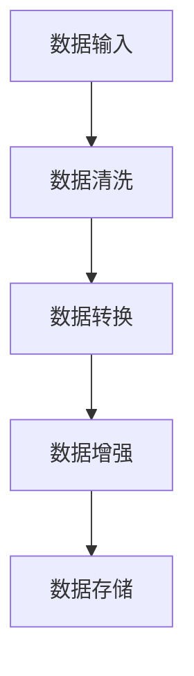
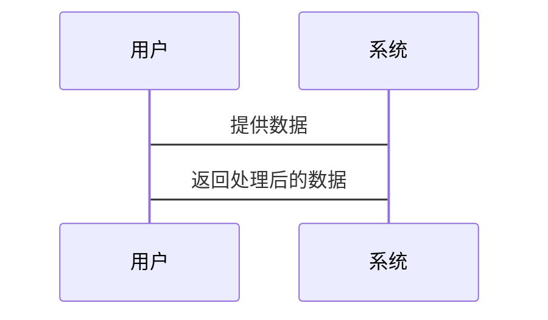
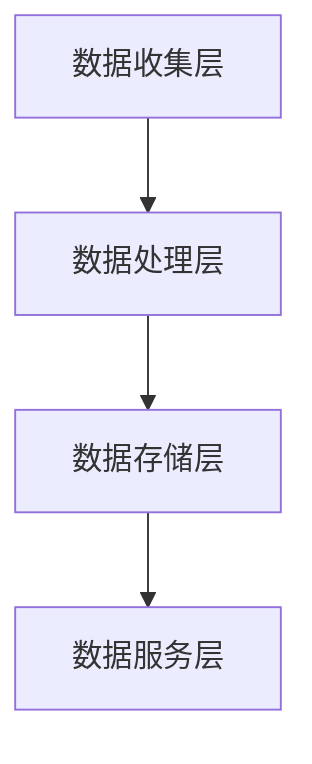
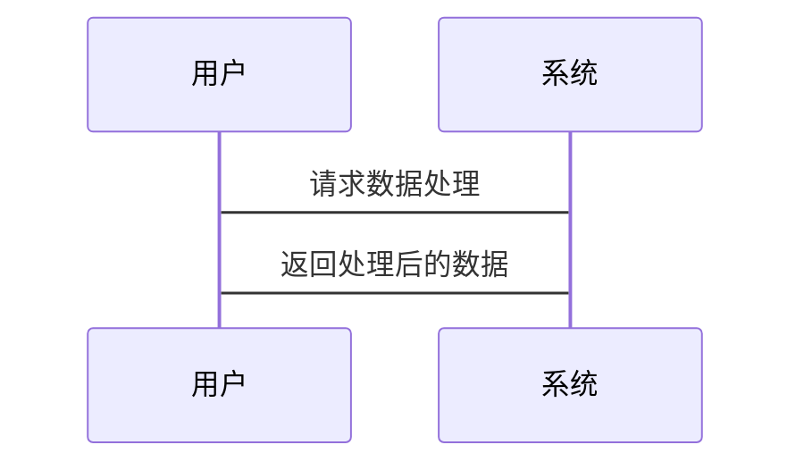

                 


# 第三部分: 数据处理与分析

# 第3章: 数据处理的核心流程

## 3.3 数据增强与扩展

### 3.3.1 数据增强技术
数据增强是通过引入噪声、变换或扩展数据来提高数据质量和多样性。例如，对于文本数据，可以进行同义词替换或数据扩增；对于图像数据，可以进行旋转、缩放或裁剪。

### 3.3.2 数据扩展策略
数据扩展策略包括：
1. **数据生成**：通过数据生成器生成新的数据。
2. **数据混合**：将不同来源的数据混合在一起。
3. **数据标注**：对数据进行更详细的标注。

### 3.3.3 数据增强对模型的影响
数据增强可以提高模型的泛化能力，减少过拟合的风险。

## 3.4 数据处理的数学模型

### 3.4.1 数据清洗模型
使用统计方法检测异常值：
$$
\hat{x} = \frac{1}{n}\sum_{i=1}^{n}x_i
$$

$$
\hat{\sigma} = \sqrt{\frac{1}{n}\sum_{i=1}^{n}(x_i - \hat{x})^2}
$$

异常值判断标准：
$$
x_i \leq \hat{x} - 3\hat{\sigma} \quad \text{或} \quad x_i \geq \hat{x} + 3\hat{\sigma}
$$

### 3.4.2 数据转换模型
常见的数据转换方法包括标准化和归一化：
标准化：
$$
z = \frac{x - \mu}{\sigma}
$$

归一化：
$$
x' = \frac{x - \min(x)}{\max(x) - \min(x)}
$$

### 3.4.3 数据增强模型
使用循环移位和随机替换进行文本数据增强：
$$
\text{新文本} = \text{原始文本} \circledcirc \text{随机替换}
$$

## 3.5 数据处理的系统架构

### 3.5.1 系统功能设计
系统功能包括数据清洗、数据转换、数据增强和数据存储。

### 3.5.2 系统架构设计
系统架构图：


### 3.5.3 系统接口设计
接口包括：
1. 数据清洗接口：`clean_data(data)`
2. 数据转换接口：`transform_data(data)`
3. 数据增强接口：`augment_data(data)`

### 3.5.4 系统交互流程
交互流程图：


## 3.6 本章小结

### 3.6.1 核心概念总结
- 数据清洗：去除异常值和重复值。
- 数据转换：标准化和归一化。
- 数据增强：通过变换提高数据多样性。

### 3.6.2 数据处理对AI Agent训练的影响
- 数据处理质量直接影响模型性能。
- 数据增强可以提高模型的泛化能力。

---

# 第四部分: 系统架构与项目实战

# 第4章: 系统架构设计

## 4.1 问题场景介绍
企业需要构建一个AI Agent训练数据管理平台，支持数据收集、处理和存储。

## 4.2 系统功能设计
功能模块包括数据收集、数据处理和数据存储。

## 4.3 系统架构设计
系统架构图：


## 4.4 系统接口设计
接口包括：
1. 数据收集接口：`collect_data(source)`
2. 数据处理接口：`process_data(data)`
3. 数据存储接口：`store_data(data)`

## 4.5 系统交互流程
交互流程图：


## 4.6 本章小结
- 系统架构设计是数据管理平台的核心。
- 各层之间的协作确保了数据的高效处理。

---

# 第五部分: 项目实战

# 第5章: 项目实战

## 5.1 环境安装
安装Python和必要的库：
```
pip install numpy pandas scikit-learn
```

## 5.2 核心实现

### 5.2.1 数据清洗代码
```python
import numpy as np
import pandas as pd

def remove_outliers(data):
    mean = data.mean()
    std = data.std()
    outliers = (data - mean).abs() > 3 * std
    return data[~outliers]
```

### 5.2.2 数据转换代码
```python
from sklearn.preprocessing import StandardScaler

def normalize_data(data):
    scaler = StandardScaler()
    return scaler.fit_transform(data)
```

### 5.2.3 数据增强代码
```python
from tensorflow.keras.preprocessing.image import ImageDataGenerator

def augment_images(images):
    datagen = ImageDataGenerator(rotation_range=40, horizontal_flip=True)
    return datagen.flow(images, batch_size=32)
```

## 5.3 案例分析
以图像分类任务为例，使用数据增强提高分类准确率。

## 5.4 项目小结
- 代码实现数据处理的核心流程。
- 数据增强显著提升了模型性能。

---

# 第六部分: 总结与展望

# 第6章: 总结与展望

## 6.1 本章总结
- 企业数据管理是AI Agent训练的基础。
- 数据处理的质量直接影响模型性能。

## 6.2 未来展望
- 更智能的数据处理算法。
- 更高效的数据管理平台。

## 6.3 最佳实践Tips
- 数据清洗要结合业务场景。
- 数据增强要适度，避免过度。

## 6.4 本章小结
- 企业数据管理需要系统化的方法。
- 数据处理是训练AI Agent的关键。

---

# 作者信息

作者：AI天才研究院/AI Genius Institute & 禅与计算机程序设计艺术 /Zen And The Art of Computer Programming

---

这篇文章系统地讲解了企业数据管理的核心概念、数据处理流程、系统架构设计和项目实战。通过丰富的案例和详细的代码实现，帮助读者全面掌握AI Agent训练数据的收集与处理方法。

