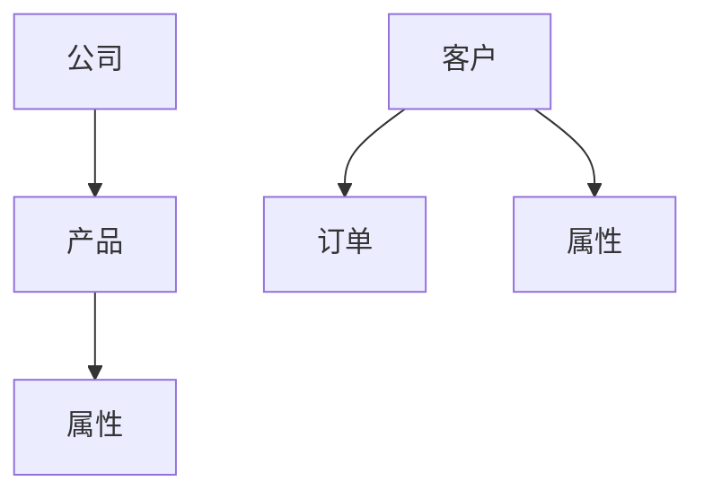

                 


# 《企业知识图谱与AI Agent的深度融合应用》

---

## 关键词：
企业知识图谱、AI Agent、知识表示、智能决策、系统架构

---

## 摘要：
本文深入探讨了企业知识图谱与AI Agent的深度融合应用，分析了知识图谱与AI Agent的核心原理、系统架构、项目实战及最佳实践。通过详细的技术分析和实际案例，展示了如何利用知识图谱构建智能决策系统，并结合AI Agent实现企业智能化。文章内容涵盖从理论到实践的各个方面，旨在为企业技术决策者和开发人员提供深度的技术指导。

---

## 第一章：引言

### 1.1 背景介绍
随着人工智能和大数据技术的快速发展，企业对智能化转型的需求日益迫切。知识图谱作为一种强大的知识表示和管理工具，能够将企业中的隐性知识显式化，而AI Agent则能够通过这些知识进行智能决策和执行任务。两者的深度融合为企业智能化提供了新的可能性。

### 1.2 问题描述
传统的企业信息化系统依赖于规则和流程，难以应对复杂多变的业务场景。通过知识图谱与AI Agent的结合，可以实现动态的知识更新和智能决策，从而提升企业的适应性和竞争力。

### 1.3 融合的意义
知识图谱为AI Agent提供了丰富的知识库，而AI Agent则利用这些知识进行推理和决策。这种结合不仅能够提高企业的智能化水平，还能降低开发成本，加快创新步伐。

---

## 第二章：知识图谱基础

### 2.1 核心概念与属性
知识图谱是一种以图结构表示知识的系统，包含实体、关系和属性三类核心要素。

#### 实体
- 实体：代表知识图谱中的具体事物，例如“公司”、“产品”、“客户”等。
- 示例：公司-甲公司，产品-智能音箱。

#### 关系
- 关系：描述实体之间的关联，例如“生产”、“销售”、“属于”等。
- 示例：甲公司生产智能音箱，智能音箱属于电子产品。

#### 属性
- 属性：描述实体的特征，例如“型号”、“价格”、“生产日期”等。
- 示例：智能音箱的型号为A1，价格为999元。

### 2.2 知识图谱的构建流程

#### 数据采集
- 来源：企业内部数据、公开数据集、爬取数据等。
- 方法：数据清洗、预处理，提取实体和关系。

#### 实体识别与关系抽取
- 技术：基于规则、统计学习、深度学习等方法。
- 工具：使用自然语言处理（NLP）技术，如分词、命名实体识别（NER）。

#### 知识融合
- 方法：冲突检测与消解，例如同一实体的不同名称合并。
- 示例：将“甲公司”和“甲科技公司”合并为“甲公司”。

---

## 第三章：AI Agent基础

### 3.1 核心能力
- 感知能力：通过多模态数据（文本、图像、语音等）感知环境。
- 推理能力：基于知识图谱进行逻辑推理，做出决策。
- 行动能力：通过API或其他接口执行任务。

### 3.2 分类与特征

#### 分类
- 单体AI Agent：独立运行，处理特定任务。
- 分布式AI Agent：协作完成复杂任务。
- 学习型AI Agent：具备自适应学习能力。

#### 特征
- 智能性：能够理解上下文，做出合理决策。
- 自主性：无需人工干预，自主执行任务。
- 社会性：能够与其他Agent或人类进行有效协作。

---

## 第四章：知识图谱与AI Agent的融合原理

### 4.1 数据流与功能模块

#### 数据流
1. **知识图谱构建**：从数据源提取实体、关系和属性，构建知识库。
2. **AI Agent感知**：通过传感器或API获取实时数据。
3. **知识融合**：将实时数据与知识图谱中的静态知识结合。
4. **推理与决策**：基于融合后的数据进行推理，生成决策。
5. **执行与反馈**：根据决策执行任务，并获取反馈。

#### 功能模块
- 知识图谱存储与查询模块。
- AI Agent感知与推理模块。
- 决策执行与反馈模块。

### 4.2 实体关系图与系统架构

#### 实体关系图


#### 系统架构


---

## 第五章：系统设计与架构

### 5.1 系统设计原则

#### 1. 可扩展性
- 知识图谱应支持动态扩展，允许新增实体和关系。
- AI Agent应具备模块化设计，便于功能扩展。

#### 2. 可靠性
- 知识图谱数据需定期备份，防止数据丢失。
- AI Agent应具备容错机制，确保任务执行的可靠性。

#### 3. 实时性
- 知识图谱需支持实时更新，确保数据的准确性。
- AI Agent应具备快速响应能力，满足实时决策需求。

### 5.2 系统架构设计

#### 1. 知识图谱存储层
- 数据库选择：使用图数据库（如Neo4j）或关系型数据库（如MySQL）。
- 数据建模：设计合理的实体、关系和属性模型。

#### 2. AI Agent逻辑层
- 感知模块：负责数据采集和环境感知。
- 推理模块：基于知识图谱进行逻辑推理。
- 决策模块：根据推理结果生成决策。

#### 3. 接口与服务层
- API设计：定义RESTful API，供其他系统调用。
- 通信协议：使用HTTP、WebSocket等协议实现实时通信。

#### 4. 用户界面层
- 界面设计：提供可视化界面，方便用户与系统交互。
- 交互设计：设计直观的操作流程，提升用户体验。

---

## 第六章：项目实战

### 6.1 项目背景
假设我们正在开发一个智能客服系统，希望通过知识图谱和AI Agent实现自动问答和任务处理。

### 6.2 系统功能设计

#### 1. 知识图谱构建
- 实体：公司、客户、订单、产品。
- 关系：公司生产产品，客户购买产品。
- 属性：产品型号、价格、生产日期。

#### 2. AI Agent功能
- 自然语言理解（NLU）：解析用户的查询意图。
- 知识推理：基于知识图谱回答问题。
- 任务执行：处理订单、查询库存等。

### 6.3 核心代码实现

#### 1. 知识图谱存储
```python
# 知识图谱存储模块
class KnowledgeGraph:
    def __init__(self):
        self.entities = {}
        self.relations = {}
        self.attributes = {}
    
    def add_entity(self, entity_name, entity_type):
        # 实体注册
        pass
    
    def add_relation(self, entity1, relation, entity2):
        # 添加关系
        pass
    
    def add_attribute(self, entity, attribute_name, attribute_value):
        # 添加属性
        pass
```

#### 2. AI Agent实现
```python
# AI Agent实现模块
class AI_Agent:
    def __init__(self, knowledge_graph):
        self.knowledge_graph = knowledge_graph
    
    def perceive(self, input_data):
        # 数据采集与解析
        pass
    
    def reason(self, input_data):
        # 基于知识图谱推理
        pass
    
    def decide(self, input_data):
        # 生成决策
        pass
```

### 6.4 系统交互流程

#### 1. 用户提问
- 用户输入：“智能音箱的价格是多少？”

#### 2. Agent处理
1. Agent通过NLU解析意图，提取关键词“智能音箱”和“价格”。
2. Agent在知识图谱中查询“智能音箱”的价格属性。
3. Agent返回结果：“智能音箱的价格是999元。”

#### 3. 系统反馈
- 系统将结果返回给用户，完成问答。

---

## 第七章：总结与展望

### 7.1 总结
通过本文的介绍，我们详细探讨了企业知识图谱与AI Agent的深度融合应用。从知识图谱的构建到AI Agent的核心技术，再到两者的融合与系统设计，为企业的智能化转型提供了理论和实践指导。

### 7.2 展望
未来，随着AI技术的不断发展，知识图谱与AI Agent的结合将更加紧密。我们期待看到更多创新性的应用，推动企业智能化迈向新的高度。

---

## 作者：
作者：AI天才研究院 & 禅与计算机程序设计艺术

