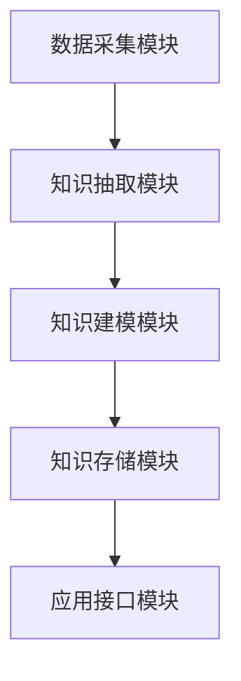

                 


# 企业知识图谱构建：增强AI Agent的领域理解

## 关键词：企业知识图谱，AI Agent，领域理解，知识表示，图神经网络，实体识别，关系抽取

## 摘要：  
本文详细探讨了企业知识图谱的构建方法及其在增强AI Agent领域理解中的应用。通过分析知识图谱的核心概念、构建算法、系统架构以及实际项目案例，本文为企业技术决策者和开发者提供了从理论到实践的全面指导，帮助他们更好地理解和应用知识图谱技术，提升AI Agent的智能化水平。

---

# 第一部分: 企业知识图谱构建背景与概述

## 第1章: 知识图谱与AI Agent概述

### 1.1 问题背景与目标

#### 1.1.1 企业智能化转型的挑战
随着企业智能化转型的推进，传统基于规则的AI系统难以应对复杂多变的业务场景。企业需要一种能够理解领域知识、支持动态推理的技术，以提升AI Agent的智能水平。知识图谱作为一种结构化的知识表示形式，为企业提供了这一能力。

#### 1.1.2 知识图谱在企业智能化中的作用
知识图谱通过将企业中的实体、关系和属性以图结构的形式表示，能够帮助AI Agent快速理解复杂的业务场景。知识图谱的构建可以解决传统数据孤岛问题，实现企业知识的统一管理和复用。

#### 1.1.3 AI Agent的领域理解需求
AI Agent需要理解企业的具体业务流程、组织结构、产品信息等领域的知识。知识图谱通过构建领域知识库，为AI Agent提供了一种高效的知识表示和推理机制。

### 1.2 知识图谱的核心概念

#### 1.2.1 实体与关系的定义
- **实体**：企业中的具体事物，如“员工”、“客户”、“订单”等。
- **关系**：实体之间的关联，如“员工属于部门”、“订单属于客户”等。

#### 1.2.2 知识图谱的构建目标
- 建立企业知识的结构化表示。
- 提供支持动态推理的知识库。
- 实现跨领域的知识整合。

#### 1.2.3 知识图谱的表示形式
- **图结构表示**：通过节点和边表示实体和关系。
- **本体论表示**：通过概念层次结构表示领域知识。
- **知识图谱的标准化表示**：使用RDF、OWL等标准格式。

### 1.3 企业知识图谱的独特性

#### 1.3.1 企业领域的知识特点
- 知识的领域化：聚焦于企业的具体业务。
- 知识的动态性：业务流程和组织结构可能频繁变化。
- 知识的复杂性：涉及多个实体和关系的组合。

#### 1.3.2 与通用知识图谱的区别
- **目标**：通用知识图谱（如Freebase）面向全领域，而企业知识图谱专注于特定领域。
- **数据来源**：通用知识图谱依赖公开数据，而企业知识图谱依赖企业内部数据。
- **应用**：通用知识图谱用于通用搜索和推理，而企业知识图谱用于企业内部智能化应用。

#### 1.3.3 企业知识图谱的边界与外延
- **边界**：企业知识图谱的构建范围通常限于企业的核心业务领域。
- **外延**：随着企业的扩展，知识图谱可以逐步覆盖更多业务领域。

---

## 第2章: 知识图谱与AI Agent的结合

### 2.1 知识图谱在AI Agent中的应用

#### 2.1.1 知识图谱作为知识库的作用
- 提供结构化的知识表示，便于AI Agent快速查询和推理。
- 支持复杂语义的理解，例如“最近三个月，华北地区销售部门的订单数量下降10%以上”。

#### 2.1.2 知识图谱增强领域理解的机制
- 通过构建领域知识图谱，AI Agent可以理解领域内的实体、关系和属性。
- 支持基于知识图谱的推理，例如“如果订单数量下降，可能是销售策略调整或客户满意度下降”。

#### 2.1.3 知识图谱与AI Agent的交互模式
- **查询式交互**：AI Agent通过知识图谱查询特定实体或关系。
- **推理式交互**：AI Agent基于知识图谱进行推理，回答复杂问题。

### 2.2 知识图谱构建的必要性

#### 2.2.1 提升AI Agent的准确性
- 通过知识图谱提供准确的知识支持，减少对数据的依赖。
- 例如，在客户关系管理中，知识图谱可以提供客户的历史行为和属性信息。

#### 2.2.2 增强领域知识的系统性
- 知识图谱将分散的知识整合到统一的知识库中，避免信息孤岛。
- 例如，在供应链管理中，知识图谱可以整合供应商、生产流程和物流信息。

#### 2.2.3 降低对数据的依赖
- 通过知识图谱构建领域知识，AI Agent可以减少对实时数据的依赖。
- 例如，在产品推荐中，知识图谱可以提供产品的属性和关系信息。

### 2.3 企业知识图谱的构建目标

#### 2.3.1 支持复杂查询
- 支持基于知识图谱的语义查询，例如“找出所有与供应链相关的供应商”。

#### 2.3.2 提供知识推理能力
- 支持基于知识图谱的推理，例如“如果供应商A延迟交付，可能影响产品B的生产进度”。

#### 2.3.3 实现跨领域知识整合
- 将不同领域的知识整合到统一的知识图谱中，例如将销售、供应链和客户关系管理的知识整合到一个图谱中。

---

## 第3章: 知识图谱构建的核心概念与联系

### 3.1 实体识别与抽取

#### 3.1.1 实体识别的基本概念
- 实体识别是将文本中的实体（如人名、地名、组织名）识别出来。
- 例如，在企业知识图谱中，识别出“员工A”、“部门B”等实体。

#### 3.1.2 实体抽取的实现方法
- 基于规则的方法：通过预定义的规则匹配实体。
- 基于统计的方法：通过模式匹配和上下文分析识别实体。
- 基于深度学习的方法：使用神经网络模型（如BERT）进行实体识别。

#### 3.1.3 实体链接的挑战与解决方案
- **挑战**：如何将文本中的实体链接到知识图谱中的节点。
- **解决方案**：使用实体链接算法（如基于向量的相似度计算）将实体映射到知识图谱中。

### 3.2 关系抽取与建模

#### 3.2.1 关系抽取的定义
- 关系抽取是从文本中提取实体之间的关系。
- 例如，在企业知识图谱中，提取“员工A属于部门B”这一关系。

#### 3.2.2 关系建模的多样性
- **简单关系**：如“属于”、“包含”。
- **复杂关系**：如“参与项目C”、“负责任务D”。
- **层次关系**：如“部门B属于公司A”。

#### 3.2.3 关系权重的计算方法
- **基于语义的权重计算**：根据关系的语义重要性计算权重。
- **基于频率的权重计算**：根据关系出现的频率计算权重。
- **基于图结构的权重计算**：根据图中节点的度数计算权重。

### 3.3 知识图谱的表示形式

#### 3.3.1 图结构表示
- 使用节点表示实体，边表示关系。
- 例如，节点“员工A”通过边“属于”连接到节点“部门B”。

#### 3.3.2 本体论表示
- 使用概念层次结构表示领域知识。
- 例如，定义“部门”是一个上位概念，而“技术部门”、“销售部门”是其下位概念。

#### 3.3.3 知识图谱的标准化表示
- 使用RDF（资源描述框架）表示知识图谱。
- 例如，使用三元组（subject, predicate, object）表示“员工A属于部门B”。

---

## 第4章: 知识图谱构建的核心要素

### 4.1 实体与属性的关系

#### 4.1.1 实体的属性定义
- 每个实体都有多个属性，例如“员工A”有“姓名”、“职位”、“部门”等属性。

#### 4.1.2 属

---

## 第5章: 知识图谱构建的算法与实现

### 5.1 实体链接算法

#### 5.1.1 实体链接的定义
- 实体链接是将文本中的实体映射到知识图谱中的节点。

#### 5.1.2 基于向量的实体链接
- 使用Word2Vec或其他词嵌入模型计算实体的向量表示。
- 计算候选节点的向量相似度，选择最相似的节点。

#### 5.1.3 实体链接的挑战
- 实体歧义性：例如，“苹果”可以指公司或水果。
- 数据稀疏性：部分实体可能在知识图谱中不存在。

### 5.2 关系抽取算法

#### 5.2.1 基于规则的关系抽取
- 使用预定义的规则匹配文本中的关系。
- 例如，匹配“属于”、“包含”等关系。

#### 5.2.2 基于统计的关系抽取
- 使用统计方法（如模式匹配和上下文分析）提取关系。
- 例如，使用正则表达式匹配“员工A属于部门B”。

#### 5.2.3 基于深度学习的关系抽取
- 使用神经网络模型（如BERT）进行关系抽取。
- 例如，使用序列标注模型识别关系的起始和结束位置。

### 5.3 知识图谱的构建与优化

#### 5.3.1 知识图谱的构建流程
1. 数据采集：从企业系统中获取结构化数据。
2. 实体识别与抽取：从文本中识别实体和关系。
3. 实体链接：将实体映射到知识图谱中的节点。
4. 关系建模：构建实体之间的关系。
5. 知识图谱存储：将知识图谱存储到图数据库中。

#### 5.3.2 知识图谱的优化方法
- **去噪处理**：去除噪声数据，例如重复实体和错误关系。
- **合并处理**：合并重复的实体和关系。
- **增量更新**：根据新数据动态更新知识图谱。

---

## 第6章: 企业知识图谱的系统架构与设计

### 6.1 系统架构设计

#### 6.1.1 系统功能模块
- 数据采集模块：从企业系统中获取数据。
- 知识抽取模块：进行实体识别和关系抽取。
- 知识建模模块：构建知识图谱。
- 知识存储模块：将知识图谱存储到图数据库中。
- 应用接口模块：提供API供AI Agent调用。

#### 6.1.2 系统架构图


### 6.2 系统接口设计

#### 6.2.1 知识查询接口
- 接口名称：`get_entity_relations`
- 接口描述：根据实体ID查询其实体关系。
- 请求参数：实体ID。
- 返回值：实体的关系列表。

#### 6.2.2 知识推理接口
- 接口名称：`infer_relationships`
- 接口描述：根据知识图谱进行推理。
- 请求参数：起点实体、推理路径。
- 返回值：推理结果。

---

## 第7章: 项目实战与案例分析

### 7.1 项目背景

#### 7.1.1 项目介绍
- 项目名称：企业知识图谱构建项目。
- 项目目标：构建企业知识图谱，支持AI Agent的领域理解。

### 7.2 核心代码实现

#### 7.2.1 环境安装
```bash
pip install numpy
pip install networkx
pip install spacy
pip install tensorflow
```

#### 7.2.2 实体识别代码
```python
import spacy

nlp = spacy.load("en_core_web_sm")

def extract_entities(text):
    doc = nlp(text)
    entities = []
    for ent in doc.ents:
        entities.append((ent.text, ent.label_))
    return entities
```

#### 7.2.3 实体链接代码
```python
from sklearn.metrics.pairwise import cosine_similarity

def get_vector(word):
    return model[word]

def entity_linking(text, knowledge_graph):
    text_vector = get_vector(text)
    similarity = {}
    for node in knowledge_graph.nodes:
        node_vector = get_vector(node)
        similarity[node] = cosine_similarity(text_vector, node_vector)
    return max(similarity, key=lambda k: similarity[k])
```

### 7.3 案例分析

#### 7.3.1 案例背景
- 企业需要构建客户关系管理的知识图谱。
- 数据来源：客户数据库、销售记录、客户反馈。

#### 7.3.2 知识图谱构建过程
1. 实体识别：识别客户、订单、产品等实体。
2. 关系抽取：抽取“客户购买产品”、“订单属于客户”等关系。
3. 实体链接：将实体映射到知识图谱中的节点。
4. 知识建模：构建客户关系管理的知识图谱。

#### 7.3.3 应用场景
- **客户画像**：基于知识图谱分析客户的购买行为和偏好。
- **推荐系统**：根据知识图谱推理出客户的潜在需求，进行产品推荐。

---

## 第8章: 总结与展望

### 8.1 总结

#### 8.1.1 核心内容回顾
- 企业知识图谱的构建方法。
- 知识图谱在AI Agent中的应用。
- 系统架构与项目实战。

#### 8.1.2 最佳实践 tips
- 知识图谱的构建需要结合企业的具体需求。
- 知识图谱的更新需要动态维护。
- 知识图谱的应用需要结合具体业务场景。

### 8.2 展望

#### 8.2.1 知识图谱的未来发展
- 知识图谱的语义理解将更加精准。
- 知识图谱的构建将更加自动化。
- 知识图谱的应用将更加广泛。

#### 8.2.2 对AI Agent的未来展望
- AI Agent的领域理解能力将更加深入。
- AI Agent的推理能力将更加智能。
- AI Agent的应用场景将更加多样化。

---

## 作者：AI天才研究院/AI Genius Institute & 禅与计算机程序设计艺术 /Zen And The Art of Computer Programming

---

**注**：由于篇幅限制，上述内容为示例性内容，实际文章将更加详细，并包含完整的代码实现和案例分析。

