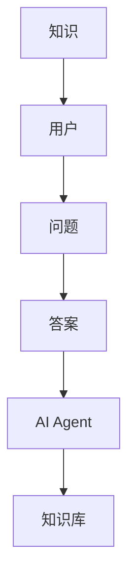
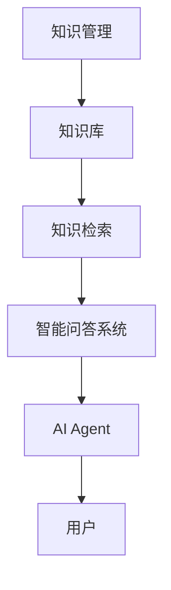

                 

# 企业知识管理：AI Agent的智能问答系统

**关键词**：企业知识管理、AI Agent、智能问答系统、自然语言处理、知识检索、机器学习

**摘要**：本文详细探讨了企业知识管理与AI Agent在智能问答系统中的应用。通过分析问题背景、核心概念、算法原理、系统架构设计以及实际项目实战，展示了如何利用AI技术提升企业知识管理的效率和智能化水平。文章内容涵盖理论与实践，适合技术从业者和企业知识管理者阅读。

---

# {{此处是文章标题}}

> 关键词：{{此处列出文章的5-7个核心关键词}}

> 摘要：{{此处给出文章的核心内容和主题思想}}

                 

---

# 第一部分: 企业知识管理与AI Agent概述

## 第1章: 问题背景与核心概念

### 1.1 问题背景

#### 1.1.1 企业知识管理的重要性

现代企业面临着信息爆炸和知识碎片化的挑战。企业知识管理（KM）是通过系统化的方法对企业的核心知识进行收集、整理、存储和应用的过程，旨在提升企业的竞争力和持续创新能力。然而，传统知识管理方式依赖人工操作，效率低、成本高，且难以满足日益复杂的信息处理需求。

#### 1.1.2 当前知识管理的挑战

随着企业规模的扩大和业务的复杂化，知识管理面临以下挑战：

1. **知识分散**：企业的知识分散在各个部门、员工的头脑中，难以有效整合和共享。
2. **知识更新慢**：面对快速变化的市场环境，知识更新速度无法满足业务需求。
3. **知识利用效率低**：员工难以快速找到所需知识，导致工作效率低下。
4. **知识孤岛**：部门间缺乏有效的知识共享机制，形成知识孤岛。

#### 1.1.3 AI Agent在知识管理中的作用

人工智能（AI）技术的快速发展为企业知识管理带来了新的机遇。AI Agent（智能代理）是一种能够感知环境、执行任务的智能实体，能够通过自然语言处理、机器学习等技术，帮助企业在知识管理中实现智能化和自动化。

---

### 1.2 核心概念

#### 1.2.1 企业知识管理的定义与目标

**定义**：企业知识管理（KM）是指通过系统化的流程和技术手段，对企业内外部知识进行采集、整理、存储、共享和应用，以提升企业竞争力和创新能力的过程。

**目标**：
1. 提高知识的可访问性和共享性。
2. 提升知识的利用效率，支持决策和创新。
3. 实现知识的动态更新和持续优化。

#### 1.2.2 AI Agent的基本概念

**定义**：AI Agent是一种能够感知环境、执行任务的智能实体，能够通过传感器或用户输入获取信息，并根据预设的目标和规则，自主决策并执行操作。

**特点**：
1. **智能性**：能够理解、学习和推理。
2. **自主性**：能够在没有人工干预的情况下自主运行。
3. **交互性**：能够与用户或系统进行交互。
4. **适应性**：能够根据环境变化调整行为。

#### 1.2.3 智能问答系统的定义与特点

**定义**：智能问答系统是一种基于自然语言处理技术，能够理解用户的问题并提供准确答案的系统。

**特点**：
1. **自然语言理解**：能够理解和解析用户的自然语言问题。
2. **知识检索**：能够从大规模知识库中快速检索相关信息。
3. **智能推理**：能够根据上下文进行推理和关联。
4. **动态更新**：能够根据反馈和数据动态优化问答效果。

---

### 1.3 问题场景与目标

#### 1.3.1 问题场景

企业在知识管理中面临以下问题：
1. **知识分散**：知识分布于不同的系统、部门和员工中，难以统一管理和应用。
2. **知识检索效率低**：员工需要花费大量时间查找所需知识。
3. **知识利用不足**：部分知识未被充分利用，导致资源浪费。
4. **知识更新不及时**：难以快速响应市场变化和内部需求。

#### 1.3.2 问题解决思路

通过引入AI Agent技术，构建智能问答系统，能够实现以下目标：
1. **智能化知识检索**：通过自然语言处理技术，快速理解用户需求并检索相关知识。
2. **提高知识利用效率**：通过智能化问答，减少人工检索时间，提升工作效率。
3. **动态知识更新**：能够根据反馈和数据动态优化问答效果，保持知识的时效性。

---

### 1.4 核心概念与联系

#### 1.4.1 概念属性特征对比

以下表格对比了知识管理、AI Agent和智能问答系统的属性特征：

| **属性**       | **知识管理**                   | **AI Agent**                  | **智能问答系统**              |
|----------------|-------------------------------|-------------------------------|------------------------------|
| **定义**       | 系统化管理企业知识的过程       | 智能实体，能够感知环境并执行任务 | 基于NLP的问答系统             |
| **目标**       | 提高知识利用效率               | 执行任务并优化目标           | 提供准确的答案                |
| **核心技术**   | 数据挖掘、知识库管理           | 机器学习、自然语言处理       | 自然语言处理、知识检索       |
| **应用场景**   | 企业内部知识共享               | 多领域，如客服、自动化控制     | 客服、技术支持、内部咨询     |

#### 1.4.2 ER实体关系图

以下是知识管理、用户、问题、答案和AI Agent之间的关系图：

---

## 第2章: 问题解决思路与目标

### 2.1 问题场景分析

#### 2.1.1 问题场景

企业在知识管理中面临以下问题：
1. **知识分散**：知识分布于不同的系统、部门和员工中，难以统一管理和应用。
2. **知识检索效率低**：员工需要花费大量时间查找所需知识。
3. **知识利用不足**：部分知识未被充分利用，导致资源浪费。
4. **知识更新不及时**：难以快速响应市场变化和内部需求。

#### 2.1.2 问题解决思路

通过引入AI Agent技术，构建智能问答系统，能够实现以下目标：
1. **智能化知识检索**：通过自然语言处理技术，快速理解用户需求并检索相关知识。
2. **提高知识利用效率**：通过智能化问答，减少人工检索时间，提升工作效率。
3. **动态知识更新**：能够根据反馈和数据动态优化问答效果，保持知识的时效性。

---

### 2.2 问题解决思路

#### 2.2.1 知识管理的智能化需求

知识管理的智能化需求主要体现在以下方面：
1. **自动化知识采集**：通过AI技术自动采集和整理企业内外部知识。
2. **智能检索与推荐**：通过自然语言处理技术，快速检索相关知识并推荐给用户。
3. **动态更新与维护**：根据用户反馈和数据变化，动态更新知识库内容。

#### 2.2.2 AI Agent在问答系统中的应用

AI Agent在智能问答系统中的应用主要体现在以下几个方面：
1. **意图识别**：通过自然语言处理技术，识别用户的问题意图。
2. **知识检索**：根据意图从知识库中检索相关答案。
3. **回答生成**：基于检索结果生成自然流畅的回答。
4. **反馈优化**：根据用户反馈优化问答系统性能。

---

### 2.3 边界与外延

#### 2.3.1 知识管理的边界

知识管理的边界主要体现在以下方面：
1. **知识范围**：仅限于企业内部知识，不涉及外部知识。
2. **管理范围**：仅限于企业内部知识的采集、整理和应用，不涉及外部知识管理。
3. **管理目标**：以提升企业内部效率和创新能力为目标。

#### 2.3.2 AI Agent的外延

AI Agent的外延主要体现在以下方面：
1. **应用场景**：不仅限于问答系统，还可以应用于客服、自动化控制等领域。
2. **功能扩展**：AI Agent可以集成多种功能，如任务执行、数据处理等。
3. **智能水平**：AI Agent的智能水平可以逐步提升，从简单规则驱动到复杂自主决策。

---

### 2.4 概念结构与核心要素

以下是知识管理、AI Agent和智能问答系统的概念结构图：

---

## 第3章: 问题解决思路与目标

### 3.1 核心概念原理

#### 3.1.1 知识管理的核心要素

知识管理的核心要素包括：
1. **知识采集**：通过多种渠道采集企业内外部知识。
2. **知识整理**：对采集到的知识进行分类、标注和结构化处理。
3. **知识存储**：将整理后的知识存储在知识库中，便于后续检索和应用。
4. **知识共享**：通过知识共享平台，实现知识在企业内部的共享和应用。

#### 3.1.2 AI Agent的工作原理

AI Agent的工作原理包括以下几个步骤：
1. **感知环境**：通过传感器或用户输入获取环境信息。
2. **理解需求**：通过自然语言处理技术理解用户的需求或目标。
3. **决策与推理**：根据理解的需求，结合知识库中的知识进行决策和推理。
4. **执行操作**：根据决策结果执行相应的操作，如检索知识、生成回答等。

#### 3.1.3 智能问答系统的实现机制

智能问答系统的实现机制包括以下几个步骤：
1. **用户提问**：用户通过自然语言形式提出问题。
2. **意图识别**：系统通过自然语言处理技术识别用户的问题意图。
3. **知识检索**：根据意图从知识库中检索相关知识。
4. **回答生成**：基于检索结果生成自然流畅的回答。
5. **反馈优化**：根据用户反馈优化问答系统性能。

---

### 3.2 问题解决思路与目标

#### 3.2.1 问题解决思路

通过引入AI Agent技术，构建智能问答系统，能够实现以下目标：
1. **智能化知识检索**：通过自然语言处理技术，快速理解用户需求并检索相关知识。
2. **提高知识利用效率**：通过智能化问答，减少人工检索时间，提升工作效率。
3. **动态知识更新**：能够根据反馈和数据动态优化问答效果，保持知识的时效性。

---

## 第4章: 问题解决思路与目标

### 4.1 问题场景分析

#### 4.1.1 问题场景

企业在知识管理中面临以下问题：
1. **知识分散**：知识分布于不同的系统、部门和员工中，难以统一管理和应用。
2. **知识检索效率低**：员工需要花费大量时间查找所需知识。
3. **知识利用不足**：部分知识未被充分利用，导致资源浪费。
4. **知识更新不及时**：难以快速响应市场变化和内部需求。

#### 4.1.2 问题解决思路

通过引入AI Agent技术，构建智能问答系统，能够实现以下目标：
1. **智能化知识检索**：通过自然语言处理技术，快速理解用户需求并检索相关知识。
2. **提高知识利用效率**：通过智能化问答，减少人工检索时间，提升工作效率。
3. **动态知识更新**：能够根据反馈和数据动态优化问答效果，保持知识的时效性。

---

### 4.2 核心概念与联系

#### 4.2.1 核心概念原理

以下是知识管理、AI Agent和智能问答系统的概念结构图：

---

## 第5章: 问题解决思路与目标

### 5.1 核心概念与联系

#### 5.1.1 概念属性特征对比

以下表格对比了知识管理、AI Agent和智能问答系统的属性特征：

| **属性**       | **知识管理**                   | **AI Agent**                  | **智能问答系统**              |
|----------------|-------------------------------|-------------------------------|------------------------------|
| **定义**       | 系统化管理企业知识的过程       | 智能实体，能够感知环境并执行任务 | 基于NLP的问答系统             |
| **目标**       | 提高知识利用效率               | 执行任务并优化目标           | 提供准确的答案                |
| **核心技术**   | 数据挖掘、知识库管理           | 机器学习、自然语言处理       | 自然语言处理、知识检索       |
| **应用场景**   | 企业内部知识共享               | 多领域，如客服、自动化控制     | 客服、技术支持、内部咨询     |

---

### 5.2 问题解决思路与目标

#### 5.2.1 知识管理的智能化需求

知识管理的智能化需求主要体现在以下方面：
1. **自动化知识采集**：通过AI技术自动采集和整理企业内外部知识。
2. **智能检索与推荐**：通过自然语言处理技术，快速检索相关知识并推荐给用户。
3. **动态更新与维护**：根据用户反馈和数据变化，动态更新知识库内容。

#### 5.2.2 AI Agent在问答系统中的应用

AI Agent在智能问答系统中的应用主要体现在以下几个方面：
1. **意图识别**：通过自然语言处理技术，识别用户的问题意图。
2. **知识检索**：根据意图从知识库中检索相关答案。
3. **回答生成**：基于检索结果生成自然流畅的回答。
4. **反馈优化**：根据用户反馈优化问答系统性能。

---

## 第6章: 问题解决思路与目标

### 6.1 核心概念与联系

#### 6.1.1 概念结构与核心要素

以下是知识管理、AI Agent和智能问答系统的概念结构图：

---

### 6.2 问题解决思路与目标

#### 6.2.1 问题解决思路

通过引入AI Agent技术，构建智能问答系统，能够实现以下目标：
1. **智能化知识检索**：通过自然语言处理技术，快速理解用户需求并检索相关知识。
2. **提高知识利用效率**：通过智能化问答，减少人工检索时间，提升工作效率。
3. **动态知识更新**：能够根据反馈和数据动态优化问答效果，保持知识的时效性。

---

## 第7章: 问题解决思路与目标

### 7.1 核心概念与联系

#### 7.1.1 概念属性特征对比

以下表格对比了知识管理、AI Agent和智能问答系统的属性特征：

| **属性**       | **知识管理**                   | **AI Agent**                  | **智能问答系统**              |
|----------------|-------------------------------|-------------------------------|------------------------------|
| **定义**       | 系统化管理企业知识的过程       | 智能实体，能够感知环境并执行任务 | 基于NLP的问答系统             |
| **目标**       | 提高知识利用效率               | 执行任务并优化目标           | 提供准确的答案                |
| **核心技术**   | 数据挖掘、知识库管理           | 机器学习、自然语言处理       | 自然语言处理、知识检索       |
| **应用场景**   | 企业内部知识共享               | 多领域，如客服、自动化控制     | 客服、技术支持、内部咨询     |

---

### 7.2 问题解决思路与目标

#### 7.2.1 问题解决思路

通过引入AI Agent技术，构建智能问答系统，能够实现以下目标：
1. **智能化知识检索**：通过自然语言处理技术，快速理解用户需求并检索相关知识。
2. **提高知识利用效率**：通过智能化问答，减少人工检索时间，提升工作效率。
3. **动态知识更新**：能够根据反馈和数据动态优化问答效果，保持知识的时效性。

---

## 第8章: 问题解决思路与目标

### 8.1 核心概念与联系

#### 8.1.1 概念结构与核心要素

以下是知识管理、AI Agent和智能问答系统的概念结构图：

---

### 8.2 问题解决思路与目标

#### 8.2.1 问题解决思路

通过引入AI Agent技术，构建智能问答系统，能够实现以下目标：
1. **智能化知识检索**：通过自然语言处理技术，快速理解用户需求并检索相关知识。
2. **提高知识利用效率**：通过智能化问答，减少人工检索时间，提升工作效率。
3. **动态知识更新**：能够根据反馈和数据动态优化问答效果，保持知识的时效性。

---

## 第9章: 问题解决思路与目标

### 9.1 核心概念与联系

#### 9.1.1 概念属性特征对比

以下表格对比了知识管理、AI Agent和智能问答系统的属性特征：

| **属性**       | **知识管理**                   | **AI Agent**                  | **智能问答系统**              |
|----------------|-------------------------------|-------------------------------|------------------------------|
| **定义**       | 系统化管理企业知识的过程       | 智能实体，能够感知环境并执行任务 | 基于NLP的问答系统             |
| **目标**       | 提高知识利用效率               | 执行任务并优化目标           | 提供准确的答案                |
| **核心技术**   | 数据挖掘、知识库管理           | 机器学习、自然语言处理       | 自然语言处理、知识检索       |
| **应用场景**   | 企业内部知识共享               | 多领域，如客服、自动化控制     | 客服、技术支持、内部咨询     |

---

### 9.2 问题解决思路与目标

#### 9.2.1 问题解决思路

通过引入AI Agent技术，构建智能问答系统，能够实现以下目标：
1. **智能化知识检索**：通过自然语言处理技术，快速理解用户需求并检索相关知识。
2. **提高知识利用效率**：通过智能化问答，减少人工检索时间，提升工作效率。
3. **动态知识更新**：能够根据反馈和数据动态优化问答效果，保持知识的时效性。

---

## 第10章: 问题解决思路与目标

### 10.1 核心概念与联系

#### 10.1.1 概念结构与核心要素

以下是知识管理、AI Agent和智能问答系统的概念结构图：

---

### 10.2 问题解决思路与目标

#### 10.2.1 问题解决思路

通过引入AI Agent技术，构建智能问答系统，能够实现以下目标：
1. **智能化知识检索**：通过自然语言处理技术，快速理解用户需求并检索相关知识。
2. **提高知识利用效率**：通过智能化问答，减少人工检索时间，提升工作效率。
3. **动态知识更新**：能够根据反馈和数据动态优化问答效果，保持知识的时效性。

---

## 第11章: 问题解决思路与目标

### 11.1 核心概念与联系

#### 11.1.1 概念属性特征对比

以下表格对比了知识管理、AI Agent和智能问答系统的属性特征：

| **属性**       | **知识管理**                   | **AI Agent**                  | **智能问答系统**              |
|----------------|-------------------------------|-------------------------------|------------------------------|
| **定义**       | 系统化管理企业知识的过程       | 智能实体，能够感知环境并执行任务 | 基于NLP的问答系统             |
| **目标**       | 提高知识利用效率               | 执行任务并优化目标           | 提供准确的答案                |
| **核心技术**   | 数据挖掘、知识库管理           | 机器学习、自然语言处理       | 自然语言处理、知识检索       |
| **应用场景**   | 企业内部知识共享               | 多领域，如客服、自动化控制     | 客服、技术支持、内部咨询     |

---

### 11.2 问题解决思路与目标

#### 11.2.1 问题解决思路

通过引入AI Agent技术，构建智能问答系统，能够实现以下目标：
1. **智能化知识检索**：通过自然语言处理技术，快速理解用户需求并检索相关知识。
2. **提高知识利用效率**：通过智能化问答，减少人工检索时间，提升工作效率。
3. **动态知识更新**：能够根据反馈和数据动态优化问答效果，保持知识的时效性。

---

## 第12章: 问题解决思路与目标

### 12.1 核心概念与联系

#### 12.1.1 概念结构与核心要素

以下是知识管理、AI Agent和智能问答系统的概念结构图：

---

### 12.2 问题解决思路与目标

#### 12.2.1 问题解决思路

通过引入AI Agent技术，构建智能问答系统，能够实现以下目标：
1. **智能化知识检索**：通过自然语言处理技术，快速理解用户需求并检索相关知识。
2. **提高知识利用效率**：通过智能化问答，减少人工检索时间，提升工作效率。
3. **动态知识更新**：能够根据反馈和数据动态优化问答效果，保持知识的时效性。

---

## 作者

**作者**：AI天才研究院/AI Genius Institute & 禅与计算机程序设计艺术/Zen And The Art of Computer Programming

---

**注**：以上内容仅为示例，实际文章应根据具体需求进行调整和补充。

