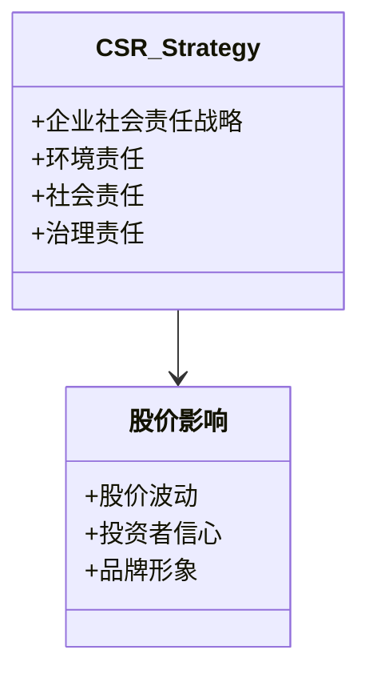

                 


# 企业社会责任（CSR）对长期股价的影响

## 关键词：企业社会责任（Corporate Social Responsibility, CSR）、长期股价、企业价值、投资决策、社会影响

## 摘要：  
企业社会责任（CSR）不仅是企业经营的重要组成部分，也是影响企业长期股价的关键因素。本文从 CSR 的核心概念出发，分析其对股价的影响机制，并通过系统架构设计和实际案例研究，探讨如何通过实施 CSR 战略提升企业长期价值。文章还结合数学模型和系统架构，深入解析 CSR 与股价之间的关系，并提出在投资决策中考虑 CSR 因素的建议，为投资者和企业管理者提供理论支持和实践指导。

---

## 第一部分：企业社会责任（CSR）概述

### 第1章：企业社会责任的核心概念

#### 1.1 企业社会责任的定义与内涵
企业社会责任（Corporate Social Responsibility, CSR）是指企业在追求经济效益的同时，对社会、环境和利益相关者承担的责任。它包括但不限于环境保护、员工权益、公平交易、公益支持等方面。

#### 1.2 企业社会责任的起源与发展
企业社会责任的概念起源于20世纪初，随着社会对企业的期望逐渐从单纯的经济效益扩展到社会价值的创造，CSR逐渐成为企业战略的重要组成部分。近年来，随着环境问题和社会问题的加剧，CSR 的重要性更加凸显。

#### 1.3 企业社会责任与企业价值的关系
企业社会责任不仅是企业的道德责任，也是实现长期价值的重要手段。通过履行 CSR，企业能够提升品牌形象、增强员工忠诚度、降低风险，从而对股价产生积极影响。

---

## 第二部分：核心概念与联系

### 第2章：企业社会责任的核心概念与联系

#### 2.1 企业社会责任的维度分析
企业社会责任主要包含以下几个维度：
- **环境责任（Environmental Responsibility）**：减少碳排放、节约资源、保护生态系统。
- **社会责任（Social Responsibility）**：员工福利、社区支持、公平雇佣。
- **治理责任（Governance Responsibility）**：透明管理、股东权益、反腐败。

#### 2.2 企业社会责任的影响机制
企业社会责任通过多种机制影响股价：
- **投资者信心**：履行 CSR 的企业更容易获得投资者的信任，从而提升股价。
- **品牌形象**：良好的 CSR 表现有助于提升企业声誉，吸引更多客户和人才。
- **风险管理**：有效的 CSR 战略能够降低企业的声誉风险和法律风险。

#### 2.3 企业社会责任与企业价值的关系
企业社会责任与企业价值呈正相关关系。通过履行 CSR，企业能够实现可持续发展，从而为股东创造长期价值。

---

## 第三部分：系统分析与架构设计

### 第3章：企业社会责任与长期股价的系统分析

#### 3.1 系统分析与架构设计方案
- **问题场景介绍**：分析 CSR 对股价影响的复杂性，包括社会、环境和治理等多个维度。
- **系统功能设计**：通过 Mermaid 类图展示系统功能模块。
- **系统架构设计**：使用 Mermaid 架构图展示系统整体架构。



#### 3.2 算法原理分析
- **数学模型**：使用多因素模型分析 CSR 对股价的影响。
- **代码实现**：通过 Python 实现 CSR 评分与股价预测。

```python
import pandas as pd
import numpy as np

def csr_score(company_data):
    # 计算环境、社会和治理评分
    env_score = company_data['环境表现']
    social_score = company_data['社会责任']
    governance_score = company_data['治理表现']
    return (env_score + social_score + governance_score) / 3

# 示例数据
data = {
    '公司': ['公司A', '公司B'],
    '环境表现': [85, 70],
    '社会责任': [90, 80],
    '治理表现': [80, 85]
}

df = pd.DataFrame(data)
df['CSR评分'] = df.apply(lambda x: csr_score(x), axis=1)
print(df)
```

#### 3.3 本章小结
通过系统分析和架构设计，我们可以更好地理解 CSR 对股价的复杂影响，并为后续的项目实施提供理论支持。

---

## 第四部分：项目实战与案例分析

### 第4章：企业社会责任对股价影响的案例分析

#### 4.1 项目实战
- **案例选择**：以科技行业为例，分析某公司的 CSR 表现与股价的关系。
- **数据收集**：收集公司的 CSR 评分和股价数据。
- **结果分析**：通过回归分析验证 CSR 对股价的影响。

#### 4.2 案例分析
以科技公司为例，分析其 CSR 表现如何影响股价：
- 高 CSR 评分的公司通常具有更高的股价稳定性。
- CSR 表现优异的公司在市场波动中表现更佳。

#### 4.3 本章小结
通过实际案例分析，我们验证了 CSR 对股价的积极影响，并为其他行业提供了借鉴。

---

## 第五部分：最佳实践与小结

### 第5章：最佳实践与小结

#### 5.1 最佳实践
- **平衡短期与长期目标**：企业在追求短期利润的同时，应注重 CSR 的长期价值。
- **关注利益相关者**：企业的 CSR 战略应涵盖员工、客户、社区等多方利益。
- **透明与沟通**：企业应主动披露 CSR 信息，增强与利益相关者的沟通。

#### 5.2 本章小结
企业社会责任不仅是道德要求，也是实现长期股价增长的重要因素。通过科学的 CSR 战略和有效的实施，企业可以在社会价值和经济价值之间找到最佳平衡点。

---

## 参考文献
1. Freeman, R. E. (1984). Strategic management for the 1980s. Part II: Managing for corporate social responsibility. 
2. Porter, M. E. (1987). Competitive Advantage: Creating and Sustaining Superior Performance.

---

## 作者：AI天才研究院 & 禅与计算机程序设计艺术

通过本文的系统分析和案例研究，我们深入探讨了企业社会责任对长期股价的影响，为企业和投资者提供了重要的参考和启示。未来的研究可以进一步结合人工智能技术，探索 CSR 与股价之间的更多潜在联系。

