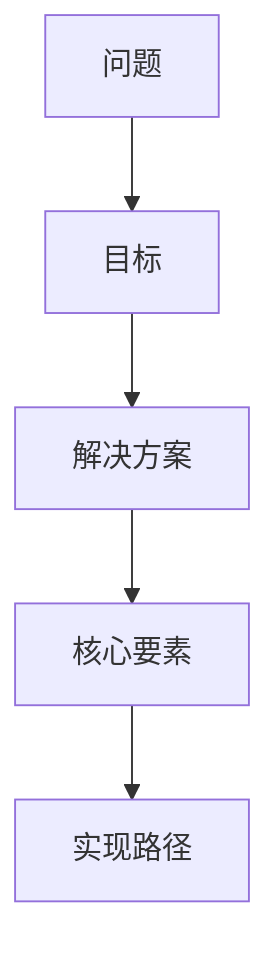
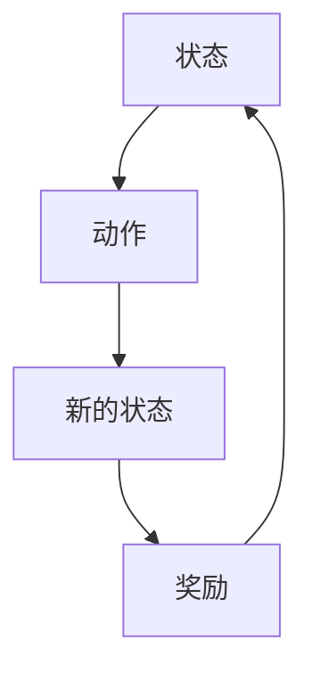
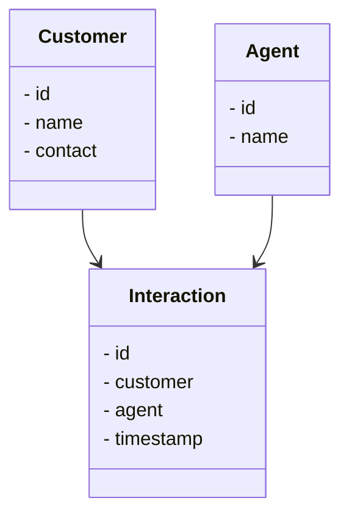
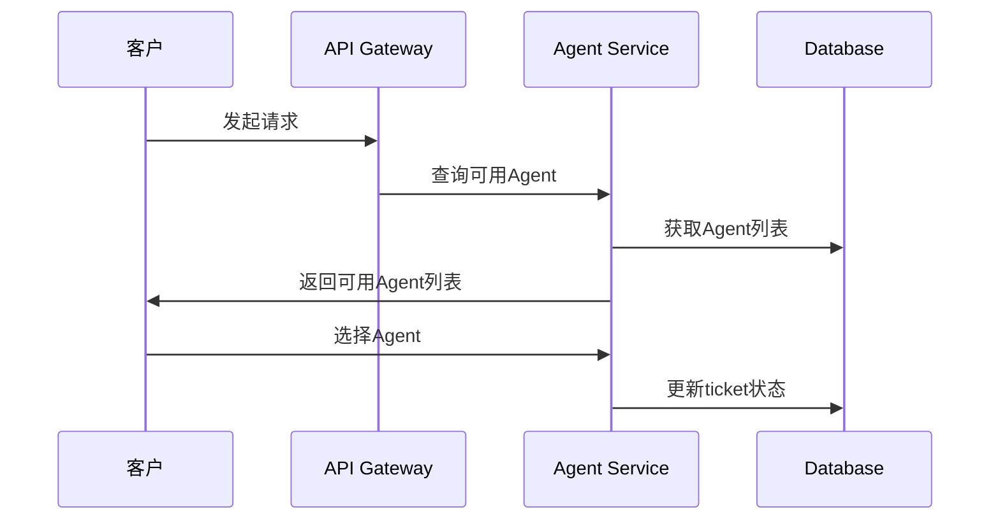

                 


# 企业级AI Agent开发：从需求分析到部署的全流程指南

---

## 关键词：
企业级AI Agent、需求分析、算法原理、系统架构、项目实战、部署指南

---

## 摘要：
本文系统性地阐述企业级AI Agent从需求分析到部署的全流程，涵盖核心概念、算法原理、系统架构、项目实战等关键环节，帮助读者全面掌握AI Agent开发的全生命周期。

---

# 第1章: 企业级AI Agent的背景与概念

## 1.1 AI Agent的基本概念

### 1.1.1 AI Agent的定义
AI Agent（人工智能代理）是能够感知环境、自主决策并执行任务的智能实体。它通过传感器获取信息，利用推理机制处理数据，并通过执行器采取行动，以实现特定目标。

### 1.1.2 企业级AI Agent的特点
- **智能性**：具备问题解决和决策能力。
- **自主性**：能在无外部干预下运行。
- **协作性**：能与其他系统或AI Agent协同工作。
- **适应性**：能根据环境变化调整策略。

### 1.1.3 AI Agent与传统AI的区别
AI Agent不仅被动响应输入，还能主动采取行动，具有目标导向性和交互性。

### 1.1.4 企业级AI Agent的应用领域
- **客服系统**：智能问答、客户支持。
- **供应链管理**：优化库存、物流调度。
- **风险管理**：实时监控、异常检测。

### 1.1.5 企业级AI Agent的挑战
- **复杂性**：多智能体协作需解决通信和协调问题。
- **安全性**：需防止恶意攻击和数据泄露。
- **可解释性**：确保决策过程透明，便于调试和信任。

## 1.2 企业级AI Agent的重要性

### 1.2.1 企业智能化转型的驱动力
AI Agent通过自动化和智能化提升企业效率，降低成本，增强竞争力。

### 1.2.2 AI Agent在企业中的应用价值
- **提升效率**：自动化处理重复性任务。
- **增强决策**：基于数据驱动的决策支持。
- **改善客户体验**：提供个性化服务。

### 1.2.3 企业级AI Agent的边界与外延
AI Agent的边界在于其功能范围和应用领域，外延则包括与其他系统和AI Agent的协作。

## 1.3 企业级AI Agent的核心要素

### 1.3.1 问题背景分析
分析企业面临的具体问题，明确目标和约束条件。

### 1.3.2 问题描述与目标设定
清晰描述问题，设定可量化的目标，如提高效率、降低成本。

### 1.3.3 问题解决的路径与方法
选择合适的技术和算法，设计解决方案的步骤和流程。

### 1.3.4 核心要素的构成与关系
AI Agent由感知、决策、执行机制构成，各部分协同工作。

---

## 1.4 本章小结
本章介绍了AI Agent的基本概念、特点、应用领域及挑战，明确了企业级AI Agent的重要性，为后续章节奠定基础。

---

# 第2章: 企业级AI Agent的核心概念与联系

## 2.1 AI Agent的基本原理

### 2.1.1 感知机制
AI Agent通过传感器获取环境数据，如摄像头、麦克风等。

### 2.1.2 决策机制
利用算法对数据进行分析，生成决策，如监督学习、强化学习。

### 2.1.3 执行机制
通过执行器将决策转化为行动，如机器人臂、网络请求。

## 2.2 多智能体协作

### 2.2.1 多智能体系统的特点
- **分布式**：各智能体独立运行。
- **协作性**：通过通信协议协同工作。

### 2.2.2 协作机制与通信协议
智能体间通过消息传递进行协作，如HTTP API、WebSocket。

### 2.2.3 联合学习与知识共享
多个智能体共同学习，共享知识，提升整体性能。

## 2.3 核心概念的ER实体关系图



## 2.4 本章小结
本章详细讲解了AI Agent的基本原理和多智能体协作机制，明确了各部分的关系。

---

# 第3章: 企业级AI Agent的算法原理

## 3.1 常见AI算法概述

### 3.1.1 强化学习
通过试错机制，智能体学习最优策略，如Q-learning、DQN。

### 3.1.2 监督学习
基于标记数据训练模型，如分类、回归任务。

### 3.1.3 无监督学习
从无标记数据中发现模式，如聚类、降维。

## 3.2 AI Agent的核心算法

### 3.2.1 Q-learning算法



数学模型：
$$ Q(s, a) = Q(s, a) + \alpha (r + \max Q(s', a) - Q(s, a)) $$

### 3.2.2 DQN算法
结合神经网络和经验回放，提升学习效率。

### 3.2.3 蒙特卡洛方法
基于概率的模拟方法，用于复杂问题求解。

## 3.3 算法实现的数学模型

### 3.3.1 Q-learning公式

$$ Q(s, a) = Q(s, a) + \alpha (r + \gamma \max Q(s', a) - Q(s, a)) $$

其中：
- $$ \alpha $$ 是学习率。
- $$ \gamma $$ 是折扣因子。

---

## 3.4 本章小结
本章讲解了AI Agent的核心算法，包括Q-learning、DQN等，并通过公式和流程图展示其工作原理。

---

# 第4章: 企业级AI Agent的系统分析与架构设计

## 4.1 系统分析

### 4.1.1 问题场景介绍
以智能客服为例，描述系统需求和目标。

### 4.1.2 项目介绍
智能客服系统旨在提高客户满意度和减少人工成本。

## 4.2 系统功能设计

### 4.2.1 领域模型图



## 4.3 系统架构设计

### 4.3.1 架构图

```mermaid
graph LR
Client --> API Gateway
API Gateway --> Service1
Service1 --> Database
Client --> Service2
Service2 --> Database
```

## 4.4 系统接口设计

### 4.4.1 API设计
- GET /agents：获取所有Agent信息。
- POST /tickets：创建新ticket。

## 4.5 系统交互

### 4.5.1 序列图



---

## 4.6 本章小结
本章通过实际案例分析，展示了系统分析和架构设计的过程，包括领域模型、架构图和交互流程。

---

# 第5章: 企业级AI Agent的项目实战

## 5.1 环境安装

### 5.1.1 安装Python
使用Anaconda安装Python 3.8以上版本。

### 5.1.2 安装依赖
```bash
pip install numpy scikit-learn tensorflow
```

## 5.2 系统核心实现

### 5.2.1 核心代码实现

```python
import numpy as np
from sklearn.metrics import accuracy_score

# 示例分类任务
X_train, y_train = np.random.randn(100, 10), np.random.randint(2, size=100)
model = ...  # 初始化模型
model.fit(X_train, y_train)
y_pred = model.predict(X_test)
print(f"Accuracy: {accuracy_score(y_test, y_pred)}")
```

### 5.2.2 代码应用解读与分析
解读代码功能，分析模型训练过程和结果。

## 5.3 实际案例分析

### 5.3.1 案例分析
以智能客服为例，分析模型在实际应用中的表现和优化方向。

## 5.4 项目小结
总结项目开发经验，指出改进方向和注意事项。

---

## 5.5 本章小结
本章通过实际案例展示了AI Agent的开发过程，从环境安装到代码实现，再到案例分析，帮助读者掌握实际操作技能。

---

# 第6章: 企业级AI Agent开发的最佳实践

## 6.1 最佳实践 Tips

### 6.1.1 技术选型建议
根据需求选择合适的技术和算法。

### 6.1.2 开发规范
遵循行业规范，确保代码可读性和可维护性。

## 6.2 小结
总结全书内容，强调关键点。

## 6.3 注意事项

### 6.3.1 安全性
确保数据安全和系统防护。

### 6.3.2 可解释性
提升模型的可解释性，便于调试和优化。

## 6.4 拓展阅读
推荐相关书籍和资源，供读者深入学习。

---

## 作者：AI天才研究院 & 禅与计算机程序设计艺术

---

# 本章小结
通过以上各章的详细讲解，本文全面覆盖了企业级AI Agent从需求分析到部署的全流程，为读者提供了系统性、实用性的指导。

