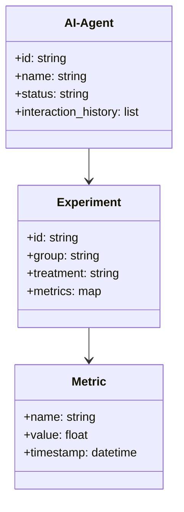
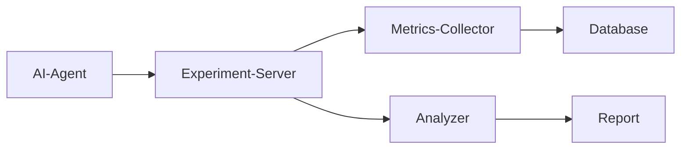
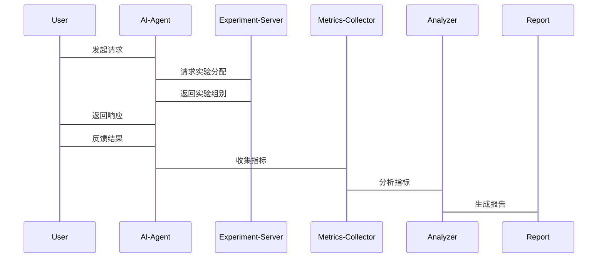

                 


# 企业级AI Agent的A/B测试策略与实施

## 关键词：企业级AI Agent，A/B测试，策略实施，技术博客，算法原理，系统架构，项目实战

## 摘要：  
本文将从企业级AI Agent的背景出发，深入探讨A/B测试的核心概念、策略设计、算法原理、系统架构与工程实践。通过结合实际案例，分析A/B测试在企业级AI Agent中的应用，帮助读者全面理解如何设计和实施有效的A/B测试策略，以优化AI Agent的性能和用户体验。

---

## 第一部分: 企业级AI Agent的A/B测试背景与基础

### 第1章: 企业级AI Agent与A/B测试概述

#### 1.1 什么是企业级AI Agent
- **1.1.1 AI Agent的基本概念**  
  AI Agent（人工智能代理）是指能够感知环境并采取行动以实现目标的智能实体。它可以是一个软件程序、机器人或其他智能系统，具备自主决策能力。  
  $$\text{AI Agent的核心特征包括：自主性、反应性、目标导向和社交能力。}$$  

- **1.1.2 企业级AI Agent的特点**  
  企业级AI Agent通常用于企业内部的复杂场景，如自动化流程、智能客服、供应链优化等。其特点是：  
  - 高可用性：需要7×24小时稳定运行。  
  - 高可靠性：决策过程需要高度准确。  
  - 高扩展性：能够处理大规模数据和复杂场景。  

- **1.1.3 企业级AI Agent的应用场景**  
  企业级AI Agent广泛应用于以下场景：  
  1. 智能客服：通过自然语言处理（NLP）技术为用户提供实时支持。  
  2. 供应链优化：通过预测模型优化库存管理和物流调度。  
  3. 智能推荐：基于用户行为推荐个性化产品或服务。  

#### 1.2 A/B测试的基本概念
- **1.2.1 什么是A/B测试**  
  A/B测试是一种通过对比不同版本的系统或功能，以评估哪个版本更优的实验方法。  
  $$\text{A/B测试的核心思想是通过小规模的实验，快速验证假设并优化系统。}$$  

- **1.2.2 A/B测试的核心原理**  
  A/B测试的原理是通过随机分配用户到不同的实验组，观察各组的指标表现，最终通过统计方法判断哪个版本更好。  

- **1.2.3 A/B测试在企业级AI Agent中的作用**  
  在企业级AI Agent中，A/B测试可以帮助：  
  1. 验证AI算法的改进效果。  
  2. 优化AI Agent的交互流程。  
  3. 提高用户体验和业务转化率。  

### 第2章: 企业级AI Agent的A/B测试背景

#### 2.1 企业级AI Agent的发展现状
- **2.1.1 AI Agent技术的演进**  
  AI Agent技术经历了从简单的规则引擎到复杂的深度学习模型的演变。现代企业级AI Agent通常结合了多种技术，如NLP、机器学习和知识图谱。  

- **2.1.2 企业级AI Agent的应用趋势**  
  随着AI技术的成熟，企业级AI Agent的应用场景不断扩大。例如，智能客服机器人已经从简单的FAQ回答发展到复杂的对话理解和任务执行。  

- **2.1.3 A/B测试在AI Agent中的重要性**  
  在AI Agent的开发和部署过程中，A/B测试是验证算法效果、优化性能和提升用户体验的重要手段。  

#### 2.2 企业级AI Agent的A/B测试需求
- **2.2.1 A/B测试在AI Agent中的必要性**  
  AI Agent的复杂性要求必须通过A/B测试来验证其在真实环境中的表现。  

- **2.2.2 企业级AI Agent的复杂性对A/B测试的挑战**  
  企业级AI Agent通常涉及复杂的算法和多维度的数据，这使得A/B测试的实施面临以下挑战：  
  - 数据量大：需要处理海量数据。  
  - 实时性要求高：实验结果需要快速反馈。  
  - 业务目标多样性：不同业务场景下的优化目标不同。  

- **2.2.3 A/B测试在企业级AI Agent中的目标**  
  A/B测试的目标是通过实验验证AI Agent的性能改进，同时确保实验结果的统计显著性和业务价值。  

### 第3章: 企业级AI Agent的A/B测试核心概念

#### 3.1 A/B测试的基本原理
- **3.1.1 对比实验的基本原理**  
  对比实验的核心是通过随机分配用户到实验组和对照组，分别收集数据，然后通过统计方法分析两组的差异。  

- **3.1.2 A/B测试的实验设计**  
  A/B测试的实验设计包括以下步骤：  
  1. 明确实验目标。  
  2. 设计实验组和对照组。  
  3. 收集数据并进行统计分析。  

- **3.1.3 A/B测试的统计方法**  
  常见的统计方法包括t检验、卡方检验和置信区间分析。  

#### 3.2 企业级AI Agent的A/B测试特点
- **3.2.1 复杂性与多样性**  
  企业级AI Agent的A/B测试涉及多种算法和数据源，实验设计需要考虑多维度因素。  

- **3.2.2 数据量与实时性要求**  
  企业级AI Agent通常需要处理海量数据，且要求实验结果能够实时反馈。  

- **3.2.3 业务目标与技术目标的结合**  
  A/B测试不仅需要验证技术上的改进，还需要确保这些改进能够带来业务价值。  

#### 3.3 A/B测试的核心要素
- **3.3.1 实验组与对照组的设计**  
  实验组和对照组的设计需要确保实验的可比性和独立性。  

- **3.3.2 实验变量与控制变量**  
  实验变量是需要测试的变量，控制变量是需要保持不变的变量。  

- **3.3.3 统计指标与业务指标**  
  统计指标用于衡量实验效果，业务指标用于衡量实验的业务价值。  

---

## 第二部分: 企业级AI Agent的A/B测试策略

### 第4章: A/B测试的策略设计

#### 4.1 A/B测试的目标设定
- **4.1.1 业务目标与技术目标的统一**  
  A/B测试的目标需要与业务目标和技术目标保持一致。  

- **4.1.2 实验目标的分解与优先级**  
  将整体目标分解为多个子目标，并根据优先级进行排序。  

- **4.1.3 目标设定的注意事项**  
  目标设定需要具体、可衡量、可实现、相关性和有时限性（SMART原则）。  

#### 4.2 A/B测试的实验设计
- **4.2.1 实验组与对照组的设计原则**  
  实验组和对照组的设计需要确保实验的公平性和可比性。  

- **4.2.2 变量的控制与隔离**  
  需要控制其他变量，以确保实验结果仅由实验变量引起。  

- **4.2.3 实验样本的选择与分配**  
  实验样本需要随机分配，并确保样本具有代表性。  

#### 4.3 A/B测试的执行策略
- **4.3.1 实验的分阶段执行**  
  A/B测试通常分为预实验、正式实验和后实验三个阶段。  

- **4.3.2 实验的监控与调整**  
  在实验过程中，需要实时监控实验指标，并根据情况调整实验参数。  

- **4.3.3 实验的终止条件**  
  实验终止的条件通常包括达到预期目标、实验时间超限或实验结果显著。  

### 第5章: A/B测试的算法与技术

#### 5.1 A/B测试的统计方法
- **5.1.1 常用统计方法**  
  - t检验：用于比较两组数据的均值差异。  
  - 卡方检验：用于比较分类变量的分布差异。  
  - 置信区间：用于估计参数的范围。  

- **5.1.2 统计方法的优缺点对比**  
  | 统计方法 | 优点 | 缺点 |  
  |----------|------|------|  
  | t检验 | 易用性高 | 不适用于分类变量 |  
  | 卡方检验 | 适用于分类变量 | 计算复杂 |  
  | 置信区间 | 提供参数范围 | 需要假设正态分布 |  

#### 5.2 基于机器学习的A/B测试
- **5.2.1 机器学习在A/B测试中的应用**  
  机器学习可以用于预测实验结果和优化实验设计。  

- **5.2.2 常见机器学习模型**  
  - 回归模型：用于预测连续型指标。  
  - 分类模型：用于预测分类型指标。  

- **5.2.3 机器学习模型的优缺点**  
  | 机器学习模型 | 优点 | 缺点 |  
  |--------------|------|------|  
  | 回归模型 | 预测精度高 | 对异常值敏感 |  
  | 分类模型 | 适合分类问题 | 需要大量数据 |  

#### 5.3 A/B测试的算法实现
- **5.3.1 实验设计算法**  
  使用随机分配算法将用户分配到实验组和对照组。  

- **5.3.2 统计分析算法**  
  使用t检验或卡方检验分析实验结果。  

---

## 第三部分: 企业级AI Agent的A/B测试系统架构与工程实践

### 第6章: 系统架构设计

#### 6.1 系统功能设计
- **6.1.1 领域模型设计**  
  使用mermaid类图描述系统的功能模块。  



- **6.1.2 系统架构设计**  
  使用mermaid架构图描述系统的整体架构。  



- **6.1.3 系统交互设计**  
  使用mermaid序列图描述系统的交互流程。  



### 第7章: 项目实战与最佳实践

#### 7.1 项目实战
- **7.1.1 环境安装**  
  安装必要的工具和库，例如Python、numpy、pandas、scipy等。  

- **7.1.2 核心代码实现**  
  示例代码如下：  

```python
import numpy as np
from scipy.stats import ttest_ind

# 示例数据
group_a = np.random.normal(0, 1, 100)
group_b = np.random.normal(0.5, 1, 100)

# 进行t检验
t_stat, p_val = ttest_ind(group_a, group_b)
print(f"t统计量：{t_stat}, p值：{p_val}")
```

- **7.1.3 实验结果分析**  
  根据t检验结果，判断实验组和对照组的差异是否显著。  

#### 7.2 最佳实践
- **7.2.1 实验设计的注意事项**  
  - 确保实验的随机性和独立性。  
  - 控制实验变量，避免其他因素的干扰。  

- **7.2.2 数据分析的注意事项**  
  - 确保数据的完整性和准确性。  
  - 使用适当的统计方法进行分析。  

- **7.2.3 实验结果的应用**  
  - 根据实验结果优化AI Agent的性能。  
  - 总结实验经验，为后续实验提供参考。  

---

## 第四部分: 总结与展望

### 第8章: 总结与展望

#### 8.1 总结
企业级AI Agent的A/B测试是一个复杂但重要的过程，需要结合技术与业务目标，通过科学的实验设计和数据分析，验证和优化AI Agent的性能。  

#### 8.2 展望
随着AI技术的不断发展，A/B测试在企业级AI Agent中的应用将更加广泛和深入。未来的研究方向包括：  
1. 更加智能的实验设计方法。  
2. 更高效的统计分析算法。  
3. 更加个性化的用户实验策略。  

---

## 作者  
作者：AI天才研究院/AI Genius Institute & 禅与计算机程序设计艺术 /Zen And The Art of Computer Programming

