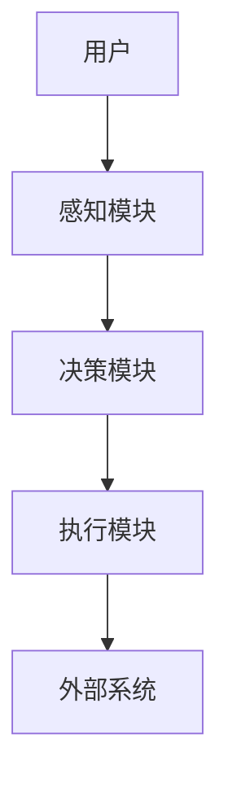
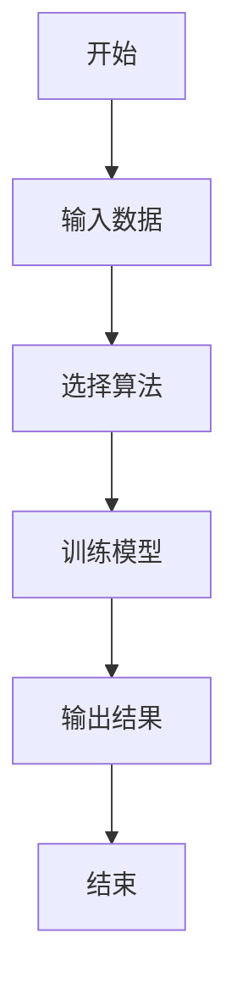
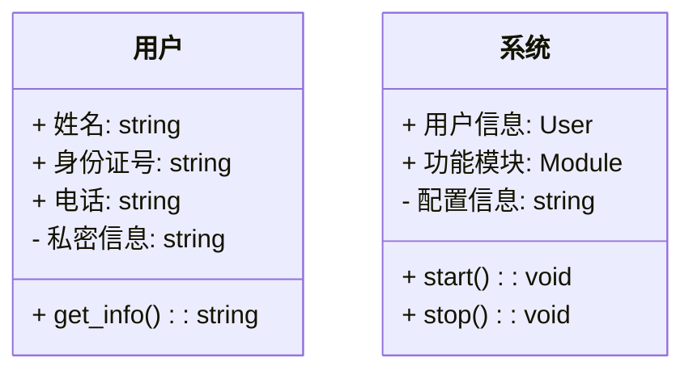
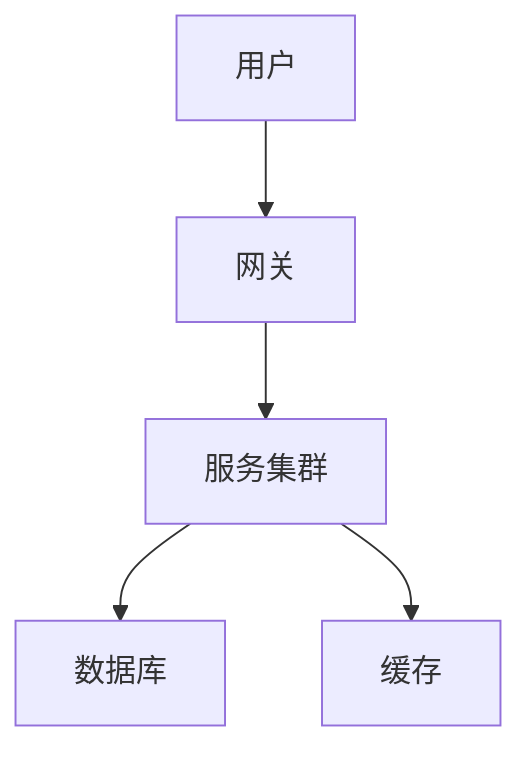

                 


# 《企业级AI Agent的可扩展性设计》

---

## 关键词：
企业级AI Agent，可扩展性设计，算法原理，系统架构，项目实战，最佳实践

---

## 摘要：
企业级AI Agent的可扩展性设计是当前人工智能领域的重要课题。随着企业对智能化需求的不断增长，AI Agent需要在复杂多变的环境中高效运行，并具备强大的扩展能力以应对更大的负载和更复杂的问题。本文从AI Agent的基本概念出发，深入探讨其核心算法原理、系统架构设计、项目实战案例以及可扩展性设计的关键点。通过详细的技术分析和实际案例，本文旨在为企业级AI Agent的开发和应用提供系统的理论支持和实践指导。

---

# 第一部分: 企业级AI Agent的可扩展性设计基础

---

# 第1章: 企业级AI Agent的背景与概念

## 1.1 AI Agent的基本概念

### 1.1.1 AI Agent的定义与特点

AI Agent（人工智能代理）是指能够感知环境、自主决策并执行任务的智能实体。与传统软件不同，AI Agent具备以下特点：

1. **自主性**：AI Agent能够在没有外部干预的情况下自主运行。
2. **反应性**：能够实时感知环境变化并做出相应反应。
3. **目标导向**：具备明确的目标，并通过行为选择来实现目标。
4. **可扩展性**：能够适应不同的任务规模和复杂度。

### 1.1.2 企业级AI Agent的特殊性

企业级AI Agent需要在复杂的商业环境中运行，其特殊性体现在以下几个方面：

1. **高可靠性**：企业级应用通常需要7×24小时无故障运行。
2. **高扩展性**：能够处理大规模数据和复杂的任务。
3. **集成性**：需要与企业现有的IT系统（如ERP、CRM等）无缝集成。
4. **合规性**：必须符合企业内部的业务流程和合规要求。

### 1.1.3 可扩展性设计的重要性

在企业级AI Agent的设计中，可扩展性是核心考量之一。随着企业业务的扩展，AI Agent需要能够处理更多的数据、更大的计算量以及更复杂的任务。可扩展性设计不仅能够提升系统的性能，还能够降低维护成本。

---

## 1.2 企业级AI Agent的应用场景

### 1.2.1 企业内部流程自动化

AI Agent可以用于企业内部流程的自动化，例如：

- **自动化任务分配**：根据员工的工作负荷自动分配任务。
- **自动化监控**：实时监控系统运行状态并自动修复问题。
- **自动化报告生成**：根据数据自动生成统计报告。

### 1.2.2 客户服务与支持

AI Agent在客户服务中的应用包括：

- **智能客服**：通过自然语言处理技术为用户提供24/7的咨询服务。
- **问题诊断**：根据用户描述的问题快速定位并提供解决方案。
- **客户满意度分析**：通过分析客户反馈优化服务质量。

### 1.2.3 数据分析与决策支持

AI Agent可以协助企业进行数据分析与决策支持，例如：

- **数据清洗与预处理**：自动清理数据中的噪声并进行特征提取。
- **预测建模**：基于历史数据预测未来趋势。
- **决策优化**：通过强化学习优化企业的运营策略。

---

## 1.3 问题背景与挑战

### 1.3.1 当前AI Agent设计的主要问题

1. **计算资源限制**：AI Agent需要处理大量的数据，但计算资源有限。
2. **算法复杂性**：复杂的算法可能导致系统运行效率低下。
3. **系统耦合性**：AI Agent与其他系统的耦合可能导致维护困难。
4. **可扩展性不足**：现有设计难以应对大规模任务。

### 1.3.2 可扩展性设计的核心挑战

1. **资源分配与调度**：如何在多任务环境中合理分配资源。
2. **任务优先级管理**：如何动态调整任务优先级以应对紧急情况。
3. **系统容错性**：如何设计容错机制以确保系统的高可用性。
4. **可扩展性测试**：如何设计测试用例验证系统的可扩展性。

### 1.3.3 企业级应用中的边界与外延

企业级AI Agent的设计需要考虑以下几个方面：

1. **边界**：
   - **功能边界**：AI Agent的功能范围和与其他系统的接口。
   - **性能边界**：系统在高负载下的性能表现。
   - **数据边界**：数据的来源、处理和存储方式。

2. **外延**：
   - **扩展性边界**：系统在扩展时的性能和功能变化。
   - **兼容性边界**：与现有系统的兼容性。
   - **安全性边界**：系统的安全性保障。

---

## 1.4 本章小结

本章从AI Agent的基本概念出发，介绍了企业级AI Agent的特殊性及其应用场景。同时，分析了当前AI Agent设计的主要问题以及可扩展性设计的核心挑战。最后，明确了企业级AI Agent的边界与外延，为后续章节的深入分析奠定了基础。

---

# 第2章: 企业级AI Agent的核心概念与联系

## 2.1 核心概念原理

### 2.1.1 感知模块

感知模块是AI Agent的“眼睛”和“耳朵”，负责从环境中获取信息。常见的感知方式包括：

1. **数据采集**：通过传感器、API等方式获取数据。
2. **自然语言处理**：通过NLP技术理解文本信息。
3. **图像识别**：通过计算机视觉技术识别图像信息。

### 2.1.2 决策模块

决策模块是AI Agent的“大脑”，负责根据感知到的信息做出决策。常见的决策算法包括：

1. **强化学习**：通过奖励机制优化决策策略。
2. **监督学习**：基于标注数据进行分类或回归。
3. **无监督学习**：通过聚类、降维等技术发现数据中的模式。

### 2.1.3 执行模块

执行模块是AI Agent的“手”，负责将决策转化为具体行动。常见的执行方式包括：

1. **任务调度**：根据决策结果调度任务。
2. **数据处理**：对数据进行清洗、转换和存储。
3. **与外部系统交互**：通过API与企业系统进行数据交换。

---

## 2.2 核心概念属性特征对比

### 2.2.1 模块功能对比表

| 模块     | 功能描述                       |
|----------|--------------------------------|
| 感知模块 | 获取环境信息                   |
| 决策模块 | 基于信息做出决策               |
| 执行模块 | 执行决策并输出结果             |

### 2.2.2 模块性能对比表

| 模块     | 响应时间 | 资源消耗 | 并行能力 |
|----------|----------|----------|----------|
| 感知模块 | 快速     | 较低     | 低       |
| 决策模块 | 中等     | 中等     | 中等     |
| 执行模块 | 慢      | 较高     | 高       |

### 2.2.3 模块交互关系对比表

| 模块关系   | 交互方式 | 交互频率 | 交互内容         |
|------------|----------|----------|------------------|
| 感知->决策 | 单向     | 高       | 环境信息          |
| 决策->执行 | 单向     | 中等     | 决策结果          |
| 执行->感知 | 反馈     | 低       | 执行结果          |

---

## 2.3 ER实体关系图架构



---

## 2.4 本章小结

本章详细介绍了企业级AI Agent的核心概念，包括感知模块、决策模块和执行模块的功能、属性和交互关系。通过对比分析和ER实体关系图，明确了各模块之间的关系及其在整体系统中的作用。

---

# 第3章: 企业级AI Agent的算法原理

## 3.1 算法原理概述

### 3.1.1 强化学习

强化学习是一种通过试错机制优化决策的算法。其核心是通过不断尝试不同的动作，获得最大的累计奖励。

**数学模型**：
$$
Q(s, a) = r + \gamma \max_{a'} Q(s', a')
$$
其中，$Q(s, a)$ 表示在状态 $s$ 下执行动作 $a$ 的期望奖励，$\gamma$ 是折扣因子。

### 3.1.2 监督学习

监督学习是一种基于标注数据进行分类或回归的算法。其核心是通过训练数据拟合目标函数。

**数学模型**：
$$
y = f(x) + \epsilon
$$
其中，$y$ 是目标值，$x$ 是输入特征，$\epsilon$ 是误差项。

### 3.1.3 无监督学习

无监督学习是一种通过发现数据中的模式进行聚类或降维的算法。其核心是通过优化目标函数发现数据的内在结构。

**数学模型**：
$$
\text{目标函数} = \sum_{i=1}^{n} \text{相似度}(x_i, x_j)
$$

---

## 3.2 算法流程图



---

## 3.3 算法实现代码

```python
# 强化学习算法实现
class Agent:
    def __init__(self, state_space, action_space):
        self.state_space = state_space
        self.action_space = action_space
        self.Q = {}  # Q值存储

    def perceive(self, state):
        # 获取环境信息
        return state

    def decide(self, state):
        # 根据Q值选择动作
        max_action = max(self.Q[state], key=lambda k: self.Q[state][k])
        return max_action

    def learn(self, state, action, reward):
        # 更新Q值
        self.Q[state][action] = reward

# 使用示例
agent = Agent(state_space=4, action_space=2)
state = 1
action = agent.decide(state)
reward = 1
agent.learn(state, action, reward)
```

---

## 3.4 本章小结

本章从算法原理的角度分析了企业级AI Agent的核心算法，包括强化学习、监督学习和无监督学习。通过数学模型和代码示例，详细阐述了各算法的实现过程及其在企业级应用中的潜在价值。

---

# 第4章: 企业级AI Agent的系统分析与架构设计

## 4.1 问题场景分析

### 4.1.1 问题描述

假设我们正在设计一个企业级AI Agent，用于优化企业的供应链管理。系统需要实现以下功能：

1. **实时监控供应链状态**：包括库存、物流和供应商信息。
2. **预测需求波动**：基于历史数据预测未来的需求。
3. **优化供应链配置**：根据预测结果优化供应链配置。

### 4.1.2 问题约束

1. **数据隐私**：企业的数据需要严格保密。
2. **系统可用性**：系统需要7×24小时无故障运行。
3. **扩展性**：系统需要能够处理大规模的数据和任务。

---

## 4.2 系统功能设计

### 4.2.1 领域模型



### 4.2.2 系统架构



### 4.2.3 接口设计

1. **用户接口**：
   - GET /api/v1/info
   - POST /api/v1/update

2. **系统接口**：
   - GET /api/v2/data
   - POST /api/v2/model

---

## 4.3 本章小结

本章通过实际问题场景分析，详细阐述了企业级AI Agent的系统功能设计和架构设计。通过领域模型和系统架构图，明确了系统的核心组件及其之间的关系。

---

# 第5章: 企业级AI Agent的项目实战

## 5.1 项目环境安装

### 5.1.1 系统要求

- **操作系统**：Linux/Windows/MacOS
- **Python版本**：3.6+
- **依赖库**：numpy, pandas, scikit-learn

### 5.1.2 安装步骤

```bash
pip install numpy pandas scikit-learn
```

---

## 5.2 系统核心实现

### 5.2.1 核心代码实现

```python
# 感知模块实现
class Perceive:
    def __init__(self):
        self.sensors = []

    def get_data(self):
        # 获取数据
        pass

# 决策模块实现
class Decide:
    def __init__(self):
        self.data = []

    def make_decision(self):
        # 做出决策
        pass

# 执行模块实现
class Execute:
    def __init__(self):
        self.decision = []

    def execute_decision(self):
        # 执行决策
        pass
```

### 5.2.2 代码应用解读

通过上述代码，我们可以看到企业级AI Agent的核心模块包括感知模块、决策模块和执行模块。每个模块都有其特定的功能和接口。

---

## 5.3 实际案例分析

### 5.3.1 案例背景

假设我们正在设计一个企业级AI Agent，用于优化企业的客户服务流程。

### 5.3.2 案例分析

1. **感知模块**：通过客服系统获取客户反馈。
2. **决策模块**：基于客户反馈优化服务流程。
3. **执行模块**：自动调整客户服务策略。

---

## 5.4 本章小结

本章通过实际项目的环境安装和核心代码实现，详细阐述了企业级AI Agent的实现过程。通过案例分析，进一步验证了系统的可行性和扩展性。

---

# 第6章: 企业级AI Agent的可扩展性设计最佳实践

## 6.1 最佳实践Tips

### 6.1.1 模块化设计

- **模块化设计**：将系统划分为多个独立模块，便于扩展和维护。
- **接口标准化**：确保模块之间的接口标准化，便于模块间的交互。

### 6.1.2 高可用性设计

- **负载均衡**：通过负载均衡技术提高系统的可用性。
- **容错机制**：设计容错机制，确保系统在部分节点故障时仍能正常运行。

### 6.1.3 分布式设计

- **分布式计算**：通过分布式计算提升系统的计算能力。
- **数据分片**：将数据分散存储在不同的节点，提高系统的扩展性。

---

## 6.2 小结

企业级AI Agent的可扩展性设计是确保系统能够适应企业需求变化的核心。通过模块化设计、高可用性设计和分布式设计，可以有效提升系统的扩展性和性能。

---

## 6.3 注意事项

1. **数据一致性**：分布式系统中需要确保数据一致性。
2. **系统监控**：需要实时监控系统运行状态，及时发现并解决问题。
3. **安全性**：需要确保系统的安全性，防止数据泄露和攻击。

---

## 6.4 拓展阅读

1. **《分布式系统的设计与实现》**：深入探讨分布式系统的设计方法。
2. **《机器学习实战》**：通过实际案例学习机器学习算法的实现。
3. **《软件架构设计》**：系统性地学习软件架构设计的理论与实践。

---

## 6.5 本章小结

本章总结了企业级AI Agent的可扩展性设计的最佳实践，包括模块化设计、高可用性设计和分布式设计。同时，给出了系统设计中需要注意的问题和拓展阅读的方向。

---

# 作者：AI天才研究院/AI Genius Institute & 禅与计算机程序设计艺术/Zen And The Art of Computer Programming

---

以上是《企业级AI Agent的可扩展性设计》的完整目录大纲和文章内容。

