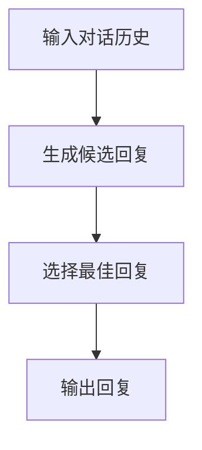
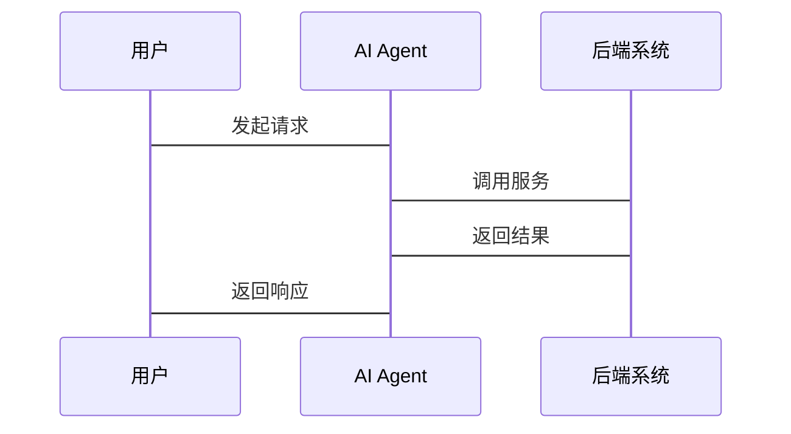

                 


# 企业级AI Agent的可扩展架构设计

> 关键词：企业级AI Agent、可扩展架构、对话生成算法、系统架构设计、大语言模型、AI代理系统

> 摘要：本文详细探讨了企业级AI Agent的可扩展架构设计，从核心概念、算法原理、系统架构到项目实战，全面解析了如何构建高效、可扩展的AI代理系统。通过分析多智能体系统、知识表示、对话理解和任务执行等核心概念，结合具体案例，展示了企业级AI Agent在实际应用中的设计与实现。

---

## 第一部分: 企业级AI Agent的背景与概念

### 第1章: 企业级AI Agent概述

#### 1.1 AI Agent的基本概念
- **什么是AI Agent？**
  AI Agent（人工智能代理）是一种能够感知环境并采取行动以实现目标的智能实体。它能够理解用户需求，执行复杂任务，并通过与系统的交互提供智能服务。
  
- **AI Agent的核心特征：**
  - **自主性**：能够在没有外部干预的情况下运行。
  - **反应性**：能够实时感知环境并做出反应。
  - **目标导向**：通过目标驱动行为，优化决策过程。
  - **可扩展性**：能够根据需求扩展功能和服务能力。

#### 1.2 企业级AI Agent的背景与问题背景
- **企业智能化转型的挑战：**
  随着企业数字化转型的推进，传统系统难以满足日益增长的智能化需求。企业需要更高效的工具来处理复杂任务，提升效率和用户体验。

- **AI Agent在企业中的应用场景：**
  - 客户服务：通过对话系统解决用户问题。
  - 业务流程自动化：优化企业内部流程，提高效率。
  - 数据分析与决策支持：利用AI代理进行数据处理和决策。

- **传统架构的局限性与问题描述：**
  传统系统通常是单体架构，难以扩展，且功能耦合度高，导致维护和升级困难。此外，传统系统缺乏智能化，难以应对复杂多变的业务需求。

#### 1.3 企业级AI Agent的解决方案
- **可扩展架构的核心思想：**
  采用分层架构，将系统划分为多个模块，每个模块负责特定功能，从而提高系统的可扩展性和可维护性。

- **分层架构的设计理念：**
  - **感知层**：负责与用户交互，理解用户需求。
  - **推理层**：基于知识库进行推理，生成响应。
  - **执行层**：执行具体任务，返回结果。

- **模块化设计的优势与实现思路：**
  模块化设计使得系统功能独立，便于功能扩展和维护。通过定义清晰的接口，各模块可以协同工作，确保系统的灵活性和可扩展性。

---

### 第2章: 企业级AI Agent的核心概念与联系

#### 2.1 核心概念原理
- **多智能体系统：**
  由多个智能体组成的系统，能够协作完成复杂任务。智能体之间通过通信和协作，实现任务分解和资源分配。

- **知识表示与推理：**
  知识表示是对现实世界信息的抽象表示，推理是基于知识库进行逻辑推理，生成新的知识。

- **对话理解与生成：**
  对话理解涉及自然语言处理技术，理解用户意图；对话生成则是基于理解生成自然的回复。

- **任务执行与反馈：**
  根据用户的指令执行任务，并通过反馈机制优化任务执行过程。

#### 2.2 核心概念属性特征对比表
| 概念       | 属性特征                     |
|------------|------------------------------|
| 多智能体系统 | 分布式、协作性、独立性       |
| 知识表示    | 形式化、可解释性、动态性     |
| 对话理解    | 语义理解、上下文依赖、实时性 |
| 任务执行    | 可分解性、可组合性、可扩展性 |

#### 2.3 ER实体关系图

```mermaid
er
actor(AI Agent, 用户, 系统)
relation(与用户交互, 调用系统服务, 执行任务)
```

---

### 第3章: 企业级AI Agent的算法原理

#### 3.1 大语言模型的训练过程
- **Transformer架构：**
  Transformer是一种基于注意力机制的深度学习模型，广泛应用于自然语言处理任务。

- **自注意力机制：**
  每个词都可以关注其他词的重要性，生成上下文相关的表示。

- **梯度下降优化：**
  使用反向传播算法，通过梯度下降优化模型参数，降低损失函数。

#### 3.2 对话生成算法
- **对话生成算法：**
  基于预训练的大语言模型，通过解码生成自然的对话回复。

- **算法流程图：**



- **Python代码实现：**
  ```python
  def generate_response(history):
      # 输入对话历史，生成候选回复
      candidates = model.generate(history)
      # 选择最佳回复
      best_candidate = select_best_candidate(candidates)
      return best_candidate
  ```

- **数学模型和公式：**
  对话生成模型的损失函数可以表示为：
  $$ L = -\sum_{i=1}^{n} \log P(y_i|x) $$
  其中，$y_i$ 是生成的回复，$x$ 是输入。

---

## 第二部分: 企业级AI Agent的系统分析与架构设计

### 第4章: 系统分析与架构设计

#### 4.1 系统功能设计
- **领域模型：**
  ```mermaid
  classDiagram
      class AI Agent {
          - 用户交互模块
          - 知识库
          - 任务执行模块
      }
      class 用户 {
          + 发起请求
          + 收到响应
      }
      class 系统 {
          + 提供服务
      }
      AI Agent --> 用户: 处理请求
      AI Agent --> 系统: 调用服务
  ```

#### 4.2 系统架构设计
- **分层架构：**
  - **感知层：** 处理用户输入，生成对话回复。
  - **推理层：** 基于知识库进行推理，生成候选回复。
  - **执行层：** 执行具体任务，并返回结果。

- **系统架构图：**


#### 4.3 系统接口设计
- **接口设计：**
  - 用户通过API调用AI Agent服务。
  - AI Agent通过API调用后端系统服务。

- **接口交互流程图：**



---

### 第5章: 项目实战

#### 5.1 环境安装
- **安装Python：**
  ```bash
  python --version
  ```

- **安装依赖库：**
  ```bash
  pip install transformers torch
  ```

#### 5.2 核心代码实现
- **对话生成模块：**
  ```python
  from transformers import AutoModelForCausalLM, AutoTokenizer

  model_name = "gpt2"
  model = AutoModelForCausalLM.from_pretrained(model_name)
  tokenizer = AutoTokenizer.from_pretrained(model_name)

  def generate_response(prompt):
      inputs = tokenizer.encode(prompt, return_tensors="pt")
      outputs = model.generate(inputs, max_length=50, do_sample=True)
      response = tokenizer.decode(outputs[0], skip_special_tokens=True)
      return response
  ```

- **任务执行模块：**
  ```python
  import requests

  def execute_task(task):
      # 调用后端服务
      response = requests.post("http://backend:8000/task", json=task)
      return response.json()
  ```

#### 5.3 案例分析与解读
- **实际案例分析：**
  某企业使用AI Agent优化客户服务流程，通过对话系统处理用户咨询，提升了客户满意度和效率。

- **代码应用解读：**
  通过代码实现对话生成和任务执行，展示了AI Agent在实际中的应用。

---

### 第6章: 最佳实践与小结

#### 6.1 最佳实践
- **模块化设计：** 采用模块化设计，便于功能扩展和维护。
- **接口标准化：** 定义清晰的接口，确保系统各部分协同工作。
- **持续优化：** 定期优化模型和算法，提升系统性能。

#### 6.2 小结
本文详细探讨了企业级AI Agent的可扩展架构设计，从核心概念到算法实现，再到系统设计和项目实战，全面解析了如何构建高效的AI代理系统。通过分层架构和模块化设计，企业可以灵活扩展AI Agent的功能，满足多样化的业务需求。

---

作者：AI天才研究院/AI Genius Institute & 禅与计算机程序设计艺术 /Zen And The Art of Computer Programming

