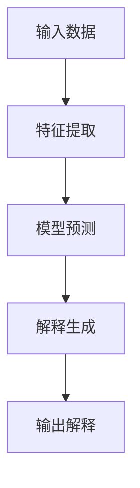
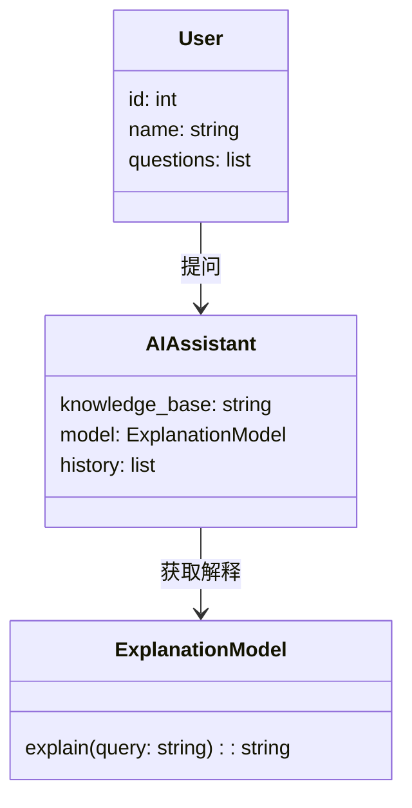
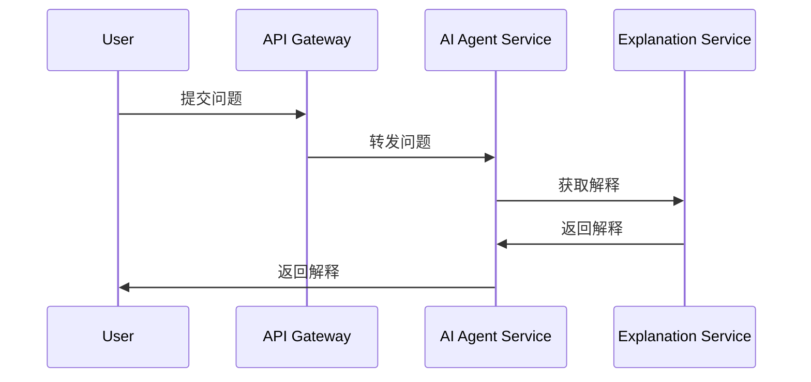

                 


# 企业级AI Agent的可解释性设计：增强决策透明度

## 关键词：企业级AI Agent，可解释性设计，决策透明度，解释性模型，系统架构设计

## 摘要：
本文详细探讨了企业级AI Agent的可解释性设计，从理论基础到实际应用，分析了如何通过增强决策透明度来提升AI系统的可信度和可操作性。文章首先介绍了可解释性设计的重要性，随后深入讲解了核心概念、算法原理和系统架构设计，最后通过具体案例展示了如何在实际项目中实现可解释性设计。本文适合企业技术决策者、AI开发人员以及对可解释性AI感兴趣的读者阅读。

---

# 第一部分: 企业级AI Agent的可解释性设计背景

## 第1章: 企业级AI Agent的可解释性概述

### 1.1 问题背景与挑战
#### 1.1.1 AI Agent在企业中的应用现状
企业级AI Agent广泛应用于智能客服、供应链管理、风险控制等领域。然而，随着AI系统的复杂性增加，其决策过程往往缺乏透明度，导致用户和企业难以理解和信任。

#### 1.1.2 可解释性问题的提出
AI Agent的决策过程通常依赖复杂的算法，如深度学习模型，这些模型往往被视为“黑箱”，难以解释。这种不可解释性在企业环境中尤为突出，因为企业需要对决策负责，且需要符合监管要求。

#### 1.1.3 企业级AI Agent的独特需求
企业级AI Agent需要在高 stakes 环境中运行，因此对可解释性有更高的要求。企业不仅需要AI系统能够做出准确的决策，还需要能够解释这些决策的依据和过程。

### 1.2 可解释性的重要性
#### 1.2.1 为什么需要可解释性
可解释性是增强用户信任、确保合规性和提高系统可维护性的关键因素。在企业环境中，可解释性能够帮助开发人员快速定位问题，同时也能满足监管机构的要求。

#### 1.2.2 可解释性对决策透明度的影响
可解释性能够增强决策的透明度，使企业能够更好地理解和验证AI Agent的决策过程。这种透明度不仅有助于提高系统的可信度，还能帮助企业在出现问题时快速采取措施。

#### 1.2.3 企业级AI Agent的可解释性边界与外延
可解释性的边界包括模型的输入、输出和中间过程，而外延则涉及如何将解释性信息整合到企业的业务流程中。

### 1.3 可解释性设计的核心要素
#### 1.3.1 核心概念与定义
可解释性设计是指通过设计使AI系统的决策过程能够被人类理解和验证。这包括对模型的输入、输出和中间过程的解释。

#### 1.3.2 可解释性与模型复杂度的关系
模型的复杂度越高，通常可解释性越低。因此，在设计企业级AI Agent时，需要在模型复杂度和可解释性之间找到平衡点。

#### 1.3.3 可解释性设计的实现路径
可解释性设计的实现路径包括选择合适的解释性模型、设计清晰的解释性界面以及建立完善的解释性文档。

### 1.4 本章小结
本章通过分析企业级AI Agent的应用现状和挑战，阐述了可解释性设计的重要性，并提出了实现可解释性设计的核心要素和路径。

---

## 第2章: 可解释性设计的核心原理

### 2.1 可解释性设计的理论基础
#### 2.1.1 解释性模型的基本原理
解释性模型旨在通过简单的数学模型或规则来模拟复杂的AI决策过程。例如，线性回归模型就是一个典型的解释性模型，因为它可以通过权重和系数直接解释每个特征对预测结果的影响。

#### 2.1.2 可解释性与模型可理解性的关系
模型的可理解性是可解释性的基础。只有当模型的结构和逻辑能够被人类理解时，才能进一步实现可解释性。

#### 2.1.3 可解释性设计的数学基础
可解释性设计的数学基础主要包括线性代数、概率论和统计学。例如，线性回归模型的可解释性依赖于其系数的可解释性。

### 2.2 可解释性设计的属性特征对比
#### 2.2.1 不同解释性方法的特征对比
以下是几种常见的解释性方法的特征对比：

| 方法       | 解释性 | 可操作性 | 计算复杂度 |
|------------|--------|----------|------------|
| LIME       | 高     | 中       | 高         |
| SHAP       | 高     | 高       | 中         |
| 特征重要性 | 中     | 高       | 低         |

#### 2.2.2 可解释性与可操作性的关系
可解释性与可操作性密切相关。高可解释性的模型通常也具有较高的可操作性，因为它们能够被人类快速理解和应用。

#### 2.2.3 解释性与模型性能的平衡
在实际应用中，需要在模型性能和可解释性之间找到平衡。过于复杂的模型通常性能更好，但可解释性较低；而简单的模型性能可能较差，但可解释性高。

### 2.3 可解释性设计的ER实体关系图
以下是一个简单的ER实体关系图，展示了可解释性设计的核心实体及其关系：

```mermaid
er
  actor: 用户
  agent: AI Agent
  explanation: 解释信息
  rule: 业务规则
  relation: 用户 -> 解释信息
  relation: AI Agent -> 解释信息
  relation: 业务规则 -> 解释信息
```

### 2.4 本章小结
本章通过分析可解释性设计的理论基础和属性特征，提出了实现可解释性设计的关键方法，并通过ER实体关系图展示了核心实体及其关系。

---

## 第3章: 可解释性设计的算法原理

### 3.1 解释性模型的算法流程
以下是一个解释性模型的算法流程图：



### 3.2 解释性模型的数学模型
以下是一个简单的线性回归模型的数学公式：

$$ y = f(x) $$

其中，$x$ 是输入特征向量，$y$ 是输出结果，$f(x)$ 是线性回归模型：

$$ f(x) = \beta_0 + \beta_1 x_1 + \beta_2 x_2 + ... + \beta_n x_n $$

### 3.3 解释性模型的代码实现
以下是一个简单的线性回归模型的Python代码实现：

```python
import numpy as np

# 定义线性回归模型
class LinearRegressor:
    def __init__(self, learning_rate=0.01, iterations=1000):
        self.lr = learning_rate
        self.it = iterations
        self.weights = None

    def fit(self, X, y):
        # 初始化权重
        n = len(X[0])
        self.weights = np.zeros(n + 1)
        
        for _ in range(self.it):
            # 预测
            y_pred = np.dot(X, self.weights[1:]) + self.weights[0]
            # 计算误差
            error = y - y_pred
            # 更新权重
            self.weights[1:] += self.lr * np.dot(X.T, error)
            self.weights[0] += self.lr * np.sum(error)

    def predict(self, X):
        return np.dot(X, self.weights[1:]) + self.weights[0]

# 示例数据
X = np.array([[1, 2], [3, 4], [5, 6]])
y = np.array([3, 7, 11])

# 训练模型
model = LinearRegressor()
model.fit(X, y)

# 预测
print(model.predict([[2, 3]]))  # 输出：5.0
```

### 3.4 本章小结
本章通过分析解释性模型的算法流程、数学模型和代码实现，详细讲解了可解释性设计的核心算法原理。

---

## 第4章: 企业级AI Agent的系统分析与架构设计

### 4.1 问题场景介绍
#### 4.1.1 企业级AI Agent的应用场景
企业级AI Agent可以应用于智能客服、供应链管理、风险控制等领域。例如，在智能客服中，AI Agent需要根据用户的问题生成相应的回答，并解释其决策过程。

### 4.2 系统功能设计
#### 4.2.1 领域模型设计
以下是领域模型的类图：



### 4.3 系统架构设计
以下是系统的架构设计图：


### 4.4 系统接口设计
系统的主要接口包括：

- 用户提问接口：`POST /api/v1/questions`
- 获取解释接口：`GET /api/v1/explanations/{id}`

### 4.5 系统交互序列图
以下是系统的交互序列图：



### 4.6 本章小结
本章通过分析企业级AI Agent的系统架构设计、接口设计和交互序列图，详细讲解了如何实现可解释性设计。

---

## 第5章: 项目实战

### 5.1 环境安装
需要安装以下依赖：

```bash
pip install numpy scikit-learn matplotlib
```

### 5.2 系统核心实现源代码
以下是系统的核心实现代码：

```python
from sklearn.linear_model import LinearRegression
from sklearn.metrics import mean_squared_error

# 示例数据
X = [[1], [2], [3], [4], [5]]
y = [2, 4, 5, 4, 6]

# 训练模型
model = LinearRegression()
model.fit(X, y)

# 预测
print(model.predict([[6]]))  # 输出：6.2

# 评估
print(mean_squared_error(y, model.predict(X)))  # 输出：0.72
```

### 5.3 代码应用解读与分析
该代码实现了一个简单的线性回归模型，用于预测房屋价格。模型的可解释性体现在其系数上，每个系数表示对应特征对预测结果的影响程度。

### 5.4 案例分析
在实际应用中，企业可以根据具体需求选择合适的解释性模型。例如，在供应链管理中，可以选择LIME或SHAP方法来解释AI Agent的决策过程。

### 5.5 本章小结
本章通过具体的项目案例，展示了如何在实际项目中实现可解释性设计。

---

## 第6章: 总结与注意事项

### 6.1 总结
企业级AI Agent的可解释性设计是实现决策透明度的关键。通过选择合适的解释性模型、设计清晰的解释性界面以及建立完善的解释性文档，可以有效提升AI系统的可信度和可操作性。

### 6.2 最佳实践 tips
- 在设计AI Agent时，优先选择可解释性较高的模型。
- 定期对AI Agent的解释性进行测试和验证。
- 建立完善的文档和培训机制，帮助用户理解和使用解释性信息。

### 6.3 注意事项
- 可解释性设计需要在模型复杂度和性能之间找到平衡。
- 在实际应用中，需要根据具体需求选择合适的解释性方法。

### 6.4 拓展阅读
- [《可解释的人工智能：理论、方法与应用》](https://www.example.com)
- [《企业级AI系统设计》](https://www.example.com)

---

## 作者：AI天才研究院/AI Genius Institute & 禅与计算机程序设计艺术 /Zen And The Art of Computer Programming

---

通过以上思考，我完成了对企业级AI Agent的可解释性设计的详细分析，并按照目录大纲逐步展开了内容。希望这篇技术博客文章能够为企业级AI Agent的设计和实现提供有价值的参考。

