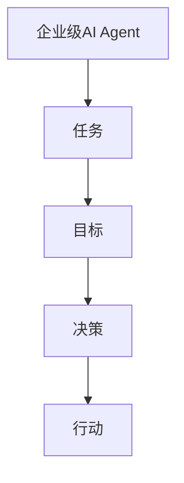
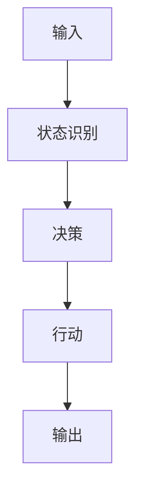
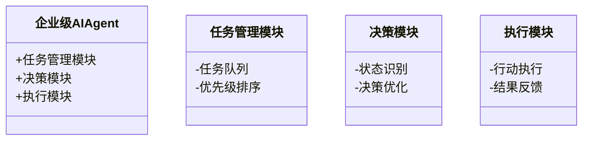
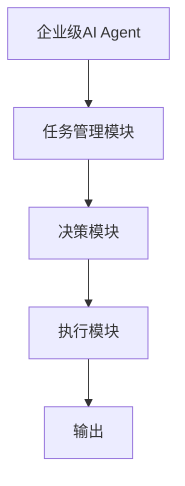

                 


# 企业级AI Agent的性能优化策略

> 关键词：企业级AI Agent，性能优化，模型压缩，分布式计算，数据优化，系统架构设计

> 摘要：本文系统地探讨了企业级AI Agent的性能优化策略，从模型优化、计算资源优化、数据优化、算法原理、系统架构设计、项目实战等多方面进行深入分析。结合实际案例，详细讲解了每种优化策略的实现方法和应用效果，旨在为企业级AI Agent的性能优化提供理论指导和实践参考。

---

## 第一部分: 企业级AI Agent的背景与概念

### 第1章: 企业级AI Agent的背景与概念

#### 1.1 什么是AI Agent
企业级AI Agent是一种能够理解、推理、学习并执行复杂任务的智能代理系统，广泛应用于企业内部流程自动化、决策支持、客户交互等领域。

#### 1.2 企业级AI Agent的特点
- **任务驱动性**：能够根据任务目标进行自主决策和行动。
- **智能决策能力**：通过机器学习和自然语言处理技术，实现复杂场景下的智能决策。
- **高可用性**：具备高可靠性和容错能力，确保在企业环境中稳定运行。

#### 1.3 企业级AI Agent的应用场景
- **企业流程自动化**：如订单处理、客户支持等。
- **智能决策支持**：如供应链优化、风险评估等。
- **客户交互**：如智能客服、虚拟助手等。

---

### 第2章: 企业级AI Agent的核心概念与联系

#### 2.1 核心概念原理
- **任务分解与优先级**：将复杂任务分解为多个子任务，并根据优先级进行处理。
- **多目标优化**：在多个目标之间找到平衡点，确保最优解。
- **分布式协作**：通过分布式计算和协作机制，实现任务的高效执行。

#### 2.2 核心概念属性对比
| 核心概念       | 特点1                | 特点2                | 特点3                |
|----------------|---------------------|---------------------|---------------------|
| 任务驱动性     | 高                  | 需要明确的目标       | 强调结果导向         |
| 智能决策能力   | 基于数据和模型       | 具备学习能力         | 可解释性高           |
| 高可用性       | 系统容错能力强       | 高可靠性             | 能够快速恢复故障     |

#### 2.3 ER实体关系图
以下是企业级AI Agent的实体关系图：



---

## 第二部分: 企业级AI Agent的性能优化策略

### 第3章: 企业级AI Agent的性能优化策略

#### 3.1 模型优化策略
- **模型压缩技术**：通过剪枝、量化等方法减少模型参数，降低计算复杂度。
- **模型蒸馏技术**：通过知识蒸馏，将大型模型的知识迁移到小型模型中。
- **知识蒸馏与剪枝**：结合蒸馏和剪枝技术，进一步优化模型性能。

#### 3.2 计算资源优化策略
- **分布式计算**：将任务分解到多个计算节点上，提高计算效率。
- **异构计算**：利用GPU、TPU等异构计算资源，加速计算过程。
- **资源分配优化**：根据任务需求动态分配计算资源，提高资源利用率。

#### 3.3 数据优化策略
- **数据质量优化**：通过数据清洗、去噪等方法提高数据质量。
- **数据量优化**：通过数据采样、数据增强等方法优化数据量。
- **数据流优化**：通过数据流处理技术，实时处理和分析数据。

---

### 第4章: 企业级AI Agent的算法原理

#### 4.1 算法原理概述
- **基于强化学习的决策**：通过强化学习算法，实现任务中的决策优化。
- **基于监督学习的优化**：通过监督学习算法，优化模型的预测能力。
- **基于图神经网络的协作**：通过图神经网络，实现分布式协作任务。

#### 4.2 算法流程图
以下是基于强化学习的决策流程图：



#### 4.3 数学模型与公式
- **强化学习的数学模型**：状态值函数 \( V(s) = \max_{a} Q(s,a) \)
- **图神经网络的边权重计算**：\( W_{ij} = \frac{1}{1 + |i-j|} \)

---

### 第5章: 系统分析与架构设计方案

#### 5.1 问题场景介绍
- **任务分解**：将复杂任务分解为多个子任务。
- **多目标优化**：在多个目标之间找到平衡点。
- **分布式协作**：通过分布式计算和协作机制，实现任务的高效执行。

#### 5.2 系统功能设计
以下是系统功能设计的类图：



#### 5.3 系统架构设计
以下是系统架构设计图：



---

### 第6章: 项目实战与最佳实践

#### 6.1 项目实战
- **环境安装**：安装必要的开发工具和依赖库。
- **系统核心实现源代码**：
  ```python
  class Agent:
      def __init__(self):
          self.tasks = []
          self.priorities = {}
  
      def add_task(self, task):
          self.tasks.append(task)
  
      def process_task(self, task):
          # 处理任务逻辑
          pass
  
  # 示例用法
  agent = Agent()
  agent.add_task("处理订单")
  agent.process_task("处理订单")
  ```

- **代码应用解读与分析**：通过代码实现企业级AI Agent的核心功能。
- **实际案例分析**：通过具体案例展示优化策略的实际应用。

#### 6.2 最佳实践
- **小结**：总结企业级AI Agent的性能优化策略的核心内容。
- **注意事项**：在优化过程中需要注意的事项。
- **拓展阅读**：推荐相关的阅读材料，进一步深入学习。

---

## 作者：AI天才研究院 & 禅与计算机程序设计艺术

---

以上就是《企业级AI Agent的性能优化策略》的完整目录和内容框架。文章通过详细分析企业级AI Agent的性能优化策略，结合实际案例和项目实战，为企业级AI Agent的优化提供了理论指导和实践参考。

