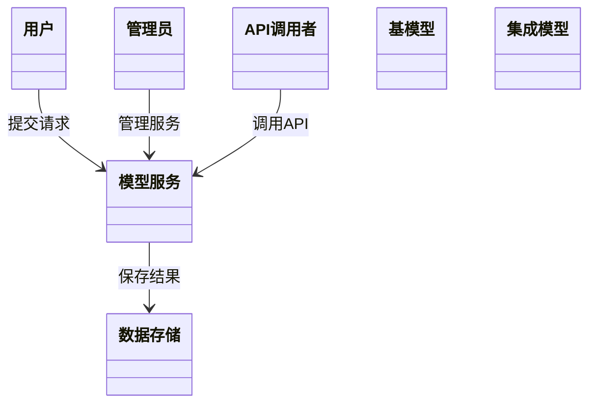
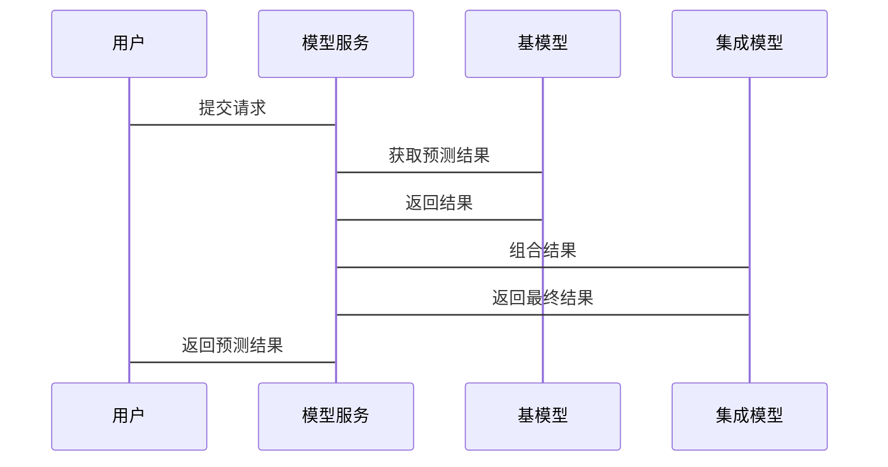

                 


# 《企业级AI模型的集成与部署策略》

## 关键词：企业级AI模型、集成策略、部署架构、实战案例、最佳实践

## 摘要

企业级AI模型的集成与部署是当前技术领域的重要课题，随着AI技术的快速发展，企业级AI模型在多个行业中的应用日益广泛。本文从企业级AI模型的背景、核心概念、集成策略、部署架构到实战案例，全面探讨了企业级AI模型的集成与部署策略。通过详细分析集成学习的算法原理、部署架构的设计优化、实际项目案例以及最佳实践，为读者提供了一套系统化的企业级AI模型集成与部署方法论。

---

## 第一部分：企业级AI模型的背景与核心概念

### 第1章：企业级AI模型的背景与问题背景

#### 1.1 企业级AI模型的背景介绍

企业级AI模型是指为大型企业设计的，能够支持企业核心业务流程和决策的AI系统。随着深度学习、自然语言处理（NLP）和计算机视觉技术的快速发展，企业级AI模型在金融、医疗、制造和零售等行业中的应用越来越广泛。企业级AI模型的特点包括高准确性、可扩展性和可解释性，能够满足企业对高效、可靠和智能决策的需求。

**当前AI技术的发展趋势**  
AI技术正在从单一任务的模型向多任务、多模态模型发展，模型的可解释性和鲁棒性成为企业级AI模型的重要考量因素。

**企业级AI模型的应用现状**  
企业级AI模型已在客户服务、风险评估、供应链管理等领域展现出强大的应用潜力，帮助企业提升了运营效率和决策能力。

**企业级AI模型的核心价值**  
通过集成多个AI模型，企业级AI模型能够提高模型的泛化能力，降低单点故障风险，并提供更高的准确性和稳定性。

#### 1.2 问题背景与问题描述

在企业级AI模型的集成与部署过程中，面临的主要问题包括模型选择困难、计算资源消耗大、部署复杂性和维护成本高等。这些问题可能导致模型性能不佳、部署效率低下，甚至影响企业的业务流程。

**企业AI模型集成与部署的主要问题**  
1. **模型选择**：如何选择适合业务需求的基模型，以及如何优化集成策略以提升整体性能。
2. **计算资源**：模型集成通常需要大量计算资源，企业在资源有限的情况下如何实现高效部署。
3. **部署复杂性**：企业级AI模型的部署涉及多平台和多环境，如何确保模型在不同环境中的稳定运行。
4. **维护成本**：模型需要定期更新和维护，如何降低维护成本并保持模型性能。

**问题解决的目标与关键点**  
目标是通过优化集成策略和部署架构，降低资源消耗，提高部署效率，同时提升模型的准确性和可维护性。关键点在于选择合适的集成方法和部署工具，确保模型在企业环境中的高效运行。

#### 1.3 核心概念与联系

企业级AI模型的集成与部署涉及多个核心概念，包括集成学习、模型部署、系统架构和API设计。这些概念相互关联，共同构成了企业级AI模型的集成与部署框架。

**核心概念原理**  
集成学习通过结合多个基模型的结果，提高模型的整体性能。模型部署则将AI模型转化为实际可用的服务，API设计则确保模型与其他系统的无缝集成。

**核心概念属性特征对比表格**

| 概念       | 属性               | 特征对比                  |
|------------|--------------------|---------------------------|
| 集成学习     | 方法               | 投票、加权投票、堆叠       |
| 模型部署     | 环境               | 离线、在线                 |
| 系统架构     | 组件               | 前端、后端、数据库         |
| API设计     | 接口               | RESTful API、GraphQL       |

**ER实体关系图架构（使用 Mermaid 流程图）**

```mermaid
erDiagram
    actor 用户
    actor 管理员
    actor 外部系统
    role 用户
    role 管理员
    role API调用者
    class 基模型
    class 集成模型
    class 模型服务
    class 数据存储
    用户 --> 基模型: 使用基模型进行预测
    用户 --> 集成模型: 使用集成模型进行预测
    管理员 --> 基模型: 管理基模型
    管理员 --> 集成模型: 管理集成模型
    外部系统 --> 模型服务: 调用API进行预测
    模型服务 --> 数据存储: 保存预测结果
```

---

## 第二部分：企业级AI模型的集成策略

### 第2章：企业级AI模型的集成原理

#### 2.1 集成学习算法原理

集成学习是一种通过组合多个基模型的结果来提高模型性能的技术。常见的集成方法包括投票法、加权投票法和堆叠法。

**投票法**  
投票法是一种简单有效的集成方法，适用于分类任务。多个基模型分别对输入进行分类，最终结果由投票决定。

**加权投票法**  
加权投票法在投票法的基础上，为每个基模型分配不同的权重。权重通常基于模型的性能表现确定。

**堆叠法**  
堆叠法将多个基模型的输出作为新的数据输入到一个元模型中，元模型用于最终的预测。

**数学模型与公式**  
假设我们有三个基模型，分别预测的结果为 $y_1$, $y_2$, $y_3$。投票法的最终预测结果为：

$$
y_{\text{集成}} = \text{多数投票}(y_1, y_2, y_3)
$$

堆叠法的最终预测结果为：

$$
y_{\text{集成}} = f(y_1, y_2, y_3)
$$

其中，$f$ 是元模型的预测函数。

#### 2.2 模型集成的实现步骤

模型集成的过程包括数据预处理、基模型训练和集成模型优化。

**数据预处理与特征选择**  
数据预处理是确保基模型性能的关键步骤，包括数据清洗、特征提取和归一化等。

**基模型训练**  
选择合适的基模型，如决策树、随机森林和神经网络，并进行训练。

**集成模型优化**  
通过调整集成方法和参数，优化集成模型的性能，确保其在实际应用中的有效性。

---

## 第三部分：企业级AI模型的部署策略

### 第3章：企业级AI模型的部署架构

#### 3.1 模型部署的系统架构设计

模型部署的系统架构设计包括前端、后端和数据库三部分。

**系统架构图（使用 Mermaid 架构图）**


**系统功能设计（领域模型 Mermaid 类图）**



**系统接口设计与交互流程（使用 Mermaid 序列图）**



#### 3.2 模型部署的实现细节

模型部署的实现细节包括模型微调、模型压缩和模型服务化。

**模型微调与迁移学习**  
微调是通过在特定任务上对预训练模型进行进一步训练，以适应具体业务需求。迁移学习则通过共享特征，减少训练数据的需求。

**模型压缩与轻量化技术**  
模型压缩技术包括剪枝、量化和知识蒸馏，能够有效降低模型的计算和存储需求。

**模型服务化与API接口开发**  
通过容器化技术（如Docker）部署模型服务，并开发RESTful API接口，实现与企业现有系统的集成。

---

## 第四部分：企业级AI模型的实战案例

### 第4章：企业级AI模型的集成与部署实战

#### 4.1 项目实战环境安装

项目实战环境需要安装Python、TensorFlow和Scikit-learn等工具。

**环境配置**  
安装Python 3.8及以上版本，安装TensorFlow 2.0及以上版本，安装Scikit-learn 0.24及以上版本。

#### 4.2 系统核心实现源代码

以下是集成学习和模型部署的代码实现示例：

**集成学习代码实现**

```python
from sklearn.ensemble import RandomForestClassifier
from sklearn.svm import SVC
from sklearn.linear_model import LogisticRegression
from sklearn.model_selection import train_test_split
from sklearn.metrics import accuracy_score

# 数据预处理
X_train, X_test, y_train, y_test = train_test_split(X, y, test_size=0.2)

# 基模型训练
model1 = RandomForestClassifier().fit(X_train, y_train)
model2 = SVC().fit(X_train, y_train)
model3 = LogisticRegression().fit(X_train, y_train)

# 集成模型
def hard_voting(X_test):
    y_pred1 = model1.predict(X_test)
    y_pred2 = model2.predict(X_test)
    y_pred3 = model3.predict(X_test)
    return majority_vote(y_pred1, y_pred2, y_pred3)

def majority_vote(y1, y2, y3):
    from collections import Counter
    cnt = Counter([y1, y2, y3])
    return cnt.most_common(1)[0][0]

y_pred = hard_voting(X_test)
print("集成模型准确率：", accuracy_score(y_test, y_pred))
```

**模型部署代码实现**

```python
from flask import Flask, request, jsonify
import joblib

app = Flask(__name__)
model = joblib.load('model.pkl')

@app.route('/predict', methods=['POST'])
def predict():
    data = request.json
    prediction = model.predict([data['input']]).tolist()
    return jsonify({'result': prediction[0]})

if __name__ == '__main__':
    app.run(debug=True)
```

#### 4.3 代码应用解读与分析

代码实现展示了集成学习和模型部署的具体步骤。集成学习部分通过投票法结合多个基模型的结果，提高了模型的准确率。模型部署部分通过Flask框架实现了RESTful API接口，方便其他系统调用。

---

## 第五部分：最佳实践与未来展望

### 第5章：企业级AI模型的部署最佳实践

#### 5.1 最佳实践 tips

1. **模型选择与优化**：选择适合业务需求的基模型，并进行充分的调优。
2. **资源优化**：合理分配计算资源，降低模型部署的成本。
3. **模型监控与维护**：建立模型监控机制，及时发现和修复问题。

#### 5.2 项目小结与注意事项

**项目总结**  
通过集成学习和优化部署架构，企业级AI模型能够显著提高预测准确率和部署效率。

**注意事项**  
在实际应用中，需要注意模型的可解释性和维护成本，确保模型的稳定性和可持续性。

### 第6章：未来展望与技术趋势

#### 6.1 企业级AI模型的未来趋势

1. **新兴技术的影响**：边缘计算和联邦学习等新技术将推动企业级AI模型的发展。
2. **模型集成与部署的新方向**：动态集成和自适应部署将成为未来的重要研究方向。

#### 6.2 技术拓展与深入学习

1. **深度学习与强化学习的结合**：探索深度学习与强化学习的结合，提升模型的泛化能力。
2. **跨领域应用的潜力**：企业级AI模型在医疗、金融等领域的应用潜力巨大，值得深入研究。

---

## 第六部分：附录

### 附录A：数学公式与算法

**集成学习的投票机制公式**

$$
y_{\text{集成}} = \text{多数投票}(y_1, y_2, y_3)
$$

**堆叠法的数学模型**

$$
y_{\text{集成}} = f(y_1, y_2, y_3)
$$

---

## 作者

作者：AI天才研究院/AI Genius Institute & 禅与计算机程序设计艺术 /Zen And The Art of Computer Programming

