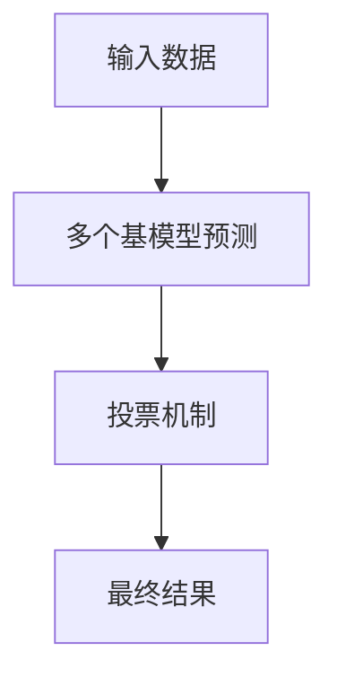
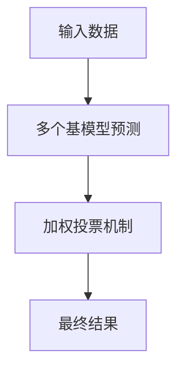
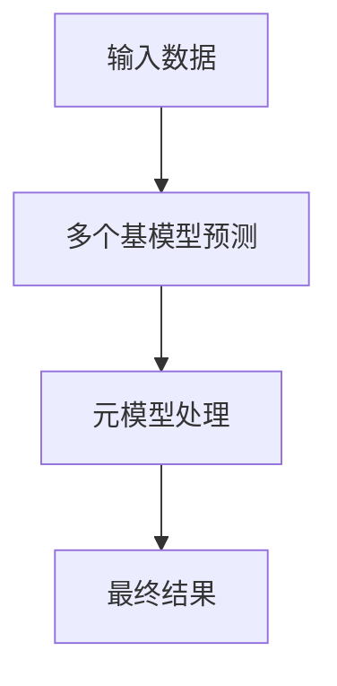
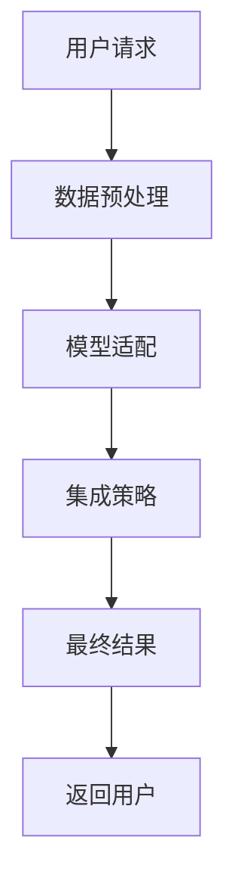
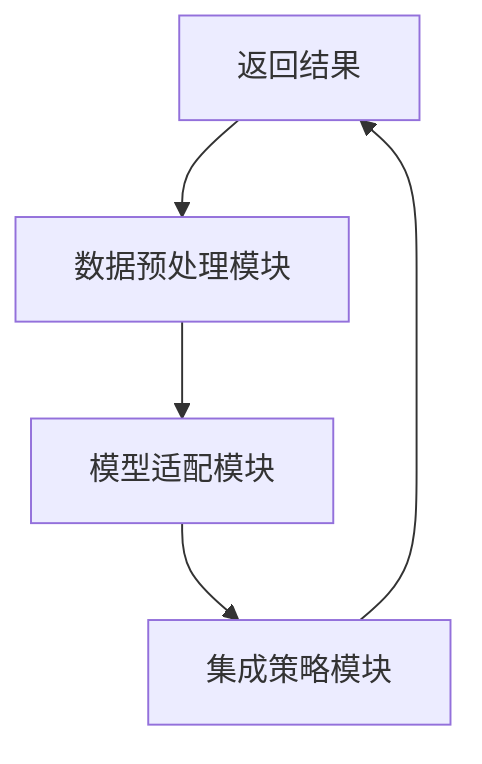

                 


# 企业级AI模型的集成策略：无缝对接现有系统

---

## 关键词：
企业级AI模型、模型集成、数据预处理、API接口设计、系统架构设计

---

## 摘要：
本文系统性地探讨了企业级AI模型的集成策略，从背景与挑战、核心概念与联系、算法原理与数学模型、系统分析与架构设计、项目实战到总结与展望，详细阐述了如何将AI模型无缝集成到现有企业系统中。通过具体案例分析和代码实现，本文为读者提供了从理论到实践的全面指导，帮助企业在数字化转型中高效利用AI技术。

---

# 第三章: 模型集成的算法原理与数学模型

## 3.1 基于投票的集成算法
### 3.1.1 算法流程
基于投票的集成是一种简单有效的集成方法，适用于分类问题。多个基模型分别对输入数据进行预测，最终通过投票机制确定结果。



### 3.1.2 Python实现示例
```python
from sklearn import datasets
from sklearn.ensemble import RandomForestClassifier
from sklearn.linear_model import LogisticRegression
from sklearn.svm import SVC
from sklearn.metrics import accuracy_score

# 加载数据集
iris = datasets.load_iris()
X = iris.data
y = iris.target

# 定义基模型
model1 = RandomForestClassifier()
model2 = LogisticRegression()
model3 = SVC()

# 模型训练
model1.fit(X, y)
model2.fit(X, y)
model3.fit(X, y)

# 预测函数
def vote_predict(models, X_test):
    predictions = []
    for model in models:
        y_pred = model.predict(X_test)
        predictions.append(y_pred)
    # 多数投票
    from collections import Counter
    y_final = Counter(predictions).most_common(1)[0][0]
    return y_final

# 验证准确率
y_pred = vote_predict([model1, model2, model3], X)
print("投票法准确率:", accuracy_score(y, y_pred))
```

### 3.1.3 数学模型
投票法的数学模型可以用多数函数表示：

$$
f(x) = \arg\max_{i} \sum_{j=1}^{n} I(y_j^{(i)} = i)
$$

其中，$y_j^{(i)}$ 是第 $j$ 个基模型对输入 $x$ 的预测结果，$I(\cdot)$ 是指示函数。

---

## 3.2 基于加权的集成算法
### 3.2.1 算法流程
加权投票法通过赋予不同基模型不同的权重来提升集成性能。



### 3.2.2 Python实现示例
```python
def weighted_vote_predict(models, weights, X_test):
    predictions = []
    for model in models:
        y_pred = model.predict(X_test)
        predictions.append(y_pred)
    # 加权投票
    import numpy as np
    y_final = np.argmax(np.dot(np.array(predictions), weights))
    return y_final

# 示例权重
weights = [2, 1, 1]

y_pred = weighted_vote_predict([model1, model2, model3], weights, X)
print("加权投票法准确率:", accuracy_score(y, y_pred))
```

### 3.2.3 数学模型
加权投票法的数学模型可以表示为：

$$
f(x) = \arg\max_{i} \sum_{j=1}^{n} w_j \cdot I(y_j^{(i)} = i)
$$

其中，$w_j$ 是第 $j$ 个基模型的权重。

---

## 3.3 基于混合的集成算法
### 3.3.1 算法流程
基于混合的集成算法通过在基模型之间引入中间层模型（如元模型）来提升性能。



### 3.3.2 Python实现示例
```python
from sklearn.ensemble import AdaBoostClassifier

# 元模型训练
meta_model = LogisticRegression()
meta_model.fit(model1.predict_proba(X), y)

# 预测函数
def stacked_predict(models, meta_model, X_test):
    # 基模型预测概率
    base_preds = [model.predict_proba(X_test) for model in models]
    # 元模型预测
    stacked_pred = meta_model.predict(base_preds)
    return stacked_pred

y_pred = stacked_predict([model1, model2, model3], meta_model, X)
print("基于混合的集成准确率:", accuracy_score(y, y_pred))
```

---

## 3.4 小结
本章通过投票法、加权投票法和基于混合的集成方法，详细介绍了企业级AI模型集成的核心算法原理。通过数学模型和Python代码实现，读者可以清晰理解每种方法的优缺点及适用场景。

---

# 第四章: 系统分析与架构设计

## 4.1 问题场景介绍
企业级AI模型集成需要解决数据格式不统一、模型接口不兼容、性能与资源平衡等问题。

## 4.2 系统功能设计
### 4.2.1 数据预处理模块
- 数据清洗
- 格式转换
- 特征提取

### 4.2.2 模型适配模块
- 模型封装
- 接口标准化
- 性能优化

### 4.2.3 集成策略模块
- 策略选择
- 权重分配
- 结果输出

## 4.3 系统架构设计


## 4.4 系统接口设计
### 4.4.1 输入接口
- RESTful API
- 数据格式：JSON/XML

### 4.4.2 输出接口
- 集成结果
- 执行时间

---

## 4.5 系统交互设计


---

## 4.6 小结
本章通过系统功能设计和架构设计，明确了企业级AI模型集成的实现路径。通过模块化设计和标准化接口，确保系统具备良好的扩展性和可维护性。

---

# 第五章: 项目实战

## 5.1 环境配置
```bash
pip install scikit-learn mermaid4j
```

## 5.2 核心实现
### 5.2.1 数据预处理
```python
def preprocess_data(X):
    # 数据清洗
    X = X.dropna()
    # 特征标准化
    from sklearn.preprocessing import StandardScaler
    scaler = StandardScaler()
    X_scaled = scaler.fit_transform(X)
    return X_scaled
```

### 5.2.2 模型适配
```python
def adapt_model(model, X, y):
    # 模型训练
    model.fit(X, y)
    return model
```

### 5.2.3 集成策略实现
```python
def ensemble_predict(models, X_test):
    predictions = []
    for model in models:
        y_pred = model.predict(X_test)
        predictions.append(y_pred)
    # 多数投票
    from collections import Counter
    y_final = Counter(predictions).most_common(1)[0][0]
    return y_final
```

## 5.3 实际案例分析
### 5.3.1 数据集选择
使用鸢尾花数据集（Iris）作为示例数据集。

### 5.3.2 系统实现
```python
# 数据加载与预处理
iris = datasets.load_iris()
X = preprocess_data(iris.data)
y = iris.target

# 模型训练
model1 = RandomForestClassifier().fit(X, y)
model2 = LogisticRegression().fit(X, y)
model3 = SVC().fit(X, y)

# 集成预测
y_pred = ensemble_predict([model1, model2, model3], X)
print("集成准确率:", accuracy_score(y, y_pred))
```

## 5.4 小结
本章通过一个实际案例，详细展示了企业级AI模型集成的实现过程。从环境配置到数据预处理，再到模型集成，读者可以跟随代码一步步完成项目的落地。

---

# 第六章: 总结与展望

## 6.1 核心总结
企业级AI模型集成需要综合考虑数据预处理、模型适配、集成策略选择等多个方面。通过模块化设计和标准化接口，可以实现AI模型与现有系统的无缝对接。

## 6.2 发展展望
随着AI技术的不断发展，企业级AI模型集成将更加注重模型压缩、边缘计算和实时性优化。未来的研究方向包括：

- 模型压缩与轻量化
- 边缘计算下的分布式集成
- 实时性优化与资源分配

---

## 作者：
作者：AI天才研究院 & 禅与计算机程序设计艺术

