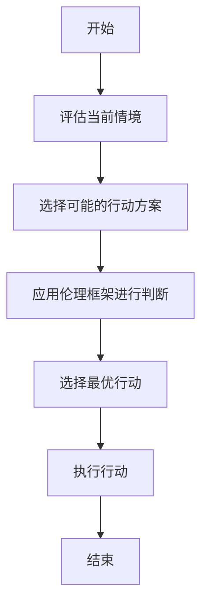
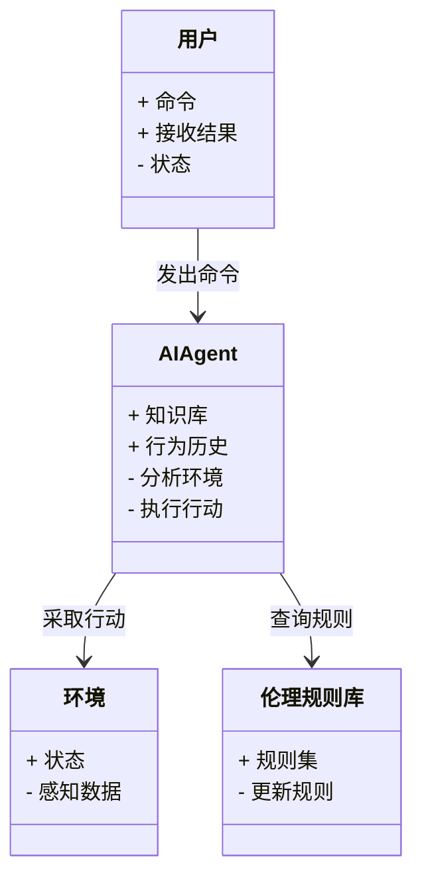
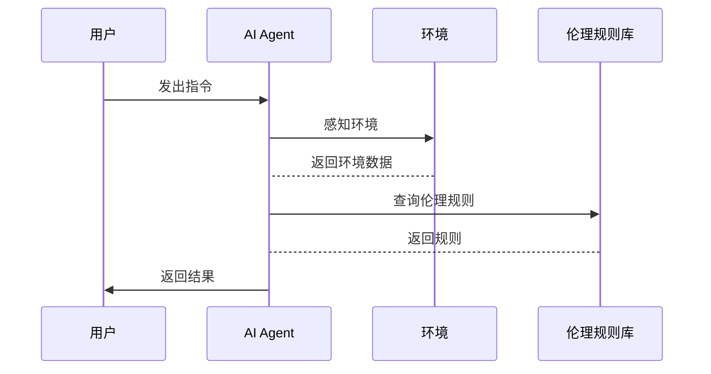

                 


# 《伦理AI：设计符合道德标准的AI Agent》

## 关键词：伦理AI，AI Agent，伦理框架，伦理判断算法，系统架构设计

## 摘要：  
本文探讨了设计符合道德标准的人工智能代理（AI Agent）的关键步骤和方法。从伦理框架的构建到算法的实现，再到系统的实际应用，系统地介绍了如何在AI代理中融入伦理判断，确保其行为符合道德标准。通过理论分析和实际案例，展示了伦理AI的重要性和实现路径。

---

# 第一部分：伦理AI的背景与概述

## 第1章：人工智能代理的基本概念

### 1.1 人工智能代理的定义与特点  
人工智能代理（AI Agent）是一种智能实体，能够感知环境并采取行动以实现目标。其特点包括：  
1. **自主性**：无需外部干预，自主决策。  
2. **反应性**：能够实时感知环境变化并做出反应。  
3. **主动性**：主动采取行动以实现目标。  
4. **社会性**：能够与其他实体（人类或其他AI）交互协作。

### 1.2 伦理在人工智能中的重要性  
随着AI代理的应用越来越广泛，伦理问题也日益突出。例如，在自动驾驶汽车中，AI代理需要在紧急情况下做出道德决策，如选择保护车内乘客还是路人。伦理设计是构建可信、可靠AI系统的关键，能够避免潜在的伦理风险。

### 1.3 人工智能代理的伦理框架  
伦理框架为AI代理的行为提供了指导原则。常见的伦理框架包括：  
1. **功利主义**：以最大化整体利益为目标。  
2. **义务论**：基于道德义务和责任进行决策。  
3. **权利论**：强调个体权利和自由。  
4. **美德伦理**：以优秀品德为指导。  

---

# 第二部分：伦理AI的核心概念与联系

## 第2章：伦理AI的核心原理  

### 2.1 伦理判断的算法原理  
伦理判断是AI代理做出决策的核心步骤。基于规则和案例推理的伦理判断算法是常见的两种方法。  

#### 基于规则的伦理判断  
规则通常以“如果-那么”的形式表达，例如：  
- 如果行为可能导致对人类造成严重伤害，则选择避免该行为。  

#### 基于案例推理的伦理判断  
通过分析类似案例的特征，AI代理可以推断出当前情况下的伦理选择。  

### 2.2 伦理决策的流程图  
以下是一个伦理决策的简化流程图：



### 2.3 伦理AI的实体关系图  
以下是一个伦理AI的实体关系图：

```mermaid
erd
    actor 用户
    actor 系统
    actor 环境
    database 伦理规则库
    database 行为历史库
    system AI Agent
    AI Agent --> 用户: 接收指令
    用户 --> AI Agent: 发出指令
    AI Agent --> 环境: 采取行动
    AI Agent --> 伦理规则库: 查询规则
    AI Agent --> 行为历史库: 查询历史数据
```

---

# 第三部分：伦理AI的算法实现

## 第3章：伦理判断的算法实现  

### 3.1 基于规则的伦理判断算法  
以下是一个基于规则的伦理判断算法的Python实现示例：

```python
def ethical_decision(rules, context):
    for rule in rules:
        if rule['condition'](context):
            return rule['action'](context)
    # 如果没有匹配规则，返回默认行为
    return default_behavior(context)
```

#### 数学模型  
伦理判断可以表示为一个条件判断函数：  
$$ \text{判断}(R, C) = \begin{cases} 
\text{执行动作}(R) & \text{如果 } R \text{的条件在} C \text{中成立} \\
\text{默认行为} & \text{否则}
\end{cases} $$  

### 3.2 基于案例推理的伦理判断算法  
以下是一个基于案例推理的算法示例：

```python
def case_based_ethical_decision(cases, context):
    # 根据相似性排序案例
    cases.sort(key=lambda x: similarity_score(x, context))
    # 遍历案例，寻找最优解决方案
    for case in cases:
        if case['context'] == context:
            return case['action']
    # 如果没有匹配案例，返回默认行为
    return default_behavior(context)
```

#### 数学模型  
案例相似性可以通过距离度量来表示：  
$$ \text{相似性}(C_1, C_2) = \sum_{i=1}^{n} (C_1[i] - C_2[i])^2 $$  

---

# 第四部分：系统分析与架构设计

## 第4章：系统架构设计  

### 4.1 领域模型Mermaid类图  
以下是一个伦理AI系统的类图：



### 4.2 系统架构Mermaid架构图  
以下是一个伦理AI系统的架构图：


### 4.3 系统接口设计和交互序列图  
以下是一个系统交互的序列图：



---

# 第五部分：项目实战

## 第5章：项目实战  

### 5.1 环境安装与配置  
安装必要的Python库：  
```bash
pip install numpy matplotlib scikit-learn
```

### 5.2 核心实现源代码  
以下是一个伦理判断的核心代码示例：

```python
def ethical_decision(rules, context):
    for rule in rules:
        if rule['condition'](context):
            return rule['action'](context)
    return default_behavior(context)
```

### 5.3 案例分析与结果解读  
通过具体案例分析伦理设计的效果，例如在自动驾驶中的紧急决策问题，展示AI代理如何根据伦理框架做出最优选择。

---

# 第六部分：最佳实践与未来展望

## 第6章：最佳实践与未来展望  

### 6.1 最佳实践Tips  
1. 在设计AI代理时，始终考虑伦理因素。  
2. 定期更新伦理规则库，以适应新的伦理挑战。  
3. 与伦理学家和法律专家合作，确保设计符合道德标准。  

### 6.2 小结  
本文详细介绍了伦理AI的设计与实现，从理论到实践，全面覆盖了伦理判断算法、系统架构设计和项目实战。

### 6.3 注意事项  
- 伦理设计需要不断迭代和优化。  
- 避免过度依赖单一的伦理框架，结合多种方法提高判断的准确性。  

### 6.4 拓展阅读  
- 《伦理与人工智能》  
- 《设计伦理AI的挑战与机遇》  

---

# 作者信息  
作者：AI天才研究院 & 禅与计算机程序设计艺术

