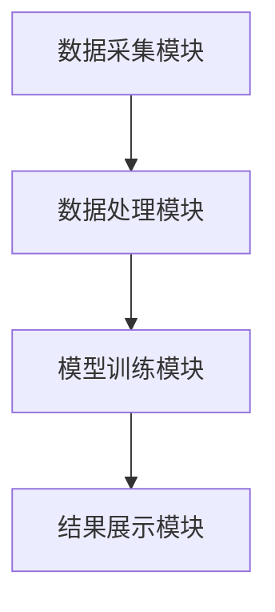

                 


# 体育AI Agent：赛事分析与训练辅助

> 关键词：体育AI Agent，人工智能，赛事分析，训练辅助，数据科学，机器学习，深度学习

> 摘要：随着人工智能技术的迅速发展，体育AI Agent在赛事分析与训练辅助领域展现出了巨大的潜力。本文将从体育AI Agent的基本概念、核心技术、算法原理、系统架构、项目实战等方面进行详细阐述，旨在为读者提供一个全面的技术视角，了解如何利用AI技术提升体育赛事的分析能力和运动员的训练效率。

---

## 第1章: 体育AI Agent的基本概念与应用背景

### 1.1 体育AI Agent的定义与核心概念

#### 1.1.1 体育AI Agent的定义
体育AI Agent（Artificial Intelligence Agent）是指一种能够感知体育数据、理解体育场景，并通过智能决策和行动来辅助体育赛事分析与运动员训练的智能系统。它能够从海量的体育数据中提取有价值的信息，并通过学习和推理为教练和运动员提供科学的决策支持。

#### 1.1.2 核心概念与属性特征对比表
| 核心概念 | 描述 | 示例 |
|----------|------|------|
| 数据源   | 包括运动传感器数据、视频数据、球员统计数据等 | 智能手环、摄像头、数据库 |
| 智能算法 | 包括机器学习、深度学习、自然语言处理等 | CNN、RNN、随机森林 |
| 决策模块 | 根据数据和模型输出制定行动计划 | 调整训练计划、优化战术 |
| 交互界面 | 用户与AI Agent交互的可视化界面 | 图表、仪表盘 |

#### 1.1.3 体育AI Agent的实体关系图（ER图）
```mermaid
erDiagram
    player[球员] {
        <属性>
        id : integer
        name : string
        position : string
        stats : JSON
    }
    match[比赛] {
        <属性>
        id : integer
        date : date
        team1 : string
        team2 : string
        score : JSON
    }
    sensor[传感器数据] {
        <属性>
        id : integer
        player_id : integer
        timestamp : datetime
        data : JSON
    }
    agent[AI Agent] {
        <属性>
        id : integer
        model : string
        version : string
        status : string
    }
    player --> sensor
    match --> sensor
    match --> agent
```

### 1.2 体育AI Agent的应用背景

#### 1.2.1 体育数据分析的需求
现代体育比赛中，数据量呈指数级增长。通过AI技术，可以对球员表现、比赛策略、战术执行等进行深度分析，帮助教练和运动员做出更科学的决策。

#### 1.2.2 AI技术在体育领域的应用现状
目前，AI技术在体育领域的应用主要集中在数据分析、 injury预测、战术优化等方面。例如，通过AI分析球员的运动轨迹，预测潜在的受伤风险。

#### 1.2.3 体育AI Agent的潜在价值
体育AI Agent可以通过实时数据分析，为教练提供实时战术调整建议，为运动员提供个性化的训练计划，从而提高训练效率和比赛成绩。

---

## 第2章: 体育AI Agent的核心技术与实现原理

### 2.1 数据采集与处理技术

#### 2.1.1 数据来源与采集方式
体育数据来源多样，包括：
- **运动传感器数据**：如智能手环、智能球拍等设备采集的运动数据。
- **视频数据**：通过摄像头捕捉球员的运动轨迹和比赛场景。
- **球员统计数据**：如比赛成绩、伤病记录等。

#### 2.1.2 数据预处理与特征提取
数据预处理是AI分析的第一步，主要包括：
- 数据清洗：去除噪声数据和异常值。
- 特征提取：从原始数据中提取有意义的特征，例如球员的速度、加速度、动作频率等。

#### 2.1.3 数据存储与管理
使用数据库（如MySQL、MongoDB）存储结构化和非结构化数据，确保数据的安全性和可扩展性。

### 2.2 AI算法与模型训练

#### 2.2.1 机器学习算法在体育分析中的应用
- **线性回归**：用于预测比赛结果或球员表现。
- **支持向量机（SVM）**：用于分类问题，如判断比赛胜负。
- **随机森林与梯度提升树**：用于特征重要性分析和分类任务。

#### 2.2.2 深度学习模型在体育AI Agent中的应用
- **卷积神经网络（CNN）**：用于图像识别，如识别球员的动作。
- **循环神经网络（RNN）**：用于时间序列分析，如分析球员的运动轨迹。

#### 2.2.3 模型训练与优化策略
- **数据增强**：增加训练数据的多样性。
- **超参数优化**：通过网格搜索或随机搜索优化模型参数。

---

## 第3章: 体育AI Agent的算法原理与数学模型

### 3.1 机器学习算法原理

#### 3.1.1 线性回归模型
线性回归是最简单的回归模型，适用于预测任务。其数学公式为：
$$ y = \beta_0 + \beta_1x + \epsilon $$
其中，$y$是目标变量，$x$是自变量，$\beta_0$和$\beta_1$是回归系数，$\epsilon$是误差项。

#### 3.1.2 支持向量机（SVM）
SVM是一种监督学习算法，适用于分类任务。其核心思想是通过找到一个超平面，将数据分为两类。

#### 3.1.3 随机森林与梯度提升树
随机森林是一种基于决策树的集成学习算法，通过组合多个决策树的结果来提高模型的准确性和鲁棒性。

---

### 3.2 深度学习模型原理

#### 3.2.1 卷积神经网络（CNN）
CNN主要用于图像识别任务。其核心思想是通过卷积操作提取图像的特征。

#### 3.2.2 循环神经网络（RNN）
RNN适用于时间序列数据的处理，如分析球员的运动轨迹。

#### 3.2.3 图神经网络（GNN）
GNN适用于图结构数据的处理，如分析球员之间的关系网络。

---

## 第4章: 体育AI Agent的系统架构与设计

### 4.1 系统模块划分

#### 4.1.1 数据采集模块
负责采集体育数据，包括传感器数据和视频数据。

#### 4.1.2 数据处理模块
对数据进行清洗、特征提取和数据转换。

#### 4.1.3 模型训练模块
使用机器学习或深度学习算法对数据进行训练，生成预测模型。

#### 4.1.4 结果展示模块
将模型的预测结果以可视化的方式展示给用户。

### 4.2 系统架构设计图


---

## 第5章: 体育AI Agent的项目实战与案例分析

### 5.1 环境搭建与配置

#### 5.1.1 开发环境
- 操作系统：Windows/Mac/Linux
- 开发工具：Python、Jupyter Notebook
- 依赖库：numpy、pandas、scikit-learn、tensorflow

#### 5.1.2 数据集准备
使用公开的体育数据集，例如Kaggle上的足球比赛数据。

### 5.2 系统核心实现

#### 5.2.1 数据预处理
```python
import pandas as pd
import numpy as np

# 加载数据
data = pd.read_csv('sports_data.csv')

# 数据清洗
data.dropna()  # 删除缺失值
data.drop_duplicates()  # 删除重复值

# 特征提取
features = data[['speed', 'acceleration', 'position']]
```

#### 5.2.2 模型训练
```python
from sklearn.ensemble import RandomForestClassifier
from sklearn.model_selection import train_test_split

# 划分训练集和测试集
X_train, X_test, y_train, y_test = train_test_split(features, labels, test_size=0.2)

# 训练模型
model = RandomForestClassifier()
model.fit(X_train, y_train)

# 模型评估
print(model.score(X_test, y_test))
```

#### 5.2.3 结果展示
使用可视化工具（如Matplotlib）将模型的预测结果以图表形式展示。

---

## 第6章: 最佳实践与小结

### 6.1 最佳实践
- 数据预处理是关键，确保数据的准确性和完整性。
- 选择合适的算法，结合数据特点和任务需求。

### 6.2 小结
体育AI Agent通过数据分析和智能决策，为体育赛事的分析与训练辅助提供了新的可能性。未来，随着AI技术的不断发展，体育AI Agent将在体育领域发挥更大的作用。

---

作者：AI天才研究院/AI Genius Institute & 禅与计算机程序设计艺术 /Zen And The Art of Computer Programming

