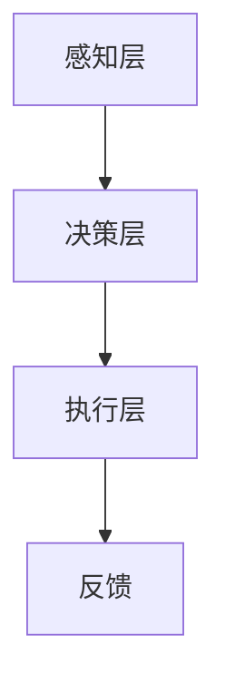
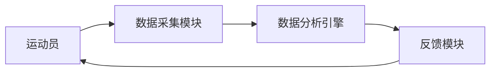
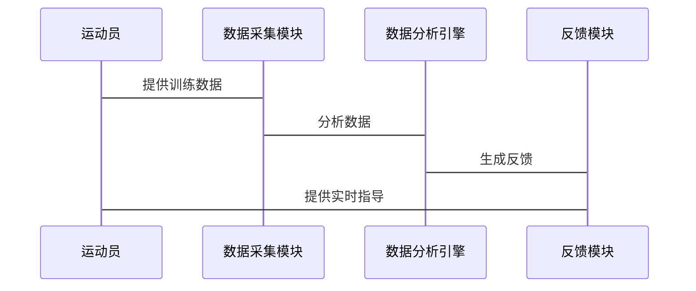

                 


# 体育训练中的AI Agent辅助教练

> 关键词：体育训练、人工智能、AI Agent、智能教练、数据分析、个性化训练

> 摘要：本文探讨AI Agent在体育训练中的应用，分析其如何通过数据分析和个性化训练计划提升运动员表现。文章从背景介绍、核心概念、算法原理、系统设计、项目实战到实际案例，全面解析AI Agent在体育训练中的作用，并展望其未来发展方向。

---

## 第一部分: 背景介绍

### 第1章: 引言

#### 1.1 AI Agent的基本概念
- AI Agent是一种智能体，能够感知环境、自主决策并执行任务，广泛应用于多个领域。
- 在体育训练中，AI Agent通过分析运动员数据，提供实时反馈和优化建议。

#### 1.2 体育训练中的问题背景
- 传统训练方法依赖教练经验，缺乏数据支持和个性化。
- 运动员表现受多种因素影响，如技术、体能、心理状态等，需精准分析。

#### 1.3 AI Agent解决的问题
- 提供实时数据分析和个性化训练计划。
- 帮助教练和运动员优化训练策略，提高效率和成绩。

#### 1.4 问题描述
- 如何利用AI Agent收集和分析运动员数据，制定科学训练计划。

#### 1.5 AI Agent在体育训练中的优势
- 数据驱动决策，个性化指导，实时反馈。

#### 1.6 边界与外延
- AI Agent主要用于训练辅助，不取代人类教练，可结合VR/AR技术提升体验。

#### 1.7 核心概念结构与要素
- 核心要素包括数据采集、算法模型、反馈系统。
- 结构化分析框架涵盖感知、决策、执行三阶段。

---

## 第二部分: 核心概念与联系

### 第2章: AI Agent的核心原理

#### 2.1 AI Agent的工作原理
- 感知层：通过传感器或视频分析获取运动员数据。
- 决策层：基于机器学习算法生成训练建议。
- 执行层：通过反馈系统指导运动员调整动作。

#### 2.2 核心概念属性对比
| 概念 | 特征 |
|------|------|
| 数据采集 | 实时性 |
| 决策模型 | 可解释性 |
| 反馈系统 | 交互性 |

#### 2.3 ER实体关系图
- 实体：运动员、训练计划、传感器数据。
- 关系：运动员-训练计划、训练计划-传感器数据。

---

## 第三部分: 算法原理讲解

### 第3章: AI Agent的算法原理

#### 3.1 算法原理概述
- 强化学习：通过奖励机制优化决策。
- 监督学习：基于历史数据预测最佳训练方案。
- 深度学习：分析复杂模式，如动作识别。

#### 3.2 算法流程图


#### 3.3 算法实现代码
```python
import numpy as np
from sklearn import svm

# 示例数据
X = np.array([[1, 2], [2, 3], [3, 4], [4, 5]])
y = np.array([0, 1, 0, 1])

# 创建SVM模型
model = svm.SVC()
model.fit(X, y)

# 预测
print(model.predict([[5, 6]]))
```

#### 3.4 数学模型与公式
$$
\text{Q-learning算法}：Q(s, a) = (1-\alpha)Q(s, a) + \alpha r + \alpha \max_{a'} Q(s', a')
$$
其中，$\alpha$为学习率，$r$为奖励。

---

## 第四部分: 系统分析与架构设计

### 第4章: 问题场景分析

#### 4.1 问题场景介绍
- 数据采集：传感器、视频分析。
- 数据分析：识别技术问题，优化训练计划。
- 反馈与调整：实时指导运动员动作。

### 第5章: 系统架构设计

#### 5.1 系统功能设计
- 数据采集模块：收集运动员数据。
- 数据分析引擎：生成训练建议。
- 反馈模块：实时指导运动员。

#### 5.2 系统架构图


#### 5.3 系统交互序列图


---

## 第五部分: 项目实战

### 第6章: 项目实战

#### 6.1 环境安装
- 安装Python、TensorFlow、Keras等库。

#### 6.2 核心代码实现
```python
import tensorflow as tf
from tensorflow.keras import layers

# 示例模型：动作识别
model = tf.keras.Sequential()
model.add(layers.Conv2D(32, (3,3), activation='relu', input_shape=(64,64,3)))
model.add(layers.MaxPooling2D((2,2)))
model.add(layers.Flatten())
model.add(layers.Dense(10, activation='softmax'))
model.compile(optimizer='adam', loss='sparse_categorical_crossentropy', metrics=['accuracy'])
model.fit(x_train, y_train, epochs=10)
```

#### 6.3 代码解读与分析
- 使用卷积神经网络识别运动员动作，优化训练计划。

#### 6.4 实际案例分析
- 案例：通过AI Agent优化短跑运动员的起跑动作，提升成绩。

---

## 第六部分: 最佳实践

### 第7章: 最佳实践

#### 7.1 小结
- AI Agent在体育训练中的应用前景广阔，可显著提升训练效率。

#### 7.2 注意事项
- 数据隐私保护，模型泛化能力。

#### 7.3 拓展阅读
- 推荐书籍和论文，深入理解AI Agent和机器学习在体育中的应用。

---

## 作者

作者：AI天才研究院（AI Genius Institute） & 禅与计算机程序设计艺术（Zen And The Art of Computer Programming）

---

本文深入分析了AI Agent在体育训练中的应用，通过系统设计和实际案例展示了其在提高训练效率和个性化指导方面的潜力。希望本文能为体育训练和人工智能的结合提供新的思路。

