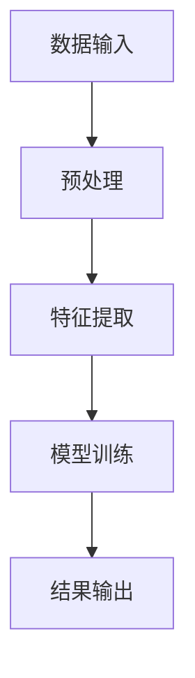
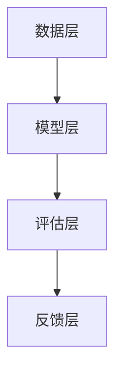

                 


# 偏见检测与缓解：提高AI Agent的公平性

> **关键词**：偏见检测，偏见缓解，AI Agent，公平性，机器学习，算法公平性，数据偏见

> **摘要**：  
本文探讨了如何在AI Agent中检测和缓解偏见，以提高其公平性。通过分析偏见的定义、类型和检测方法，结合算法公平性约束和系统架构设计，提出了有效的偏见缓解策略。文章内容涵盖偏见检测的核心原理、偏见缓解的算法实现、系统分析与架构设计、项目实战以及最佳实践，为读者提供了全面的技术指导。

---

## 第一部分: 偏见检测与缓解的背景与核心概念

### 第1章: 偏见检测与缓解的背景介绍

#### 1.1 问题背景
##### 1.1.1 AI Agent的公平性问题
AI Agent作为人工智能的核心组件，广泛应用于自然语言处理、推荐系统和自动驾驶等领域。然而，AI Agent可能会因为训练数据中的偏见或算法设计的缺陷，导致不公平的结果，例如在招聘系统中对某些群体的歧视性推荐，或者在司法系统中对某些群体的不公正判决。

##### 1.1.2 偏见的定义与表现形式
偏见是指在数据或算法中存在的一种系统性误差，导致某些群体在AI系统的决策中被不公平地对待。偏见可以分为样本偏见（Sample Bias）、算法偏见（Algorithmic Bias）和结果偏见（Outcome Bias）。

##### 1.1.3 偏见对社会的影响
偏见的存在可能导致社会不公，加剧某些群体的边缘化，甚至引发法律和道德问题。例如，偏见可能导致某些群体在信贷评分、招聘和司法判决中受到不公平对待。

#### 1.2 问题描述
##### 1.2.1 偏见检测的必要性
为了确保AI系统的公平性，必须对AI Agent进行偏见检测，以识别数据或算法中存在的不公平倾向。

##### 1.2.2 偏见缓解的目标
偏见缓解的目标是通过技术手段消除或减少AI系统中的偏见，确保决策的公平性和透明性。

##### 1.2.3 偏见检测与缓解的边界与外延
偏见检测与缓解的边界在于如何在保证系统性能的同时，消除偏见。其外延涉及数据预处理、模型设计和结果评估等多个方面。

#### 1.3 问题解决方法
##### 1.3.1 偏见检测的基本思路
通过统计测试、对抗训练和公平性约束等方法，识别数据或模型中的偏见。

##### 1.3.2 偏见缓解的核心策略
通过重新采样、对抗训练和公平性约束等方法，消除或减少偏见。

##### 1.3.3 偏见检测与缓解的系统性解决方案
从数据预处理、模型训练到结果评估，构建一个完整的偏见检测与缓解系统。

#### 1.4 核心概念的结构与组成
##### 1.4.1 偏见检测的流程
1. 数据预处理
2. 特征提取
3. 模型训练
4. 结果评估

##### 1.4.2 偏见缓解的机制
1. 数据重新采样
2. 对抗训练
3. 公平性约束

##### 1.4.3 偏见检测与缓解的系统架构
1. 数据层
2. 模型层
3. 评估层
4. 反馈层

---

## 第二部分: 偏见检测与缓解的核心概念与联系

### 第2章: 偏见检测的核心原理

#### 2.1 偏见检测的定义与原理
##### 2.1.1 偏见检测的基本原理
通过统计测试和机器学习算法，识别数据或模型中的偏见。

##### 2.1.2 偏见检测的关键技术
1. 统计测试
2. 机器学习模型
3. 对抗训练

##### 2.1.3 偏见检测的数学模型
$$ \text{偏见度} = \frac{\text{目标群体的错误率}}{\text{总体错误率}} $$

#### 2.2 偏见检测的算法原理
##### 2.2.1 基于统计的偏见检测方法
使用卡方检验或t检验等统计方法，检测数据中的偏见。

##### 2.2.2 基于机器学习的偏见检测方法
通过训练分类器，识别数据中的偏见。

##### 2.2.3 基于对抗训练的偏见检测方法
使用生成对抗网络（GAN）检测数据中的偏见。

#### 2.3 偏见检测的数学模型与公式
##### 2.3.1 统计测试公式
$$ p \text{-value} = \text{统计测试结果} $$

##### 2.3.2 偏见度量公式
$$ \text{偏见度} = \frac{\text{目标群体的错误率}}{\text{总体错误率}} $$

#### 2.4 偏见检测的流程图


#### 2.5 本章小结
---

## 第三部分: 偏见缓解的算法原理与实现

### 第3章: 偏见缓解的核心算法

#### 3.1 偏见缓解的定义与原理
##### 3.1.1 偏见缓解的目标
通过技术手段消除或减少AI系统中的偏见，确保决策的公平性。

##### 3.1.2 偏见缓解的关键技术
1. 数据重新采样
2. 对抗训练
3. 公平性约束

##### 3.1.3 偏见缓解的数学模型
$$ \text{损失函数} = \text{原始损失} + \lambda \times \text{公平性约束} $$

#### 3.2 偏见缓解的算法实现
##### 3.2.1 基于重新采样的偏见缓解方法
通过过采样或欠采样，平衡数据中的偏见。

##### 3.2.2 基于对抗训练的偏见缓解方法
使用生成对抗网络（GAN）消除数据中的偏见。

##### 3.2.3 基于公平性约束的偏见缓解方法
在损失函数中加入公平性约束，确保模型的公平性。

#### 3.3 偏见缓解的数学模型与公式
##### 3.3.1 公平性约束公式
$$ \text{损失函数} = \text{原始损失} + \lambda \times \text{公平性约束} $$

#### 3.4 偏见缓解的流程图


---

## 第四部分: 系统分析与架构设计方案

### 第4章: 偏见检测与缓解的系统架构

#### 4.1 问题场景介绍
AI Agent在招聘、推荐和司法判决等场景中广泛应用，需要确保其公平性。

#### 4.2 系统功能设计
##### 4.2.1 数据层
1. 数据预处理
2. 数据清洗

##### 4.2.2 模型层
1. 模型训练
2. 模型评估

##### 4.2.3 评估层
1. 偏见检测
2. 偏见缓解

##### 4.2.4 反馈层
1. 结果反馈
2. 模型优化

#### 4.3 系统架构设计


---

## 第五部分: 项目实战

### 第5章: 偏见检测与缓解的项目实战

#### 5.1 环境安装
安装必要的Python库，例如scikit-learn、tensorflow和numpy。

#### 5.2 系统核心实现
##### 5.2.1 偏见检测代码
```python
from sklearn.metrics import confusion_matrix
from sklearn.metrics import accuracy_score

def calculate_bias(y_true, y_pred):
    cm = confusion_matrix(y_true, y_pred)
    total = accuracy_score(y_true, y_pred)
    # 计算偏见度
    bias = (cm[0][0] + cm[1][1]) / (total + 1e-8)
    return bias
```

##### 5.2.2 偏见缓解代码
```python
import tensorflow as tf

def fair_loss(y_true, y_pred, sensitive_attribute):
    # 实现公平性约束的损失函数
    loss = tf.keras.losses.binary_crossentropy(y_true, y_pred)
    # 加入公平性约束
    constraint = tf.reduce_mean(tf.abs(sensitive_attribute - tf.sigmoid(y_pred)))
    return loss + 0.1 * constraint
```

#### 5.3 实际案例分析
通过具体案例分析，展示如何检测和缓解偏见。

#### 5.4 项目小结
总结项目实现的关键点和经验教训。

---

## 第六部分: 最佳实践与未来展望

### 第6章: 偏见检测与缓解的最佳实践

#### 6.1 小结
总结全文的核心内容和主要观点。

#### 6.2 注意事项
在实际应用中，需要注意数据质量和模型复杂度的平衡。

#### 6.3 拓展阅读
推荐相关领域的书籍和论文，供读者进一步学习。

---

## 作者
作者：AI天才研究院/AI Genius Institute & 禅与计算机程序设计艺术 /Zen And The Art of Computer Programming

