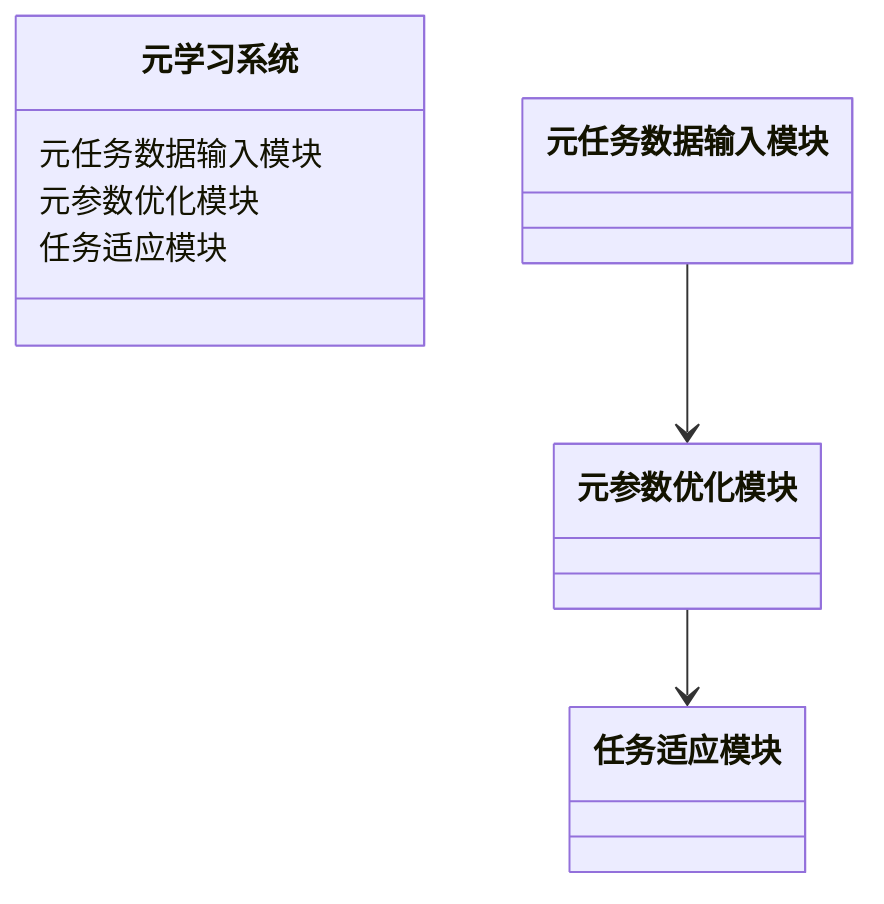
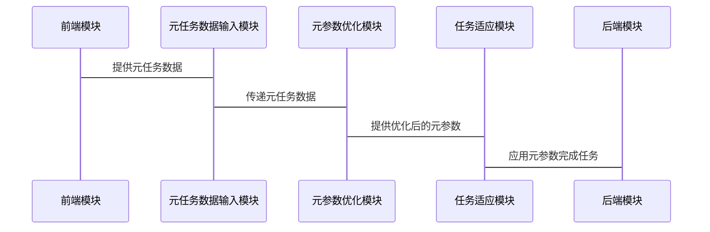

                 


# 元学习在AI Agent中的应用：快速适应新任务

> 关键词：元学习、AI Agent、快速适应、机器学习、算法优化

> 摘要：  
本文深入探讨了元学习在AI Agent中的应用，详细分析了元学习的核心概念、算法原理及其在AI Agent快速适应新任务中的具体应用。通过理论分析和实践案例，本文揭示了元学习如何帮助AI Agent在动态环境中快速适应新任务，解决了传统机器学习方法在任务多样性上的局限性。文章还结合实际场景，详细介绍了元学习算法的数学模型和系统架构设计，并给出了具体的实现方案和优化建议。

---

## 第一部分: 元学习与AI Agent基础

### 第1章: 元学习与AI Agent概述

#### 1.1 元学习的基本概念

##### 1.1.1 元学习的定义
元学习（Meta-Learning）是一种机器学习范式，旨在通过学习“如何学习”来提高模型在新任务上的适应能力。与传统机器学习不同，元学习的目标不是直接解决特定任务，而是优化模型的元参数（meta-parameters），使其能够快速适应新任务。

##### 1.1.2 元学习的核心特点
- **快速适应性**：元学习模型能够在少量数据下快速适应新任务。
- **任务多样性**：适用于多个相关任务的联合优化。
- **元参数优化**：通过优化元参数，提升模型在不同任务上的泛化能力。

##### 1.1.3 元学习与传统机器学习的区别
| 特性        | 传统机器学习             | 元学习                 |
|-------------|--------------------------|------------------------|
| 数据需求     | 需要大量标注数据         | 适用于小样本数据       |
| 任务适应性   | 适应单一任务             | 适应多个相关任务       |
| 参数优化     | 优化任务特定参数         | 优化元参数（适用于多任务） |

#### 1.2 AI Agent的基本概念

##### 1.2.1 AI Agent的定义
AI Agent（人工智能代理）是指能够感知环境、执行任务并做出决策的智能实体。它可以是一个软件程序或物理设备，通过与环境交互来实现目标。

##### 1.2.2 AI Agent的核心功能
- **感知环境**：通过传感器或数据输入获取环境信息。
- **决策制定**：基于感知信息做出最优决策。
- **任务执行**：根据决策执行具体操作。

##### 1.2.3 AI Agent的分类
| 类型         | 描述                     | 示例                     |
|--------------|--------------------------|--------------------------|
| 简单反射型   | 基于规则的简单反应       | 家庭自动化设备           |
| 目标驱动型   | 以特定目标为导向         | 自动交易系统             |
| 情景意识型   | 具有复杂环境感知能力     | 自动驾驶汽车             |

#### 1.3 元学习在AI Agent中的应用背景

##### 1.3.1 AI Agent面临的挑战
- **动态环境适应性**：AI Agent需要在不断变化的环境中快速调整策略。
- **任务多样性**：AI Agent可能需要执行多种不同类型的任务。
- **数据稀缺性**：在某些场景下，新任务的数据量可能非常有限。

##### 1.3.2 元学习如何解决AI Agent的适应性问题
元学习通过优化元参数，使得AI Agent能够在新任务上快速适应，减少了对大量数据的依赖，提高了任务执行效率。

##### 1.3.3 元学习在AI Agent中的潜在应用领域
- **自动驾驶**：快速适应不同的驾驶场景。
- **智能助手**：快速响应用户的多样化需求。
- **机器人控制**：在不同环境中快速调整动作策略。

#### 1.4 本章小结
本章介绍了元学习和AI Agent的基本概念，并分析了元学习在AI Agent中的应用背景。通过对比传统机器学习和元学习的特点，揭示了元学习在AI Agent快速适应新任务中的重要性。

---

## 第二部分: 元学习的核心概念与算法原理

### 第2章: 元学习的核心概念

#### 2.1 元学习的数学模型

##### 2.1.1 元学习的元任务与目标函数
元任务（Meta-Task）是指一系列用于训练元学习模型的任务集合。目标函数（Objective Function）定义了模型在这些任务上的优化目标。

##### 2.1.2 元学习的优化目标
元学习的优化目标是通过最小化元任务的损失函数，优化模型的元参数，使得模型能够快速适应新任务。

##### 2.1.3 元学习的元参数与任务参数
元参数（Meta-Parameters）是用于优化模型的参数，任务参数（Task-Parameters）是具体任务的参数。

#### 2.2 元学习的算法原理

##### 2.2.1 模型agnostic meta-learning (MAML)
MAML是一种经典的元学习算法，其核心思想是通过优化元参数，使得模型在新任务上的损失函数最小化。

##### 2.2.2 基于神经网络的元学习算法
基于神经网络的元学习算法（如Meta-LSTM）通过构建特定的网络结构，来实现元参数的优化。

##### 2.2.3 元学习算法的收敛性分析
元学习算法的收敛性取决于优化目标函数的性质和优化方法的选择。

#### 2.3 元学习与迁移学习的对比

##### 2.3.1 元学习与迁移学习的定义对比
迁移学习是将一个任务上的知识迁移到另一个任务，而元学习是通过学习“如何学习”来优化模型的适应能力。

##### 2.3.2 元学习与迁移学习的核心区别
- **目标**：元学习关注如何快速适应新任务，迁移学习关注如何利用已有知识。
- **适用场景**：元学习适用于任务多样性高的场景，迁移学习适用于任务之间有较强关联的场景。

##### 2.3.3 元学习在迁移学习中的优势
元学习可以结合迁移学习的思想，通过优化元参数来实现跨任务的知识共享。

#### 2.4 本章小结
本章详细介绍了元学习的核心概念和算法原理，分析了元学习与迁移学习的区别与联系，为后续章节的分析奠定了基础。

---

## 第三部分: 元学习算法的数学模型与公式

### 第3章: 元学习的数学模型

#### 3.1 元学习的元任务模型

##### 3.1.1 元任务的定义与表示
元任务可以表示为一系列任务集合，每个任务都有自己的数据和标签。

##### 3.1.2 元任务的损失函数
元任务的损失函数通常定义为模型在各个任务上的损失之和。

##### 3.1.3 元任务的优化目标
元任务的优化目标是通过最小化损失函数，优化模型的元参数。

#### 3.2 元学习的元参数优化

##### 3.2.1 元参数的定义
元参数是用于优化模型的参数，通常包括神经网络的权重和偏置。

##### 3.2.2 元参数的优化过程
通过梯度下降等优化方法，逐步优化元参数，使得模型在新任务上的表现最优。

##### 3.2.3 元参数与任务参数的关系
元参数用于生成任务参数，任务参数用于具体任务的优化。

#### 3.3 具体元学习算法的数学公式

##### 3.3.1 MAML算法的数学公式
MAML算法的目标是最小化元任务的损失函数，通过优化元参数 $\theta$：

$$ \theta = \arg\min_{\theta} \sum_{i=1}^{N} \mathcal{L}_i(f_\theta(x_i)) $$

其中，$f_\theta$ 是模型的参数化函数，$\mathcal{L}_i$ 是第 $i$ 个任务的损失函数。

##### 3.3.2 Reptile算法的数学公式
Reptile算法通过在每个任务上优化模型参数，并将这些参数作为元参数的更新方向：

$$ \theta = \theta - \eta \sum_{i=1}^{N} \nabla_\theta \mathcal{L}_i(f_\theta(x_i)) $$

##### 3.3.3 其他元学习算法的数学公式
例如，Meta-SGD算法的更新规则为：

$$ \theta = \theta - \eta \sum_{i=1}^{N} \nabla_\theta \mathcal{L}_i(f_\theta(x_i)) $$

#### 3.4 本章小结
本章通过数学公式详细描述了元学习的核心模型和优化过程，为后续章节的算法实现提供了理论基础。

---

## 第四部分: 元学习在AI Agent中的应用

### 第4章: AI Agent的任务适应性问题

#### 4.1 AI Agent的任务适应性需求

##### 4.1.1 AI Agent的动态环境适应性
AI Agent需要在动态环境中快速调整策略。

##### 4.1.2 AI Agent的任务多样性
AI Agent可能需要执行多种不同类型的任务。

##### 4.1.3 AI Agent的快速适应性要求
AI Agent需要在短时间内适应新任务。

#### 4.2 元学习如何解决AI Agent的任务适应性问题

##### 4.2.1 元学习的快速适应性特点
元学习通过优化元参数，使得AI Agent能够快速适应新任务。

##### 4.2.2 元学习在AI Agent任务适应中的具体应用
- **自动驾驶**：通过元学习优化驾驶策略，适应不同的道路和交通情况。
- **智能助手**：通过元学习优化对话策略，适应不同的用户需求。

##### 4.2.3 元学习与AI Agent任务适应性的结合
通过元学习优化AI Agent的元参数，使得其能够在新任务上快速调整策略。

#### 4.3 本章小结
本章分析了AI Agent的任务适应性需求，并探讨了元学习在其中的应用，揭示了元学习在AI Agent快速适应新任务中的重要性。

---

## 第五部分: 元学习算法的系统分析与架构设计

### 第5章: 元学习算法的系统架构

#### 5.1 元学习系统的组成模块

##### 5.1.1 元任务数据输入模块
负责输入和处理元任务数据。

##### 5.1.2 元参数优化模块
负责优化模型的元参数。

##### 5.1.3 任务适应模块
负责将优化后的元参数应用于具体任务。

#### 5.2 系统功能设计

##### 5.2.1 领域模型（mermaid类图）


##### 5.2.2 系统架构设计（mermaid架构图）


##### 5.2.3 系统交互设计（mermaid序列图）


#### 5.3 系统接口设计

##### 5.3.1 元任务数据接口
定义元任务数据的输入格式和接口规范。

##### 5.3.2 元参数优化接口
定义元参数优化模块的输入输出接口。

##### 5.3.3 任务适应接口
定义任务适应模块的输入输出接口。

#### 5.4 本章小结
本章通过系统架构设计和交互流程图，详细描述了元学习算法在AI Agent中的系统实现，为后续章节的代码实现奠定了基础。

---

## 第六部分: 项目实战

### 第6章: 元学习在AI Agent中的项目实现

#### 6.1 环境安装与配置

##### 6.1.1 安装依赖
需要安装PyTorch、numpy、mermaid等库。

##### 6.1.2 环境配置
设置Python版本、安装开发工具等。

#### 6.2 系统核心实现源代码

##### 6.2.1 元学习模型实现
实现MAML算法的PyTorch代码。

```python
import torch
import torch.nn as nn

class MetaLearner(nn.Module):
    def __init__(self, input_size, hidden_size, output_size):
        super(MetaLearner, self).__init__()
        self.w1 = nn.Parameter(torch.randn(input_size, hidden_size))
        self.b1 = nn.Parameter(torch.randn(hidden_size))
        self.w2 = nn.Parameter(torch.randn(hidden_size, output_size))
        self.b2 = nn.Parameter(torch.randn(output_size))

    def forward(self, x, theta=None):
        if theta is not None:
            w1, b1, w2, b2 = theta
            h = torch.relu(torch.mm(x, w1) + b1)
            y = torch.mm(h, w2) + b2
            return y
        else:
            h = torch.relu(torch.mm(x, self.w1) + self.b1)
            y = torch.mm(h, self.w2) + self.b2
            return y
```

##### 6.2.2 任务适应模块实现
实现任务适应模块的具体逻辑。

```python
def adapt_task(model, task_data, task_labels, inner_lr):
    # 优化任务参数
    loss_fn = nn.CrossEntropyLoss()
    optimizer = torch.optim.SGD(model.parameters(), lr=inner_lr)
    optimizer.zero_grad()
    outputs = model(task_data)
    loss = loss_fn(outputs, task_labels)
    loss.backward()
    optimizer.step()
    return model
```

##### 6.2.3 元参数优化模块实现
实现元参数优化模块的具体逻辑。

```python
def meta_optimize(meta_model, tasks, meta_lr):
    optimizer = torch.optim.Adam(meta_model.parameters(), lr=meta_lr)
    optimizer.zero_grad()
    for task in tasks:
        adapted_model = meta_model(task.data, theta=None)
        task_loss = compute_task_loss(adapted_model, task.data, task.labels)
        # 计算梯度并反向传播
        task_loss.backward()
    optimizer.step()
```

#### 6.3 代码应用解读与分析

##### 6.3.1 元学习模型的训练过程
通过训练多个元任务，优化元参数，使得模型能够快速适应新任务。

##### 6.3.2 任务适应模块的实现细节
通过优化任务参数，完成具体任务的适应。

##### 6.3.3 系统整体流程
从数据输入到元参数优化，再到任务适应，整个流程的详细解读。

#### 6.4 实际案例分析和详细讲解剖析

##### 6.4.1 案例背景
假设我们有一个AI Agent需要在多个分类任务上快速适应。

##### 6.4.2 数据准备
准备多个分类任务的数据集。

##### 6.4.3 模型训练
通过元学习模型训练元参数，使得模型能够快速适应新任务。

##### 6.4.4 任务适应
在新任务上，通过优化任务参数，快速调整模型策略。

#### 6.5 项目小结
本章通过实际案例，详细讲解了元学习在AI Agent中的具体实现过程，包括环境配置、代码实现和系统优化。

---

## 第七部分: 最佳实践与总结

### 第7章: 元学习在AI Agent中的最佳实践

#### 7.1 最佳实践 tips
- **数据预处理**：确保数据的质量和多样性。
- **模型选择**：根据任务需求选择合适的元学习算法。
- **超参数优化**：合理设置学习率等超参数。

#### 7.2 小结
总结本文的主要内容和关键点。

#### 7.3 注意事项
- **计算资源**：元学习需要大量的计算资源。
- **数据隐私**：注意数据的隐私和安全问题。
- **模型解释性**：提高模型的可解释性。

#### 7.4 拓展阅读
推荐一些关于元学习和AI Agent的进一步阅读资料。

---

## 作者信息

作者：AI天才研究院/AI Genius Institute & 禅与计算机程序设计艺术 /Zen And The Art of Computer Programming

---

以上是《元学习在AI Agent中的应用：快速适应新任务》的技术博客文章的完整大纲和内容。文章从理论到实践，详细分析了元学习在AI Agent中的应用，结合数学模型、系统架构和实际案例，为读者提供了全面而深入的指导。

