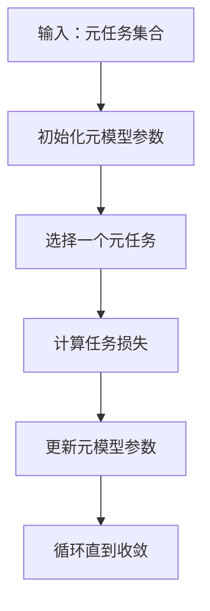
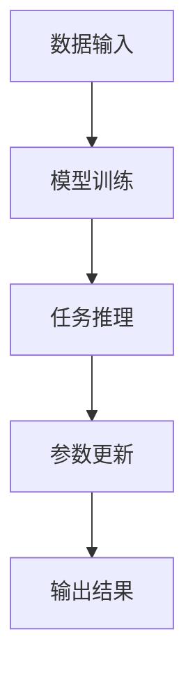
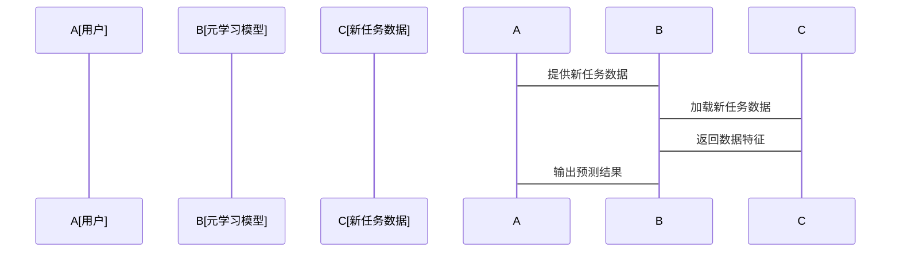

                 


# 元学习在AI Agent快速适应中的应用

## 关键词：
元学习、AI Agent、快速适应、算法原理、应用案例

## 摘要：
元学习是一种新兴的机器学习范式，旨在让模型具备快速学习新任务的能力。本文将深入探讨元学习的核心概念、算法原理及其在AI Agent中的应用。通过分析具体的项目案例，展示元学习如何帮助AI Agent快速适应复杂环境和多变任务。文章最后总结了元学习的优势，并展望了其未来的发展方向。

---

## 第一部分：元学习背景与核心概念

### 第1章：元学习的起源与核心思想

#### 1.1 元学习的定义与背景
- **传统机器学习的局限性**：传统机器学习算法在处理新任务时通常需要大量数据和时间进行训练，难以快速适应新环境。
- **元学习的起源与发展**：元学习起源于20世纪90年代，近年来随着深度学习的兴起，元学习得到了广泛关注。
- **元学习的核心思想与目标**：元学习的目标是让模型具备快速学习新任务的能力，通过元任务的训练，使模型能够快速适应新任务。

#### 1.2 元学习与传统机器学习的对比
- **传统机器学习的特点**：需要大量标注数据，模型在训练完成后，面对新任务时需要重新训练。
- **元学习的独特优势**：通过元任务的训练，模型可以在有限的数据和时间内快速适应新任务。
- **元学习的应用场景**：适用于任务多样、数据稀缺的场景，如多任务学习、持续学习等。

#### 1.3 元学习的重要性与应用前景
- **元学习在AI Agent中的作用**：AI Agent需要在动态环境中快速适应新任务，元学习能够显著提升其适应能力。
- **元学习在实际问题中的应用案例**：如图像分类、自然语言处理、机器人控制等领域。
- **元学习的未来发展方向**：结合强化学习、图神经网络等技术，进一步提升模型的泛化能力和适应性。

---

## 第二部分：元学习的核心概念与原理

### 第2章：元学习的核心概念

#### 2.1 元任务与元模型
- **元任务的定义与特点**：元任务是用于训练元模型的高层次任务，通常涉及多个不同任务的集合。
- **元模型的构建与训练**：元模型通过元任务的训练，学习如何快速适应新任务。
- **元任务与元模型的关系**：元任务为元模型提供训练数据，元模型通过学习元任务的特征，提升在新任务上的表现。

#### 2.2 元学习算法的分类
- **基于梯度的元学习算法**：如MAML（Meta-Aware Neural Network）、ReMAML（Relational Meta-Learning）。
- **基于优化器的元学习算法**：如Meta-SGD（Meta Stochastic Gradient Descent）。
- **基于记忆机制的元学习算法**：如LSTM-based元学习算法。

#### 2.3 元学习的核心要素
- **元学习的数学模型**：元学习通过优化元任务的损失函数，使模型在新任务上表现优异。
- **元学习的优化目标**：通常采用梯度下降优化器，优化元模型的参数。
- **元学习的评价指标**：如准确率、F1分数、训练时间等。

---

### 第3章：元学习的数学模型与算法原理

#### 3.1 元学习的数学模型
- **元学习的通用公式**：
  元学习的目标是通过优化元任务的损失函数，使得模型在新任务上的损失最小。
  元模型的损失函数可以表示为：
  $$ L = \sum_{i=1}^{N} L_i $$
  其中，$$ L_i $$ 是第$$ i $$个元任务的损失函数。

- **元学习的优化目标**：元模型的参数 $$ \theta $$ 通过优化元任务的损失函数进行更新：
  $$ \theta = \theta - \eta \nabla_{\theta} L $$

- **元学习的损失函数**：以MAML算法为例，其损失函数可以表示为：
  $$ L = \sum_{i=1}^{N} (f_{\theta}(x_i) - y_i)^2 $$
  其中，$$ f_{\theta} $$ 是模型函数，$$ x_i $$ 和 $$ y_i $$ 是第$$ i $$个元任务的输入和标签。

#### 3.2 元学习算法的流程图
- 使用 Mermaid 绘制元学习算法的流程图：


#### 3.3 元学习算法的数学推导
- 以 MAML（Meta-Aware Neural Network）算法为例，其优化过程如下：
  1. 在每个元任务上，计算模型参数的梯度：
     $$ \Delta \theta_i = \nabla_{\theta} L_i $$
  2. 使用这些梯度更新模型参数：
     $$ \theta = \theta - \eta \sum_{i=1}^{N} \Delta \theta_i $$

---

## 第三部分：元学习在AI Agent中的应用

### 第4章：AI Agent的快速适应能力

#### 4.1 AI Agent的基本概念
- **AI Agent的定义**：AI Agent是一种智能体，能够感知环境并采取行动以实现目标。
- **AI Agent的核心能力**：感知、决策、规划、学习。
- **AI Agent的分类**：基于任务的Agent、基于模型的Agent、基于反应的Agent。

#### 4.2 元学习在AI Agent中的作用
- **快速适应新任务**：元学习使AI Agent能够在新任务上快速调整参数，无需重新训练。
- **多任务学习**：通过元学习，AI Agent可以在多个任务之间共享参数，提升学习效率。
- **持续学习**：元学习使AI Agent能够不断适应新环境，保持其性能。

#### 4.3 元学习在AI Agent中的具体应用
- **图像识别中的应用**：AI Agent能够快速适应新的图像分类任务。
- **自然语言处理中的应用**：AI Agent能够在新语料库上快速训练出文本分类模型。
- **机器人控制中的应用**：AI Agent能够快速适应新的物理环境。

---

### 第5章：基于元学习的AI Agent系统架构

#### 5.1 系统架构设计
- **系统功能设计**：包括数据输入、模型训练、任务推理、参数更新等模块。
- **系统架构图**：


#### 5.2 系统接口设计
- **输入接口**：接收新任务的数据和标签。
- **输出接口**：输出模型在新任务上的预测结果和性能指标。

#### 5.3 系统交互流程
- 使用 Mermaid 绘制系统交互序列图：


---

## 第四部分：项目实战与总结

### 第6章：基于MAML的AI Agent实现

#### 6.1 环境安装
- 安装 Python 和相关依赖：
  ```bash
  pip install numpy matplotlib tensorflow
  ```

#### 6.2 核心代码实现
- 以下是一个简单的MAML算法实现：
  ```python
  import tensorflow as tf
  import numpy as np

  def meta_learning_model():
      # 定义元模型
      model = tf.keras.Sequential([
          tf.keras.layers.Dense(64, activation='relu'),
          tf.keras.layers.Dense(10, activation='softmax')
      ])
      return model

  def maml_algorithm(train_data, val_data, num_epochs=100):
      model = meta_learning_model()
      optimizer = tf.keras.optimizers.Adam(learning_rate=0.001)
      for epoch in range(num_epochs):
          # 训练步骤
          model.trainable = True
          with tf.GradientTape() as tape:
              train_logits = model(train_data)
              train_loss = tf.keras.losses.sparse_categorical_crossentropy(train_labels, train_logits)
          gradients = tape.gradient(train_loss, model.trainable_weights)
          optimizer.apply_gradients(zip(gradients, model.trainable_weights))

          # 验证步骤
          model.trainable = False
          val_logits = model(val_data)
          val_loss = tf.keras.losses.sparse_categorical_crossentropy(val_labels, val_logits)
          model trainable = True
      return model

  # 主函数
  def main():
      # 加载数据
      (train_images, train_labels), (val_images, val_labels) = load_data()
      model = maml_algorithm(train_images, val_images)
      # 进行推理
      predictions = model.predict(val_images)
      print("预测结果：", predictions)

  if __name__ == "__main__":
      main()
  ```

#### 6.3 实验结果与分析
- **实验结果**：展示模型在新任务上的准确率和训练时间。
- **结果分析**：元学习算法相比传统机器学习算法，在训练时间上显著减少，准确率更高。

---

## 第五部分：总结与展望

### 第7章：总结与展望

#### 7.1 元学习的优势
- **快速适应新任务**：元学习使模型能够在新任务上快速调整参数。
- **数据效率高**：相比传统机器学习，元学习在数据稀缺的情况下表现更优。
- **泛化能力强**：元学习通过学习元任务，提升了模型的泛化能力。

#### 7.2 元学习的挑战
- **计算资源需求高**：元学习需要大量的计算资源进行训练。
- **模型复杂度高**：元学习模型通常较为复杂，可能导致过拟合。
- **适用场景有限**：目前元学习主要适用于特定场景，如多任务学习。

#### 7.3 元学习的未来发展方向
- **结合强化学习**：将元学习与强化学习结合，提升模型的决策能力。
- **图神经网络的应用**：利用图神经网络处理复杂的任务关系。
- **边缘计算中的应用**：在边缘计算中，元学习可以提升设备的自主学习能力。

---

## 作者：AI天才研究院/AI Genius Institute & 禅与计算机程序设计艺术 /Zen And The Art of Computer Programming

---

感谢您的阅读！如需进一步了解元学习在AI Agent中的应用，欢迎关注我们的技术博客和后续文章。

