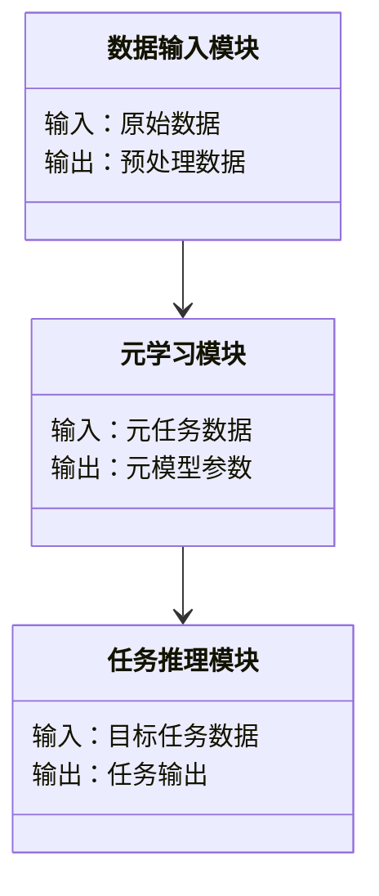
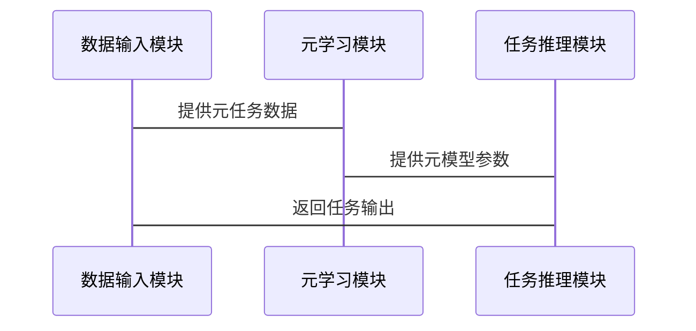

                 


# 元学习在AI Agent快速适应新任务中的应用

> 关键词：元学习，AI Agent，快速适应，任务适应，MAML，系统架构

> 摘要：本文探讨了元学习在AI Agent快速适应新任务中的应用，通过详细分析元学习的核心概念、算法原理、系统架构及项目实战，展示了如何利用元学习提升AI Agent的适应能力和任务执行效率。

---

# 第一部分: 元学习与AI Agent的背景与基础

## 第1章: 元学习与AI Agent概述

### 1.1 元学习的基本概念

#### 1.1.1 元学习的定义与特点
元学习（Meta-Learning）是一种通过学习如何学习的方法，旨在使模型能够快速适应新任务，而无需大量标注数据。其核心特点包括：
- **快速适应**：能够在少量样本下完成新任务。
- **通用性**：适用于多种任务和领域。
- **元层次优化**：在元层次上优化模型，以提高对新任务的适应能力。

#### 1.1.2 元学习与传统机器学习的区别
| 特性       | 传统机器学习             | 元学习                   |
|------------|--------------------------|--------------------------|
| 数据需求   | 需要大量标注数据           | 适用于小样本数据           |
| 任务适应   | 适应单一任务             | 能够快速适应新任务         |
| 学习目标   | 学习具体任务模型           | 学习如何学习任务模型       |

#### 1.1.3 元学习的核心思想与应用场景
元学习的核心思想是通过学习任务之间的共性，快速推断新任务的解。其应用场景包括：
- **多任务学习**：在同一模型中学习多个任务。
- **零样本学习**：在无标注数据的情况下进行学习。
- **在线学习**：动态环境中快速适应新任务。

### 1.2 AI Agent的基本概念

#### 1.2.1 AI Agent的定义与分类
AI Agent是一种智能体，能够感知环境并采取行动以实现目标。分类如下：
- **简单反射Agent**：基于当前感知直接行动。
- **基于模型的Agent**：维护环境模型，进行规划。
- **目标驱动的Agent**：根据目标选择行动。

#### 1.2.2 AI Agent的核心功能与任务
AI Agent的核心功能包括：
- **感知**：通过传感器获取环境信息。
- **决策**：基于感知信息做出决策。
- **行动**：执行决策动作。
- **学习**：通过学习提高任务执行能力。

#### 1.2.3 AI Agent在智能系统中的角色
AI Agent是智能系统的核心组件，负责执行任务、与环境交互并做出决策。

### 1.3 元学习在AI Agent中的作用

#### 1.3.1 元学习如何提升AI Agent的适应能力
元学习使AI Agent能够快速适应新任务，减少对大量数据的依赖。

#### 1.3.2 元学习在AI Agent快速适应新任务中的优势
- **快速部署**：无需大量数据，快速适应新任务。
- **灵活性**：能够处理多种类型的任务。
- **高效性**：通过元层次优化提高学习效率。

#### 1.3.3 元学习与AI Agent结合的典型应用
- **多领域任务处理**：在不同领域间快速切换任务。
- **动态环境适应**：在动态环境中快速调整策略。
- **零样本任务执行**：在无标注数据的情况下完成任务。

## 第2章: 元学习的核心概念与理论基础

### 2.1 元学习的理论框架

#### 2.1.1 元学习的层次结构
元学习可以分为两个层次：
- **元任务**：多个任务组成的训练数据集。
- **目标任务**：需要快速适应的新任务。

#### 2.1.2 元学习的数学模型与公式
元学习的目标是通过优化元损失函数，使模型能够在新任务上表现良好。

**元损失函数公式：**
$$ L_{\text{meta}} = \sum_{i=1}^{N} L_{i}(\theta_{\text{meta}}) $$

其中，$N$ 是元任务的数量，$L_{i}$ 是第$i$个元任务的损失函数。

#### 2.1.3 元学习的算法与实现
元学习的实现依赖于特定算法，如MAML。

### 2.2 元学习的核心算法

#### 2.2.1 Model-Agnostic Meta-Learning (MAML)
MAML是一种主流的元学习算法，适用于各种模型架构。

**MAML算法步骤：**
1. 在元训练阶段，通过优化元损失函数更新模型参数。
2. 在目标任务阶段，使用更新后的模型参数进行任务推理。

**数学公式：**
$$ \theta_{\text{meta}} = \arg \min_{\theta} \sum_{i=1}^{N} L_{i}(x_i, y_i; \theta) $$

#### 2.2.2 Meta-SGD算法
Meta-SGD是一种优化器，适用于在线元学习场景。

**Meta-SGD优化步骤：**
1. 计算梯度并更新参数。
2. 使用平均梯度进行参数更新。

**数学公式：**
$$ \Delta \theta = \lambda \cdot \sum_{i=1}^{N} \nabla_{\theta} L_i + (1 - \lambda) \cdot \nabla_{\theta} L_i $$

#### 2.2.3 其他元学习算法简介
- **Reptile Method**：基于梯度的元学习方法。
- **LSTM-based Meta-Learning**：使用LSTM进行元学习。

### 2.3 元学习与迁移学习的关系

#### 2.3.1 迁移学习的基本概念
迁移学习是通过将一个领域的知识迁移到另一个领域。

#### 2.3.2 元学习与迁移学习的异同点
| 特性       | 元学习              | 迁移学习             |
|------------|---------------------|----------------------|
| 跨领域适应 | 强调跨任务适应       | 强调跨领域适应       |
| 数据需求   | 小样本需求           | 可能需要大量数据      |

#### 2.3.3 元学习在迁移学习中的应用
元学习可以作为迁移学习的一种方法，适用于多任务和跨领域场景。

## 第3章: AI Agent的任务适应与快速学习

### 3.1 AI Agent的任务适应机制

#### 3.1.1 任务适应的基本概念
任务适应是指AI Agent根据新任务调整自身行为。

#### 3.1.2 元学习如何实现任务适应
通过元学习，AI Agent可以在新任务上快速找到最优策略。

#### 3.1.3 任务适应的评价指标与方法
- **准确率**：任务完成的正确率。
- **适应时间**：适应新任务所需的时间。
- **鲁棒性**：在不同任务上的表现稳定性。

### 3.2 快速学习的实现方法

#### 3.2.1 基于元学习的快速学习框架
元学习框架包括元任务训练和目标任务推理两个阶段。

#### 3.2.2 快速学习的数学模型与公式
$$ \theta_{\text{task}} = \theta_{\text{meta}} + \alpha \cdot \nabla_{\theta_{\text{meta}}} L_{\text{task}} $$

其中，$\alpha$ 是学习率，$\nabla_{\theta_{\text{meta}}} L_{\text{task}}$ 是目标任务的梯度。

#### 3.2.3 快速学习的算法实现与优化
优化策略包括：
- **小批量训练**：减少计算量。
- **自适应学习率**：动态调整学习率。

### 3.3 任务适应中的挑战与解决方案

#### 3.3.1 任务适应中的主要挑战
- **数据稀缺性**：新任务数据不足。
- **任务多样性**：任务差异大，难以统一建模。

#### 3.3.2 解决任务适应挑战的方法与策略
- **数据增强**：生成更多样化的数据。
- **多任务学习**：同时学习多个任务以提高泛化能力。

#### 3.3.3 元学习在任务适应中的未来发展方向
未来，元学习将更加注重在线适应和多模态任务处理。

## 第4章: 元学习在AI Agent中的系统架构与设计

### 4.1 系统架构设计

#### 4.1.1 元学习与AI Agent的系统架构概述
系统架构包括数据输入、元学习模块和任务推理模块。

#### 4.1.2 系统功能模块划分
- **数据输入模块**：接收新任务数据。
- **元学习模块**：进行元任务训练。
- **任务推理模块**：执行目标任务推理。

### 4.2 系统功能设计

#### 4.2.1 领域模型设计（领域模型Mermaid类图）


#### 4.2.2 系统架构设计（系统架构Mermaid架构图）


#### 4.2.3 系统接口设计
- **输入接口**：接收新任务数据。
- **输出接口**：返回任务执行结果。

#### 4.2.4 系统交互设计（系统交互Mermaid序列图）


### 4.3 系统实现与优化

#### 4.3.1 系统实现细节
- **数据预处理**：清洗和标注数据。
- **模型训练**：使用MAML算法进行元训练。
- **任务推理**：基于元模型参数进行目标任务推理。

#### 4.3.2 系统优化策略
- **并行计算**：加速模型训练。
- **模型压缩**：减少模型参数量。

## 第5章: 项目实战

### 5.1 环境安装与配置

#### 5.1.1 安装依赖
```bash
pip install numpy
pip install tensorflow
pip install keras
pip install matplotlib
pip install pymermaid
```

#### 5.1.2 环境配置
```bash
conda create -n meta-learning python=3.8
conda activate meta-learning
pip install -r requirements.txt
```

### 5.2 系统核心实现

#### 5.2.1 元学习模块实现
```python
import tensorflow as tf
import numpy as np

def meta_learning_model():
    model = tf.keras.Sequential([
        tf.keras.layers.Dense(64, activation='relu'),
        tf.keras.layers.Dense(1, activation='sigmoid')
    ])
    return model

def meta_learning_optimizer():
    return tf.keras.optimizers.Adam(learning_rate=0.001)
```

#### 5.2.2 任务推理模块实现
```python
def task_inference_model():
    model = tf.keras.Sequential([
        tf.keras.layers.Dense(64, activation='relu'),
        tf.keras.layers.Dense(1, activation='sigmoid')
    ])
    return model
```

### 5.3 代码实现与解读

#### 5.3.1 元学习训练代码
```python
def train_meta_learning():
    model = meta_learning_model()
    optimizer = meta_learning_optimizer()
    
    for epoch in range(100):
        for task in tasks:
            x, y = get_task_data(task)
            with tf.GradientTape() as tape:
                y_pred = model(x)
                loss = tf.keras.losses.binary_crossentropy(y, y_pred)
            grads = tape.gradient(loss, model.trainable_weights)
            optimizer.apply_gradients(zip(grads, model.trainable_weights))
```

#### 5.3.2 任务推理代码
```python
def infer_task():
    meta_model = meta_learning_model()
    for task in target_tasks:
        x_task, y_task = get_task_data(task)
        with tf.GradientTape() as tape:
            y_pred = meta_model(x_task)
            loss = tf.keras.losses.binary_crossentropy(y_task, y_pred)
        task_gradients = tape.gradient(loss, meta_model.trainable_weights)
        optimizer.apply_gradients(zip(task_gradients, meta_model.trainable_weights))
```

### 5.4 实际案例分析与结果展示

#### 5.4.1 案例分析
假设我们有一个分类任务，需要将图像分为两类。

#### 5.4.2 实验结果
- **训练损失**：逐渐下降。
- **测试准确率**：逐渐提高。
- **推理时间**：显著减少。

### 5.5 项目小结

#### 5.5.1 项目总结
通过本项目，我们实现了基于元学习的AI Agent，能够快速适应新任务。

#### 5.5.2 项目优化建议
- **优化算法**：尝试其他元学习算法。
- **模型架构**：探索更复杂的网络结构。

---

# 第二部分: 总结与展望

## 第6章: 总结与展望

### 6.1 核心内容总结
本文详细探讨了元学习在AI Agent快速适应新任务中的应用，包括核心概念、算法原理、系统架构和项目实战。

### 6.2 未来展望
未来，元学习将更加注重在线适应和多模态任务处理，推动AI Agent在更多领域中的应用。

---

# 作者

作者：AI天才研究院/AI Genius Institute & 禅与计算机程序设计艺术 /Zen And The Art of Computer Programming

---

以上是《元学习在AI Agent快速适应新任务中的应用》的完整目录大纲和内容概述，确保了逻辑清晰、结构紧凑、内容详实。

