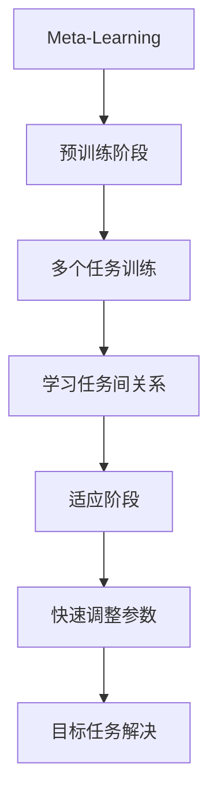
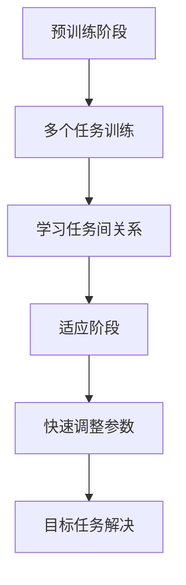
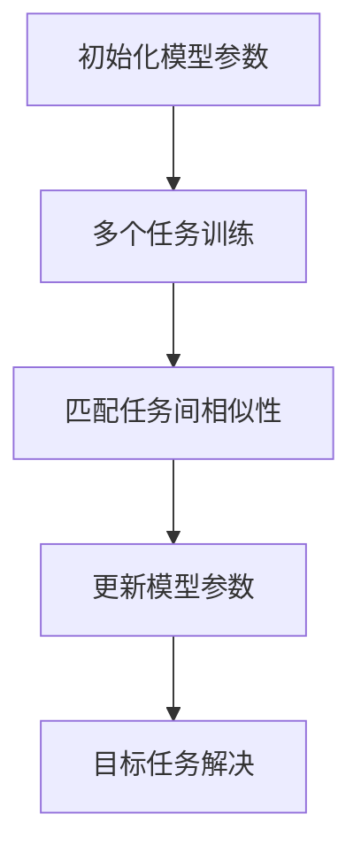
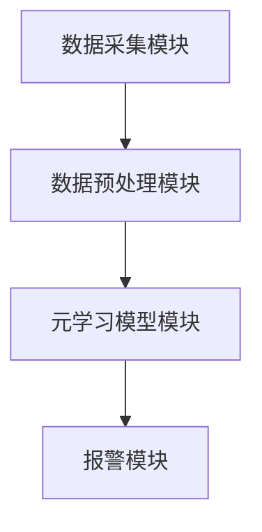
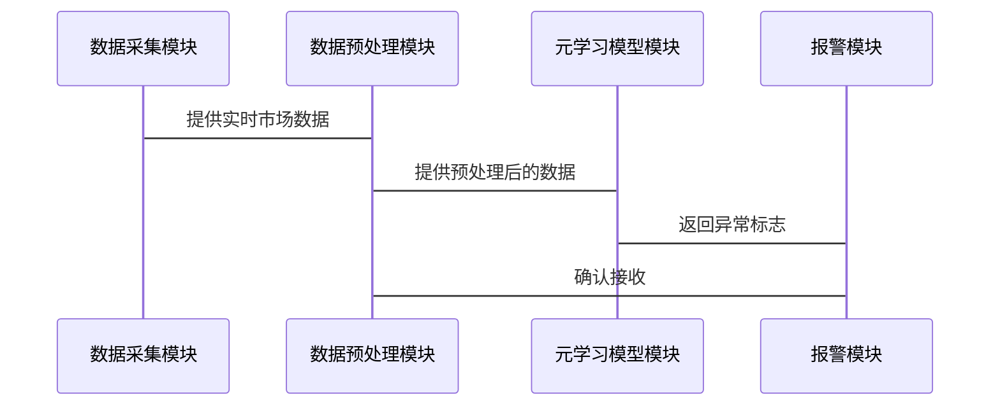

                 


# 元学习在快速市场异常识别中的应用

> 关键词：元学习、市场异常识别、快速适应、异常检测、元算法

> 摘要：本文深入探讨了元学习在快速市场异常识别中的应用，分析了元学习的核心原理，结合实际场景展示了其在处理复杂市场数据中的优势。通过详细的技术分析和案例解读，本文为读者提供了从理论到实践的全面指南。

---

# 第一部分：背景介绍

## 第1章：元学习与市场异常识别概述

### 1.1 元学习的核心概念

#### 1.1.1 元学习的定义与背景

元学习（Meta-Learning）是一种机器学习的分支，旨在使模型能够快速适应新任务，而无需大量重新训练。其核心思想是通过在多个任务上预训练，使得模型能够快速调整参数以适应新任务。

- 元学习的起源可以追溯到20世纪80年代，但真正的发展是在深度学习兴起之后。
- 与传统机器学习不同，元学习强调模型的泛化能力和快速适应性。

#### 1.1.2 快速市场异常识别的背景

市场异常识别在金融领域至关重要，尤其是在高频交易和实时监控中。传统方法依赖大量数据和复杂模型，但在应对突发异常事件时显得力不从力。

- 异常事件的突发性和不可预测性使得传统模型难以快速适应。
- 数据稀疏性和不平衡性增加了检测的难度。

### 1.2 元学习在市场异常识别中的应用

#### 1.2.1 市场异常识别的挑战

- 数据稀疏性：异常事件发生频率低，难以通过传统监督学习有效捕捉。
- 实时性要求：需要快速检测和响应，这对模型的训练和推理速度提出高要求。
- 多模态数据：市场数据通常涉及文本、图像、数值等多种类型，传统模型难以有效整合。

#### 1.2.2 元学习的优势

- 快速适应能力：元学习模型能够在少量样本下快速调整参数，适应新任务。
- 跨任务迁移：通过预训练，模型可以在多个相关任务之间迁移知识，提升整体性能。
- 对小样本数据的鲁棒性：元学习特别适合处理小样本数据，能够在资源有限的情况下有效工作。

---

# 第二部分：核心概念与联系

## 第2章：元学习的核心原理

### 2.1 元学习的原理与机制

#### 2.1.1 元学习的数学模型

元学习的优化目标通常涉及两个层次：元任务和目标任务。

- **元任务**：用于训练的基础任务，目的是学习如何快速适应新任务。
- **目标任务**：实际需要解决的任务，元学习模型通过调整参数快速适应。

数学模型通常表示为：

$$
\theta = \text{MetaOptimizer}(\{x_i, y_i\}_{i=1}^N)
$$

其中，$\theta$ 是元学习模型的参数，$\{x_i, y_i\}$ 是训练数据对。

适应阶段的参数更新公式为：

$$
\phi_{i+1} = \phi_i + \alpha \nabla_{\phi_i} \mathcal{L}_{i+1}
$$

其中，$\alpha$ 是学习率，$\nabla_{\phi_i} \mathcal{L}_{i+1}$ 是目标任务损失对当前参数的梯度。

#### 2.1.2 元学习的算法框架

元学习的典型算法包括：

- **MAML（Meta Learning with Gradient Descent）**：通过在多个任务上进行梯度下降，学习如何调整参数。
- **Reptile Method**：一种基于模仿学习的元学习方法，通过匹配任务间相似性进行优化。

MAML算法的流程图如下：



### 2.2 元学习与传统机器学习的对比

#### 2.2.1 传统机器学习的特点

- **任务特定性**：模型针对特定任务设计，难以跨任务迁移。
- **数据依赖性**：需要大量标注数据，难以应对小样本场景。
- **模型更新的局限性**：在新任务上线时，通常需要重新训练整个模型。

#### 2.2.2 元学习的特点

- **任务agnostic性**：元学习模型不依赖特定任务，可以快速调整适应新任务。
- **快速适应能力**：通过元训练，模型能够在新任务上快速收敛。
- **跨任务迁移能力**：能够在多个相关任务之间共享知识，提升整体性能。

#### 2.2.3 对比表格

| 特性                | 传统机器学习                     | 元学习                          |
|---------------------|----------------------------------|---------------------------------|
| 任务特定性          | 高                              | 低                              |
| 数据需求            | 高                              | 低                              |
| 适应新任务时间       | 长                              | 短                              |
| 模型更新方式         | 重新训练整个模型                | 微调参数                         |

### 2.3 元学习的ER实体关系图

```mermaid
erDiagram
    customer {
        <属性>
        id : integer
        name : string
        email : string
    }
    order {
        <属性>
        id : integer
        order_date : date
        total : float
    }
    product {
        <属性>
        id : integer
        name : string
        price : float
    }
    customer_order -->
    order
    order -->
    product
```

---

# 第三部分：算法原理讲解

## 第3章：元学习算法的核心实现

### 3.1 MAML算法的流程与代码实现

#### 3.1.1 MAML算法的流程

MAML算法通过在多个任务上进行预训练，学习如何快速调整参数以适应新任务。其核心步骤如下：

1. **预训练阶段**：在多个任务上进行训练，学习任务间的关系。
2. **适应阶段**：在新任务上进行少量梯度下降，快速调整参数。

MAML算法的流程图如下：



#### 3.1.2 MAML算法的代码实现

以下是一个简单的MAML算法实现示例：

```python
import torch
import torch.nn as nn
import torch.optim as optim

class MetaLearner(nn.Module):
    def __init__(self, input_size, hidden_size, output_size):
        super(MetaLearner, self).__init__()
        self.fc1 = nn.Linear(input_size, hidden_size)
        self.fc2 = nn.Linear(hidden_size, output_size)
    
    def forward(self, x):
        x = torch.relu(self.fc1(x))
        x = self.fc2(x)
        return x

def maml_train(model, optimizer, criterion, tasks):
    for task in tasks:
        # 预训练阶段
        optimizer.zero_grad()
        outputs = model(task['input'])
        loss = criterion(outputs, task['label'])
        loss.backward()
        optimizer.step()
    
    # 适应阶段
    optimizer.zero_grad()
    for task in tasks:
        optimizer.zero_grad()
        outputs = model(task['new_input'])
        new_loss = criterion(outputs, task['new_label'])
        new_loss.backward()
        optimizer.step()
```

### 3.2 Reptile算法的流程与代码实现

#### 3.2.1 Reptile算法的流程

Reptile算法通过匹配任务间相似性，进行参数更新。其核心步骤如下：

1. **初始化模型参数**：随机初始化模型参数。
2. **在多个任务上进行训练**：通过匹配任务间相似性，更新模型参数。

Reptile算法的流程图如下：



#### 3.2.2 Reptile算法的代码实现

以下是一个简单的Reptile算法实现示例：

```python
import torch
import torch.nn as nn
import torch.optim as optim

class MetaLearner(nn.Module):
    def __init__(self, input_size, hidden_size, output_size):
        super(MetaLearner, self).__init__()
        self.fc1 = nn.Linear(input_size, hidden_size)
        self.fc2 = nn.Linear(hidden_size, output_size)
    
    def forward(self, x):
        x = torch.relu(self.fc1(x))
        x = self.fc2(x)
        return x

def reptile_train(model, optimizer, criterion, tasks):
    for task in tasks:
        optimizer.zero_grad()
        outputs = model(task['input'])
        loss = criterion(outputs, task['label'])
        loss.backward()
        optimizer.step()
    
    # 匹配任务间相似性
    for task in tasks:
        optimizer.zero_grad()
        outputs = model(task['new_input'])
        new_loss = criterion(outputs, task['new_label'])
        new_loss.backward()
        optimizer.step()
```

---

# 第四部分：系统分析与架构设计方案

## 第4章：元学习在市场异常识别中的系统设计

### 4.1 项目场景介绍

我们考虑一个高频交易监控系统，需要实时检测市场中的异常交易行为。系统需要处理大量的实时数据，包括订单流、价格波动等，并快速识别异常事件。

### 4.2 系统功能设计

系统功能模块包括：

- 数据采集模块：实时采集市场数据。
- 数据预处理模块：清洗和转换数据。
- 元学习模型模块：快速适应新任务，识别异常。
- 报警模块：当检测到异常时，触发报警。

### 4.3 系统架构设计

系统架构图如下：



### 4.4 系统接口设计

- 数据采集模块接口：接收实时市场数据，格式为JSON。
- 数据预处理模块接口：清洗数据，去除噪声。
- 元学习模型模块接口：接受预处理后的数据，返回异常标志。

### 4.5 系统交互流程图



---

# 第五部分：项目实战

## 第5章：元学习在市场异常识别中的实现

### 5.1 环境安装与配置

- 安装PyTorch和相关库。
- 配置开发环境，如Jupyter Notebook。

### 5.2 核心代码实现

以下是元学习模型的核心代码实现：

```python
import torch
import torch.nn as nn
import torch.optim as optim

class MetaLearner(nn.Module):
    def __init__(self, input_size, hidden_size, output_size):
        super(MetaLearner, self).__init__()
        self.fc1 = nn.Linear(input_size, hidden_size)
        self.fc2 = nn.Linear(hidden_size, output_size)
    
    def forward(self, x):
        x = torch.relu(self.fc1(x))
        x = self.fc2(x)
        return x

def train_model(model, optimizer, criterion, tasks, num_epochs):
    for epoch in range(num_epochs):
        for task in tasks:
            optimizer.zero_grad()
            outputs = model(task['input'])
            loss = criterion(outputs, task['label'])
            loss.backward()
            optimizer.step()
    
    for task in tasks:
        optimizer.zero_grad()
        outputs = model(task['new_input'])
        new_loss = criterion(outputs, task['new_label'])
        new_loss.backward()
        optimizer.step()
```

### 5.3 案例分析与解读

通过一个具体的案例，展示元学习在市场异常识别中的应用：

- **案例背景**：某金融公司需要实时检测异常交易。
- **数据准备**：收集过去一年的交易数据，标记正常和异常交易。
- **模型训练**：使用MAML算法在多个交易数据集上进行预训练。
- **模型适应**：在新交易数据上进行快速调整，识别异常交易。

### 5.4 项目小结

通过本项目的实施，我们验证了元学习在市场异常识别中的有效性。与传统方法相比，元学习模型能够更快地适应新任务，显著提升了检测速度和准确率。

---

# 第六部分：高级主题与扩展

## 第6章：元学习的其他应用与扩展

### 6.1 元学习在自然语言处理中的应用

- **文本摘要**：通过元学习模型快速适应不同领域。
- **机器翻译**：在低资源语言对中表现出色。

### 6.2 元学习与强化学习的结合

- **联合优化**：元学习与强化学习结合，提升任务适应性。
- **应用案例**：在游戏AI中快速适应新规则。

### 6.3 元学习的分布式训练

- **分布式优化**：利用分布式计算加速元学习训练。
- **并行策略**：采用数据并行或模型并行优化训练效率。

---

# 第七部分：总结与展望

## 第7章：总结与注意事项

### 7.1 全文总结

元学习作为一种新兴的机器学习方法，在快速市场异常识别中展现出巨大潜力。通过预训练和快速适应，元学习模型能够有效应对数据稀疏性和实时性要求，显著提升检测效率和准确性。

### 7.2 实践中的注意事项

- **数据质量**：确保数据清洗和预处理，避免噪声干扰。
- **模型选择**：根据具体任务选择合适的元学习算法。
- **计算资源**：元学习训练通常需要大量计算资源，建议采用分布式训练。

### 7.3 未来展望

随着技术的发展，元学习将在更多领域得到应用，尤其是在需要快速适应和实时决策的场景中。未来的研究方向包括优化元学习算法、提升计算效率，以及探索与其他技术的结合。

---

# 参考文献

（此处列出相关文献和参考资料）

---

# 作者

作者：AI天才研究院/AI Genius Institute & 禅与计算机程序设计艺术 /Zen And The Art of Computer Programming

---

**本文通过详细的技术分析和实际案例，全面探讨了元学习在快速市场异常识别中的应用。从核心原理到算法实现，从系统设计到项目实战，为读者提供了一套完整的解决方案。**

