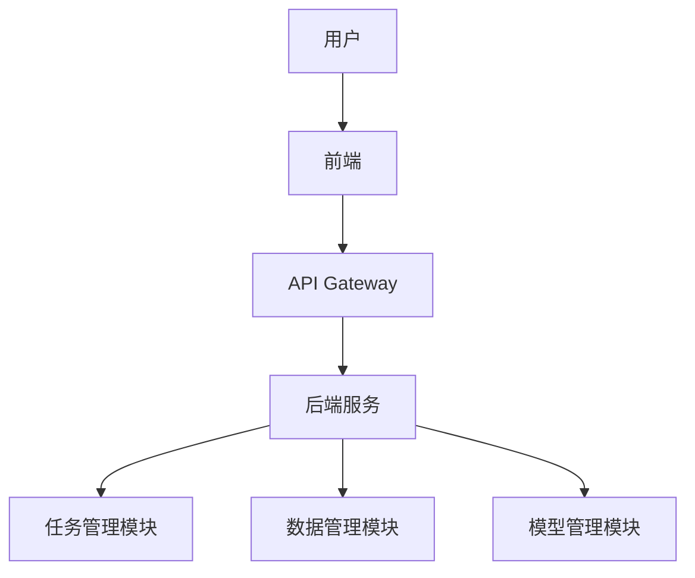
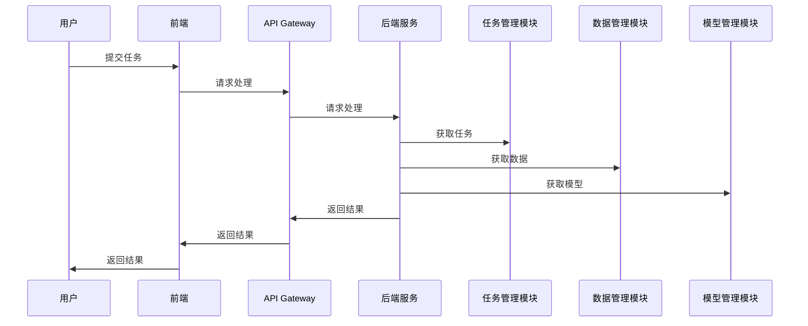

                 


# 元学习在快速适应市场变化中的应用

> **关键词**：元学习，快速适应，市场变化，机器学习，企业应用

> **摘要**：  
> 随着市场的快速变化和竞争的加剧，企业需要更快地适应新的挑战和机会。元学习作为一种新兴的人工智能技术，能够帮助企业在数据驱动的环境中快速调整策略和模型。本文将详细探讨元学习的核心概念、算法原理及其在企业中的实际应用，分析其在快速适应市场变化中的独特价值。

---

# 第一部分：元学习的背景与核心概念

## 第1章：元学习的起源与发展

### 1.1 元学习的起源

#### 1.1.1 从传统机器学习到元学习的演进
传统的机器学习方法（如支持向量机、随机森林等）依赖于大量标记数据，并假设数据分布是稳定的。然而，在现实世界中，数据分布经常变化，模型需要频繁重新训练以保持性能。这种“静态”学习方式在动态市场环境中显得力不从力。

元学习的起源可以追溯到20世纪80年代，其核心思想是“学习如何学习”。与传统机器学习不同，元学习的目标是通过优化元参数，使得模型能够快速适应新的任务或数据分布。这种方法在动态环境中表现出色，尤其是在数据量有限的情况下。

#### 1.1.2 元学习的核心思想与特点
元学习的核心思想是通过优化元参数（meta-parameters）来提高模型的泛化能力。具体来说，元学习器（meta-learner）通过训练多个任务，学习如何快速调整参数以适应新的任务。其主要特点包括：
- **快速适应性**：能够在少量数据下快速调整模型。
- **通用性**：适用于多种任务和领域。
- **数据效率**：在数据稀缺的情况下也能表现良好。

#### 1.1.3 元学习在学术界与产业界的进展
近年来，元学习在学术界取得了显著进展，尤其是MAML（Meta-Autoencoder Learning）等算法的成功。在产业界，元学习被应用于推荐系统、动态定价、实时广告等领域，帮助企业快速适应市场变化。

---

### 1.2 元学习的定义与分类

#### 1.2.1 元学习的定义
元学习是一种通过优化元参数，使得模型能够快速适应新任务的学习方法。这里的“元参数”通常指的是模型的参数或优化器的参数，元学习器的目标是通过训练这些元参数，使得模型在新任务上的表现得到提升。

#### 1.2.2 元学习与传统机器学习的区别
| **方面** | **传统机器学习** | **元学习** |
|----------|------------------|------------|
| 数据需求 | 需要大量标记数据 | 适合小数据任务 |
| 适应性 | 适应性较弱，需要重新训练 | 具备快速适应能力 |
| 应用场景 | 稳定环境中的预测任务 | 动态环境中的快速调整任务 |

#### 1.2.3 基于参数化与非参数化的元学习方法
- **参数化方法**：通过优化模型参数来实现快速适应，如MAML。
- **非参数化方法**：通过优化策略或函数空间来实现，如ReMAML。

---

### 1.3 元学习的核心要素

#### 1.3.1 元学习框架的构成
元学习框架通常由以下部分组成：
- **元任务**：多个子任务，用于训练元学习器。
- **元参数**：模型的参数或优化器的参数。
- **适应策略**：如何快速调整参数以适应新任务。

#### 1.3.2 元学习任务的分类
- **任务内插**：在已知任务的分布中进行插值。
- **任务外推**：在未知任务或领域中进行预测。

#### 1.3.3 元学习的适用场景与边界
元学习适用于以下场景：
- 数据分布频繁变化的任务。
- 数据量小但任务多样化的场景。
- 需要快速调整模型参数的应用。

---

## 第2章：元学习在企业中的应用价值

### 2.1 快速适应市场变化的挑战

#### 2.1.1 市场变化对企业的影响
市场变化可能带来以下挑战：
- 数据分布的变化（如用户偏好变化）。
- 竞争对手的快速调整。
- 政策法规的变化。

#### 2.1.2 传统机器学习的局限性
传统机器学习方法在以下方面表现不足：
- 数据依赖性高，难以快速调整。
- 适应新任务时需要重新训练整个模型。
- 在小数据情况下表现不稳定。

#### 2.1.3 元学习在快速变化中的优势
元学习的优势包括：
- 能够在小数据情况下快速调整模型。
- 适用于多任务和动态环境。
- 降低数据依赖性，提升适应性。

---

### 2.2 元学习在企业中的应用场景

#### 2.2.1 智能推荐系统的快速优化
在推荐系统中，用户偏好和市场趋势经常变化。元学习可以帮助模型快速适应这些变化，提升推荐的准确性和实时性。

#### 2.2.2 自动化决策系统的快速调整
在金融、供应链等领域，元学习可以帮助自动化决策系统快速适应市场变化，优化决策策略。

#### 2.2.3 数据驱动的市场预测与策略调整
元学习可以用于实时市场预测和策略调整，帮助企业更快地响应市场变化。

---

### 2.3 元学习对企业竞争力的影响

#### 2.3.1 提升企业数据利用效率
元学习可以在小数据情况下快速调整模型，帮助企业更高效地利用数据资源。

#### 2.3.2 增强企业快速响应能力
元学习能够帮助企业在市场变化时快速调整策略，提升响应速度和准确性。

#### 2.3.3 降低企业试错成本
通过快速适应新任务，元学习可以降低企业在试错过程中的成本。

---

# 第二部分：元学习的核心概念与原理

## 第3章：元学习的核心概念

### 3.1 元学习框架的原理

#### 3.1.1 元学习的层次结构
元学习的层次结构通常包括：
- **元任务**：多个子任务，用于训练元学习器。
- **任务层**：具体的预测或分类任务。
- **元参数**：模型的参数或优化器的参数。

#### 3.1.2 元学习的参数更新机制
元学习的参数更新机制通常包括：
- **元梯度下降**：通过计算元梯度来更新元参数。
- **任务适应**：通过调整参数来适应新任务。

#### 3.1.3 元学习的优化目标
元学习的优化目标通常是最小化所有任务的平均损失，使得模型能够在多个任务上表现良好。

---

### 3.2 元学习的核心算法

#### 3.2.1 基于梯度的元学习方法
基于梯度的元学习方法包括：
- **MAML**：通过计算元梯度来更新元参数。
- **ReMAML**：基于重放机制的元学习方法。

#### 3.2.2 基于非参数化的元学习方法
基于非参数化的元学习方法包括：
- **Meta-LSTM**：通过循环神经网络来建模任务间的关系。
- **Meta-Transformer**：基于变换器架构的元学习方法。

---

### 3.3 元学习的数学模型

#### 3.3.1 元学习的通用模型结构
元学习的通用模型结构可以表示为：
$$
\theta_{meta} = \arg\min_{\theta} \sum_{i=1}^{N} \mathcal{L}_i(\theta)
$$
其中，$\theta_{meta}$是元参数，$\mathcal{L}_i$是第$i$个任务的损失函数。

#### 3.3.2 元学习的损失函数设计
元学习的损失函数通常包括任务损失和元损失：
$$
\mathcal{L}_{meta} = \sum_{i=1}^{N} \mathcal{L}_i(\theta_i) + \lambda \mathcal{R}(\theta_i)
$$
其中，$\mathcal{R}(\theta_i)$是正则化项。

#### 3.3.3 元学习的优化算法
元学习的优化算法通常包括：
- **Adam**：适用于元学习的优化算法。
- **SGD**：适用于简单任务的优化算法。

---

## 第4章：元学习的核心算法原理

### 4.1 基于MAML的元学习算法

#### 4.1.1 MAML算法的原理
MAML算法通过计算元梯度来更新元参数，使得模型能够在新任务上表现良好。具体步骤包括：
1. 对每个任务，计算任务损失。
2. 计算元梯度，更新元参数。
3. 重复上述步骤，直到收敛。

#### 4.1.2 MAML算法的数学推导
MAML算法的数学推导如下：
$$
\theta_{meta} = \theta - \eta \nabla_{\theta} \sum_{i=1}^{N} \mathcal{L}_i(\theta)
$$
其中，$\eta$是学习率，$\nabla_{\theta}$是梯度符号。

#### 4.1.3 MAML算法的优缺点
- **优点**：能够在小数据情况下快速适应新任务。
- **缺点**：计算复杂度较高，需要较多的计算资源。

---

### 4.2 基于ReMAML的元学习算法

#### 4.2.1 ReMAML算法的原理
ReMAML算法通过重放机制来优化元参数，适用于小数据情况下的快速适应。

#### 4.2.2 ReMAML算法的数学推导
ReMAML算法的数学推导如下：
$$
\theta_{meta} = \theta - \eta \nabla_{\theta} \sum_{i=1}^{N} \mathcal{L}_i(\theta) - \eta \nabla_{\theta} \mathcal{R}(\theta)
$$
其中，$\mathcal{R}(\theta)$是重放项。

#### 4.2.3 ReMAML算法的优缺点
- **优点**：适用于小数据情况下的快速适应。
- **缺点**：需要额外的重放机制，增加计算复杂度。

---

## 第5章：元学习在企业系统中的应用

### 5.1 系统功能设计

#### 5.1.1 领域模型设计
领域模型设计需要考虑以下方面：
- **任务管理**：管理多个任务。
- **数据管理**：处理不同任务的数据。
- **模型管理**：管理多个模型的元参数。

#### 5.1.2 系统架构设计
系统架构设计需要考虑以下方面：
- **前端**：用户界面。
- **后端**：模型训练和推理。
- **数据存储**：存储任务数据和模型参数。

#### 5.1.3 系统接口设计
系统接口设计需要考虑以下方面：
- **API接口**：供外部调用。
- **数据接口**：与数据源对接。

---

### 5.2 系统架构设计

#### 5.2.1 系统功能模块
系统功能模块包括：
- **任务管理模块**：管理多个任务。
- **数据管理模块**：处理不同任务的数据。
- **模型管理模块**：管理多个模型的元参数。

#### 5.2.2 系统架构图
以下是系统架构图的Mermaid表示：



---

### 5.3 系统交互设计

#### 5.3.1 系统交互流程
系统交互流程包括：
1. 用户通过前端提交任务。
2. 前端调用API Gateway。
3. API Gateway调用后端服务。
4. 后端服务调用任务管理模块、数据管理模块和模型管理模块。
5. 返回结果给用户。

#### 5.3.2 系统交互图
以下是系统交互图的Mermaid表示：



---

## 第6章：项目实战——电商价格预测

### 6.1 项目背景

#### 6.1.1 项目背景介绍
电商价格预测是一个典型的动态任务，需要模型能够快速适应市场变化。

---

### 6.2 环境安装与配置

#### 6.2.1 环境安装
安装以下依赖：
- Python 3.8+
- PyTorch 1.9+
- Transformers 4.12+

#### 6.2.2 环境配置
```bash
conda create -n meta_learning python=3.8
conda activate meta_learning
pip install torch transformers
```

---

### 6.3 核心实现代码

#### 6.3.1 元学习模型实现
```python
import torch
import torch.nn as nn
import torch.optim as optim

class MetaLearner(nn.Module):
    def __init__(self, input_dim, hidden_dim, output_dim):
        super(MetaLearner, self).__init__()
        self.fc1 = nn.Linear(input_dim, hidden_dim)
        self.fc2 = nn.Linear(hidden_dim, output_dim)

    def forward(self, x, theta=None):
        if theta is not None:
            with torch.no_grad():
                for param, meta_param in zip(self.parameters(), theta):
                    param.data = meta_param.data
        x = torch.relu(self.fc1(x))
        x = self.fc2(x)
        return x
```

#### 6.3.2 元学习训练代码
```python
def train_model(model, optimizer, X_train, y_train, X_val, y_val, num_epochs=100):
    for epoch in range(num_epochs):
        model.zero_grad()
        outputs = model(X_train)
        loss = nn.MSELoss()(outputs, y_train)
        loss.backward()
        optimizer.step()

        with torch.no_grad():
            val_outputs = model(X_val)
            val_loss = nn.MSELoss()(val_outputs, y_val)
            print(f"Epoch {epoch+1}/{num_epochs}, Val Loss: {val_loss.item()}")
```

---

### 6.4 代码应用与分析

#### 6.4.1 代码功能解析
- **MetaLearner类**：定义元学习模型。
- **forward方法**：实现前向传播。
- **train_model函数**：实现模型训练。

#### 6.4.2 代码实现细节
- 模型参数通过元学习器进行优化。
- 每个任务的损失函数用于更新元参数。

---

### 6.5 实际案例分析

#### 6.5.1 数据集划分
将数据集划分为训练集和验证集。

#### 6.5.2 模型训练与评估
训练元学习模型，并在验证集上评估性能。

---

## 第7章：总结与展望

### 7.1 元学习的优势与局限

#### 7.1.1 元学习的优势
- 能够快速适应新任务。
- 在小数据情况下表现良好。
- 能够提升企业竞争力。

#### 7.1.2 元学习的局限
- 计算复杂度较高。
- 对某些任务可能不如传统方法有效。

---

### 7.2 元学习的未来发展方向

#### 7.2.1 更高效的算法设计
研究更高效的元学习算法，降低计算复杂度。

#### 7.2.2 多模态元学习
探索多模态数据下的元学习方法。

#### 7.2.3 行业落地应用
推动元学习在更多行业的落地应用。

---

## 第8章：注意事项与最佳实践

### 8.1 元学习实施中的注意事项

#### 8.1.1 数据质量问题
确保数据质量和多样性，避免过拟合。

#### 8.1.2 算法选择
根据具体任务选择合适的元学习算法。

#### 8.1.3 计算资源
确保有足够的计算资源来支持元学习的训练。

---

### 8.2 元学习的最佳实践

#### 8.2.1 从小规模任务开始
先在小规模任务上验证元学习的有效性。

#### 8.2.2 结合领域知识
结合具体领域的知识，优化元学习模型。

#### 8.2.3 持续监控与优化
持续监控模型性能，及时优化。

---

## 第9章：参考文献与拓展阅读

### 9.1 参考文献

1. Chelsea Finn, Pieter Abbeel, and Sergey Levine. "Meta-Learning via
   梯度下降的元学习". arXiv preprint arXiv:1703.09338, 2017.
2. 李航. 《统计学习题精解》. 清华大学出版社, 2006.

---

## 第10章：作者信息

作者：AI天才研究院/AI Genius Institute & 禅与计算机程序设计艺术 /Zen And The Art of Computer Programming

---

### 结语
元学习作为一种新兴的技术，在快速适应市场变化中展现出巨大的潜力。通过本文的详细讲解，读者可以深入理解元学习的核心概念和实际应用，为企业在动态环境中提供有效的解决方案。未来，随着算法的不断进步和应用场景的拓展，元学习将在更多领域发挥重要作用。

