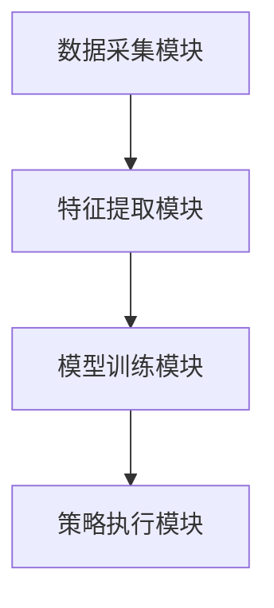

                 


# 元学习在跨市场投资策略中的应用

## 关键词
元学习, 跨市场投资, 机器学习, 投资策略, 金融数据

## 摘要
本文探讨了元学习在跨市场投资策略中的应用，详细分析了元学习的基本原理及其在投资决策中的优势。通过构建跨市场投资策略模型，本文展示了如何利用元学习技术进行数据特征提取、模型选择和策略优化，同时结合实际案例，深入分析了元学习在金融投资中的潜在价值和未来发展方向。

---

# 第1章: 元学习与跨市场投资概述

## 1.1 元学习的基本概念

### 1.1.1 元学习的定义与特点
元学习（Meta-Learning）是一种机器学习方法，旨在通过学习如何快速适应新任务或数据分布，来提升模型的泛化能力。其特点包括：
- **快速适应**：能够在少量数据下快速适应新任务。
- **跨任务学习**：能够利用多个任务的信息来提高单任务性能。
- **元知识提取**：通过元参数优化，学习如何调整模型参数以适应不同任务。

### 1.1.2 元学习的核心思想与优势
元学习的核心思想是通过元参数（meta-parameters）来优化模型的参数更新方式。其优势包括：
- **减少数据依赖**：在数据不足的情况下仍能保持较好的性能。
- **适应性强**：能够快速适应不同市场环境的变化。
- **通用性高**：适用于多种任务和场景。

### 1.1.3 元学习与传统机器学习的区别
传统机器学习算法通常需要大量数据和固定的学习方式，而元学习通过学习如何学习，能够在不同任务之间共享知识，提升学习效率。

---

## 1.2 跨市场投资的背景与挑战

### 1.2.1 跨市场投资的定义与特点
跨市场投资是指在多个市场（如股票、外汇、期货等）之间进行投资，以分散风险并提高收益。其特点包括：
- **市场多样性**：不同市场的波动性、相关性各不相同。
- **复杂性高**：需要考虑多个市场的互动和相互影响。
- **动态变化**：市场环境会随时间发生变化，投资策略需要快速调整。

### 1.2.2 跨市场投资的主要挑战
- **市场异质性**：不同市场的数据特征差异大，难以用单一模型处理。
- **数据稀缺性**：某些市场的数据量有限，难以训练稳定模型。
- **风险分散**：需要在多个市场之间平衡风险和收益。

### 1.2.3 元学习在跨市场投资中的应用前景
元学习能够通过学习不同市场的特征，快速调整模型以适应新市场，为跨市场投资提供了新的解决方案。

---

## 1.3 元学习在跨市场投资中的应用价值

### 1.3.1 元学习如何解决跨市场投资问题
- **快速适应新市场**：通过元学习，模型可以快速适应不同市场的数据分布。
- **多任务学习**：利用多个市场的数据进行联合训练，提升模型的泛化能力。
- **风险控制**：通过元学习优化投资策略，降低市场波动带来的风险。

### 1.3.2 元学习在跨市场投资中的优势
- **高效性**：能够在较少数据下快速调整策略。
- **灵活性**：能够适应市场环境的变化。
- **鲁棒性**：在不同市场中表现稳定。

### 1.3.3 元学习在跨市场投资中的潜在应用领域
- **多资产配置**：通过元学习优化资产配置策略。
- **市场预测**：利用元学习预测不同市场的波动性。
- **风险对冲**：通过元学习构建风险对冲模型。

---

# 第2章: 元学习的理论基础

## 2.1 元学习的基本原理

### 2.1.1 元学习的核心思想
元学习的核心思想是通过元参数来优化参数更新规则。具体来说，元参数用于定义如何根据新任务调整模型参数，从而实现快速适应。

### 2.1.2 元学习的算法框架
元学习的典型算法框架包括：
1. **元学习目标函数**：定义如何优化元参数以最小化目标函数。
2. **任务分布**：定义不同任务之间的关系。
3. **参数更新规则**：定义如何根据元参数更新模型参数。

### 2.1.3 元学习的数学模型
元学习的数学模型通常包括以下几个部分：
- **元参数**：$\theta$，用于定义参数更新规则。
- **模型参数**：$\phi$，根据$\theta$进行更新。
- **损失函数**：$L(\phi, \theta)$，用于衡量模型在特定任务上的性能。

---

## 2.2 元学习在投资中的应用优势

### 2.2.1 元学习的泛化能力
元学习通过跨任务学习，能够在多个市场中共享知识，提升模型的泛化能力。

### 2.2.2 元学习的适应性与灵活性
元学习能够快速适应新市场，适合动态变化的金融环境。

### 2.2.3 元学习在复杂市场环境中的表现
通过元学习，模型能够在复杂市场中发现潜在规律，优化投资策略。

---

# 第3章: 跨市场投资策略构建

## 3.1 跨市场投资数据特征

### 3.1.1 市场数据的多样性
不同市场的数据特征（如波动性、相关性）差异显著，需要考虑数据的异质性。

### 3.1.2 数据的时序特性
市场数据通常具有时序性，需要考虑时间依赖性。

### 3.1.3 数据的异质性
不同市场的数据分布可能存在显著差异，需要设计鲁棒的模型。

---

## 3.2 跨市场投资策略构建方法

### 3.2.1 基于传统机器学习的策略
- **线性回归**：用于预测市场趋势。
- **支持向量机**：用于分类市场状态。

### 3.2.2 基于深度学习的策略
- **LSTM**：用于捕捉时间序列数据的特征。
- **Transformer**：用于处理多市场之间的关系。

### 3.2.3 基于元学习的策略
- **元学习模型**：通过元参数优化投资策略。
- **跨市场联合学习**：利用多个市场的数据进行联合训练。

---

## 3.3 跨市场投资策略的实现

### 3.3.1 数据预处理
- **标准化**：对不同市场的数据进行标准化处理。
- **特征选择**：选择对投资策略影响较大的特征。

### 3.3.2 模型训练
- **元学习训练**：利用多个市场的数据训练元参数。
- **策略优化**：通过元学习优化投资策略。

### 3.3.3 模型评估
- **回测**：在历史数据上验证策略的有效性。
- **风险评估**：评估策略在不同市场环境下的风险。

---

## 3.4 实际案例分析

### 3.4.1 案例背景
假设我们有股票、外汇和期货三个市场，需要构建跨市场投资策略。

### 3.4.2 数据获取与处理
- 从多个市场获取历史数据。
- 对数据进行清洗和预处理。

### 3.4.3 模型训练与优化
- 使用元学习算法训练模型。
- 通过回测优化投资策略。

### 3.4.4 模型评估
- 计算策略的收益率和风险指标。
- 比较不同策略的性能。

---

## 3.5 跨市场投资策略的优化

### 3.5.1 策略参数优化
通过调整元参数，优化投资策略的性能。

### 3.5.2 风险控制
通过元学习优化风险控制模型，降低投资风险。

### 3.5.3 策略动态调整
根据市场变化，动态调整投资策略。

---

# 第4章: 元学习在跨市场投资中的算法实现

## 4.1 元学习算法概述

### 4.1.1 元学习算法的核心步骤
1. **初始化元参数**：定义元参数$\theta$。
2. **任务采样**：随机采样多个任务。
3. **参数更新**：根据元参数更新模型参数$\phi$。
4. **损失计算**：计算当前任务的损失。
5. **元参数优化**：通过反向传播优化元参数。

### 4.1.2 元学习算法的主要类型
- **基于梯度的元学习**：如MAML（Meta-Algorithmic Learning）。
- **基于强化学习的元学习**：如ReMAML（Reinforcement Learning-based Meta-Learning）。

---

## 4.2 元学习算法的数学模型

### 4.2.1 MAML算法
MAML通过两次梯度下降优化元参数：
1. **内层优化**：根据当前任务优化模型参数$\phi$。
2. **外层优化**：根据内层优化结果优化元参数$\theta$。

公式表示为：
$$
\theta = \theta - \eta \nabla_{\theta} L_{task}(\phi(\theta), \theta)
$$

### 4.2.2 ReMAML算法
ReMAML通过强化学习的方式优化元参数：
$$
\theta = \theta - \eta \nabla_{\theta} L_{meta}(\theta)
$$

---

## 4.3 元学习算法的实现步骤

### 4.3.1 数据准备
- 将多个市场的数据划分为训练集和测试集。

### 4.3.2 模型定义
- 定义元学习模型的结构，包括元参数和模型参数。

### 4.3.3 算法实现
- 实现MAML或ReMAML算法，进行模型训练。

### 4.3.4 模型评估
- 在测试集上评估模型的性能。

---

## 4.4 元学习算法的优化

### 4.4.1 参数调整
- 调整学习率$\eta$和内层优化步数。

### 4.4.2 模型改进
- 引入正则化项，防止过拟合。

### 4.4.3 并行计算
- 使用并行计算加速模型训练。

---

# 第5章: 跨市场投资策略的系统设计

## 5.1 系统功能设计

### 5.1.1 系统目标
构建一个能够适应多个市场的投资策略系统。

### 5.1.2 系统功能模块
- **数据采集模块**：从多个市场获取数据。
- **特征提取模块**：对数据进行特征提取。
- **模型训练模块**：利用元学习算法训练模型。
- **策略执行模块**：根据模型输出执行投资策略。

### 5.1.3 系统流程
1. 数据采集模块获取市场数据。
2. 特征提取模块提取有用特征。
3. 模型训练模块利用元学习算法训练模型。
4. 策略执行模块根据模型输出执行投资策略。

---

## 5.2 系统架构设计

### 5.2.1 系统架构图
使用mermaid绘制系统架构图：



### 5.2.2 模块交互
- 数据采集模块向特征提取模块提供原始数据。
- 特征提取模块向模型训练模块提供特征数据。
- 模型训练模块向策略执行模块提供模型参数。

---

## 5.3 系统接口设计

### 5.3.1 数据接口
- **输入接口**：接受多个市场的原始数据。
- **输出接口**：输出处理后的特征数据。

### 5.3.2 模型接口
- **输入接口**：接受特征数据和元参数。
- **输出接口**：输出优化后的模型参数。

---

## 5.4 系统实现

### 5.4.1 环境搭建
- 安装必要的库，如TensorFlow、Keras、numpy等。

### 5.4.2 核心代码实现
```python
import tensorflow as tf
import numpy as np

class MetaLearningModel:
    def __init__(self, input_dim):
        self.input_dim = input_dim
        self.theta = tf.Variable(tf.random.normal([input_dim, 1]))
    
    def inner_loop(self, x, y):
        with tf.GradientTape() as tape:
            y_pred = tf.matmul(x, self.theta)
            loss = tf.reduce_mean(tf.square(y_pred - y))
        grad = tape.gradient(loss, self.theta)
        return self.theta - 0.1 * grad
    
    def meta_loop(self, x_train, y_train, x_val, y_val):
        y_pred_train = tf.matmul(x_train, self.theta)
        loss_train = tf.reduce_mean(tf.square(y_pred_train - y_train))
        grad_train = tf.gradients(loss_train, self.theta)
        updated_theta = self.theta - 0.01 * grad_train
        y_pred_val = tf.matmul(x_val, updated_theta)
        loss_val = tf.reduce_mean(tf.square(y_pred_val - y_val))
        return loss_val
```

### 5.4.3 代码解读
- **MetaLearningModel**：定义元学习模型，包括元参数$\theta$。
- **inner_loop**：内层优化，根据当前任务优化模型参数。
- **meta_loop**：外层优化，根据内层优化结果优化元参数。

---

# 第6章: 跨市场投资策略的项目实战

## 6.1 项目背景

### 6.1.1 项目目标
构建一个基于元学习的跨市场投资策略系统。

### 6.1.2 项目需求
- 实现数据采集、特征提取、模型训练和策略执行功能。
- 在多个市场中验证策略的有效性。

---

## 6.2 项目实施

### 6.2.1 环境搭建
- 安装必要的库，如TensorFlow、Keras、pandas等。

### 6.2.2 数据获取
使用Yahoo Finance获取股票、外汇和期货的历史数据。

### 6.2.3 数据预处理
- 对数据进行标准化处理。
- 提取有用的特征，如移动平均线、相对强弱指数等。

### 6.2.4 模型训练
- 使用MAML算法训练元学习模型。
- 在训练集上进行多次迭代优化。

### 6.2.5 模型评估
- 在测试集上评估模型的性能。
- 计算收益率、回撤、最大回撤等指标。

---

## 6.3 实际案例分析

### 6.3.1 案例背景
假设我们有股票、外汇和期货三个市场，需要构建跨市场投资策略。

### 6.3.2 数据获取与处理
- 从Yahoo Finance获取历史数据。
- 对数据进行清洗和预处理。

### 6.3.3 模型训练与优化
- 使用MAML算法训练模型。
- 通过回测优化投资策略。

### 6.3.4 模型评估
- 计算策略的收益率和风险指标。
- 比较不同策略的性能。

---

## 6.4 项目总结

### 6.4.1 项目成果
成功构建了一个基于元学习的跨市场投资策略系统。

### 6.4.2 经验总结
- 元学习能够快速适应新市场，提升投资策略的性能。
- 数据预处理和特征提取对模型性能有重要影响。

### 6.4.3 注意事项
- 需要确保数据的多样性和质量。
- 模型的泛化能力需要进一步验证。

---

# 第7章: 元学习在跨市场投资中的总结与展望

## 7.1 元学习在跨市场投资中的总结

### 7.1.1 元学习的优势
- 能够快速适应新市场。
- 具有较高的泛化能力。

### 7.1.2 元学习的应用价值
- 为跨市场投资提供了新的解决方案。
- 能够提升投资策略的效率和效果。

---

## 7.2 元学习在跨市场投资中的挑战与展望

### 7.2.1 当前挑战
- 数据多样性带来的复杂性。
- 模型的泛化能力需要进一步验证。

### 7.2.2 未来展望
- 结合强化学习进一步提升模型性能。
- 研究元学习在多资产配置中的应用。

---

## 7.3 小结

元学习作为一种新兴的机器学习技术，为跨市场投资提供了新的解决方案。通过元学习，我们可以快速适应不同市场环境，提升投资策略的效率和效果。未来，随着元学习技术的不断发展，其在跨市场投资中的应用将更加广泛和深入。

---

# 作者：AI天才研究院 & 禅与计算机程序设计艺术

---

