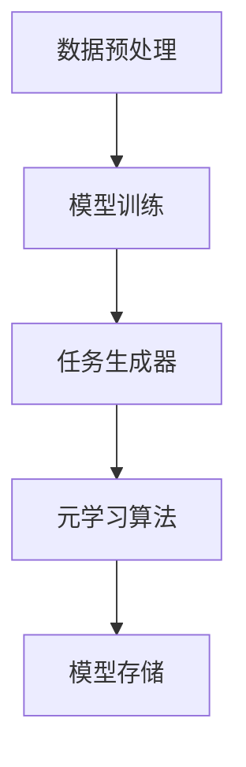

                 


# 元学习框架：构建快速适应的AI Agent

**关键词：** 元学习框架、AI Agent、快速适应、Meta-Learning、深度学习

**摘要：**  
在人工智能领域，快速适应新任务的能力是构建高效AI Agent的核心需求。元学习（Meta-Learning）作为一种新兴的技术，通过让模型在训练过程中“学习如何学习”，能够在有限的数据和时间内快速适应新任务。本文将从背景、原理、算法、系统架构和实战案例等多个维度，全面探讨元学习框架在构建快速适应的AI Agent中的应用，帮助读者深入了解其技术细节和实际价值。

---

# 目录

1. [元学习框架与AI Agent背景介绍](#元学习框架与ai-agent背景介绍)
2. [元学习的核心原理](#元学习的核心原理)
3. [典型元学习算法原理与实现](#典型元学习算法原理与实现)
4. [元学习框架的系统分析与架构设计](#元学习框架的系统分析与架构设计)
5. [元学习框架项目实战](#元学习框架项目实战)
6. [总结与展望](#总结与展望)

---

## 第一部分: 元学习框架与AI Agent背景介绍

### 第1章: 元学习与AI Agent概述

#### 1.1 元学习的基本概念

##### 1.1.1 元学习的定义与背景
元学习（Meta-Learning）是一种机器学习技术，旨在让模型能够通过“学习如何学习”来快速适应新任务。传统机器学习需要大量标注数据和长时间训练，而元学习的目标是通过少量样本或经验，快速调整模型参数以适应新任务。元学习的背景源于现实场景中数据获取的高成本和任务多样化的挑战。

##### 1.1.2 元学习与传统机器学习的区别
- **数据需求：** 传统机器学习需要大量标注数据，而元学习通过学习元数据（如任务分布）实现快速适应。
- **任务多样性：** 元学习适用于多任务或零样本任务，而传统机器学习通常针对单一任务。
- **学习目标：** 元学习的目标是“学习如何学习”，而传统学习是直接从数据中学习任务。

##### 1.1.3 元学习的核心目标与应用场景
- **核心目标：** 快速适应新任务，减少数据需求，提高模型的泛化能力。
- **应用场景：** 多任务学习、零样本学习、领域适应、在线学习等。

#### 1.2 AI Agent的基本概念

##### 1.2.1 AI Agent的定义与分类
AI Agent（人工智能代理）是指能够感知环境、执行任务并做出决策的智能实体。根据功能和应用场景，AI Agent可以分为：
- **简单反射型：** 基于规则的简单响应。
- **基于模型的反射型：** 基于内部模型做出决策。
- **目标驱动型：** 以目标为导向，主动规划行动。
- **效用驱动型：** 基于效用函数优化决策。

##### 1.2.2 AI Agent的核心功能与特点
- **感知能力：** 通过传感器或接口获取环境信息。
- **决策能力：** 基于感知信息做出行动决策。
- **学习能力：** 通过学习提升任务执行效率。
- **自适应能力：** 能够根据环境变化调整行为。

##### 1.2.3 AI Agent在不同领域的应用实例
- **自动驾驶：** 环境感知和路径规划。
- **智能助手：** 通过对话交互帮助用户完成任务。
- **机器人：** 在工业或服务场景中执行复杂任务。

#### 1.3 元学习与AI Agent的关系

##### 1.3.1 元学习如何赋能AI Agent
元学习通过让AI Agent具备快速学习新任务的能力，显著提升了其在动态环境中的适应性。例如，在自动驾驶中，元学习可以让AI Agent快速适应新的道路规则或天气条件。

##### 1.3.2 元学习在AI Agent中的具体应用
- **多任务学习：** 同一AI Agent在多个任务间切换。
- **零样本学习：** 在新任务上直接部署，无需额外训练。
- **在线学习：** 在线环境中实时更新模型参数。

##### 1.3.3 元学习与AI Agent结合的优势
- **快速部署：** 减少新任务的训练时间。
- **高效决策：** 在复杂环境中快速调整策略。
- **降低数据成本：** 减少对大量标注数据的依赖。

#### 1.4 本章小结
本章介绍了元学习的基本概念、AI Agent的核心功能及其应用场景，并探讨了元学习如何赋能AI Agent。通过结合元学习，AI Agent能够更快地适应新任务，显著提升了其在实际应用中的价值。

---

## 第二部分: 元学习的核心原理

### 第2章: 元学习的核心原理

#### 2.1 元学习的原理与算法框架

##### 2.1.1 元学习的核心思想
元学习的核心思想是让模型学会“如何从经验中学习”。通过在元训练阶段（Meta-Training）学习多个任务，模型能够快速适应新任务（Meta-Test）。

##### 2.1.2 元学习的算法框架
元学习的典型流程包括：
1. **元训练阶段：** 在多个任务上训练模型，提取任务间的共同特征。
2. **元测试阶段：** 在新任务上微调模型参数，快速适应。

##### 2.1.3 元学习的核心要素
- **元任务：** 元学习的训练目标，通常涉及多个子任务。
- **元模型：** 负责学习如何从任务中快速调整参数。
- **任务生成器：** 生成多样化的任务以训练元模型。

#### 2.2 元学习的核心概念与联系

##### 2.2.1 元学习的核心概念
- **元训练：** 在多个任务上预训练模型，使其具备快速适应新任务的能力。
- **元测试：** 在新任务上进行微调或直接应用。

##### 2.2.2 元学习与传统机器学习的对比
| 特性         | 传统机器学习               | 元学习                   |
|--------------|---------------------------|--------------------------|
| 数据需求     | 高                         | 低                       |
| 任务适应性   | 单任务                     | 多任务                   |
| 学习目标     | 直接学习任务               | 学习如何快速学习任务     |

##### 2.2.3 元学习与迁移学习的关系
- **迁移学习：** 利用已有任务的数据或特征，提升新任务的性能。
- **元学习：** 在迁移学习的基础上，进一步优化模型的快速适应能力。

#### 2.3 元学习的关键属性

##### 2.3.1 快速适应性
元学习的核心目标是快速适应新任务，这需要模型具备强大的参数调整能力。

##### 2.3.2 任务多样性
元学习适用于多个任务，模型需要在这些任务间找到共同特征。

##### 2.3.3 可扩展性
元学习框架通常具备较高的扩展性，能够轻松添加新任务。

---

## 第三部分: 典型元学习算法原理与实现

### 第3章: 典型元学习算法原理与实现

#### 3.1 元学习算法概述

##### 3.1.1 元学习算法的分类
- **基于梯度的元学习：** 如MAML（Meta-Automatic Learning）。
- **基于优化器的元学习：** 如Meta-SGD。

##### 3.1.2 各种元学习算法的优缺点
| 算法         | 优点                           | 缺点                           |
|--------------|--------------------------------|--------------------------------|
| MAML         | 能够直接优化模型参数           | 计算成本较高                   |
| Meta-SGD     | 计算效率高                     | 参数更新可能不够精确           |

#### 3.2 MAML算法原理与实现

##### 3.2.1 MAML算法的工作流程
1. **元训练阶段：** 在多个任务上预训练模型，计算梯度并更新参数。
2. **元测试阶段：** 在新任务上进行一次梯度下降，快速适应。

##### 3.2.2 MAML的数学模型
$$ \text{MAML的目标是优化} \theta \text{，使得} \forall t \in T, \arg\min_{\theta} \mathbb{E}_{t \sim T}[\mathcal{L}(f_\theta(x_t), y_t)] $$

##### 3.2.3 MAML算法的实现代码
```python
import torch

class MetaLearner:
    def __init__(self, model, optimizer):
        self.model = model
        self.optimizer = optimizer

    def meta_train(self, tasks):
        for task in tasks:
            # 内部梯度下降
            self.optimizer.zero_grad()
            loss = task.loss()
            loss.backward()
            # 外部梯度下降
            self.optimizer.step()
```

#### 3.3 其他典型元学习算法

##### 3.3.1 ReMAML算法
ReMAML通过引入重放机制，提升模型在小样本任务上的表现。

##### 3.3.2 Meta-SGD算法
Meta-SGD通过优化器的参数更新策略，实现快速适应新任务。

---

## 第四部分: 元学习框架的系统分析与架构设计

### 第4章: 元学习框架的系统分析与架构设计

#### 4.1 元学习框架的系统架构

##### 4.1.1 系统功能模块
- **数据预处理模块：** 负责数据的清洗和格式转换。
- **模型训练模块：** 实现元训练和微调。
- **任务生成器：** 生成多样化的任务供模型训练。

##### 4.1.2 系统架构图


#### 4.2 元学习框架的实现细节

##### 4.2.1 数据预处理模块
- 数据清洗：去除噪声数据。
- 数据增强：提升模型的泛化能力。

##### 4.2.2 模型训练模块
- 元训练：在多个任务上预训练模型。
- 微调：在新任务上进行参数调整。

##### 4.2.3 任务生成器
- 任务定义：定义任务的具体形式和目标。
- 任务生成：生成多样化的任务供模型训练。

---

## 第五部分: 元学习框架项目实战

### 第5章: 元学习框架项目实战

#### 5.1 环境安装与配置

##### 5.1.1 环境需求
- Python 3.6+
- PyTorch 1.0+

##### 5.1.2 安装依赖
```bash
pip install torch matplotlib numpy
```

#### 5.2 项目核心实现

##### 5.2.1 数据加载与处理
```python
def load_data(task):
    # 数据加载逻辑
    pass
```

##### 5.2.2 模型定义
```python
class MetaModel(torch.nn.Module):
    def __init__(self):
        super().__init__()
        # 模型结构定义
```

##### 5.2.3 任务生成与训练
```python
def train_model(tasks, model):
    # 训练逻辑
    pass
```

#### 5.3 项目运行与结果分析

##### 5.3.1 运行脚本
```bash
python main.py
```

##### 5.3.2 结果分析
- 模型在新任务上的准确率提升情况。
- 训练时间与传统方法的对比。

#### 5.4 项目小结

---

## 第六部分: 总结与展望

### 第6章: 总结与展望

#### 6.1 全文总结
元学习通过快速适应新任务的能力，显著提升了AI Agent在复杂环境中的表现。本文从背景、原理、算法、系统架构和实战案例等多个维度，全面探讨了元学习框架的应用。

#### 6.2 未来展望
未来，元学习将在以下方向进一步发展：
- 更高效的元学习算法。
- 更广泛的领域应用。
- 更低的计算成本。

#### 6.3 最佳实践 Tips
- 在实际应用中，选择合适的元学习算法。
- 确保数据的多样性和代表性。
- 定期更新模型以适应环境变化。

---

**作者：AI天才研究院/AI Genius Institute & 禅与计算机程序设计艺术 /Zen And The Art of Computer Programming**

---

以上是《元学习框架：构建快速适应的AI Agent》的技术博客文章的完整目录和内容框架。根据实际需求，可以进一步扩展每一章的具体内容，添加更多详细的技术细节和实际案例。

