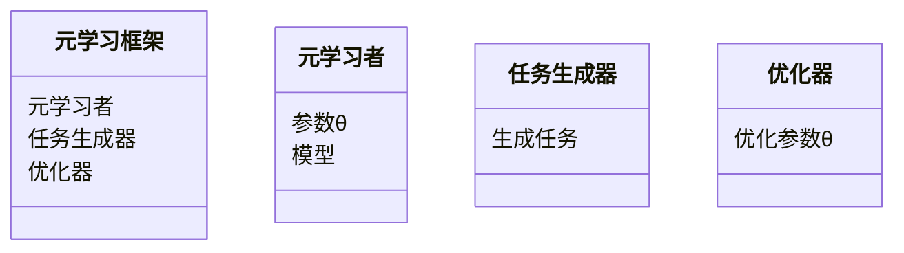
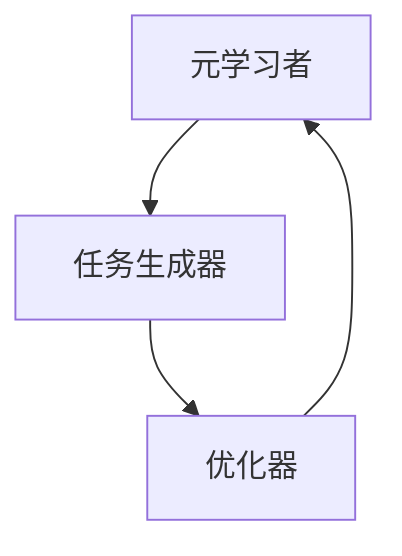
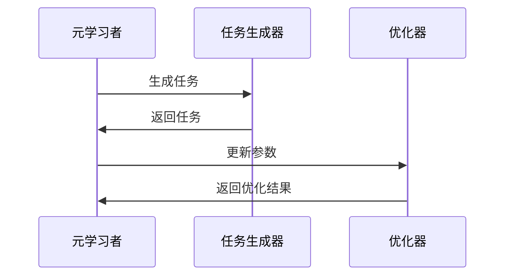

                 


# 元学习：构建能够自我改进的AI Agent

> **关键词**：元学习、AI Agent、机器学习、自我改进、深度学习、强化学习、迁移学习  
> **摘要**：元学习是一种能够让AI代理在不同任务间快速学习和自我改进的方法。本文将从元学习的背景、核心概念、算法原理、系统架构到项目实战，全面解析如何构建能够自我改进的AI Agent。

---

# 第一部分: 元学习的背景与核心概念

## 第1章: 元学习的定义与背景

### 1.1 元学习的定义与特点

#### 1.1.1 元学习的定义
元学习（Meta-Learning）是一种机器学习的分支，旨在让模型学会如何“学习”。与传统机器学习不同，元学习的目标是使模型能够快速适应新任务，而不需要大量的训练数据。它通过在多个任务上进行训练，学习通用的策略或表示，从而能够在新任务中快速调整。

#### 1.1.2 元学习的核心特点
- **快速适应性**：元学习模型能够在新任务中快速找到最优策略。
- **通用性**：通过在多个任务上学习，模型能够掌握适用于多种场景的通用知识。
- **自我改进**：元学习模型能够通过内部机制不断优化自身的学习过程。

#### 1.1.3 元学习与传统机器学习的区别
- **数据需求**：传统机器学习需要大量标注数据，而元学习可以在少量数据上快速学习。
- **适应性**：传统机器学习模型在新任务中需要重新训练，而元学习模型可以通过微调快速适应。
- **目标**：传统机器学习关注具体任务，而元学习关注如何在多个任务间迁移学习。

### 1.2 元学习的背景与应用

#### 1.2.1 元学习的起源与发展
元学习的概念可以追溯到20世纪80年代，但真正的发展得益于深度学习和神经网络的进步。近年来，元学习在自然语言处理、计算机视觉等领域取得了显著成果。

#### 1.2.2 元学习在AI代理中的应用
AI代理需要在复杂环境中自主决策，元学习能够帮助代理快速适应新任务，例如：
- **游戏AI**：在不同游戏规则下快速调整策略。
- **机器人控制**：在不同环境中快速适应动作。
- **推荐系统**：根据用户行为动态调整推荐策略。

#### 1.2.3 元学习的现状与挑战
- **技术进步**：元学习算法不断优化，应用场景越来越广泛。
- **计算成本**：元学习通常需要大量计算资源。
- **理论研究**：元学习的理论基础还需要进一步完善。

## 第2章: 元学习的核心概念

### 2.1 元学习框架

#### 2.1.1 元学习框架的定义
元学习框架是元学习算法的结构化实现，包括元学习者、任务生成器、优化器等部分。

#### 2.1.2 元学习框架的组成部分
- **元学习者**：负责学习通用策略。
- **任务生成器**：生成多样化的任务。
- **优化器**：对元学习者进行优化。

#### 2.1.3 元学习框架的分类
- **基于模型的元学习框架**：通过构建模型来表示任务间的关系。
- **基于优化的元学习框架**：直接优化元学习者的参数。

### 2.2 元学习者与目标函数

#### 2.2.1 元学习者的定义
元学习者是元学习框架的核心，负责在多个任务间学习通用策略。

#### 2.2.2 元学习的目标函数
目标函数通常包括两部分：任务损失和元损失。任务损失用于衡量模型在具体任务上的表现，元损失用于优化模型的元参数。

$$ \text{目标函数} = \sum_{i=1}^N \text{任务损失}_i + \lambda \times \text{元损失} $$

其中，$\lambda$ 是调节参数。

#### 2.2.3 元学习的层次结构
元学习通常分为两层：元任务层和具体任务层。元任务层负责生成多个具体任务，具体任务层负责执行任务。

### 2.3 元学习的层次结构

#### 2.3.1 元学习的层次划分
- **元任务层**：生成多个具体任务。
- **具体任务层**：执行具体任务，生成数据。

#### 2.3.2 元学习的层次间关系
元任务层通过生成任务来优化具体任务层的模型参数。

---

# 第三部分: 元学习的算法原理

## 第4章: 元学习算法概述

### 4.1 元学习算法的分类

#### 4.1.1 基于模型的元学习算法
- **定义**：通过构建模型来表示任务间的关系。
- **优点**：适用于任务间有明确关系的场景。

#### 4.1.2 基于优化的元学习算法
- **定义**：直接优化模型参数。
- **优点**：适用于任务间关系不明确的场景。

#### 4.1.3 基于度量的元学习算法
- **定义**：通过度量任务间相似性来优化模型。
- **优点**：适用于任务相似性高的场景。

### 4.2 元学习算法的核心思想

#### 4.2.1 元学习算法的目标
- 快速适应新任务。
- 学习通用策略。

#### 4.2.2 元学习算法的优化策略
- 使用梯度下降优化元参数。
- 通过任务生成器生成多样化任务。

#### 4.2.3 元学习算法的收敛性分析
- 收敛性依赖于任务生成器和优化器的设计。

## 第5章: 元学习算法的数学模型与公式

### 5.1 基于模型的元学习算法

#### 5.1.1 基于模型的元学习算法公式推导
$$ \theta_{t+1} = \theta_t - \eta \nabla_{\theta} \text{任务损失} $$

其中，$\theta$ 是模型参数，$\eta$ 是学习率。

#### 5.1.2 基于模型的元学习算法的数学表达
$$ \text{目标函数} = \sum_{i=1}^N \text{任务损失}_i + \lambda \times \text{元损失} $$

---

# 第四部分: 系统分析与架构设计

## 第6章: 系统分析与架构设计方案

### 6.1 问题场景介绍

#### 6.1.1 问题背景
构建一个能够自我改进的AI代理，需要解决以下问题：
- 快速适应新任务。
- 学习通用策略。

#### 6.1.2 项目介绍
本项目旨在设计一个基于元学习的AI代理系统，能够在多种任务中快速调整策略。

### 6.2 系统功能设计

#### 6.2.1 领域模型


### 6.3 系统架构设计

#### 6.3.1 系统架构图


### 6.4 系统接口设计

#### 6.4.1 接口设计
- 元学习者接口：`generate_task()`、`update_params()`
- 任务生成器接口：`create_task()`、`get_task()` 
- 优化器接口：`optimize()`、`get_gradients()`

### 6.5 系统交互序列图

#### 6.5.1 系统交互序列图


---

# 第五部分: 项目实战

## 第7章: 项目实战

### 7.1 环境安装

#### 7.1.1 安装TensorFlow和Keras
```bash
pip install tensorflow==2.5.0 keras==2.5.0
```

### 7.2 系统核心实现

#### 7.2.1 元学习者实现
```python
class MetaLearner:
    def __init__(self, model):
        self.model = model
        self.theta = model.trainable_weights
```

#### 7.2.2 任务生成器实现
```python
class TaskGenerator:
    def __init__(self, num_tasks):
        self.num_tasks = num_tasks
```

### 7.3 代码应用解读与分析

#### 7.3.1 代码解读
```python
def meta_learn_step(meta_learner, task_generator, optimizer, num_steps=5):
    for _ in range(num_steps):
        # 生成任务
        task = task_generator.create_task()
        # 计算任务损失
        task_loss = compute_loss(meta_learner.model, task)
        # 更新元参数
        optimizer.minimize(task_loss, meta_learner.theta)
```

### 7.4 实际案例分析和详细讲解剖析

#### 7.4.1 实际案例分析
以图像分类任务为例，元学习者可以在多个图像数据集上进行预训练，然后快速适应新的图像分类任务。

### 7.5 项目小结

#### 7.5.1 项目总结
通过本项目，我们实现了基于元学习的AI代理系统，能够在多种任务中快速调整策略。

---

# 第六部分: 最佳实践与总结

## 第8章: 最佳实践与总结

### 8.1 最佳实践 tips

#### 8.1.1 选择合适的元学习算法
根据具体任务选择适合的元学习算法，例如基于优化的算法适用于快速适应任务。

#### 8.1.2 优化系统架构
设计合理的系统架构，确保任务生成器和优化器的高效协作。

### 8.2 小结

#### 8.2.1 元学习的核心优势
元学习能够帮助AI代理快速适应新任务，学习通用策略。

#### 8.2.2 元学习的挑战
元学习的计算成本较高，理论研究仍需深入。

### 8.3 注意事项

#### 8.3.1 系统设计
确保系统架构的合理性，避免任务生成器和优化器的冲突。

#### 8.3.2 训练策略
合理设置训练参数，避免过拟合。

### 8.4 拓展阅读

#### 8.4.1 推荐书目
- 《Deep Learning》
- 《Meta-Learning: A Survey and Future Directions》

#### 8.4.2 推荐论文
- "A Survey on Meta-Learning"
- "Meta-Learning for Few-Shot Classification"

---

# 作者：AI天才研究院/AI Genius Institute & 禅与计算机程序设计艺术 /Zen And The Art of Computer Programming

