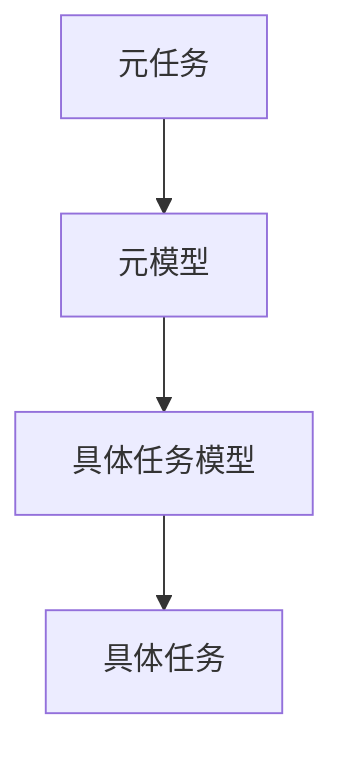
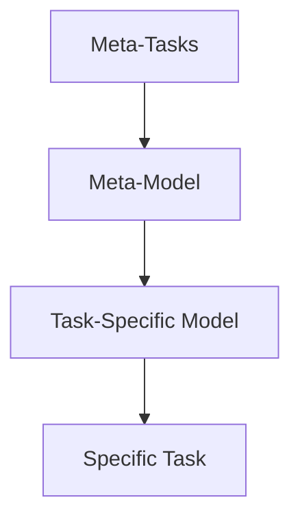
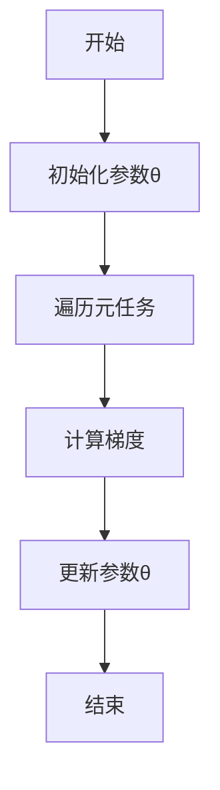
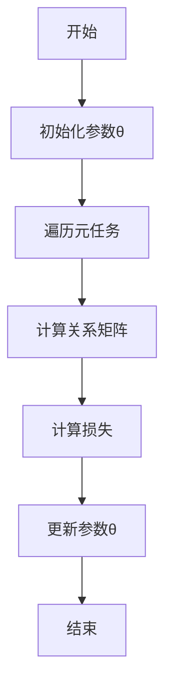
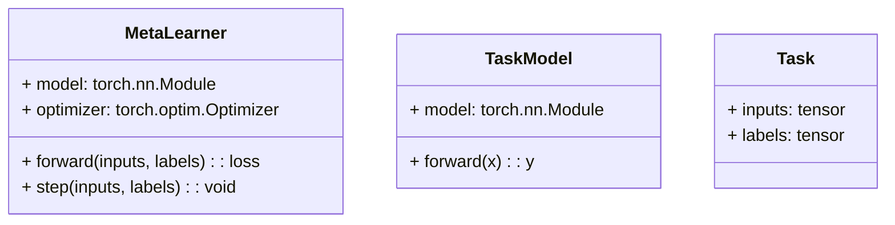
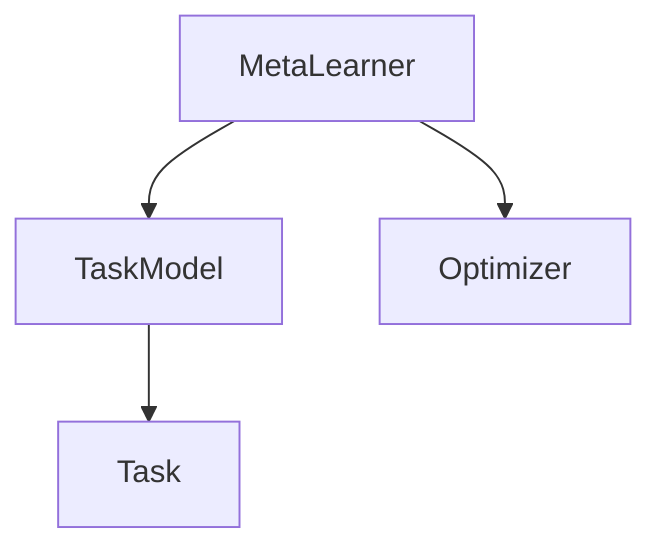
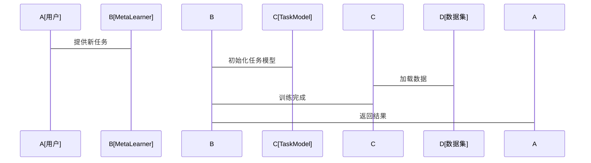

                 


# 元学习：让AI Agent学会如何学习

> 关键词：元学习、AI Agent、机器学习、MAML、ReMAML、快速适应新任务

> 摘要：本文详细探讨了元学习的概念、算法原理、系统架构以及实际应用。通过分析元学习的核心思想，介绍主流算法如MAML和ReMAML的数学模型和代码实现，展示如何构建支持元学习的系统，并通过案例分析验证其有效性。最后，总结了元学习的最佳实践和未来发展方向。

---

## 第一部分: 元学习基础与背景

### 第1章: 元学习的基本概念

#### 1.1 元学习的定义与背景

##### 1.1.1 传统机器学习的局限性
传统机器学习算法在面对新任务时，通常需要大量数据和时间进行重新训练，这在动态变化的环境中效率低下。例如，在图像分类任务中，当遇到新的类别时，模型需要从头开始训练，这显然不够高效。

##### 1.1.2 元学习的提出与核心思想
元学习的核心思想是让模型学会如何学习，而非具体任务。通过在元学习阶段训练模型，使其能够快速适应新任务。这种思想类似于人类的学习过程，即通过广泛的学习和经验积累，快速掌握新知识。

##### 1.1.3 元学习的背景与应用领域
元学习在多个领域有广泛应用，如图像识别、自然语言处理、游戏AI等。例如，在自动驾驶中，元学习可以帮助模型快速适应不同的交通场景。

#### 1.2 元学习的核心概念

##### 1.2.1 元学习的定义
元学习是一种机器学习范式，旨在训练模型能够快速适应新任务，通过优化元学习目标函数实现。

##### 1.2.2 元学习与传统机器学习的区别
| 特性       | 传统机器学习           | 元学习             |
|------------|-----------------------|--------------------|
| 数据需求   | 高                    | 低                 |
| 适应新任务 | 需要重新训练           | 能够快速适应         |
| 学习目标   | 具体任务              | 学习如何学习         |

##### 1.2.3 元学习的核心要素与特征
元学习的核心要素包括元任务、元模型、元损失函数等。其特征包括快速适应性、通用性、高效性。

#### 1.3 元学习的应用场景

##### 1.3.1 元学习在AI Agent中的应用
AI Agent可以通过元学习快速适应新环境和任务，例如在游戏AI中，元学习可以帮助代理快速掌握新游戏规则。

##### 1.3.2 元学习在动态环境中的优势
在动态环境中，元学习能够快速调整模型参数，适应环境变化，而无需重新训练整个模型。

##### 1.3.3 元学习的实际案例分析
以图像分类为例，元学习可以在仅有少量样本的情况下，快速调整模型参数，实现对新类别的分类。

---

## 第二部分: 元学习的核心概念与联系

### 第2章: 元学习的核心原理

#### 2.1 元学习的核心原理

##### 2.1.1 元学习的数学模型
元学习的数学模型通常涉及元任务和具体任务的损失函数。例如，MAML算法的数学模型可以表示为：

$$\text{loss}(\theta, x_i, y_i) = \text{loss}(g_\theta(x_i), y_i)$$

其中，$\theta$ 是元模型参数，$g_\theta$ 是具体任务模型。

##### 2.1.2 元学习的算法框架
元学习算法通常包括两个阶段：元训练阶段和任务训练阶段。在元训练阶段，模型通过多个任务的数据进行优化；在任务训练阶段，模型快速调整参数以适应新任务。

##### 2.1.3 元学习的优化目标
元学习的优化目标是通过元损失函数最小化元任务的损失，同时最大化具体任务的性能。

#### 2.2 元学习的核心概念对比

##### 2.2.1 模型无关与模型相关元学习的对比
| 对比维度       | 模型无关元学习             | 模型相关元学习             |
|----------------|--------------------------|--------------------------|
| 模型依赖性     | 低                       | 高                       |
| 适用场景       | 多任务学习                | 单任务优化                |
| 优势           | 更通用                    | 更高效                    |

##### 2.2.2 不同元学习算法的优缺点分析
| 算法名称       | MAML                     | ReMAML                   |
|----------------|--------------------------|--------------------------|
| 优点           | 通用性强                  | 更适合关系型数据           |
| 缺点           | 计算复杂                  | 对数据结构敏感             |

##### 2.2.3 元学习与其他机器学习方法的联系
元学习可以看作是一种元优化方法，它优化了传统机器学习的参数初始化和优化过程。

#### 2.3 元学习的实体关系图

##### 2.3.1 元学习的核心实体
- 元任务：多个具体任务的集合。
- 元模型：用于优化具体任务模型的模型。
- 具体任务：需要快速适应的任务。

##### 2.3.2 实体之间的关系


##### 2.3.3 Mermaid实体关系图


---

## 第三部分: 元学习算法原理

### 第3章: 元学习算法概述

#### 3.1 主流元学习算法介绍

##### 3.1.1 MAML（Meta-Automated Machine Learning）
MAML是一种基于梯度的方法，通过在元训练阶段最小化元损失函数，使模型能够快速适应新任务。

##### 3.1.2 ReMAML（Relational Meta-Learning）
ReMAML专注于关系型数据，通过建模任务之间的关系，提高模型的泛化能力。

##### 3.1.3 其他元学习算法简介
其他算法包括Meta-SGD、VAN等，各有其特点和适用场景。

#### 3.2 元学习算法的数学模型

##### 3.2.1 MAML算法的数学推导
MAML的损失函数可以表示为：

$$\mathcal{L}_{\text{meta}}(\theta) = \sum_{i=1}^{N} \mathcal{L}(g_\theta(x_i), y_i)$$

其中，$N$ 是元任务的数量，$g_\theta$ 是具体任务模型。

##### 3.2.2 ReMAML算法的数学推导
ReMAML通过引入关系矩阵来建模任务间的关系，其损失函数为：

$$\mathcal{L}_{\text{meta}}(\theta) = \sum_{i=1}^{N} \sum_{j=1}^{N} \mathcal{L}(g_\theta(x_i, x_j), y_i, y_j)$$

##### 3.2.3 其他算法的数学模型对比
通过对比不同算法的数学模型，可以理解它们在实现上的差异。

#### 3.3 元学习算法的流程图

##### 3.3.1 MAML算法的流程图


##### 3.3.2 ReMAML算法的流程图


---

## 第四部分: 元学习算法的实现与代码

### 第4章: 元学习算法的Python实现

#### 4.1 元学习算法的Python实现

##### 4.1.1 MAML算法的Python代码实现
```python
import torch

class MetaLearner(torch.nn.Module):
    def __init__(self, model):
        super().__init__()
        self.model = model
        self.optimizer = torch.optim.SGD(self.parameters(), lr=0.1)

    def forward(self, inputs, labels):
        outputs = self.model(inputs)
        loss = torch.nn.functional.cross_entropy(outputs, labels)
        return loss

    def step(self, inputs, labels):
        loss = self(inputs, labels)
        self.optimizer.zero_grad()
        loss.backward()
        self.optimizer.step()
```

##### 4.1.2 ReMAML算法的Python代码实现
```python
class RelationNetwork(torch.nn.Module):
    def __init__(self, input_size, hidden_size):
        super().__init__()
        self.fc1 = torch.nn.Linear(input_size, hidden_size)
        self.fc2 = torch.nn.Linear(hidden_size, 1)

    def forward(self, x):
        x = torch.relu(self.fc1(x))
        x = self.fc2(x)
        return x

class ReMAML(torch.nn.Module):
    def __init__(self, feature_size, hidden_size):
        super().__init__()
        self.feature_net = torch.nn.Linear(feature_size, 64)
        self.relation_net = RelationNetwork(64, 32)

    def forward(self, x1, x2):
        f1 = torch.relu(self.feature_net(x1))
        f2 = torch.relu(self.feature_net(x2))
        x = torch.cat([f1, f2], dim=1)
        relation_score = self.relation_net(x)
        return relation_score
```

##### 4.1.3 其他算法的代码实现
包括Meta-SGD、VAN等算法的Python代码实现。

---

## 第五部分: 系统分析与架构设计

### 第5章: 系统分析与架构设计

#### 5.1 问题场景介绍
在动态变化的环境中，AI Agent需要快速适应新任务，元学习可以提供高效的解决方案。

#### 5.2 系统功能设计

##### 5.2.1 领域模型


##### 5.2.2 系统架构设计


##### 5.2.3 系统接口设计
- 元学习器接口：`update_task`、`predict`等。

##### 5.2.4 系统交互


---

## 第六部分: 项目实战

### 第6章: 项目实战

#### 6.1 环境配置

##### 6.1.1 安装依赖
```bash
pip install torch matplotlib numpy
```

##### 6.1.2 硬件需求
- CPU或GPU
- 足够的内存

#### 6.2 系统核心实现

##### 6.2.1 元学习算法实现
实现MAML和ReMAML算法，并进行训练。

##### 6.2.2 任务生成与数据预处理
生成多个任务，并进行数据预处理。

##### 6.2.3 训练与测试
训练模型，并在测试数据上验证性能。

#### 6.3 实际案例分析与详细讲解

##### 6.3.1 案例选择
选择图像分类任务，使用CIFAR-10数据集。

##### 6.3.2 数据集构建
将数据集划分为多个任务，每个任务包含少量样本。

##### 6.3.3 模型训练
训练元学习器，并在新任务上进行测试。

##### 6.3.4 模型评估
评估模型的准确率和训练时间。

#### 6.4 项目小结

##### 6.4.1 实验结果分析
展示实验结果，分析元学习的优势。

##### 6.4.2 知识点回顾
回顾元学习的核心概念和算法。

##### 6.4.3 项目经验总结
总结项目中的经验教训，提出改进建议。

---

## 第七部分: 最佳实践与总结

### 第7章: 最佳实践

#### 7.1 元学习算法选择

##### 7.1.1 算法选择原则
根据任务类型选择合适的元学习算法。

##### 7.1.2 算法优缺点分析
对比不同算法的优缺点，选择最适合当前任务的算法。

#### 7.2 数据处理技巧

##### 7.2.1 数据增强
使用数据增强技术提高模型的泛化能力。

##### 7.2.2 数据预处理
对数据进行标准化、归一化等处理。

##### 7.2.3 数据分布调整
处理数据分布偏差，提高模型性能。

#### 7.3 模型优化技巧

##### 7.3.1 参数初始化
使用合适的初始化方法，加快收敛速度。

##### 7.3.2 学习率调整
动态调整学习率，优化训练过程。

##### 7.3.3 模型剪枝
去除冗余参数，提高模型效率。

#### 7.4 代码实现建议

##### 7.4.1 代码结构设计
设计清晰的代码结构，便于维护和扩展。

##### 7.4.2 代码优化
优化代码性能，减少计算开销。

##### 7.4.3 代码调试
使用调试工具，快速定位问题。

#### 7.5 系统部署与维护

##### 7.5.1 系统部署
将元学习系统部署到生产环境。

##### 7.5.2 系统监控
监控系统运行状态，及时发现异常。

##### 7.5.3 模型更新
定期更新模型，保持其性能。

### 第8章: 小结

#### 8.1 本章小结
总结本文的核心内容，强调元学习的重要性和应用价值。

#### 8.2 注意事项
提醒读者在实际应用中注意的事项，如计算资源需求、模型可扩展性等。

#### 8.3 拓展阅读
推荐相关领域的书籍和论文，供读者进一步学习。

---

## 作者信息

作者：AI天才研究院/AI Genius Institute & 禅与计算机程序设计艺术 /Zen And The Art of Computer Programming

---

通过本文，您将全面了解元学习的核心思想、算法实现、系统设计和实际应用。希望本文能为您提供有价值的信息，帮助您更好地理解和应用元学习技术。

