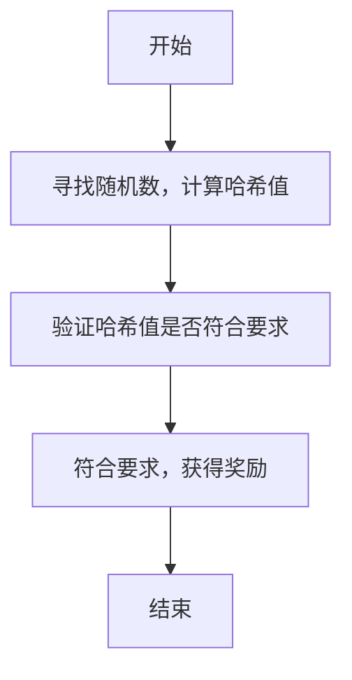
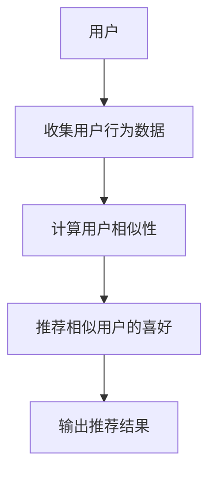
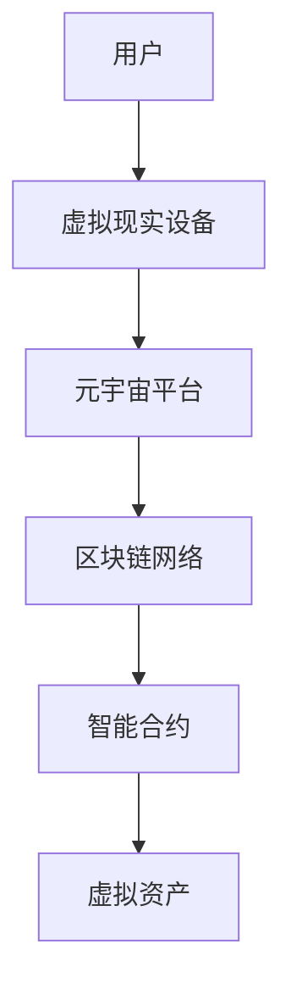
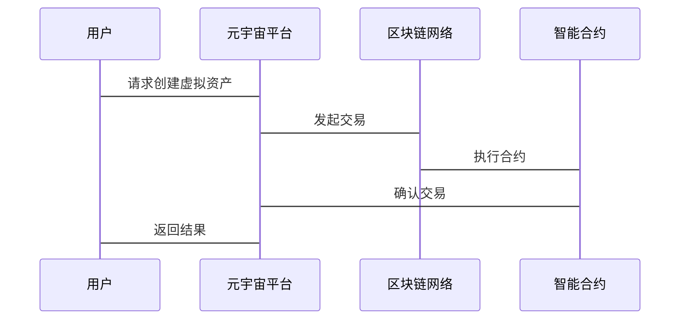

                 


# 元宇宙概念：虚拟经济的投资前景

## 关键词：元宇宙、虚拟经济、区块链、人工智能、虚拟资产、投资前景

## 摘要：元宇宙作为新兴的技术概念，正在迅速改变虚拟经济的格局。本文将深入探讨元宇宙的核心概念、技术基础、经济系统以及投资机会，分析其在虚拟经济中的潜力和挑战，为投资者提供有深度的见解和建议。

---

## 第一部分：元宇宙的概念与虚拟经济的背景介绍

### 第1章：元宇宙的概念与起源

#### 1.1 元宇宙的定义与背景

##### 1.1.1 从虚拟现实到元宇宙的演进
元宇宙（Metaverse）是一个整合虚拟现实（VR）、增强现实（AR）、区块链、人工智能（AI）等技术的虚拟空间。它不仅是一个虚拟世界，更是一个去中心化的、可扩展的、高度互动的数字生态系统。元宇宙的起源可以追溯到1992年 Neal Stephenson 的小说《雪崩》（Snow Crash），书中描述了一个通过虚拟现实技术连接的平行世界。

##### 1.1.2 元宇宙的核心概念与问题背景
元宇宙的核心在于通过技术手段构建一个虚拟的三维空间，用户可以通过虚拟化身在这个空间中进行社交、娱乐、工作和投资等活动。与传统的虚拟世界不同，元宇宙强调去中心化、沉浸式体验和高度的互动性。

##### 1.1.3 元宇宙的起源与技术基础
元宇宙的起源不仅限于文学作品，还包括计算机科学、互联网技术和虚拟现实的发展。随着区块链技术的成熟和人工智能的进步，元宇宙的概念逐渐从理论走向实践。

#### 1.2 元宇宙的现状与发展趋势

##### 1.2.1 当前元宇宙的主要应用场景
目前，元宇宙主要应用于游戏、社交、教育和虚拟资产交易等领域。例如，游戏《Roblox》和《Decentraland》已经初步实现了元宇宙的某些特征。

##### 1.2.2 元宇宙技术的演进方向
元宇宙的未来发展将朝着更沉浸式、更去中心化和更智能化的方向发展。虚拟现实技术的进步、区块链的扩展性和人工智能的深度学习能力将是推动元宇宙发展的关键因素。

##### 1.2.3 元宇宙与虚拟经济的结合
元宇宙为虚拟经济提供了新的平台和机会。用户可以在元宇宙中购买、持有和交易虚拟资产，这些资产具有一定的经济价值。

#### 1.3 元宇宙的核心概念与问题描述

##### 1.3.1 虚拟经济在元宇宙中的角色
虚拟经济是元宇宙的重要组成部分。用户通过购买虚拟土地、数字艺术品、虚拟货币等资产，可以在元宇宙中获得经济收益。

##### 1.3.2 元宇宙中的虚拟资产与交易
虚拟资产包括虚拟货币、数字艺术品、虚拟土地等。这些资产可以在元宇宙的虚拟市场上进行交易，形成一个完整的经济系统。

##### 1.3.3 元宇宙经济系统的边界与外延
元宇宙的经济系统不仅限于虚拟世界，还可以与实体经济产生互动。例如，用户可以通过元宇宙中的虚拟资产获得现实世界中的经济收益。

## 第二部分：元宇宙的核心概念与联系

### 第2章：元宇宙的核心概念与原理

#### 2.1 元宇宙的构成要素

##### 2.1.1 虚拟现实技术
虚拟现实技术是元宇宙的基础，它为用户提供了沉浸式的虚拟体验。

##### 2.1.2 区块链技术
区块链技术确保了元宇宙中的虚拟资产的安全性和去中心化特性。

##### 2.1.3 人工智能技术
人工智能技术为元宇宙提供了智能化的服务和决策支持。

##### 2.1.4 虚拟经济系统
虚拟经济系统是元宇宙的核心，它包括虚拟货币、虚拟资产和虚拟市场。

#### 2.2 元宇宙核心概念的属性特征对比

##### 2.2.1 虚拟现实与增强现实的对比
| 特性         | 虚拟现实（VR）            | 增强现实（AR）            |
|--------------|--------------------------|--------------------------|
| 定义         | 完全虚拟的数字环境        | 在现实环境中叠加虚拟元素  |
| 应用场景     | 游戏、教育培训            | 商业、医疗                |
| 技术基础     | 头戴式显示器、传感器      | 摄像头、传感器            |

##### 2.2.2 区块链与传统数据库的对比
| 特性         | 区块链                   | 传统数据库               |
|--------------|--------------------------|--------------------------|
| 数据存储     | 分布式存储               | 集中式存储               |
| 数据安全性   | 高安全性，防篡改          | 较低安全性                |
| 可扩展性     | 较高                     | 较低                     |

##### 2.2.3 人工智能与传统算法的对比
| 特性         | 人工智能算法             | 传统算法                 |
|--------------|--------------------------|--------------------------|
| 数据需求     | 需要大量数据             | 数据需求较低             |
| 智能性       | 具有学习和自适应能力      | 缺乏学习能力              |
| 应用场景     | 机器学习、自然语言处理    | 简单的数据处理            |

##### 2.2.4 虚拟经济与实体经济的对比
| 特性         | 虚拟经济                 | 实体经济                 |
|--------------|--------------------------|--------------------------|
| 资产形式     | 虚拟货币、数字艺术品      | 实体货币、实物资产        |
| 交易场所     | 虚拟市场                 | 实体市场                 |
| 资产价值     | 由市场供需决定            | 由实际价值决定            |

#### 2.3 元宇宙核心概念的ER实体关系图

```mermaid
erDiagram
    actor 用户 {
        <属性> 用户ID : integer
        <属性> 用户名 : string
        <属性> 虚拟资产 : 资产表
    }
    actor 智能合约 {
        <属性> 合约地址 : string
        <属性> 合约代码 : string
        <属性> 资产转移 : 资产转移表
    }
    actor 虚拟资产 {
        <属性> 资产ID : integer
        <属性> 资产类型 : string
        <属性> 资产价值 : float
    }
    用户 --> 虚拟资产 : 拥有
    智能合约 --> 资产转移 : 执行
```

---

## 第三部分：算法原理讲解

### 第3章：支撑元宇宙的算法原理

#### 3.1 支撑元宇宙的关键算法

##### 3.1.1 区块链共识机制
区块链的共识机制（如PoW、PoS）确保了元宇宙中的虚拟资产的安全性和去中心化特性。以下是比特币的PoW算法流程：



##### 3.1.2 人工智能推荐算法
人工智能的推荐算法（如协同过滤）为用户提供了个性化的服务。以下是协同过滤算法的流程：



#### 3.2 区块链共识机制的数学模型

##### 3.2.1 工作量证明（PoW）模型
$$ H(m) = \text{哈希值} $$
$$ \text{满足} H(m) < \text{目标值} $$

##### 3.2.2 权益证明（PoS）模型
$$ \text{概率} = \frac{\text{质押的代币数}}{\text{总代币数}} $$

#### 3.3 人工智能推荐算法的数学模型

##### 3.3.1 协同过滤算法
$$ \text{相似度} = \frac{\sum_{i=1}^{n} (r_{ui} - \bar{r_u})(r_{vi} - \bar{r_v})}{\sqrt{\sum_{i=1}^{n} (r_{ui} - \bar{r_u})^2} \cdot \sqrt{\sum_{i=1}^{n} (r_{vi} - \bar{r_v})^2}} $$

##### 3.3.2 基于内容的推荐算法
$$ \text{相似度} = \frac{\sum_{i=1}^{n} w_i \cdot x_i \cdot y_i}{\sum_{i=1}^{n} w_i} $$

---

## 第四部分：数学模型与系统架构设计

### 第4章：元宇宙系统的数学模型与架构设计

#### 4.1 元宇宙系统的数学模型

##### 4.1.1 区块链中的哈希函数
$$ H(m) = \text{哈希值} $$

##### 4.1.2 共识机制中的概率模型
$$ P = \frac{\text{质押的代币数}}{\text{总代币数}} $$

#### 4.2 元宇宙系统的架构设计

##### 4.2.1 系统架构图


##### 4.2.2 系统交互流程图


---

## 第五部分：项目实战

### 第5章：基于元宇宙的虚拟经济项目实战

#### 5.1 项目背景与目标

##### 5.1.1 项目背景
本项目旨在开发一个基于元宇宙的虚拟经济系统，实现虚拟资产的创建、交易和管理。

##### 5.1.2 项目目标
- 实现虚拟资产的创建和管理
- 实现虚拟资产的交易功能
- 提供用户交互界面

#### 5.2 项目环境与工具

##### 5.2.1 环境安装
- 操作系统：Windows 10 或更高版本
- 区块链平台：Ethereum
- 开发工具：Visual Studio Code
- 智能合约语言：Solidity

#### 5.3 项目核心实现

##### 5.3.1 智能合约实现
```solidity
// SPDX-License-Identifier: MIT
pragma solidity ^0.8.0;

contract VirtualAsset {
    mapping(address => uint256) public balances;
    address public owner;

    constructor() {
        owner = msg.sender;
    }

    function transfer(address recipient, uint256 amount) external {
        require(balances[msg.sender] >= amount, "Insufficient balance");
        balances[msg.sender] -= amount;
        balances[recipient] += amount;
    }

    function balanceOf(address account) external view returns (uint256) {
        return balances[account];
    }
}
```

##### 5.3.2 交易实现
```python
def transfer(from_address, to_address, amount):
    if balances[from_address] < amount:
        return "Insufficient balance"
    balances[from_address] -= amount
    balances[to_address] += amount
    return "Transfer successful"
```

#### 5.4 项目小结
通过本项目的实战，我们掌握了元宇宙中虚拟资产的创建、交易和管理的基本方法，为后续的虚拟经济系统开发奠定了基础。

---

## 第六部分：最佳实践与总结

### 第6章：元宇宙虚拟经济的投资前景与注意事项

#### 6.1 投资机会与风险分析

##### 6.1.1 投资机会
- 虚拟资产的升值潜力
- 元宇宙技术的广泛应用

##### 6.1.2 投资风险
- 技术风险：技术不成熟可能导致系统崩溃
- 市场风险：虚拟资产价格波动大
- 法律风险：政策法规的不确定性

#### 6.2 投资策略与建议

##### 6.2.1 长期投资
- 投资者应关注元宇宙技术的长期发展，选择具有强大技术支撑的项目。

##### 6.2.2 分散投资
- 通过分散投资降低风险，避免将所有资金投入单一项目。

#### 6.3 本章小结
元宇宙的虚拟经济具有巨大的投资潜力，但投资者需要充分了解相关风险，制定合理的投资策略。

---

## 结语

元宇宙作为新兴的技术概念，正在迅速改变虚拟经济的格局。通过本文的分析，我们深入了解了元宇宙的核心概念、技术基础、经济系统以及投资机会。尽管元宇宙的虚拟经济存在一定的风险，但其潜力无疑是巨大的。未来，随着技术的不断进步，元宇宙的虚拟经济将更加成熟，为投资者带来更多的机会。

---

## 作者：AI天才研究院/AI Genius Institute & 禅与计算机程序设计艺术 /Zen And The Art of Computer Programming

