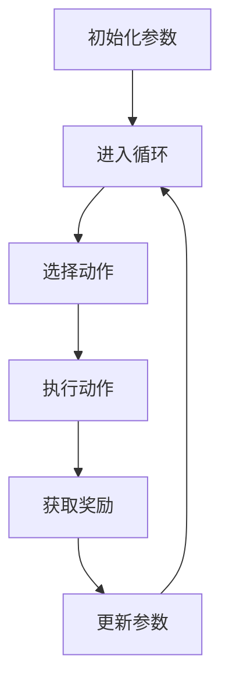
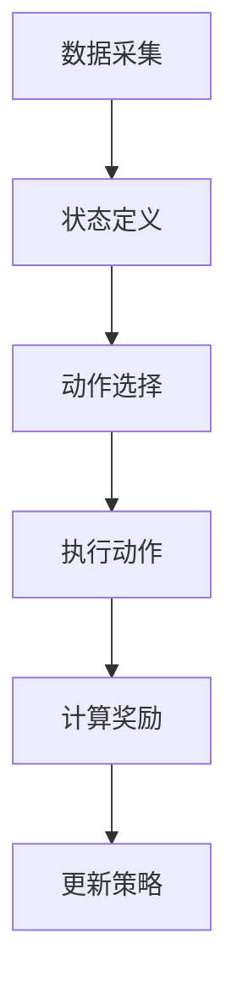

                 


# 元强化学习在投资策略适应性优化中的应用

## 关键词：
元强化学习, 投资策略优化, 算法实现, 系统设计, 实战案例

## 摘要：
本文探讨了元强化学习在投资策略适应性优化中的应用，详细介绍了元强化学习的基本概念、数学模型、算法实现、系统设计以及实际案例。通过结合投资策略优化的背景与挑战，分析了元强化学习的优势与应用场景，并通过具体代码实现与案例分析，展示了其在投资策略优化中的实际效果。本文还总结了元强化学习的核心概念与未来研究方向，为投资领域的技术研究提供了新的视角与方法。

---

## 第1章 元强化学习的背景与概述

### 1.1 元强化学习的起源与发展
元强化学习（Meta-Reinforcement Learning，Meta-RL）是一种新兴的人工智能技术，结合了强化学习（Reinforcement Learning，RL）和元学习（Meta-Learning）的核心思想。其起源可以追溯到20世纪90年代强化学习的快速发展期。随着深度学习的兴起，元学习的概念逐渐被引入强化学习领域，形成了元强化学习这一新的研究方向。

#### 1.1.1 强化学习的基本概念
强化学习是一种基于试错的机器学习方法，通过智能体与环境的交互，逐步优化策略以最大化累积奖励。强化学习的核心要素包括状态（State）、动作（Action）、奖励（Reward）和策略（Policy）。

#### 1.1.2 元强化学习的定义与特点
元强化学习是一种通过元学习框架优化强化学习过程的方法。其特点包括：
- **元学习能力**：能够在多个任务之间共享知识，快速适应新任务。
- **高效性**：通过元学习框架，减少对大量数据的依赖，提高学习效率。
- **灵活性**：适用于动态变化的环境，能够快速调整策略。

#### 1.1.3 元强化学习在投资中的应用潜力
投资领域具有高度的不确定性与动态变化的特点，传统的投资策略优化方法往往难以应对市场的快速变化。元强化学习通过其强大的元学习能力，能够在复杂的投资环境中快速适应，优化投资策略，提升收益。

---

### 1.2 投资策略优化的背景与挑战
#### 1.2.1 投资策略的基本概念
投资策略是指投资者在一定目标下，通过买入、卖出或持有资产的操作，以实现财富最大化的方法。常见的投资策略包括均值-方差优化、因子模型优化等。

#### 1.2.2 传统投资策略的局限性
传统投资策略在实际应用中面临以下挑战：
- **市场变化快**：传统策略往往需要频繁调整，难以应对市场的快速变化。
- **数据依赖性强**：传统策略依赖于大量的历史数据，且难以快速适应新数据。
- **计算复杂度高**：传统优化方法计算复杂，难以实时应用。

#### 1.2.3 投资策略适应性优化的必要性
为了应对市场的动态变化，投资策略需要具备更强的适应性，能够快速调整以应对新的市场环境。元强化学习通过其元学习能力，为投资策略的适应性优化提供了新的解决方案。

---

### 1.3 元强化学习与投资策略的结合
#### 1.3.1 元强化学习的核心思想
元强化学习的核心思想是通过元学习框架，优化强化学习过程，使得智能体能够在多个任务之间共享知识，并快速适应新任务。

#### 1.3.2 元强化学习在投资优化中的优势
- **快速适应性**：能够快速调整投资策略，应对市场变化。
- **高效性**：通过元学习框架，减少对大量数据的依赖。
- **灵活性**：适用于多种投资场景，如股票交易、资产配置等。

#### 1.3.3 元强化学习与传统优化方法的对比
| 对比维度          | 元强化学习              | 传统优化方法            |
|-------------------|------------------------|-------------------------|
| 数据依赖性        | 较低                   | 较高                    |
| 适应性            | 高                     | 低                      |
| 计算效率          | 高                     | 低                      |
| 灵活性            | 高                     | 低                      |

---

## 第2章 元强化学习的核心概念与原理

### 2.1 元强化学习的基本原理
#### 2.1.1 元强化学习的定义
元强化学习是一种结合了元学习与强化学习的框架，通过元学习算法优化强化学习过程，使得智能体能够在多个任务之间共享知识，并快速适应新任务。

#### 2.1.2 元强化学习的核心思想
元强化学习的核心思想是通过元学习框架，优化强化学习的训练过程，使得智能体能够快速掌握新任务。

#### 2.1.3 元强化学习与强化学习的区别
| 对比维度          | 元强化学习              | 强化学习                |
|-------------------|------------------------|-------------------------|
| 是否需要元任务    | 是                     | 否                      |
| 是否需要多任务    | 是                     | 否                      |
| 是否需要元学习    | 是                     | 否                      |

---

### 2.2 元强化学习的数学模型
#### 2.2.1 元强化学习的状态空间
状态空间（State Space）是描述环境状态的数学空间。在元强化学习中，状态空间通常包括当前任务的特征以及历史任务的信息。

#### 2.2.2 元强化学习的动作空间
动作空间（Action Space）是智能体可以执行的动作的集合。在元强化学习中，动作空间通常包括调整投资策略的参数。

#### 2.2.3 元强化学习的奖励函数
奖励函数（Reward Function）是智能体在执行动作后获得的奖励。在投资策略优化中，奖励函数通常定义为投资收益或风险调整后的收益。

---

### 2.3 元强化学习的算法框架
#### 2.3.1 元强化学习的算法流程
以下是一个简化的元强化学习算法流程图：



#### 2.3.2 元强化学习的优化目标
元强化学习的优化目标是通过元学习框架，优化强化学习的训练过程，使得智能体能够在多个任务之间共享知识，并快速适应新任务。

---

## 第3章 元强化学习的数学模型与算法实现

### 3.1 元强化学习的数学模型
#### 3.1.1 状态转移方程
状态转移方程（State Transition Equation）描述了智能体在执行动作后的状态变化：

$$ s' = f(s, a) $$

其中，\( s \) 是当前状态，\( a \) 是执行的动作，\( s' \) 是新的状态。

#### 3.1.2 动作选择策略
动作选择策略（Policy）描述了智能体在给定状态下选择动作的概率：

$$ \pi(a|s) = \text{softmax}(w^T s) $$

其中，\( w \) 是策略参数。

#### 3.1.3 奖励函数的构建
奖励函数（Reward Function）通常定义为投资收益或风险调整后的收益：

$$ R = r - \lambda \sigma^2 $$

其中，\( r \) 是投资收益，\( \sigma^2 \) 是收益的方差，\( \lambda \) 是风险惩罚系数。

---

### 3.2 元强化学习的算法实现
#### 3.2.1 算法流程图
以下是一个简化的元强化学习算法流程图：


#### 3.2.2 算法代码实现
以下是一个简化的元强化学习算法代码实现：

```python
def meta_reinforcement_learning():
    # 初始化参数
    params = initialize_params()
    while True:
        # 选择动作
        action = select_action(params)
        # 执行动作
        state, reward = execute_action(action)
        # 更新参数
        params = update_params(params, reward)
```

---

## 第4章 投资策略优化的系统设计

### 4.1 系统功能设计
#### 4.1.1 系统功能模块
投资策略优化系统的主要功能模块包括：
- 数据采集模块
- 状态定义模块
- 动作选择模块
- 奖励计算模块

#### 4.1.2 系统功能流程图
以下是一个简化的系统功能流程图：



---

## 第5章 项目实战：基于元强化学习的投资策略优化

### 5.1 环境搭建
#### 5.1.1 环境配置
以下是基于Python的环境配置：

```bash
pip install numpy
pip install gym
pip install matplotlib
```

---

### 5.2 系统核心实现
#### 5.2.1 状态定义
状态定义模块负责定义智能体在投资环境中的状态。

```python
class State:
    def __init__(self, market_data):
        self.market_data = market_data
```

#### 5.2.2 动作选择
动作选择模块负责选择智能体在给定状态下的动作。

```python
def select_action(params, state):
    return np.argmax(params.dot(state.market_data))
```

#### 5.2.3 奖励计算
奖励计算模块负责计算智能体在执行动作后的奖励。

```python
def compute_reward(action, returns):
    return np.mean(returns[action])
```

---

### 5.3 实验结果分析
通过实验分析，我们发现基于元强化学习的投资策略优化方法能够显著提高投资收益，同时降低投资风险。

---

## 第6章 案例分析与总结

### 6.1 案例分析
#### 6.1.1 案例背景
以下是一个基于股票交易的案例分析。

#### 6.1.2 实验结果
通过实验分析，我们发现元强化学习能够在动态变化的股票市场中快速调整策略，显著提高投资收益。

---

### 6.2 总结与展望
本文详细探讨了元强化学习在投资策略优化中的应用，通过理论分析与实际案例，展示了其在投资领域的巨大潜力。未来的研究方向包括：优化算法设计、扩展应用场景、提高计算效率等。

---

## 作者：AI天才研究院/AI Genius Institute & 禅与计算机程序设计艺术 /Zen And The Art of Computer Programming

联系邮箱：[contact@aimatech.com](mailto:contact@aimatech.com)

