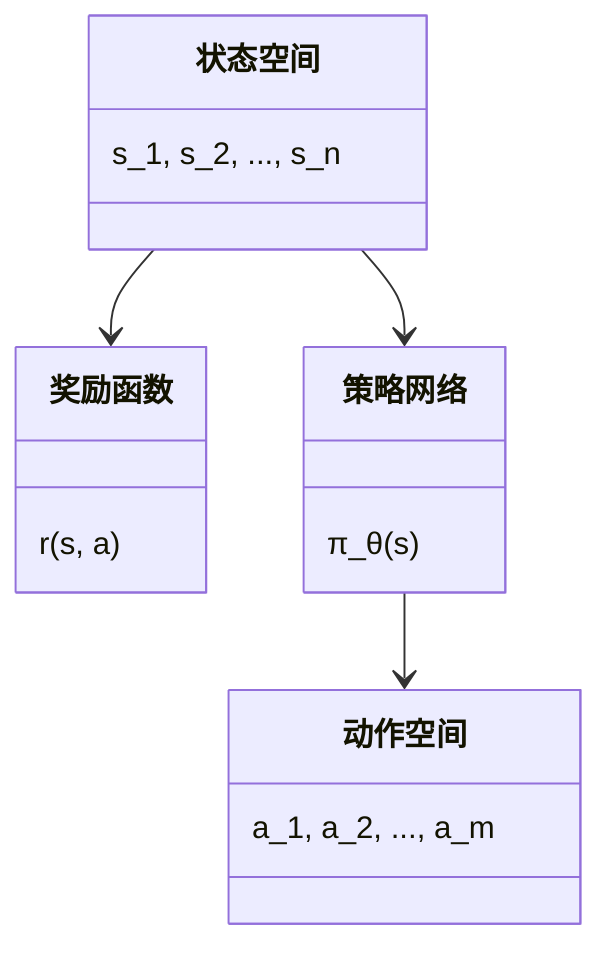
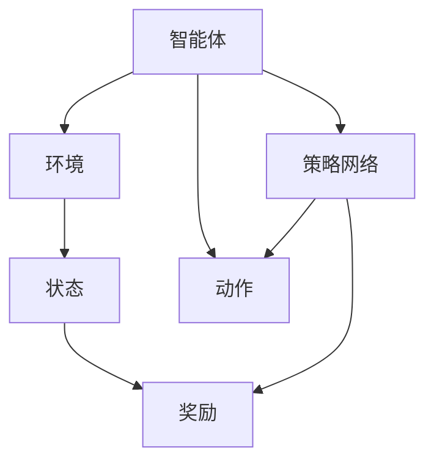
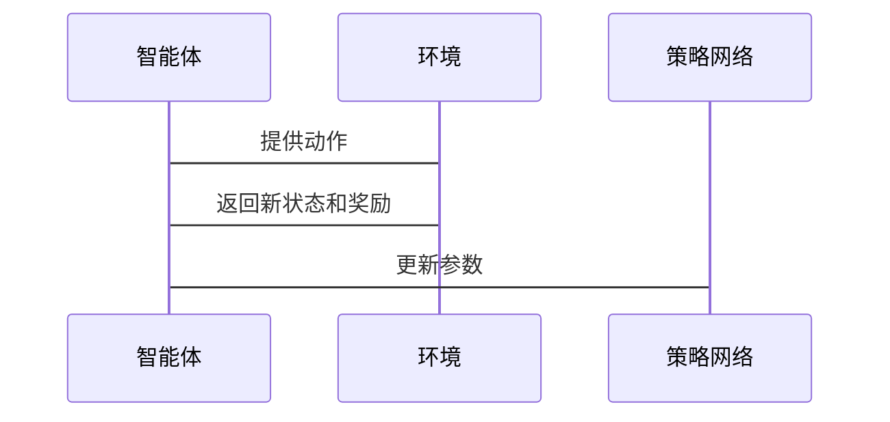

                 


# 元强化学习：AI Agent的策略泛化

> 关键词：元强化学习，策略泛化，AI Agent，强化学习，深度学习

> 摘要：本文系统地介绍了元强化学习（Meta Reinforcement Learning）的核心概念、算法原理及其在AI Agent策略泛化中的应用。从强化学习的基础到元强化学习的高级方法，详细讲解了策略泛化的实现机制、数学模型和优化算法。通过实际案例分析和系统架构设计，展示了如何将元强化学习应用于复杂的AI Agent任务中，帮助读者全面理解并掌握这一前沿技术。

---

# 第1章 元强化学习的背景与概念

## 1.1 强化学习的基本概念

### 1.1.1 强化学习的定义
强化学习是一种机器学习范式，通过智能体与环境的交互，学习如何做出一系列决策以最大化累积奖励。智能体通过试错的方式探索环境，逐步优化其策略。

### 1.1.2 强化学习的核心要素
- **状态（State）**：环境在某一时刻的描述。
- **动作（Action）**：智能体在给定状态下采取的行动。
- **奖励（Reward）**：智能体采取某个动作后获得的反馈，用于指导学习。
- **策略（Policy）**：智能体选择动作的概率分布函数。

### 1.1.3 强化学习的应用场景
- 游戏AI
- 机器人控制
- 自动驾驶
- 自然语言处理

## 1.2 元强化学习的定义与特点

### 1.2.1 元强化学习的定义
元强化学习是一种新兴的强化学习范式，旨在通过元学习机制，使智能体能够快速适应新任务或环境，减少对大量训练数据的依赖。

### 1.2.2 元强化学习与传统强化学习的区别
| 特性 | 传统强化学习 | 元强化学习 |
|------|--------------|------------|
| 数据需求 | 高 | 低 |
| 适应性 | 低 | 高 |
| 稳定性 | 高 | 低（需要良好的元学习设计） |

### 1.2.3 元强化学习的核心优势
- 快速泛化：能够快速适应新任务。
- 数据效率：减少对大量数据的需求。
- 灵活性：适用于动态变化的环境。

## 1.3 AI Agent的策略泛化

### 1.3.1 策略泛化的定义
策略泛化是指智能体在不同任务或环境中，能够保持或调整其策略，以实现一致或更好的表现。

### 1.3.2 策略泛化的应用场景
- 多任务学习
- 零样本学习
- 动态环境适应

### 1.3.3 策略泛化与元强化学习的关系
元强化学习通过元学习机制，为策略泛化提供了理论和技术支持，使智能体能够在不同任务中灵活调整策略。

---

# 第2章 元强化学习的核心概念

## 2.1 元学习的基本原理

### 2.1.1 元学习的定义
元学习是指通过学习如何学习，使模型能够快速适应新任务。其核心是优化模型的参数更新规则。

### 2.1.2 元学习的核心机制
- **元模型**：用于生成任务特定的参数更新规则。
- **快速适应**：通过元模型的参数调整，使模型能够在新任务中快速收敛。

### 2.1.3 元学习与深度学习的结合
深度学习提供了强大的特征表示能力，而元学习则增强了模型的适应性。

## 2.2 策略泛化的实现方法

### 2.2.1 策略网络的构建
策略网络是一个函数，将状态映射到动作的概率分布。

$$ P(a|s) = \pi_\theta(s) $$

其中，$\theta$ 是策略网络的参数。

### 2.2.2 策略泛化的数学模型
元强化学习的目标是最小化策略在所有任务上的平均损失。

$$ \min_\theta \sum_{i=1}^N L_i(\theta) $$

其中，$L_i$ 是第i个任务的损失函数。

### 2.2.3 策略泛化的优化算法
- **梯度下降**：通过优化目标函数，更新策略网络的参数。
- **元优化器**：用于优化参数更新规则。

## 2.3 元强化学习的数学模型

### 2.3.1 状态空间的定义
状态空间是智能体所处环境的所有可能状态的集合。

$$ S = \{ s_1, s_2, \dots, s_n \} $$

### 2.3.2 动作空间的定义
动作空间是智能体在给定状态下可以采取的所有动作的集合。

$$ A = \{ a_1, a_2, \dots, a_m \} $$

### 2.3.3 奖励函数的定义
奖励函数定义了智能体在特定状态下采取某个动作后获得的奖励。

$$ r(s, a) = r(s, a) $$

## 2.4 本章小结

---

# 第3章 元强化学习的算法原理

## 3.1 基于模型的元强化学习算法

### 3.1.1 MAML算法的原理
MAML（Meta-Automated Machine Learning）算法通过优化参数更新规则，使模型能够快速适应新任务。

### 3.1.2 MAML算法的数学模型
MAML的目标是最小化任务特定损失函数的梯度。

$$ \min_\theta \sum_{i=1}^N f_i(\theta) $$

其中，$f_i$ 是第i个任务的损失函数。

### 3.1.3 MAML算法的实现步骤
1. 初始化模型参数 $\theta$。
2. 对每个任务，计算梯度并更新参数。
3. 优化参数以最小化所有任务的损失。

## 3.2 基于无模型的元强化学习算法

### 3.2.1 REPTILE算法的原理
REPTILE算法通过任务间参数的共享，使模型能够快速适应新任务。

### 3.2.2 REPTILE算法的数学模型
REPTILE的目标是通过参数更新规则，优化模型的参数。

$$ \min_\theta \sum_{i=1}^N L_i(\theta) $$

### 3.2.3 REPTILE算法的实现步骤
1. 初始化模型参数 $\theta$。
2. 对每个任务，计算梯度并更新参数。
3. 优化参数以最小化所有任务的损失。

## 3.3 策略网络的优化方法

### 3.3.1 策略梯度法
策略梯度法通过优化策略网络的参数，使智能体能够最大化期望奖励。

$$ J(\theta) = \mathbb{E}_{s,a} [\log \pi_\theta(a|s) \cdot Q_\pi(s,a)] $$

### 3.3.2 值函数方法
值函数方法通过估计状态值函数或动作值函数，优化策略网络的参数。

$$ V_\theta(s) = \mathbb{E}_{a} [Q_\pi(s,a)] $$

### 3.3.3 深度强化学习方法
深度强化学习方法通过深度神经网络，学习复杂的策略和值函数。

---

# 第4章 元强化学习的系统分析与架构设计

## 4.1 系统功能设计

### 4.1.1 问题场景
- 多任务学习
- 动态环境适应
- 策略泛化

### 4.1.2 系统功能
- 状态感知
- 动作选择
- 奖励计算
- 策略优化

## 4.2 系统架构设计

### 4.2.1 领域模型


### 4.2.2 系统架构


### 4.2.3 系统接口设计
- 输入接口：接收状态和动作。
- 输出接口：输出奖励和新状态。

### 4.2.4 系统交互流程


---

# 第5章 元强化学习的项目实战

## 5.1 环境安装

### 5.1.1 安装Python
```bash
python --version
```

### 5.1.2 安装深度学习框架
```bash
pip install tensorflow
pip install keras
```

## 5.2 核心代码实现

### 5.2.1 策略网络的实现
```python
import tensorflow as tf
import numpy as np

class PolicyNetwork:
    def __init__(self, state_size, action_size):
        self.state_size = state_size
        self.action_size = action_size
        self.model = self.build_model()
    
    def build_model(self):
        model = tf.keras.Sequential([
            tf.keras.layers.Dense(64, activation='relu', input_dim=self.state_size),
            tf.keras.layers.Dense(self.action_size, activation='softmax')
        ])
        return model
    
    def call(self, state):
        return self.model(state)
```

### 5.2.2 元强化学习算法的实现
```python
import tensorflow as tf

class MetaReinforcementLearning:
    def __init__(self, policy_network):
        self.policy_network = policy_network
        self.optimizer = tf.keras.optimizers.Adam(learning_rate=0.001)
    
    def update_policy(self, states, actions, rewards):
        with tf.GradientTape() as tape:
            # 计算策略
            logits = self.policy_network.model(states)
            # 计算损失
            loss = tf.nn.sparse_softmax_cross_entropy_with_logits(
                labels=actions, logits=logits
            )
            total_loss = tf.reduce_mean(loss)
        # 更新参数
        gradients = tape.gradient(total_loss, self.policy_network.model.trainable_weights)
        self.optimizer.apply_gradients(zip(gradients, self.policy_network.model.trainable_weights))
```

## 5.3 实际案例分析

### 5.3.1 环境描述
考虑一个连续控制任务，智能体需要控制机器人在动态环境中完成任务。

### 5.3.2 策略优化过程
1. 初始化策略网络参数。
2. 对每个任务，计算梯度并更新参数。
3. 优化参数以最小化所有任务的损失。

## 5.4 项目小结

---

# 第6章 元强化学习的最佳实践与总结

## 6.1 小结

### 6.1.1 元强化学习的核心思想
通过元学习机制，使智能体能够快速适应新任务或环境。

### 6.1.2 策略泛化的实现方法
通过策略网络的优化和元学习算法的设计，实现策略在不同任务中的泛化能力。

## 6.2 注意事项

### 6.2.1 算法选择
根据具体任务选择合适的元强化学习算法。

### 6.2.2 参数设置
合理设置模型参数和优化器的超参数，确保模型的稳定性和性能。

## 6.3 拓展阅读

### 6.3.1 推荐书籍
- 《Reinforcement Learning: Theory and Algorithms》
- 《Deep Learning》

### 6.3.2 推荐论文
- "Meta-Learning via Thompson Sampling for Reinforcement Learning"
- "A Survey on Meta-Reinforcement Learning"

---

# 作者：AI天才研究院 & 禅与计算机程序设计艺术

---

以上是《元强化学习：AI Agent的策略泛化》的技术博客文章的完整大纲和内容。文章从背景介绍到实际案例分析，全面系统地讲解了元强化学习的核心概念、算法原理、系统架构和项目实战，帮助读者深入理解并掌握这一前沿技术。

