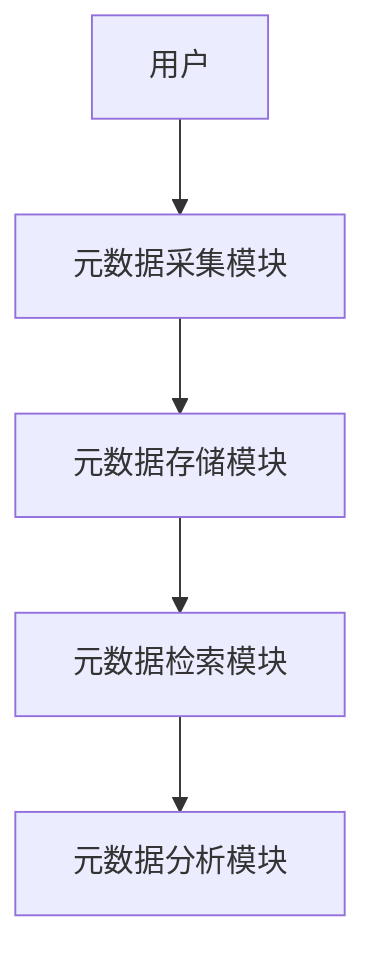

                 


# 元数据管理：组织和利用AI Agent的数据资产

**关键词**：元数据管理、AI Agent、数据资产、数据管理、智能化管理

**摘要**：本文探讨了元数据管理在AI Agent中的应用，详细分析了元数据的分类、特征及其在AI Agent中的作用，结合算法原理和系统架构设计，展示了如何通过元数据管理优化AI Agent的数据处理能力。通过实际案例分析，提供了元数据管理在AI Agent中的实施策略和最佳实践。

---

## 第一部分: 引言

在数字化转型的浪潮中，数据已成为企业的核心资产。AI Agent作为一种智能代理，能够自动化处理数据，但其性能和准确性高度依赖于数据的质量和管理。元数据作为数据的“指南”，在AI Agent的数据管理中扮演着关键角色。本文将深入探讨元数据管理在AI Agent中的应用，从概念到实践，为您提供全面的指导。

---

## 第二部分: 元数据管理的核心概念

### 第1章: 元数据的基本概念

#### 1.1 元数据的定义与作用

元数据是描述数据的数据，用于帮助我们更好地理解和管理数据。它包括数据的来源、格式、结构、关系等信息。元数据的作用在于提高数据的可发现性、可理解性和可用性。

#### 1.2 AI Agent的定义与演进

AI Agent是一种智能代理，能够感知环境、执行任务并优化决策。从简单的规则驱动到复杂的深度学习模型，AI Agent不断演进，其数据管理能力也日益重要。

#### 1.3 元数据与AI Agent的关系

元数据为AI Agent提供了数据的上下文信息，帮助其更准确地理解和处理数据。通过元数据管理，AI Agent能够更好地组织数据资产，提升数据处理效率和准确性。

---

### 第2章: 元数据管理的核心原理

#### 2.1 元数据的生命周期

元数据的生命周期包括创建、存储、检索、更新和删除。在AI Agent中，元数据管理贯穿整个数据处理流程，确保数据的完整性和一致性。

#### 2.2 元数据的分类与特征

元数据可以分为结构化元数据、非结构化元数据和混合元数据。每类元数据都有其独特的特征和应用场景。

| 元数据分类 | 特征描述 | 应用场景 |
|------------|-----------|----------|
| 结构化 | 明确的结构和格式 | 数据库管理 |
| 非结构化 | 不规则的格式 | 文本分析 |
| 混合 | 结合结构化和非结构化 | 综合数据管理 |

#### 2.3 元数据与数据资产的关系

元数据是数据资产的“身份证”，帮助我们识别、组织和利用数据资产。通过元数据管理，AI Agent能够高效地管理和利用数据资产，提升数据驱动的决策能力。

---

## 第三部分: AI Agent的原理与应用

### 第3章: AI Agent的基本原理

#### 3.1 AI Agent的体系结构

AI Agent通常由感知层、决策层和执行层组成。感知层负责数据采集，决策层进行数据分析和决策，执行层负责任务执行。

#### 3.2 AI Agent的工作流程

1. 数据采集：通过传感器或API获取数据。
2. 数据处理：对数据进行清洗、转换和分析。
3. 任务执行：根据分析结果执行相应任务。
4. 反馈优化：根据执行结果优化后续操作。

#### 3.3 元数据在AI Agent中的作用

元数据帮助AI Agent更好地理解数据，优化数据处理流程，提升任务执行的准确性和效率。

---

## 第四部分: 元数据管理的算法原理

### 第4章: 元数据清洗算法

#### 4.1 元数据清洗的必要性

元数据清洗旨在去除冗余、错误或不一致的数据，确保数据的准确性和一致性。

#### 4.2 元数据清洗的步骤

1. 去除重复数据。
2. 处理缺失值。
3. 纠正错误数据。

#### 4.3 元数据清洗算法的实现

```python
def clean_metadata(data):
    # 去除重复数据
    data = data.drop_duplicates()
    # 处理缺失值
    data = data.fillna('unknown')
    return data
```

### 第5章: 元数据特征提取算法

#### 5.1 元数据特征提取的原理

通过主成分分析（PCA）等方法提取元数据的特征，提升数据的表示能力。

#### 5.2 元数据特征提取的实现

```python
from sklearn.decomposition import PCA

def extract_features(data):
    pca = PCA(n_components=2)
    features = pca.fit_transform(data)
    return features
```

---

## 第五部分: 系统架构设计

### 第6章: 元数据管理系统的架构设计

#### 6.1 系统功能设计

系统功能包括元数据采集、存储、检索和分析。

#### 6.2 系统架构图



#### 6.3 系统接口设计

系统接口包括元数据采集接口、检索接口和分析接口。

---

## 第六部分: 项目实战

### 第7章: 元数据管理项目的实施

#### 7.1 项目背景

通过一个电商数据分析项目，展示元数据管理在AI Agent中的应用。

#### 7.2 核心代码实现

```python
def main():
    # 采集元数据
    metadata =采集元数据()
    # 清洗元数据
    cleaned_metadata = clean_metadata(metadata)
    # 提取特征
    features = extract_features(cleaned_metadata)
    # 分析特征
    analyze_features(features)
```

#### 7.3 项目总结

通过项目实战，我们掌握了元数据管理在AI Agent中的实施方法，提升了数据处理效率和准确性。

---

## 第七部分: 最佳实践与总结

### 第8章: 元数据管理的最佳实践

#### 8.1 元数据管理的实施策略

1. 制定元数据管理策略。
2. 选择合适的元数据管理工具。
3. 建立元数据治理体系。

#### 8.2 元数据管理的未来趋势

元数据管理将更加智能化、自动化，与AI Agent的结合将更加紧密，推动数据管理的智能化发展。

---

## 结语

元数据管理是AI Agent高效利用数据资产的关键。通过本文的探讨，我们深入理解了元数据管理的核心概念和算法原理，并通过实际案例展示了其在AI Agent中的应用。未来，元数据管理将继续演进，为数据驱动的决策提供更强大的支持。

---

**作者：AI天才研究院 & 禅与计算机程序设计艺术**

