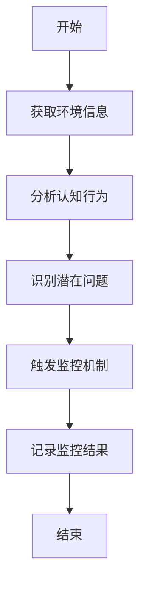
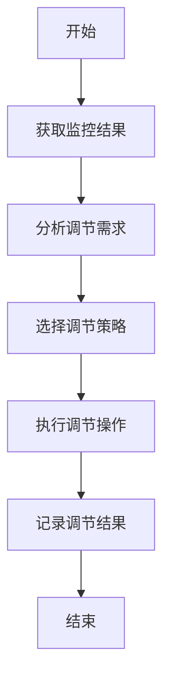
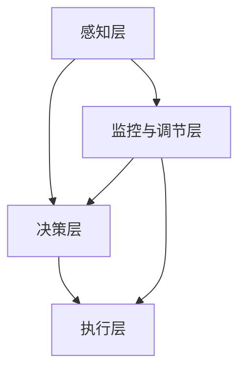

                 


# 元认知AI Agent：自我监控与调节

## 关键词：元认知AI Agent，自我监控，自我调节，AI系统架构，算法实现，系统设计

## 摘要

本文深入探讨了元认知AI Agent的概念、关键特性及其在自我监控与调节中的实现机制。文章从元认知的基本概念出发，逐步分析其在AI Agent中的应用，详细讲解了自我监控与调节的核心算法、系统架构设计以及实际项目中的应用案例。通过理论与实践相结合的方式，本文为读者提供了全面的理解和应用指南。

---

## 第1章 元认知AI Agent的背景与概念

### 1.1 元认知的基本概念

#### 1.1.1 元认知的定义与核心特征

元认知（Metacognition）是关于认知的认知，即对自身认知过程的认知。它包含两个主要部分：认知过程（如记忆、推理）和元认知过程（如监控、调节）。元认知的核心特征包括：

1. **自我监控**：能够监控自身的认知过程，识别当前的认知状态。
2. **自我调节**：根据监控结果调整认知策略，优化目标的实现。
3. **灵活性**：能够根据环境变化动态调整认知行为。
4. **目标导向**：以实现特定目标为导向，指导认知过程。

#### 1.1.2 元认知的结构与功能

元认知的结构通常分为三个层次：

1. **元认知知识**：关于认知过程的知识，包括对任务、策略和自我认知的理解。
2. **元认知体验**：在认知过程中产生的感受和意识，如“我需要更仔细地分析这个问题”。
3. **元认知监控与调节**：对认知过程的实时监控和调整。

元认知的功能主要体现在以下几个方面：

- **监控**：实时跟踪认知过程的状态，识别潜在问题。
- **调节**：根据监控结果调整策略，优化认知过程。
- **评估**：对认知结果进行评估，总结经验教训。

#### 1.1.3 元认知在AI中的应用背景

随着AI技术的快速发展，AI系统需要具备更强的适应性和自主性。元认知AI Agent通过自我监控与调节，能够更好地应对复杂多变的环境，提升任务执行的效率和准确性。

---

### 1.2 AI Agent的基本概念

#### 1.2.1 AI Agent的定义与分类

AI Agent（智能体）是指能够感知环境、做出决策并采取行动的实体。根据智能体的智能水平，可以将其分为以下几类：

1. **反应式AI Agent**：基于当前感知做出反应，不依赖历史信息。
2. **认知式AI Agent**：具备推理、规划和学习能力，能够理解环境并采取复杂行动。
3. **混合式AI Agent**：结合反应式和认知式的特点，具备更强的适应性和智能性。

#### 1.2.2 AI Agent的核心功能与特点

AI Agent的核心功能包括感知、推理、规划、决策和行动。其特点在于：

- **自主性**：能够自主决策，无需外部干预。
- **反应性**：能够实时感知环境并做出反应。
- **学习性**：能够通过经验改进性能。
- **适应性**：能够适应环境的变化。

#### 1.2.3 AI Agent的应用场景与挑战

AI Agent广泛应用于自动驾驶、智能助手、机器人、推荐系统等领域。然而，其发展也面临诸多挑战，如复杂环境的处理、多目标优化、实时性要求高等。

---

### 1.3 元认知AI Agent的定义与结构

#### 1.3.1 元认知AI Agent的定义

元认知AI Agent是一种具备自我监控与调节能力的智能体，能够在执行任务的过程中动态调整自身的认知策略，以优化目标的实现。

#### 1.3.2 元认知AI Agent的核心要素

元认知AI Agent的核心要素包括：

1. **元认知监控模块**：实时监控认知过程的状态。
2. **元认知调节模块**：根据监控结果调整认知策略。
3. **任务执行模块**：负责具体任务的执行。
4. **知识库**：存储任务相关的知识和经验。

#### 1.3.3 元认知AI Agent的系统架构

元认知AI Agent的系统架构通常包括以下模块：

1. **感知层**：负责接收环境信息。
2. **决策层**：基于感知信息做出决策。
3. **执行层**：根据决策执行具体行动。
4. **监控与调节层**：对决策和执行过程进行监控与调节。

---

## 第2章 元认知的理论基础

### 2.1 元认知的层次结构

#### 2.1.1 元认知的宏观模型

Flavell的元认知理论将元认知分为三个层次：

1. **元认知知识**：关于认知过程的知识。
2. **元认知体验**：在认知过程中产生的体验和感受。
3. **元认知监控与调节**：对认知过程的监控和调整。

#### 2.1.2 元认知的微观模型

微观模型关注认知过程的具体步骤，包括：

1. **目标设定**：明确认知任务的目标。
2. **策略选择**：选择合适的认知策略。
3. **监控执行**：监控策略的执行情况。
4. **结果评估**：评估认知结果的有效性。

#### 2.1.3 元认知与认知过程的关系

元认知与认知过程的关系是元认知指导认知过程，认知过程为元认知提供反馈。两者相互作用，共同完成认知任务。

---

### 2.2 元认知的模型与框架

#### 2.2.1 元认知的标准模型

Flavell的元认知标准模型包括以下三个部分：

1. **元认知知识**：关于任务、策略和自我认知的知识。
2. **元认知体验**：在认知过程中产生的体验和感受。
3. **元认知监控与调节**：对认知过程的监控和调整。

#### 2.2.2 元认知的框架模型

框架模型强调元认知的结构化表示，包括：

1. **目标设定**：明确认知任务的目标。
2. **策略选择**：选择合适的认知策略。
3. **监控执行**：监控策略的执行情况。
4. **结果评估**：评估认知结果的有效性。

#### 2.2.3 元认知的动态调整模型

动态调整模型强调元认知的实时监控与动态调节，包括：

1. **实时监控**：持续跟踪认知过程的状态。
2. **动态调节**：根据监控结果调整认知策略。
3. **反馈机制**：通过反馈优化认知过程。

---

## 第3章 元认知AI Agent的自我监控机制

### 3.1 自我监控的核心算法

#### 3.1.1 自我监控的实现方法

自我监控的实现方法包括：

1. **状态感知**：通过传感器或数据流感知环境状态。
2. **行为分析**：分析自身的认知行为，识别潜在问题。
3. **反馈机制**：通过反馈信息调整监控策略。

#### 3.1.2 监控模块的设计

监控模块的设计需要考虑以下几点：

1. **实时性**：监控过程必须实时进行。
2. **准确性**：监控结果必须准确反映认知过程的状态。
3. **适应性**：监控策略能够根据环境变化进行调整。

#### 3.1.3 监控策略与实现

监控策略的设计包括：

1. **规则驱动**：基于预定义的规则进行监控。
2. **数据驱动**：基于历史数据进行监控。
3. **混合驱动**：结合规则和数据进行监控。

---

### 3.2 监控算法的流程

#### 3.2.1 监控算法的流程图

以下是监控算法的流程图：



#### 3.2.2 监控策略的实现

监控策略的实现需要结合具体任务的需求，设计合理的监控规则。例如，在自动驾驶中，监控算法需要实时监控车辆的行驶状态，识别潜在危险。

---

## 第4章 元认知AI Agent的自我调节机制

### 4.1 自我调节的核心算法

#### 4.1.1 自我调节的实现方法

自我调节的实现方法包括：

1. **策略调整**：根据监控结果调整认知策略。
2. **动态优化**：动态优化认知过程。
3. **反馈机制**：通过反馈信息优化调节策略。

#### 4.1.2 调节模块的设计

调节模块的设计需要考虑以下几点：

1. **实时性**：调节过程必须实时进行。
2. **有效性**：调节策略必须能够有效优化认知过程。
3. **适应性**：调节策略能够根据环境变化进行调整。

#### 4.1.3 调节策略与实现

调节策略的设计包括：

1. **规则驱动**：基于预定义的规则进行调节。
2. **数据驱动**：基于历史数据进行调节。
3. **混合驱动**：结合规则和数据进行调节。

---

### 4.2 调节算法的流程

#### 4.2.1 调节算法的流程图

以下是调节算法的流程图：



#### 4.2.2 调节策略的实现

调节策略的实现需要结合具体任务的需求，设计合理的调节规则。例如，在智能助手中，调节算法需要根据用户的反馈动态调整推荐策略。

---

## 第5章 元认知AI Agent的算法实现

### 5.1 元认知AI Agent的算法设计

#### 5.1.1 元认知AI Agent的算法步骤

元认知AI Agent的算法步骤包括：

1. **初始化**：设置初始参数和状态。
2. **感知**：获取环境信息。
3. **决策**：基于感知信息做出决策。
4. **监控**：监控决策过程的状态。
5. **调节**：根据监控结果调整决策策略。
6. **执行**：根据调整后的策略执行行动。
7. **评估**：评估行动结果。
8. **反馈**：将反馈信息用于优化算法。

#### 5.1.2 元认知AI Agent的数学模型

元认知AI Agent的数学模型可以表示为：

$$
f(x) = \begin{cases}
x & \text{如果 } x \text{ 满足监控条件} \\
g(x) & \text{否则}
\end{cases}
$$

其中，$f(x)$ 是元认知AI Agent的输出，$g(x)$ 是调整后的输出。

#### 5.1.3 元认知AI Agent的代码实现

以下是元认知AI Agent的代码实现示例：

```python
class MetaCognitiveAgent:
    def __init__(self):
        self.state = 'initial'
        self.strategy = 'default'
    
    def perceive(self, environment):
        # 获取环境信息
        self.environment = environment
    
    def decide(self):
        # 基于感知信息做出决策
        if self.environment == 'normal':
            return 'proceed'
        else:
            return 'pause'
    
    def monitor(self):
        # 监控决策过程的状态
        if self.decide() == 'pause':
            return 'alert'
        else:
            return 'normal'
    
    def regulate(self):
        # 根据监控结果调整策略
        if self.monitor() == 'alert':
            self.strategy = 'alternative'
        else:
            self.strategy = 'default'
    
    def execute(self):
        # 根据调整后的策略执行行动
        if self.strategy == 'default':
            return 'execute default strategy'
        else:
            return 'execute alternative strategy'
```

---

## 第6章 元认知AI Agent的系统架构设计

### 6.1 系统架构设计概述

#### 6.1.1 系统架构的目标

系统架构设计的目标是实现元认知AI Agent的自我监控与调节功能，确保系统的高效性和可靠性。

#### 6.1.2 系统架构的设计原则

系统架构的设计原则包括：

1. **模块化**：系统划分为独立的模块，便于开发和维护。
2. **可扩展性**：系统能够方便地扩展新的功能模块。
3. **可维护性**：系统易于维护和升级。
4. **可配置性**：系统能够根据需求进行配置。

#### 6.1.3 系统架构的实现

以下是元认知AI Agent的系统架构图：



---

### 6.2 系统架构的核心模块

#### 6.2.1 感知层

感知层负责接收环境信息，包括：

- **传感器数据**：如温度、湿度等。
- **用户输入**：如用户的操作指令。

#### 6.2.2 决策层

决策层负责基于感知信息做出决策，包括：

- **规则引擎**：基于预定义的规则做出决策。
- **机器学习模型**：基于机器学习模型做出决策。

#### 6.2.3 执行层

执行层负责根据决策结果执行具体行动，包括：

- **硬件控制**：如控制机器人执行动作。
- **软件操作**：如调用API执行任务。

#### 6.2.4 监控与调节层

监控与调节层负责对决策和执行过程进行监控与调节，包括：

- **监控模块**：实时监控决策和执行过程的状态。
- **调节模块**：根据监控结果调整决策和执行策略。

---

## 第7章 元认知AI Agent的项目实战

### 7.1 项目概述

#### 7.1.1 项目背景

本项目旨在开发一个具备自我监控与调节能力的元认知AI Agent，能够在复杂环境中自主决策并动态调整策略。

#### 7.1.2 项目目标

项目目标包括：

1. 实现元认知AI Agent的自我监控功能。
2. 实现元认知AI Agent的自我调节功能。
3. 在实际场景中验证元认知AI Agent的性能。

#### 7.1.3 项目需求

项目需求包括：

- **环境感知**：能够感知环境信息。
- **决策制定**：能够基于感知信息做出决策。
- **监控与调节**：能够监控决策过程并动态调整策略。

---

### 7.2 系统核心实现

#### 7.2.1 环境感知实现

环境感知实现包括：

- **传感器数据采集**：如温度、湿度等。
- **用户输入处理**：如用户的操作指令。

#### 7.2.2 决策制定实现

决策制定实现包括：

- **规则引擎**：基于预定义的规则做出决策。
- **机器学习模型**：基于机器学习模型做出决策。

#### 7.2.3 监控与调节实现

监控与调节实现包括：

- **监控模块**：实时监控决策和执行过程的状态。
- **调节模块**：根据监控结果调整决策和执行策略。

---

### 7.3 项目实战案例

#### 7.3.1 案例分析

案例分析包括：

- **自动驾驶中的应用**：元认知AI Agent能够实时监控车辆的行驶状态，识别潜在危险，并动态调整驾驶策略。
- **智能助手中的应用**：元认知AI Agent能够根据用户的反馈动态调整推荐策略，提供更精准的服务。

#### 7.3.2 代码实现与解读

以下是元认知AI Agent的代码实现示例：

```python
class MetaCognitiveAgent:
    def __init__(self):
        self.state = 'initial'
        self.strategy = 'default'
    
    def perceive(self, environment):
        self.environment = environment
    
    def decide(self):
        if self.environment == 'normal':
            return 'proceed'
        else:
            return 'pause'
    
    def monitor(self):
        if self.decide() == 'pause':
            return 'alert'
        else:
            return 'normal'
    
    def regulate(self):
        if self.monitor() == 'alert':
            self.strategy = 'alternative'
        else:
            self.strategy = 'default'
    
    def execute(self):
        if self.strategy == 'default':
            return 'execute default strategy'
        else:
            return 'execute alternative strategy'
```

---

## 第8章 元认知AI Agent的最佳实践与小结

### 8.1 最佳实践

#### 8.1.1 系统设计中的注意事项

系统设计中的注意事项包括：

1. **模块化设计**：确保系统的模块化和可扩展性。
2. **实时性优化**：优化系统的实时性，确保监控与调节的及时性。
3. **安全性保障**：确保系统的安全性，防止潜在的安全漏洞。

#### 8.1.2 开发中的技巧与经验

开发中的技巧与经验包括：

1. **持续监控**：持续监控系统的运行状态，及时发现潜在问题。
2. **动态调整**：根据系统的运行状态动态调整策略。
3. **反馈优化**：通过反馈信息不断优化系统的性能。

#### 8.1.3 测试与优化

测试与优化包括：

1. **功能测试**：测试系统的各项功能是否正常。
2. **性能测试**：测试系统的性能指标是否达到要求。
3. **优化迭代**：根据测试结果不断优化系统的性能。

---

### 8.2 小结

元认知AI Agent通过自我监控与调节，能够在复杂环境中自主决策并动态调整策略。本文从理论基础、算法实现、系统架构、项目实战等多个方面进行了详细探讨，为读者提供了全面的理解和应用指南。

---

## 作者：AI天才研究院/AI Genius Institute & 禅与计算机程序设计艺术/Zen And The Art of Computer Programming

---

以上是《元认知AI Agent：自我监控与调节》的技术博客文章，涵盖了元认知AI Agent的核心概念、算法实现、系统架构以及项目实战等内容，为读者提供了全面的理解和应用指南。

