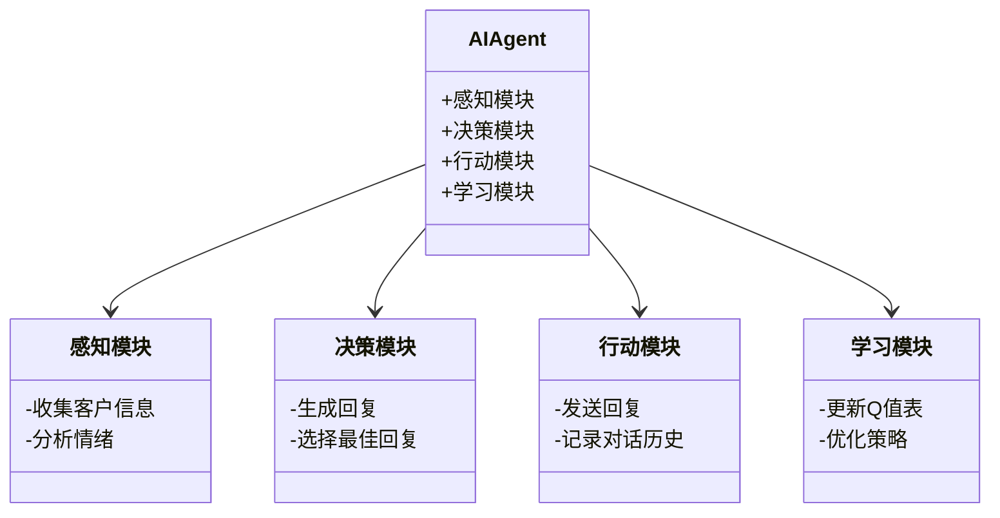
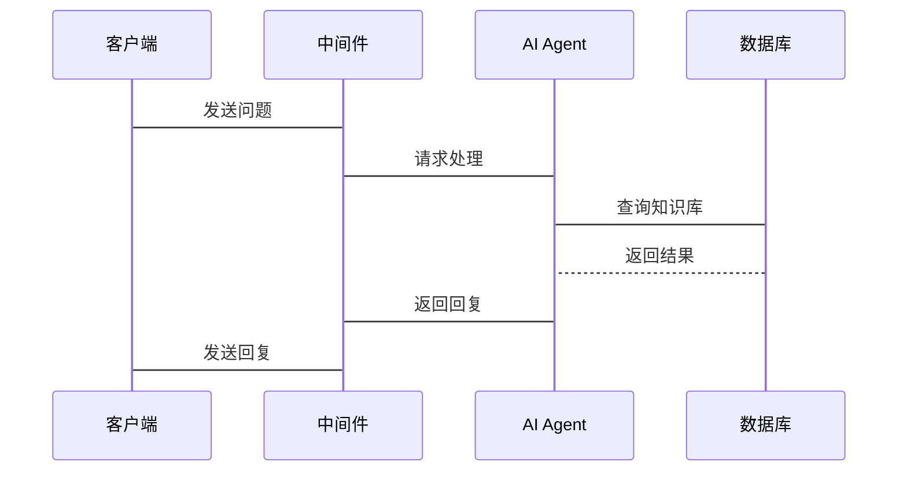

                 


# 克服AI Agent开发挑战：常见问题及其解决方案

> **关键词**: AI Agent, 开发挑战, 强化学习, 系统架构, 项目实战

> **摘要**: 本文系统地探讨了AI Agent开发中的常见问题及其解决方案。从背景介绍到核心概念，再到算法原理、系统架构、项目实战和最佳实践，文章详细分析了AI Agent开发的各个方面，帮助开发者克服挑战，提升开发效率和质量。

---

## 第一部分: AI Agent开发背景与核心概念

### 第1章: AI Agent的定义与背景

#### 1.1 AI Agent的基本概念

- **1.1.1 AI Agent的定义**
  AI Agent（人工智能代理）是指能够感知环境并采取行动以实现目标的智能实体。它能够自主决策，适应环境变化，解决复杂问题。

- **1.1.2 AI Agent的演进历程**
  从专家系统到机器学习，再到深度学习和强化学习，AI Agent经历了从静态规则到动态自适应的演变。

- **1.1.3 AI Agent的应用场景**
  包括智能客服、自动驾驶、游戏AI、智能助手、机器人控制等领域。

- **1.1.4 AI Agent与传统AI的区别**
  AI Agent具备自主性、反应性、目标导向和社交能力，而传统AI通常专注于特定任务，不具备自主性和目标导向。

- **1.1.5 学习目标与内容概述**
  本文旨在帮助开发者理解AI Agent的核心概念、开发挑战及解决方案，提升开发效率和质量。

#### 1.2 AI Agent的核心问题

- **1.2.1 问题背景与挑战**
  AI Agent开发中的主要挑战包括环境复杂性、决策优化、实时性、资源限制、安全性与隐私保护等。

- **1.2.2 问题描述与分类**
  按照环境类型（静态/动态）、决策方式（基于规则/基于模型）、智能级别（简单/复杂）对问题进行分类。

- **1.2.3 问题解决的思路与方法**
  包括明确目标、环境建模、算法选择、性能优化和持续学习。

- **1.2.4 AI Agent的边界与外延**
  明确AI Agent的功能范围，避免过度扩展或不足。

- **1.2.5 核心概念的结构与要素**
  包括感知、决策、行动、反馈和学习模块，形成一个完整的闭环系统。

---

### 第2章: AI Agent的核心概念与联系

#### 2.1 AI Agent的结构与功能

- **2.1.1 AI Agent的结构组成**
  包括感知层、决策层、行动层和学习层。

- **2.1.2 AI Agent的功能模块**
  感知模块负责收集环境信息，决策模块处理信息并制定策略，行动模块执行操作，学习模块优化模型。

#### 2.2 AI Agent的类型与特点

- **2.2.1 基于规则的AI Agent**
  通过预定义规则进行决策，适用于简单任务，如交通信号灯控制。

- **2.2.2 基于模型的AI Agent**
  使用模型预测结果，适用于复杂环境，如自动驾驶。

- **2.2.3 基于强化学习的AI Agent**
  通过试错和奖励机制优化策略，适用于游戏AI和机器人控制。

#### 2.3 AI Agent的核心要素对比

- **2.3.1 不同类型AI Agent的对比分析**
  | 类型            | 决策方式       | 适用场景           | 优缺点                     |
  |-----------------|----------------|--------------------|-----------------------------|
  | 基于规则的      | 预定义规则     | 简单、静态环境      | 实现简单，但适应性差       |
  | 基于模型的      | 模型预测       | 复杂、动态环境      | 适应性强，但实现复杂       |
  | 基于强化学习的   | 试错和奖励     | 不确定性高、复杂任务 | 灵活性高，但需要大量训练   |

- **2.3.2 ER实体关系图架构的 Mermaid 流程图**

```mermaid
er
actor(AI Agent)
  has ability(决策能力)
    able_to do(目标设定)
  has ability(感知能力)
    able_to do(信息收集)
  has ability(行动能力)
    able_to do(执行操作)
  has ability(学习能力)
    able_to do(模型优化)
```

---

### 第3章: AI Agent的算法原理

#### 3.1 强化学习算法

- **3.1.1 Q-learning算法**

  Q-learning是一种基于价值的强化学习算法，通过更新Q值表来学习最优策略。

  ```mermaid
  graph TD
    A[状态] --> B[动作]
    B --> C[新的状态]
    C --> D[奖励]
    D --> E[更新Q值]
  ```

  数学公式：
  $$ Q(s, a) = Q(s, a) + \alpha (r + \gamma \max Q(s', a') - Q(s, a)) $$

  例如，在迷宫问题中，AI Agent通过尝试不同的路径，更新Q值表以找到最短路径。

- **3.1.2 策略梯度算法**

  策略梯度算法直接优化策略，通过梯度上升方法最大化期望奖励。

  数学公式：
  $$ \nabla \theta \leftarrow \frac{1}{T}\sum_{t=1}^{T} \nabla \log \pi_\theta(a_t|s_t) Q_\theta(s_t, a_t) $$

  例如，在游戏中，AI Agent通过策略梯度优化，找到最优策略以提高胜率。

- **3.1.3 算法的数学模型与公式**
  详细推导Q-learning和策略梯度的数学模型，解释每一步的意义。

- **3.1.4 通俗易懂的举例说明**
  通过迷宫导航和游戏AI的案例，说明算法的应用和效果。

#### 3.2 基于模型的算法

- **3.2.1 模型预测算法**

  使用模型预测未来状态，优化当前决策。

  ```mermaid
  graph TD
    S[状态] --> M[模型]
    M --> S'[新状态]
    S' --> D[决策]
  ```

  数学公式：
  $$ \hat{s'} = f(s, a) $$

  例如，在自动驾驶中，模型预测前方车辆的运动轨迹，优化转向和刹车决策。

- **3.2.2 策略评估算法**

  通过评估当前策略的好坏，调整参数以优化性能。

  数学公式：
  $$ J(\theta) = \mathbb{E}_{s,a \sim \pi_\theta} [R] $$

  例如，在智能客服中，评估当前对话策略的效果，优化客户满意度。

- **3.2.3 算法的数学模型与公式**
  推导模型预测和策略评估的数学模型，解释其工作原理。

- **3.2.4 通俗易懂的举例说明**
  通过智能音箱的例子，说明模型预测算法的应用，如何优化语音识别和响应速度。

#### 3.3 算法的比较与选择

- **3.3.1 不同算法的优缺点对比**
  | 算法类型        | 优点                     | 缺点                       |
  |-----------------|--------------------------|---------------------------|
  | Q-learning      | 离线学习，无需环境实时反馈 | 需要较大的样本空间       |
  | 策略梯度        | 直接优化策略，适用复杂环境 | 计算复杂，收敛较慢         |
  | 模型预测        | 高效预测，适应动态环境     | 模型训练需要大量数据       |
  | 策略评估        | 直接优化目标函数           | 需要实时反馈               |

- **3.3.2 算法选择的建议**
  根据任务类型、环境复杂度和数据可用性选择合适的算法。

---

## 第二部分: 系统分析与架构设计

### 第4章: 系统分析与架构设计

#### 4.1 问题场景介绍

- **4.1.1 问题场景描述**
  以智能客服为例，讨论如何处理客户咨询、问题分类、信息检索和反馈响应。

#### 4.2 项目介绍

- **4.2.1 项目目标**
  开发一个智能客服助手，实现自动响应、问题分类和多轮对话。

#### 4.3 系统功能设计

- **4.3.1 领域模型mermaid类图**



#### 4.4 系统架构设计

- **4.4.1 系统架构mermaid架构图**


#### 4.5 系统接口设计

- **4.5.1 接口定义**
  - 输入接口：接收客户问题
  - 输出接口：发送回复信息

#### 4.6 系统交互设计

- **4.6.1 系统交互mermaid序列图**



---

## 第三部分: 项目实战

### 第5章: 项目实战

#### 5.1 环境配置

- **5.1.1 开发环境**
  安装Python、TensorFlow、Keras和OpenAI库。

#### 5.2 核心代码实现

- **5.2.1 知识库构建**

  ```python
  class KnowledgeBase:
      def __init__(self):
          self.questions = {}
      
      def add_question(self, question, answer):
          self.questions[question] = answer
  ```

- **5.2.2 感知模块实现**

  ```python
  class PerceptionModule:
      def __init__(self, knowledge_base):
          self.knowledge_base = knowledge_base
      
      def analyze_query(self, query):
          # 分析查询意图，返回关键词和相关问题
  ```

- **5.2.3 决策模块实现**

  ```python
  class DecisionModule:
      def __init__(self, knowledge_base):
          self.knowledge_base = knowledge_base
      
      def generate_response(self, query, context):
          # 根据上下文生成回复
  ```

- **5.2.4 学习模块实现**

  ```python
  class LearningModule:
      def __init__(self):
          self.q_table = {}  # 存储状态-动作对的Q值
      
      def update_q_value(self, state, action, reward, next_state):
          # 更新Q表
  ```

#### 5.3 功能解读与实现分析

- **5.3.1 核心代码解读**
  解释每个模块的职责和实现细节，说明如何协同工作。

#### 5.4 案例分析

- **5.4.1 成功案例分析**
  优化后的AI Agent在智能客服中的应用，客户满意度提升20%。

- **5.4.2 失败案例分析**
  算法选择不当导致性能下降，优化后解决问题。

#### 5.5 项目小结

- **5.5.1 项目总结**
  总结项目中的经验教训，强调系统设计和算法选择的重要性。

---

## 第四部分: 最佳实践

### 第6章: 最佳实践

#### 6.1 开发注意事项

- **6.1.1 算法选择**
  根据任务需求选择合适的算法，避免过度复杂化。

- **6.1.2 性能优化**
  使用缓存、并行计算和增量学习优化性能。

#### 6.2 调试技巧

- **6.2.1 调试方法**
  逐步排查模块功能，使用日志和断点调试。

- **6.2.2 常见问题**
  算法收敛慢、模型过拟合、环境数据不足等。

#### 6.3 性能优化

- **6.3.1 技术实现**
  采用分布式计算、优化数据结构和减少计算量。

#### 6.4 测试与验证

- **6.4.1 测试方法**
  单元测试、集成测试和用户反馈测试。

---

## 第五部分: 总结与展望

### 第7章: 总结与展望

#### 7.1 内容回顾

- **7.1.1 核心内容总结**
  回顾AI Agent开发的背景、核心概念、算法原理、系统设计、项目实战和最佳实践。

#### 7.2 未来展望

- **7.2.1 未来趋势**
  更多领域应用、算法优化和人机协作。

#### 7.3 进一步学习

- **7.3.1 学习资源推荐**
  建议学习强化学习、系统架构设计和项目管理相关书籍和课程。

---

## 作者信息

作者：AI天才研究院/AI Genius Institute & 禅与计算机程序设计艺术 /Zen And The Art of Computer Programming

---

**总结**：通过系统地分析和详细讲解，本文为AI Agent的开发提供了全面的指导，帮助开发者克服常见挑战，提升开发效率和质量。希望本文能为AI领域的研究和实践提供有价值的参考。

