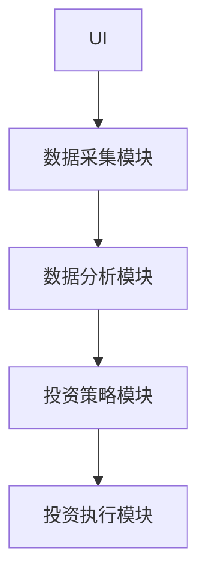

                 


# 全球化 vs 去全球化：投资策略的调整

> 关键词：全球化、去全球化、投资策略、资产配置、风险管理、经济趋势

> 摘要：本文探讨了全球化与去全球化对投资策略的影响，分析了两者的核心概念、驱动因素和经济影响，提出了在不同背景下调整投资策略的方法，包括资产配置、风险管理及系统架构设计等。通过实际案例和数学模型的分析，为投资者提供了应对全球化与去全球化趋势的有效策略。

---

## 第一部分: 全球化与去全球化的背景与概念

### 第1章: 全球化与去全球化的定义与特征

#### 1.1 全球化的定义与特征

**全球化**是指经济活动跨越国界，通过国际贸易、资本流动和信息共享，形成一个相互依存的全球经济体系。其核心特征包括：

- **经济一体化**：国与国之间的贸易、投资和资本流动日益频繁。
- **技术共享**：全球化促进了技术的跨国传播和应用。
- **文化融合**：全球化推动了不同文化的交流与融合。

#### 1.2 去全球化的定义与特征

**去全球化**是指经济活动逐渐从全球化转向本地化或区域化的趋势，表现为：

- **经济本地化**：强调本地生产和消费，减少对外部市场的依赖。
- **贸易保护主义**：通过关税和非关税壁垒限制进口，保护本国产业。
- **资本管制**：限制资本的自由流动，以防止外部冲击。

### 第2章: 全球化与去全球化的驱动因素

#### 2.1 全球化的驱动因素

- **经济因素**：跨国公司通过全球供应链降低成本，提高效率。
- **技术因素**：互联网和通信技术的发展促进了信息的快速流通。
- **政治因素**：国际组织（如WTO）推动贸易自由化。

#### 2.2 去全球化的驱动因素

- **经济因素**：全球经济不确定性增加，如贸易摩擦和地缘政治风险。
- **技术因素**：技术回流和本地化生产的需求。
- **政治因素**：各国政府为了保护本国产业，采取更多保护性政策。

---

## 第二部分: 全球化与去全球化对投资策略的影响

### 第4章: 全球化背景下的投资策略

#### 4.1 全球化对投资策略的影响

在**全球化**背景下，投资者可以利用全球市场的多样性来分散风险。例如，投资跨国公司或全球化行业（如科技、制药）能够获得更高的增长潜力。

#### 4.2 全球化背景下的投资工具

- **全球股票投资**：投资者可以通过投资全球股票基金或ETF（交易所交易基金）来分散风险。
- **跨境债券投资**：投资不同国家的债券可以平衡利率风险。

### 第5章: 去全球化背景下的投资策略

#### 5.1 去全球化对投资策略的影响

在**去全球化**背景下，投资者需要更加关注本地市场和区域化的投资机会。例如，投资本地制造业或区域供应链企业可能更具抗风险能力。

#### 5.2 去全球化背景下的投资工具

- **本地股票投资**：投资者可以投资于本地企业的股票。
- **区域债券投资**：投资于区域市场的债券。

### 第6章: 全球化与去全球化下的资产配置策略

#### 6.1 资产配置的动态调整

投资者需要根据全球化与去全球化的趋势动态调整资产配置。例如：

- 在全球化趋势增强时，增加全球股票和债券的配置。
- 在去全球化趋势增强时，增加本地资产的配置。

#### 6.2 资产配置的数学模型与公式

以下是一个简单的资产配置优化模型：

$$
\text{最大化收益} = \sum_{i=1}^{n} w_i r_i
$$

$$
\text{最小化风险} = \sum_{i=1}^{n} \sum_{j=1}^{n} w_i w_j \sigma_{ij}
$$

其中，$w_i$ 是资产 $i$ 的权重，$r_i$ 是资产 $i$ 的预期收益，$\sigma_{ij}$ 是资产 $i$ 和 $j$ 的协方差。

### 第7章: 全球化与去全球化下的风险管理策略

#### 7.1 风险管理的核心概念

风险管理在投资中至关重要。在全球化和去全球化的背景下，投资者需要关注以下风险：

- **市场风险**：全球或本地市场的波动。
- **政治风险**：政策变化对投资的影响。

#### 7.2 风险管理的具体策略

- **分散投资**：通过投资不同资产类别和市场来降低风险。
- **动态调整**：根据市场变化及时调整投资组合。

---

## 第三部分: 系统分析与架构设计方案

### 第8章: 系统分析与架构设计

#### 8.1 问题场景介绍

假设我们开发一个投资管理系统，需要根据全球化和去全球化的趋势动态调整投资策略。

#### 8.2 系统功能设计

- **用户界面**：用户可以输入全球化和去全球化的指标。
- **数据分析模块**：分析市场趋势并生成投资建议。
- **投资策略模块**：根据分析结果动态调整资产配置。

#### 8.3 系统架构设计

以下是系统架构的Mermaid图：



---

## 第四部分: 项目实战与案例分析

### 第9章: 项目实战

#### 9.1 环境安装

安装Python和相关库（如Pandas、Matplotlib）。

#### 9.2 核心实现代码

以下是一个简单的资产配置优化代码：

```python
import numpy as np
import pandas as pd

# 定义问题
n_assets = 3
returns = np.array([0.1, 0.15, 0.08])
cov_matrix = np.array([[0.02, 0.01, 0.01],
                        [0.01, 0.03, 0.02],
                        [0.01, 0.02, 0.03]])

# 使用拉格朗日乘数法求解优化问题
def optimize(weights):
    return (weights.T @ returns) - 0.5 * (weights.T @ cov_matrix @ weights)

# 初始权重
initial_weights = np.array([1/3, 1/3, 1/3])

# 使用数值优化求解
from scipy.optimize import minimize

result = minimize(optimize, initial_weights, method='Nelder-Mead')
print(result)
```

---

## 第五部分: 总结与展望

### 第10章: 总结与展望

#### 10.1 总结

全球化和去全球化是投资策略调整的重要背景。投资者需要根据市场趋势动态调整资产配置和风险管理策略。

#### 10.2 展望

未来，随着技术的发展，投资策略将更加依赖于数据驱动的分析和人工智能技术。

---

## 作者：AI天才研究院/AI Genius Institute & 禅与计算机程序设计艺术 /Zen And The Art of Computer Programming

