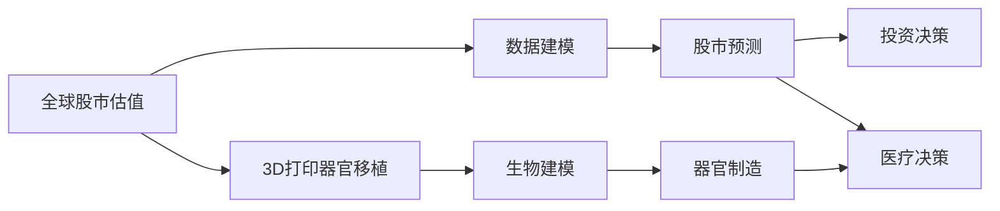
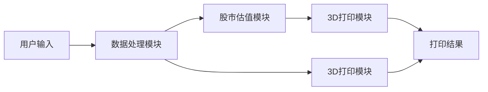
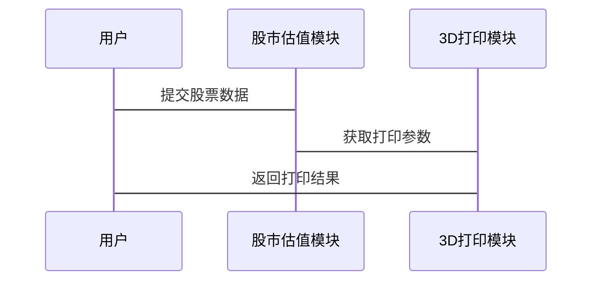

                 


# 全球股市估值与3D打印器官移植的伦理问题

---

## 关键词：全球股市、估值模型、3D打印、器官移植、伦理问题

---

## 摘要：

本文探讨了全球股市估值与3D打印器官移植两个看似不相关的领域的联系，分析了它们在技术原理、应用场景和伦理问题上的异同。通过结合金融与生物技术，本文深入探讨了股市估值算法、3D打印技术的数学模型，以及两者在系统设计中的综合应用。同时，本文重点分析了3D打印器官移植带来的伦理挑战，并提出了平衡技术创新与伦理问题的最佳实践建议。

---

## 第一部分：背景介绍

### 第1章：全球股市估值的背景与现状

#### 1.1 全球股市估值的基本概念

股市估值是通过对公司基本面、市场趋势和宏观经济指标进行分析，以确定股票的合理价格区间。主要方法包括市盈率（P/E）、市净率（P/B）和现金流折现模型（DCF）。这些方法依赖于大量数据的处理和分析，近年来，随着人工智能和大数据技术的引入，股市估值模型逐渐向自动化、智能化方向发展。

#### 1.2 3D打印技术的背景与现状

3D打印技术是一种基于数字模型的快速成型技术，通过逐层堆叠材料来构建三维物体。其在医疗领域的应用尤为突出，尤其是器官移植领域。3D打印技术能够制造复杂的器官结构，如肾脏、肝脏和骨骼，为解决器官捐献短缺问题提供了新思路。

#### 1.3 全球股市估值与3D打印技术的联系

尽管两者分属不同领域，但它们都涉及数据的处理与分析。股市估值依赖于大量数据的建模与预测，而3D打印技术则需要精确的几何建模和材料性能分析。此外，两者的创新都可能引发伦理问题：股市估值算法可能导致市场操纵，而3D打印器官移植可能引发隐私和公平性问题。

---

## 第二部分：核心概念与联系

### 第2章：核心概念与联系

#### 2.1 核心概念的对比分析

| 概念 | 全球股市估值 | 3D打印器官移植 |
|------|--------------|-----------------|
| 核心目标 | 确定股票合理价格 | 制造生物器官 |
| 数据来源 | 市场数据、财务报表 | CAD模型、生物数据 |
| 技术挑战 | 数据噪声、市场波动 | 制造精度、材料限制 |
| 伦理问题 | 市场操纵、利益冲突 | 隐私保护、公平性 |

#### 2.2 核心概念的联系

以下是核心概念联系的Mermaid图：



---

## 第三部分：算法原理与数学模型

### 第3章：算法原理

#### 3.1 股市估值的算法原理

##### 3.1.1 基于机器学习的股市预测模型


##### 3.1.2 基于LSTM的时序预测模型

代码示例：

```python
import numpy as np
from keras.layers import LSTM, Dense
from keras.models import Sequential

# 示例数据：股票价格序列
data = np.random.random((1000, 1))

# 模型构建
model = Sequential()
model.add(LSTM(64, input_shape=(None, 1)))
model.add(Dense(1))
model.compile(loss='mean_squared_error', optimizer='adam')

# 训练
model.fit(data, data, epochs=10, batch_size=32)
```

##### 3.1.3 数学模型

LSTM的数学模型：

$$
f(t) = \sigma(W_{f}x_t + U_{f}h_{t-1} + b_f)
$$

其中：
- $W_f$ 和 $U_f$ 是权重矩阵
- $b_f$ 是偏置项
- $\sigma$ 是sigmoid函数

#### 3.2 3D打印器官移植的算法原理

##### 3.2.1 基于点阵的3D打印算法

代码示例：

```python
import numpy as np
from scipy.ndimage import morphology

# 示例点阵
points = np.random.random((100, 3))

# 点阵扩展
def expand_points(points, radius):
    expanded = []
    for point in points:
        x, y, z = point
        for i in range(int(-radius), int(radius)+1):
            expanded.append((x+i, y+i, z+i))
    return expanded

expanded_points = expand_points(points, 2)
```

##### 3.2.2 数学模型

3D打印的几何模型：

$$
V(x, y, z) = \sum_{i=1}^{n} w_i \cdot f(x_i, y_i, z_i)
$$

其中：
- $w_i$ 是权重
- $f(x_i, y_i, z_i)$ 是基函数

---

## 第四部分：系统分析与架构设计

### 第4章：系统分析与架构设计

#### 4.1 系统功能设计

##### 4.1.1 股市估值模块

- 数据采集：实时采集股票市场数据
- 数据处理：清洗、特征提取
- 预测模块：基于LSTM的预测模型
- 结果输出：生成股票估值报告

##### 4.1.2 3D打印模块

- 模型输入：接收3D器官模型
- 参数设置：材料选择、打印精度
- 打印控制：实时监控打印过程
- 结果输出：生成打印完成的器官

#### 4.2 系统架构设计



#### 4.3 系统交互设计



---

## 第五部分：伦理问题与最佳实践

### 第5章：伦理问题与最佳实践

#### 5.1 伦理问题

- **隐私问题**：3D打印器官移植可能涉及患者隐私数据的泄露。
- **公平性问题**：高成本可能导致技术仅限于富裕阶层。
- **责任归属**：打印失败的责任划分。

#### 5.2 最佳实践

- **数据保护**：采用加密技术保护患者数据。
- **成本控制**：推动技术普及，降低使用成本。
- **责任界定**：制定明确的责任划分标准。

---

## 结论与展望

本文探讨了全球股市估值与3D打印器官移植的伦理问题，分析了它们在技术原理和系统设计上的联系。通过结合现代技术，我们能够解决一些传统方法无法处理的问题，但同时也需要关注伦理挑战。未来，随着技术的不断进步，我们期待在技术创新与伦理保护之间找到更优的平衡点。

---

## 作者：AI天才研究院/AI Genius Institute & 禅与计算机程序设计艺术 /Zen And The Art of Computer Programming

