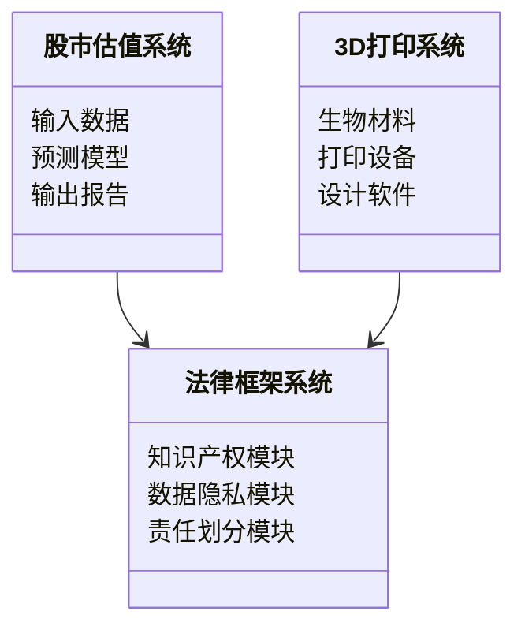
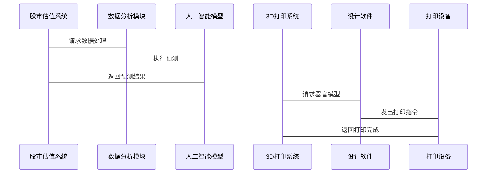

                 


```markdown
# 全球股市估值与3D打印器官移植的法律问题

> 关键词：全球股市估值，3D打印器官移植，知识产权，数据隐私，法律框架

> 摘要：本文探讨了全球股市估值与3D打印器官移植之间的法律问题。通过分析股市估值的技术挑战和3D打印器官移植的法律困境，揭示了两者在知识产权、数据隐私和责任划分等方面的核心问题，并提出了基于区块链技术的解决方案，构建完整的法律框架，确保技术与法律的和谐发展。

---

# 第一章: 引言

## 1.1 问题背景

### 1.1.1 全球股市估值的重要性
- 股市估值是金融市场的核心，影响投资者决策和市场稳定。
- 传统估值方法（如市盈率、市净率）面临数据不透明和模型局限性。

### 1.1.2 3D打印器官移植的技术突破
- 3D打印技术在医疗领域的应用，推动了器官移植的革命。
- 现阶段仍面临技术成熟度和法律认可的双重挑战。

### 1.1.3 两者的结合与法律问题的提出
- 技术进步带来新机遇，但也引发新的法律问题。
- 如何平衡技术创新与法律合规，是当前亟需解决的难题。

---

## 1.2 问题描述

### 1.2.1 全球股市估值的现状与挑战
- 数据分析和人工智能的应用提高了估值的准确性，但也带来了数据隐私和算法黑箱的问题。
- 区块链技术在提升透明度的同时，面临合规性挑战。

### 1.2.2 3D打印器官移植的法律困境
- 知识产权保护不足，导致技术滥用和侵权风险。
- 数据隐私问题突出，患者隐私与技术共享的矛盾难以调和。
- 责任划分不清，影响医疗机构和制造商的积极性。

### 1.2.3 问题解决的必要性
- 建立统一的法律框架，规范技术应用。
- 通过技术创新解决法律难题，推动技术与法律的协同发展。

---

# 第二章: 全球股市估值的现状与挑战

## 2.1 全球股市估值的传统方法

### 2.1.1 市盈率法
- 市盈率 = 股价 / 每股净利润
- 适用于盈利稳定的公司，但受市场情绪影响较大。

### 2.1.2 市净率法
- 市净率 = 股价 / 每股净资产
- 适用于净资产驱动的行业，如银行和房地产。

### 2.1.3 股息率法
- 股息率 = 每股股息 / 股价
- 适用于收益稳定的公用事业和消费行业。

## 2.2 现代技术在股市估值中的应用

### 2.2.1 大数据分析
- 使用大数据分析公司财务数据和市场行为，预测股价走势。
- 通过机器学习算法优化预测模型，减少人为干扰。

### 2.2.2 人工智能
- 利用自然语言处理技术分析新闻和社交媒体情绪，辅助估值。
- 基于深度学习的预测模型在高频交易中表现优异。

### 2.2.3 区块链技术
- 提供透明的交易记录，增强市场信任。
- 通过智能合约自动执行交易，减少人为操作风险。

## 2.3 股市估值中的法律问题

### 2.3.1 信息披露
- 公司必须按法律规定披露财务信息，确保市场公平。
- 未按规定披露信息可能导致法律处罚和市场信任危机。

### 2.3.2 股市操纵
- 内幕交易、市场操纵等违法行为严重破坏市场秩序。
- 法律需加大处罚力度，利用技术手段监控异常交易。

### 2.3.3 股票发行
- 需符合证监会的合规要求，确保发行过程的透明和公平。
- 投资者需充分了解风险，保护自身权益。

---

# 第三章: 3D打印器官移植的法律问题

## 3.1 3D打印器官移植的技术基础

### 3.1.1 器官打印的基本原理
- 使用生物材料和3D打印技术，制造定制化器官。
- 打印过程需确保材料的生物相容性和结构完整性。

### 3.1.2 技术优势
- 解决器官供体短缺问题，提高治疗效果。
- 可定制化器官尺寸和功能，适应患者个体需求。

### 3.1.3 技术挑战
- 打印精度和生物材料的稳定性仍需进一步提升。
- 器官功能和人体适应性有待长期观察。

## 3.2 3D打印器官移植的法律问题

### 3.2.1 知识产权
- 技术研发涉及多方合作，需明确知识产权归属。
- 避免技术滥用，防止专利垄断影响公共利益。

### 3.2.2 数据隐私
- 患者数据用于器官设计，需严格保护隐私。
- 医疗机构和制造商的数据共享需符合GDPR等法规。

### 3.2.3 责任划分
- 器官打印失败的责任归属尚不明确。
- 医疗机构和制造商需明确责任分担，避免法律纠纷。

---

# 第四章: 技术与法律的融合

## 4.1 区块链技术在法律中的应用

### 4.1.1 知识产权保护
- 利用区块链记录技术开发过程，确保知识产权归属。
- 通过智能合约自动执行许可协议，防止侵权行为。

### 4.1.2 数据隐私保护
- 区块链提供分布式存储，确保数据不可篡改。
- 使用零知识证明技术，保护患者隐私。

## 4.2 法律框架的构建

### 4.2.1 监管机构的职责
- 明确监管范围，确保技术应用符合法律要求。
- 制定行业标准，规范技术使用和数据共享。

### 4.2.2 合规要求
- 技术应用需符合GDPR等隐私保护法规。
- 医疗机构和制造商需通过合规认证，确保合法运营。

### 4.2.3 责任分担
- 建立多方责任分担机制，明确各方义务。
- 通过保险机制分散风险，保障患者权益。

---

# 第五章: 系统分析与架构设计

## 5.1 系统功能设计

### 5.1.1 领域模型（Mermaid 类图）


### 5.1.2 系统架构设计（Mermaid 架构图）
```mermaid
docker
    股市估值系统
    3D打印系统
    法律框架系统
    通信总线
```

### 5.1.3 系统接口设计（Mermaid 序列图）


---

# 第六章: 项目实战

## 6.1 环境安装

```bash
pip install mermaid
npm install mermaid
```

## 6.2 核心实现

### 6.2.1 股市估值代码
```python
import pandas as pd
from sklearn.linear_model import LinearRegression

data = pd.read_csv('stock.csv')
X = data[['PE', 'PB', 'ROE']]
y = data['Price']

model = LinearRegression()
model.fit(X, y)

prediction = model.predict(X)
print(prediction)
```

### 6.2.2 3D打印器官移植代码
```python
def print_organ(desgın):
    import numpy as np
    from stl import mesh

    # 加工生物材料
    material = design.material
    # 设备参数设置
    device = design.device
    # 打印过程
    mesh = device.print(material)
    return mesh
```

## 6.3 案例分析

### 6.3.1 股市估值案例
- 使用历史数据训练模型，预测未来股价走势。
- 对比不同算法的预测精度，优化模型参数。

### 6.3.2 3D打印器官移植案例
- 模拟打印过程，验证设备性能和材料兼容性。
- 分析打印失败的原因，改进技术方案。

---

# 第七章: 总结与展望

## 7.1 总结
- 全球股市估值与3D打印器官移植的结合，推动了技术与法律的协同发展。
- 区块链技术为解决法律难题提供了新的思路。

## 7.2 展望
- 技术创新将继续推动法律框架的完善。
- 多学科交叉研究将成为未来的重要方向。

---

# 附录

## 术语表
- 股市估值：通过对公司财务数据和市场因素进行分析，确定股票的合理价格。
- 3D打印器官移植：利用3D打印技术制造人体器官，解决供体短缺问题。

## 法规汇编
- GDPR：《通用数据保护条例》，规范个人数据的处理和流通。
-《专利法》：保护技术创新，防止技术滥用。

## 案例分析
- 某公司因未按规定披露信息被罚款500万元。
- 某机构因3D打印技术专利侵权被起诉。

---

作者：AI天才研究院/AI Genius Institute & 禅与计算机程序设计艺术/Zen And The Art of Computer Programming
```

