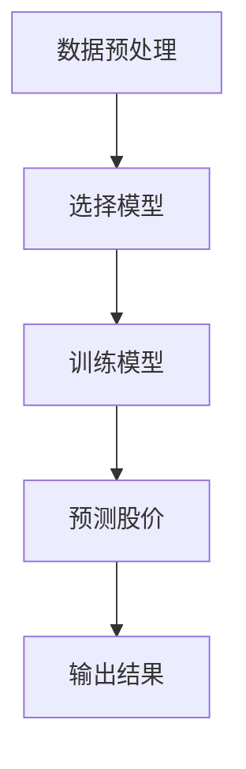
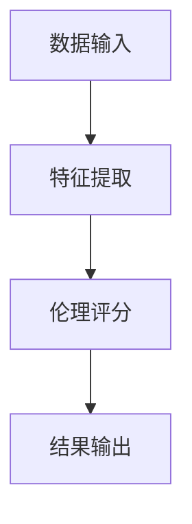
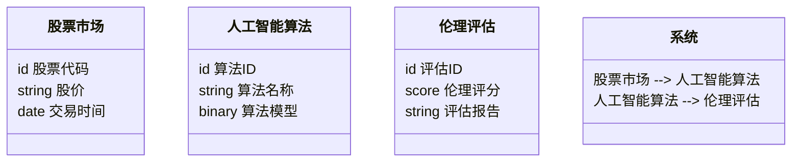
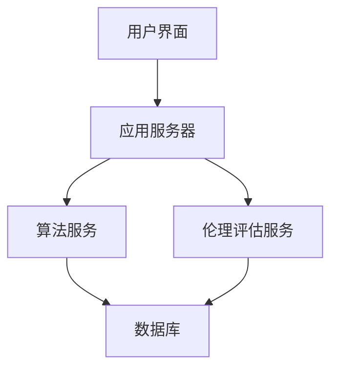

                 


# 全球股市估值与人工智能伦理的关联

## 关键词：全球股市估值，人工智能伦理，关联，算法，系统设计，项目实战

## 摘要：  
本文探讨了全球股市估值与人工智能伦理之间的关联性，从理论到实践，系统地分析了两者的核心概念、算法原理、系统架构设计以及项目实战。通过具体案例和数学模型的详细解读，本文展示了如何将人工智能技术应用于股市估值，同时确保伦理合规性，为未来的金融创新提供了新的思路。

---

# 第一部分：背景介绍

## 第1章：全球股市估值与人工智能伦理的关联概述

### 1.1 问题背景与定义

#### 1.1.1 全球股市估值的核心概念
- 股市估值是通过对公司基本面分析、市场趋势和宏观经济指标等多维度数据，对股票的内在价值进行评估的过程。
- 传统估值方法包括市盈率（P/E）、市净率（P/B）等，但随着数据量的爆炸式增长，基于人工智能的预测模型逐渐成为主流。

#### 1.1.2 人工智能伦理的基本定义
- 人工智能伦理涉及算法的公平性、透明性、隐私保护等方面。例如，算法是否对某些群体存在偏见，是否符合监管要求等。
- 在金融领域，人工智能伦理尤为重要，因为算法决策直接影响投资者的收益和风险。

#### 1.1.3 两者的关联性与研究意义
- 股市估值需要依赖大量数据和算法，而算法的伦理合规性直接影响估值的准确性。
- 研究两者的关联性，有助于在金融创新中平衡效率与合规性。

### 1.2 核心概念与边界

#### 1.2.1 股市估值的关键要素
- 数据来源：包括历史股价、财务报表、市场新闻等。
- 模型选择：如ARIMA、LSTM等时间序列模型。
- 风险因素：市场波动、政策变化等。

#### 1.2.2 人工智能伦理的核心原则
- 公平性：避免算法歧视。
- 透明性：确保决策过程可解释。
- 隐私保护：防止数据滥用。

#### 1.2.3 问题的边界与外延
- 本文主要关注算法在股市估值中的应用，不涉及算法的底层开发。
- 研究范围限定于金融领域，不涉及其他行业的伦理问题。

---

# 第二部分：核心概念与联系

## 第2章：核心概念原理与属性对比

### 2.1 股市估值与人工智能伦理的属性特征

| 属性维度 | 股市估值 | 人工智能伦理 |
|----------|----------|--------------|
| 数据依赖性 | 高 | 高 |
| 计算复杂性 | 高 | 中 |
| 监管要求 | 严格 | 严格 |
| 应用场景 | 金融 | 金融、医疗等 |

#### 2.2 实体关系图

```mermaid
erDiagram
    class 股票市场 {
        id 股票代码
        string 股价
        date 交易时间
    }
    class 人工智能算法 {
        id 算法ID
        string 算法名称
        binary 算法模型
    }
    class 伦理评估 {
        id 评估ID
        score 伦理评分
        string 评估报告
    }
    股票市场 --> 人工智能算法 : 使用
    人工智能算法 --> 伦理评估 : 驱动
```

---

# 第三部分：算法原理讲解

## 第3章：算法原理与流程

### 3.1 股市估值算法

#### 使用 Mermaid 绘制的算法流程图



#### Python 实现：基于 ARIMA 模型的股票价格预测代码

```python
import pandas as pd
from statsmodels.tsa.arima.model import ARIMA
import matplotlib.pyplot as plt

# 加载数据
data = pd.read_csv('stock_price.csv')

# 数据预处理
data['date'] = pd.to_datetime(data['date'])
data.set_index('date', inplace=True)

# 训练模型
model = ARIMA(data['price'], order=(5, 1, 0))
model_fit = model.fit()

# 预测
forecast = model_fit.forecast(steps=5)

# 可视化
plt.plot(data['price'], label='实际价格')
plt.plot(forecast, label='预测价格')
plt.legend()
plt.show()
```

### 3.2 人工智能伦理评估算法

#### 使用 Mermaid 绘制的伦理评估流程图



#### Python 实现：基于神经网络的伦理评分系统代码

```python
import tensorflow as tf
from tensorflow.keras import layers

# 定义模型
model = tf.keras.Sequential([
    layers.Dense(64, activation='relu'),
    layers.Dense(1, activation='sigmoid')
])

# 编译模型
model.compile(optimizer='adam', loss='binary_crossentropy')

# 训练模型
model.fit(X_train, y_train, epochs=10, batch_size=32)

# 预测
y_pred = model.predict(X_test)
```

---

## 第四部分：数学模型与公式

### 第4章：数学模型与公式

#### 4.1 股市估值模型

- ARIMA 模型的数学公式：  
  $$ARIMA(p, d, q)$$  
  其中，p 为自回归阶数，d 为差分阶数，q 为移动平均阶数。

- LSTM 网络的数学公式：  
  $$f(t) = \sigma(g(t-1, x_t))$$  
  其中，$\sigma$ 是sigmoid函数，$g$ 是LSTM的隐藏层计算函数。

#### 4.2 人工智能伦理评估模型

- 基于神经网络的伦理评分公式：  
  $$score = \sum_{i=1}^{n} w_i x_i$$  
  其中，$w_i$ 是权重，$x_i$ 是特征。

---

## 第五部分：系统分析与架构设计

## 第5章：系统分析与架构设计

### 5.1 问题场景介绍

- 系统目标：设计一个结合股市数据和伦理评估的智能估值系统。
- 使用场景：投资者通过系统获取股票的估值结果和伦理评分。

### 5.2 系统功能设计

#### 使用 Mermaid 绘制的领域模型类图



### 5.3 系统架构设计

#### 使用 Mermaid 绘制的系统架构图



### 5.4 系统接口设计

- API 接口：  
  - POST /predict：接收股票代码，返回预测结果和伦理评分。
  - GET /score：返回算法的伦理评分详情。

---

## 第六部分：项目实战

## 第6章：项目实战与案例分析

### 6.1 环境安装与配置

```bash
pip install pandas statsmodels tensorflow matplotlib
```

### 6.2 核心代码实现

#### 股市估值代码

```python
# 数据加载与预处理
import pandas as pd
import numpy as np

data = pd.read_csv('stock_price.csv')
data['date'] = pd.to_datetime(data['date'])
data.set_index('date', inplace=True)

# 训练模型
from statsmodels.tsa.arima.model import ARIMA
model = ARIMA(data['price'], order=(5, 1, 0))
model_fit = model.fit()

# 预测
forecast = model_fit.forecast(steps=5)
```

#### 伦理评估代码

```python
# 数据加载与预处理
import pandas as pd
import tensorflow as tf

data = pd.read_csv('ethics_data.csv')
X = data.drop('label', axis=1)
y = data['label']

# 训练模型
model = tf.keras.Sequential([
    layers.Dense(64, activation='relu'),
    layers.Dense(1, activation='sigmoid')
])
model.compile(optimizer='adam', loss='binary_crossentropy')
model.fit(X, y, epochs=10, batch_size=32)
```

### 6.3 案例分析

#### 案例一：ARIMA 模型预测股票价格

- 输入数据：某股票的历史股价数据。
- 输出结果：未来5个交易日的预测价格。
- 可视化：实际价格与预测价格的对比图。

#### 案例二：神经网络伦理评分

- 输入数据：股票相关的新闻和社交媒体数据。
- 输出结果：股票的伦理评分（0-1）。
- 分析：评分高的股票在伦理合规性方面表现较好。

---

## 第七部分：总结与展望

## 第7章：总结与展望

### 7.1 本文总结

- 本文系统地探讨了全球股市估值与人工智能伦理的关联性。
- 提出了基于ARIMA和神经网络的算法模型，并结合实际案例进行了详细分析。

### 7.2 未来研究方向

- 研究更复杂的算法，如Transformer模型在股市估值中的应用。
- 探讨人工智能伦理在金融领域的更多应用场景。

### 7.3 注意事项与建议

- 在实际应用中，需注意数据隐私保护。
- 建议投资者结合算法结果和专业分析进行决策。

### 7.4 拓展阅读

- 推荐阅读《算法伦理：人工智能的公平性与透明性》。
- 参考《金融时间序列分析》相关文献。

---

作者：AI天才研究院/AI Genius Institute & 禅与计算机程序设计艺术 /Zen And The Art of Computer Programming

