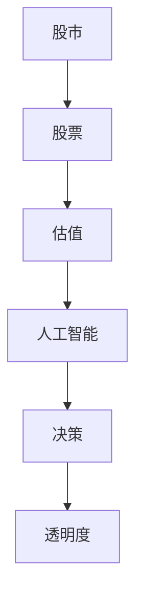
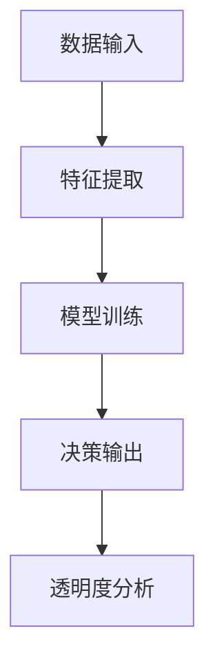
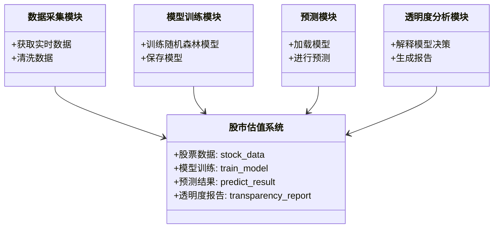
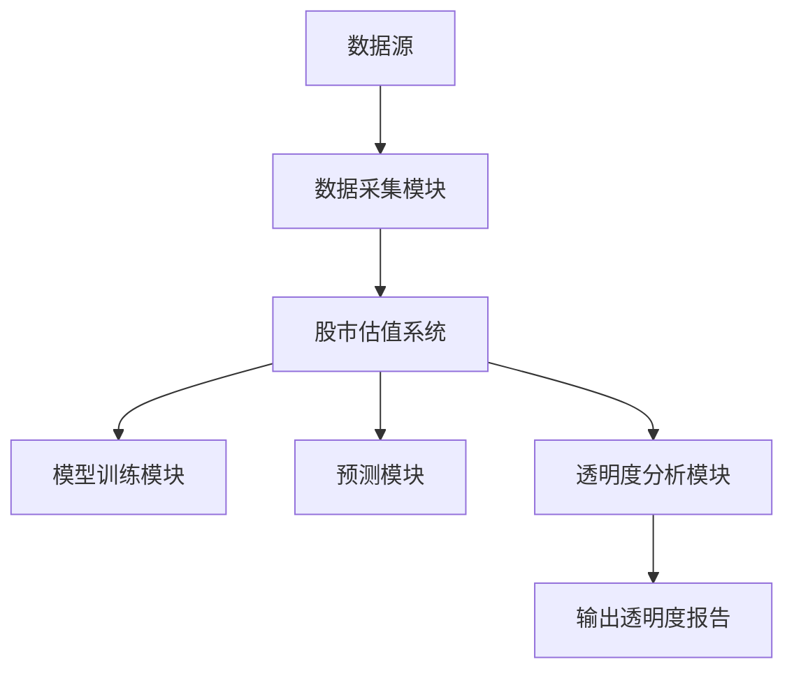
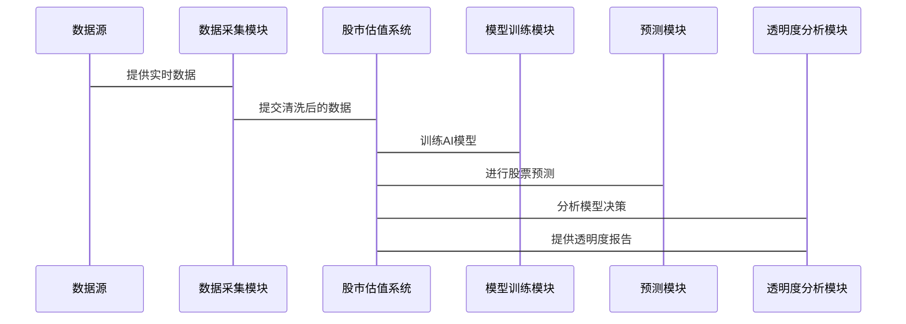

                 


# 全球股市估值与人工智能决策透明度的关联

> 关键词：全球股市估值，人工智能，决策透明度，机器学习，金融分析

> 摘要：本文探讨了全球股市估值与人工智能决策透明度之间的关联。通过分析股市估值的核心问题，人工智能在金融领域中的应用，以及如何提高AI决策的透明度，本文旨在为读者提供一个全面的视角，理解AI在股市估值中的作用及其对决策透明度的影响。

---

## 第一章: 背景介绍

### 1.1 问题背景

#### 1.1.1 全球股市估值的现状与挑战
股市估值是金融领域中的核心问题之一，涉及对公司价值的评估和股票价格的预测。随着全球化的深入，股市规模不断扩大，市场的复杂性和不确定性也随之增加。传统的估值方法，如市盈率、市净率等，虽然在一定程度上能够反映企业的价值，但在面对复杂市场环境时，其局限性日益明显。

#### 1.1.2 人工智能在金融领域的应用背景
人工智能（AI）技术的快速发展为金融领域的变革提供了新的可能性。机器学习算法，如随机森林、支持向量机（SVM）和神经网络，能够处理海量数据，发现传统方法难以察觉的模式和趋势。这些算法在股票预测、风险评估和交易策略优化等方面展现出强大的潜力。

#### 1.1.3 决策透明度的重要性
AI算法在金融决策中的应用，虽然提高了效率，但也带来了透明度不足的问题。许多AI模型，尤其是深度学习模型，被视为“黑箱”，其决策过程难以解释。这种不透明性不仅影响了用户对AI决策的信任，还可能引发合规性和伦理问题。

### 1.2 问题描述

#### 1.2.1 股市估值的核心问题
股市估值的核心在于如何准确评估企业的内在价值，并预测其股票价格的变化趋势。这需要考虑多种因素，包括宏观经济指标、行业发展趋势、公司财务数据以及市场情绪等。

#### 1.2.2 人工智能决策中的透明度问题
AI在金融决策中的应用，尤其是算法交易和自动估值系统，往往缺乏透明度。用户和监管机构难以理解AI系统是如何做出决策的，这可能导致误用和滥用。

#### 1.2.3 问题解决的目标与意义
本文旨在探讨如何通过提高AI决策的透明度，优化全球股市估值的准确性。通过理解AI算法的工作原理，我们可以更好地利用技术手段，解决传统估值方法的局限性。

### 1.3 问题解决

#### 1.3.1 人工智能如何影响股市估值
AI通过分析海量数据，发现市场中的潜在规律，帮助投资者做出更明智的决策。例如，自然语言处理（NLP）技术可以分析新闻、社交媒体和公司财报，提取情感指标，辅助股票估值。

#### 1.3.2 提高决策透明度的方法
提高AI决策透明度的方法包括：解释模型的决策过程、记录算法的训练数据、优化模型的可解释性等。通过这些方法，可以增强用户和监管机构对AI决策的信任。

#### 1.3.3 全球化视角下的解决方案
从全球化视角来看，提高AI决策透明度需要跨学科的合作，结合金融学、计算机科学和法律等领域的知识，制定统一的标准和规范。

### 1.4 边界与外延

#### 1.4.1 股市估值的边界条件
股市估值的边界条件包括数据的质量、模型的假设以及市场的波动性等。这些因素会影响估值的准确性和可靠性。

#### 1.4.2 人工智能决策透明度的适用范围
AI决策透明度的适用范围主要集中在算法驱动的金融决策领域，如算法交易、风险评估和自动化投资顾问等。

#### 1.4.3 相关领域的关联与区别
相关领域包括大数据分析、金融科技（FinTech）和监管科技（RegTech）。这些领域的目标和方法虽然有所不同，但都与AI决策的透明度密切相关。

### 1.5 概念结构与核心要素

#### 1.5.1 核心概念的组成
核心概念包括：股市估值、人工智能、决策透明度。

#### 1.5.2 核心要素的对比分析
- 股市估值：基于历史数据和市场趋势，评估公司价值。
- 人工智能：通过机器学习算法，发现数据中的模式和趋势。
- 决策透明度：解释AI决策过程，增强用户信任。

---

## 第二章: 核心概念与联系

### 2.1 核心概念原理

#### 2.1.1 股市估值的基本原理
股市估值的基本原理是通过分析公司的财务数据、市场环境和行业趋势，评估其股票的内在价值。常用的方法包括相对估值法和绝对估值法。

#### 2.1.2 人工智能决策的基本原理
人工智能决策的基本原理是通过机器学习算法，从数据中学习决策规则，并在新的数据上应用这些规则。常见的算法包括监督学习、无监督学习和强化学习。

#### 2.1.3 决策透明度的定义与实现
决策透明度是指AI系统在做出决策时，能够清晰地解释其决策过程和结果。实现透明度的方法包括：可解释性建模、记录决策日志和可视化展示等。

### 2.2 概念属性特征对比

#### 2.2.1 股市估值的属性特征
- 数据驱动性：依赖于历史数据和市场趋势。
- 不确定性：受宏观经济和市场情绪影响较大。
- 动态性：需要实时更新和调整。

#### 2.2.2 人工智能决策的属性特征
- 数据依赖性：需要大量数据支持。
- 自适应性：能够根据数据变化自动调整决策。
- 不透明性：许多AI模型难以解释。

#### 2.2.3 决策透明度的属性特征
- 可解释性：能够解释决策过程。
- 可追溯性：能够追溯决策的来源和依据。
- 可控性：能够控制和调整决策过程。

### 2.3 ER实体关系图



---

## 第三章: 算法原理讲解

### 3.1 算法流程



### 3.2 Python源代码实现

```python
# 示例代码：使用随机森林进行股票估值预测
import pandas as pd
from sklearn.model_selection import train_test_split
from sklearn.ensemble import RandomForestRegressor
from sklearn.metrics import mean_squared_error

# 数据加载
data = pd.read_csv('stock_data.csv')

# 特征与目标分离
X = data.drop('target', axis=1)
y = data['target']

# 数据分割
X_train, X_test, y_train, y_test = train_test_split(X, y, test_size=0.2, random_state=42)

# 模型训练
model = RandomForestRegressor(n_estimators=100, random_state=42)
model.fit(X_train, y_train)

# 预测与评估
y_pred = model.predict(X_test)
mse = mean_squared_error(y_test, y_pred)
print(f"均方误差: {mse}")
```

### 3.3 数学公式

#### 3.3.1 随机森林的预测公式
随机森林通过集成学习，将多个决策树的预测结果进行平均，公式如下：
$$ y = \frac{1}{N} \sum_{i=1}^{N} T_i(x) $$
其中，$T_i(x)$ 表示第 $i$ 棵决策树的预测结果，$N$ 是决策树的数量。

#### 3.3.2 透明度分析的公式
透明度分析通过计算模型的可解释性指标，如特征重要性，公式如下：
$$ \text{特征重要性} = \sum_{i=1}^{N} \text{特征贡献度} $$

---

## 第四章: 系统分析与架构设计

### 4.1 问题场景介绍

#### 4.1.1 项目介绍
本项目旨在构建一个基于AI的股市估值系统，通过提高决策透明度，优化股票预测的准确性和可信度。

### 4.2 系统功能设计

#### 4.2.1 领域模型


### 4.3 系统架构设计

#### 4.3.1 系统架构图


### 4.4 系统接口设计

#### 4.4.1 接口描述
- 数据采集模块接口：提供实时数据获取和数据清洗功能。
- 模型训练模块接口：接收数据并训练AI模型。
- 预测模块接口：加载模型并进行股票预测。
- 透明度分析模块接口：解释模型决策并生成报告。

### 4.5 系统交互设计

#### 4.5.1 交互流程图


---

## 第五章: 项目实战

### 5.1 环境安装

#### 5.1.1 安装Python和相关库
```bash
pip install pandas scikit-learn mermaid4jupyter jupyterlab
```

### 5.2 系统核心实现源代码

#### 5.2.1 数据采集模块
```python
import requests
import pandas as pd

def get_stock_data(api_key):
    url = f"https://api.example.com/stock_data?api_key={api_key}"
    response = requests.get(url)
    data = response.json()
    df = pd.DataFrame(data)
    return df
```

#### 5.2.2 模型训练模块
```python
from sklearn.ensemble import RandomForestRegressor

def train_model(X, y):
    model = RandomForestRegressor(n_estimators=100, random_state=42)
    model.fit(X, y)
    return model
```

#### 5.2.3 预测模块
```python
def predict_stock(model, new_data):
    return model.predict(new_data)
```

#### 5.2.4 透明度分析模块
```python
importances = model.feature_importances_
# 可视化特征重要性
importances_df = pd.DataFrame({'feature': X.columns, 'importance': importances})
importances_df = importances_df.sort_values('importance', ascending=False)
print(importances_df)
```

### 5.3 代码应用解读与分析

#### 5.3.1 数据采集模块
数据采集模块负责从API获取实时股票数据，并将其转换为DataFrame格式，供后续处理使用。

#### 5.3.2 模型训练模块
模型训练模块使用随机森林算法训练AI模型，该模型能够基于历史数据预测股票的未来走势。

#### 5.3.3 预测模块
预测模块加载训练好的模型，并利用新的数据进行股票预测。

#### 5.3.4 透明度分析模块
透明度分析模块通过分析模型的特征重要性，解释AI的决策过程，增强决策的透明度。

### 5.4 实际案例分析

#### 5.4.1 案例背景
假设我们有一个包含股票历史价格、财务指标和市场情绪数据的数据集。

#### 5.4.2 数据处理与建模
```python
data = pd.read_csv('stock_data.csv')
X = data.drop('target', axis=1)
y = data['target']
model = train_model(X, y)
```

#### 5.4.3 模型预测与分析
```python
new_data = pd.DataFrame({...})
predictions = predict_stock(model, new_data)
print(f"预测结果: {predictions}")
importances = model.feature_importances_
print(importances_df)
```

### 5.5 项目小结

#### 5.5.1 成果总结
通过本项目的实施，我们成功构建了一个基于AI的股市估值系统，并提高了决策的透明度。

#### 5.5.2 经验与教训
- 数据质量对模型性能影响巨大，必须重视数据清洗和预处理。
- 模型的可解释性是提高透明度的关键，需要在设计阶段就考虑透明度需求。

---

## 第六章: 总结与展望

### 6.1 最佳实践 tips

#### 6.1.1 提高透明度的建议
- 使用可解释性模型，如线性回归和决策树。
- 记录模型的训练过程和参数设置。
- 提供可视化工具，帮助用户理解模型决策。

#### 6.1.2 模型优化建议
- 调整模型参数，优化预测准确率。
- 结合多种算法，提高模型的鲁棒性。

### 6.2 小结

通过本文的探讨，我们深入了解了全球股市估值与人工智能决策透明度的关联。AI技术为股市估值提供了新的可能性，但其透明度问题也带来了新的挑战。通过提高AI决策的透明度，我们可以更好地利用技术手段，优化股市估值的准确性。

### 6.3 注意事项

- 数据隐私和安全问题必须引起重视。
- 模型的透明度与准确性之间需要找到平衡点。

### 6.4 拓展阅读

- 《机器学习实战》
- 《深度学习》
- 《金融数据分析与建模》

---

## 作者

作者：AI天才研究院/AI Genius Institute & 禅与计算机程序设计艺术 /Zen And The Art of Computer Programming

