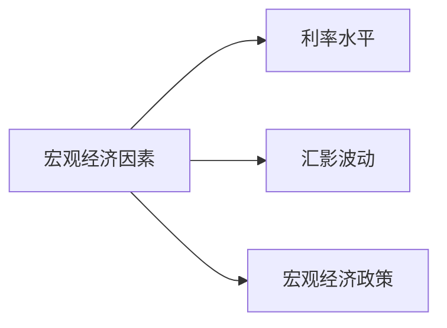
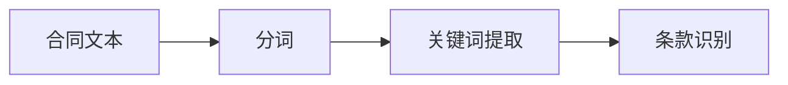

                 


# 全球股市估值与人工智能在法律合规中的应用

> 关键词：全球股市估值，人工智能，法律合规，股票分析，技术应用

> 摘要：本文探讨了全球股市估值的核心方法和影响因素，同时分析了人工智能技术在法律合规领域的创新应用。通过详细的技术分析和实际案例，展示了如何利用AI提升股市估值的准确性和法律合规的效率。

---

## 第一部分: 全球股市估值基础

### 第1章: 全球股市估值概述

#### 1.1 股市估值的基本概念

股市估值是通过对公司财务数据和市场情况的分析，确定其股票的合理价格范围。它帮助投资者判断股票是否被高估或低估。

**核心概念：**
- **定义**：股市估值是评估股票内在价值的过程。
- **重要性**：帮助投资者做出理性决策，避免盲目跟风。
- **特点**：动态变化，受多种因素影响。

#### 1.2 股市估值的核心指标

股市估值常用的指标包括市盈率（P/E）、市净率（P/B）和股息率（Dividend Yield）。

**表格对比：**

| 指标名称   | 计算公式                     | 主要用途                     |
|------------|------------------------------|------------------------------|
| 市盈率     | P/E = 价格 / 每股收益         | 评估股票相对于市场的价值     |
| 市净率     | P/B = 价格 / 每股净资产       | 适用于净资产驱动的公司       |
| 股息率     | Dividend Yield = 每股股息 / 价格 | 评估收益能力                 |

#### 1.3 股市估值的主要方法

- **市场法**：基于市场可比公司进行估值。
- **收入法**：通过未来现金流折现计算。
- **资产法**：评估公司资产的公允价值。

### 第2章: 全球股市估值的影响因素

#### 2.1 宏观经济因素

宏观经济状况直接影响股市估值。例如，利率上升可能导致股市整体估值下降。

**图表分析：**



#### 2.2 行业因素

行业周期和竞争格局影响公司估值。例如，处于上升期的行业通常有更高的估值。

#### 2.3 公司基本面因素

公司盈利能力、财务状况直接影响估值。例如，高盈利能力的公司通常有更高的市盈率。

### 第3章: 全球股市估值模型

#### 3.1 常用估值模型概述

- **DCF模型**：通过现金流折现计算内在价值。
- **市盈率模型**：基于可比公司市盈率估算。
- **市净率模型**：适用于资产密集型行业。

#### 3.2 DCF模型的详细分析

**公式推导：**

$$ \text{企业价值} = \sum_{t=1}^{n} \frac{\text{现金流}_t}{(1 + r)^t} + \frac{\text{终值}}{(1 + r)^n} $$

其中，r是折现率，n是预测年数。

**Python代码实现：**

```python
def dcf_model(free_cash_flows, discount_rate, terminal_value):
    present_value = 0
    for t in range(len(free_cash_flows)):
        present_value += free_cash_flows[t] / (1 + discount_rate)**t
    present_value += terminal_value / (1 + discount_rate)**len(free_cash_flows)
    return present_value

# 示例
free_cash_flows = [100, 150, 200]
discount_rate = 0.1
terminal_value = 500
print(dcf_model(free_cash_flows, discount_rate, terminal_value))
```

---

## 第二部分: 人工智能在法律合规中的应用

### 第4章: 人工智能与法律合规概述

#### 4.1 人工智能的基本概念

人工智能技术包括自然语言处理（NLP）、机器学习和深度学习，广泛应用于法律领域。

#### 4.2 人工智能在法律合规中的应用

- **合同审查**：使用NLP识别关键条款。
- **合规监控**：利用机器学习分析法律文本，识别潜在风险。

### 第5章: 人工智能在法律合规中的具体应用

#### 5.1 合同审查

**自然语言处理流程：**



**Python代码示例：**

```python
from sklearn.feature_extraction.text import TfidfVectorizer

# 初始化向量器
vectorizer = TfidfVectorizer()
# 训练模型
model = vectorizer.fit_transform(documents)
```

#### 5.2 风险评估

利用机器学习模型分析法律风险，预测潜在问题。

**公式推导：**

$$ \text{风险评分} = \sum_{i=1}^{n} w_i \times x_i $$

其中，\( w_i \) 是权重，\( x_i \) 是特征值。

### 第6章: 人工智能在法律合规中的案例分析

#### 6.1 智能合规监控

通过实时数据分析，帮助企业识别潜在的合规风险。

#### 6.2 自动化法律咨询

利用AI聊天机器人提供法律咨询服务，提高效率。

---

## 结语

通过本文的详细分析，读者可以理解全球股市估值的关键方法和影响因素，同时了解人工智能在法律合规中的创新应用。这些技术的应用不仅提高了股市估值的准确性，也推动了法律合规领域的智能化发展。

作者：AI天才研究院  
联系邮箱：[email protected]

