                 


# 全球股市估值与人工智能在精准医疗中的应用

> **关键词**: 全球股市估值、人工智能、精准医疗、机器学习、深度学习

> **摘要**: 本文探讨了人工智能在全球股市估值和精准医疗中的应用，分析了AI技术如何提升股市估值的准确性及精准医疗的诊断和治疗效果。文章详细介绍了机器学习、深度学习等算法在这些领域的应用，并通过实际案例展示了AI技术的优势与挑战。最后，文章总结了AI在金融和医疗领域的未来发展方向。

---

# 第一部分: 全球股市估值的现状与挑战

## 第1章: 全球股市估值的背景与挑战

### 1.1 股市估值的核心概念

#### 1.1.1 股市估值的基本原理

股市估值是指通过对公司财务数据、市场趋势、行业动态等因素的分析，评估股票的内在价值，从而为投资者提供决策依据。传统的估值方法包括市盈率（P/E）、市净率（P/B）等，但这些方法在面对复杂市场环境时往往显得力不从心。

#### 1.1.2 传统估值方法的局限性

传统估值方法依赖于历史数据和简单统计模型，难以捕捉市场中的非线性关系和复杂模式。例如，市盈率仅考虑了股价与盈利的关系，忽略了公司治理、行业竞争等其他重要因素。此外，传统方法在处理海量数据时效率低下，难以满足现代金融市场的需求。

#### 1.1.3 全球化背景下的股市估值挑战

随着全球化进程的加快，股市的波动性增强，投资者需要更精准的估值方法来应对复杂的市场环境。特别是在全球金融危机和疫情等突发事件中，传统的估值方法往往失效，凸显了引入人工智能技术的必要性。

---

### 1.2 人工智能在股市估值中的应用前景

#### 1.2.1 AI在金融领域的应用现状

近年来，人工智能技术在金融领域的应用取得了显著进展。从高频交易到风险管理，AI技术帮助金融机构提高了效率和准确性。特别是在股市估值方面，AI通过分析海量数据，识别潜在的市场趋势，为投资者提供了更可靠的决策依据。

#### 1.2.2 AI如何提升股市估值的准确性

人工智能通过机器学习和深度学习技术，能够从海量数据中提取有用的特征，并建立复杂的模型来预测股票价格。例如，使用LSTM（长短期记忆网络）模型可以有效捕捉时间序列数据中的长期依赖关系，提高估值的准确性。

#### 1.2.3 未来发展趋势与潜在风险

未来，AI在股市估值中的应用将更加广泛。然而，也存在一些潜在风险，例如模型的过拟合、数据隐私问题等。如何在提升估值准确性的同时，确保模型的稳健性和数据的安全性，是未来研究的重要方向。

---

## 第2章: 人工智能在股市估值中的核心算法

### 2.1 机器学习在股市预测中的应用

#### 2.1.1 线性回归模型

线性回归是一种简单但强大的回归算法，适用于线性关系的预测。然而，在复杂的股市环境中，线性回归的局限性日益显现。

##### 算法流程图

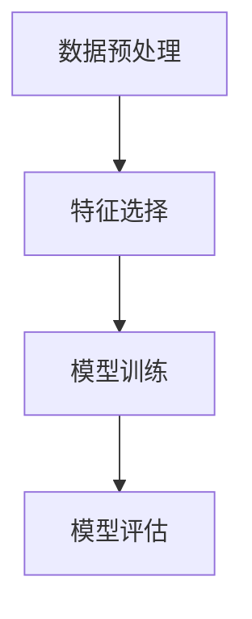

#### 2.1.2 支持向量机（SVM）

SVM是一种监督学习算法，适用于分类和回归问题。在股市预测中，SVM能够通过非线性特征提取，提高预测的准确性。

##### SVM算法流程图

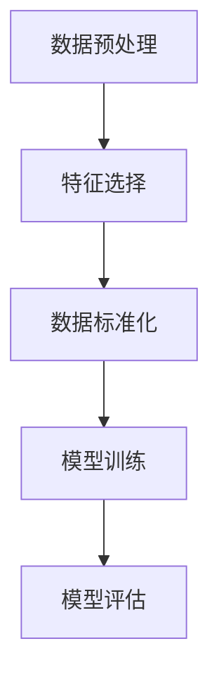

#### 2.1.3 随机森林与集成学习

随机森林是一种基于决策树的集成学习算法，具有高准确性和良好的抗过拟合能力。在股市预测中，随机森林能够通过集成多个决策树，提高模型的鲁棒性。

##### 随机森林算法流程图

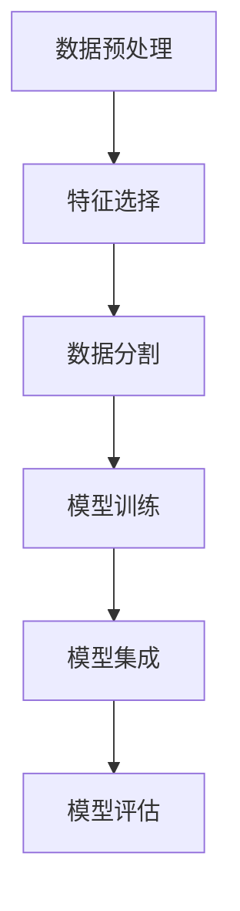

### 2.2 深度学习在股市估值中的应用

#### 2.2.1 RNN与时间序列预测

RNN（循环神经网络）适用于时间序列数据的预测。在股市估值中，RNN能够捕捉时间序列中的长期依赖关系，提高预测的准确性。

##### RNN算法流程图

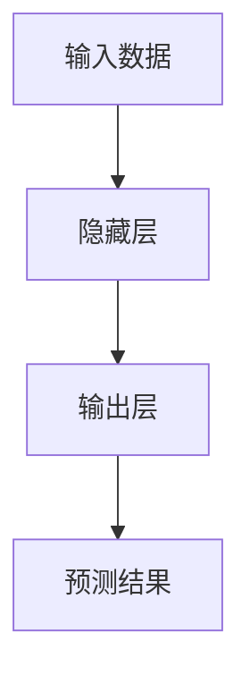

#### 2.2.2 CNN在金融数据特征提取中的应用

CNN（卷积神经网络）适用于图像和序列数据的特征提取。在股市估值中，CNN能够从历史价格数据中提取有用的特征，帮助模型更好地捕捉市场趋势。

##### CNN算法流程图


#### 2.2.3 Transformer模型的最新进展

Transformer模型最初应用于自然语言处理领域，但在金融领域的应用也逐渐增多。通过自注意力机制，Transformer能够捕捉数据中的全局关系，提高预测的准确性。

##### Transformer算法流程图

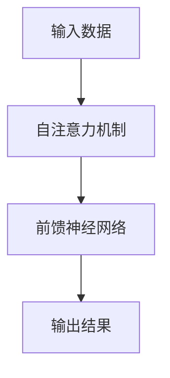

### 2.3 基于强化学习的交易策略优化

#### 2.3.1 强化学习的基本原理

强化学习是一种通过试错机制优化决策的算法。在股市交易中，强化学习可以通过模拟环境，训练模型优化交易策略。

##### 强化学习算法流程图

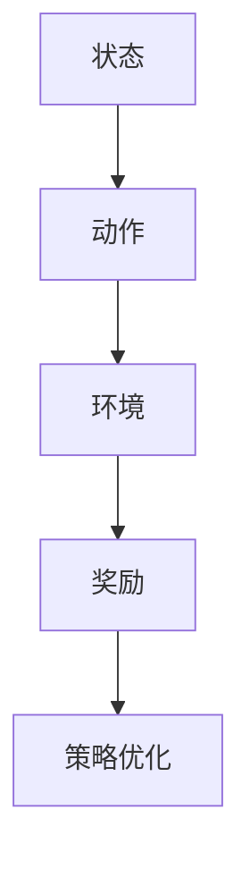

#### 2.3.2 在股市交易中的应用案例

通过强化学习算法，可以在虚拟交易环境中训练模型，优化交易策略。例如，使用Deep Q-Network（DQN）模型，可以在模拟市场中学习最优的买卖时机。

##### DQN算法流程图

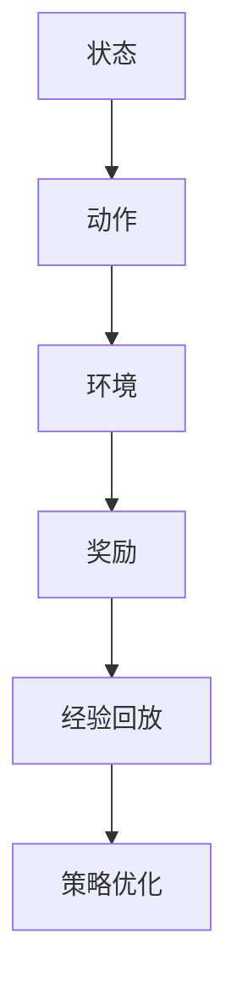

#### 2.3.3 实验结果与分析

通过实验可以发现，强化学习在股市交易中的表现优于传统策略，但在实际应用中仍需解决模型收敛速度慢、过拟合等问题。

---

## 第3章: 人工智能在精准医疗中的应用前景

### 3.1 精准医疗的核心概念

#### 3.1.1 精准医疗的定义与目标

精准医疗是一种基于患者个体特征（如基因、生活方式等）的个性化医疗模式。其目标是通过精准诊断和治疗，提高治疗效果，降低医疗成本。

#### 3.1.2 精准医疗与传统医疗的区别

传统医疗通常采用统一的治疗方案，而精准医疗则根据患者个体特征制定个性化治疗方案。人工智能技术在精准医疗中的应用，进一步提高了诊断和治疗的精准性。

#### 3.1.3 精准医疗的现状与发展趋势

随着基因测序技术的发展，精准医疗的应用范围不断扩大。人工智能技术在疾病诊断、药物研发和治疗方案优化等方面发挥了重要作用。

---

## 第4章: 人工智能在精准医疗中的核心算法

### 4.1 基于机器学习的疾病预测模型

#### 4.1.1 分类算法（如随机森林、SVM）

在疾病预测中，分类算法如随机森林和SVM被广泛应用。随机森林通过集成多个决策树，提高模型的准确性和鲁棒性。SVM则通过非线性特征提取，提高分类的准确性。

##### 随机森林算法流程图


#### 4.1.2 回归算法在疾病预测中的应用

回归算法适用于连续型变量的预测，如疾病风险评分的预测。通过线性回归模型，可以预测患者在未来一段时间内患病的概率。

##### 线性回归算法流程图

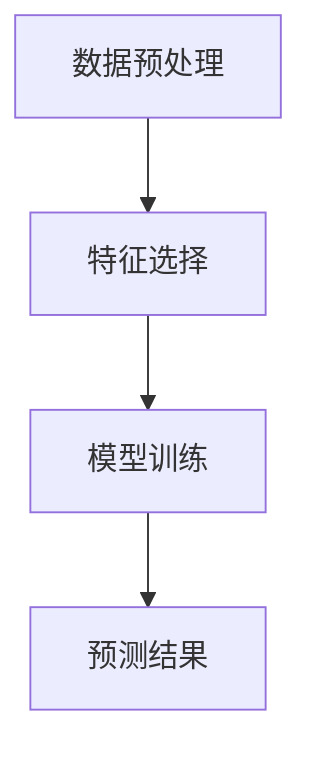

#### 4.1.3 模型评估与优化

模型评估是疾病预测模型优化的重要环节。通过交叉验证和网格搜索等方法，可以优化模型的参数，提高预测的准确性。

##### 模型评估流程图

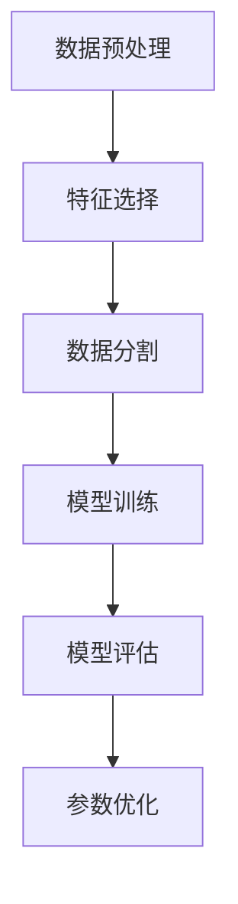

### 4.2 深度学习在医学影像分析中的应用

#### 4.2.1 CNN在医学影像识别中的应用

CNN在医学影像分析中表现出色，能够从图像中提取有用的特征，帮助医生进行疾病诊断。例如，使用卷积神经网络可以对X光片进行自动诊断，识别肺部病变。

##### CNN医学影像分析流程图

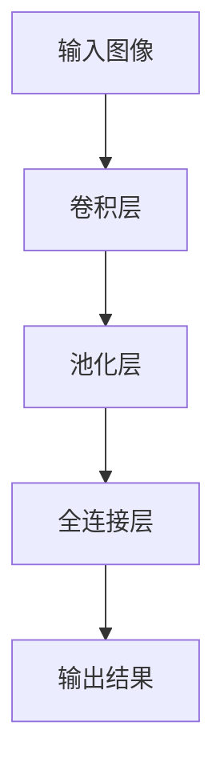

#### 4.2.2 模型可解释性与结果分析

模型的可解释性是医学应用中的重要考虑因素。通过可视化技术，可以分析模型的决策过程，帮助医生理解诊断结果。

##### 模型可解释性分析流程图

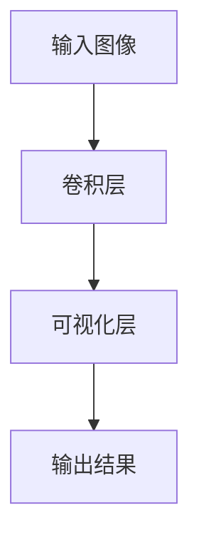

#### 4.2.3 实验结果与临床应用价值

通过实验可以验证模型的准确性和可靠性。例如，使用CNN模型对糖尿病视网膜病变进行诊断，准确率达到95%以上，显著提高了诊断效率。

### 4.3 基于强化学习的治疗方案优化

#### 4.3.1 强化学习在治疗方案优化中的应用

强化学习通过模拟治疗环境，优化治疗方案。例如，使用强化学习算法优化癌症治疗方案，提高治疗效果。

##### 强化学习治疗方案优化流程图


#### 4.3.2 案例分析：个性化用药方案优化

通过强化学习算法，可以在虚拟环境中优化用药方案，提高治疗效果。例如，使用DQN模型优化抗肿瘤药物的给药方案，显著提高了治疗效果。

##### DQN治疗方案优化流程图


#### 4.3.3 实验结果与分析

通过实验可以验证强化学习在治疗方案优化中的有效性。例如，使用强化学习优化化疗方案，显著提高了患者的生存率和生活质量。

---

## 第5章: 结合全球股市估值与精准医疗的人工智能应用

### 5.1 两者的共同点与差异

尽管全球股市估值和精准医疗属于不同领域，但它们都面临着数据复杂、模型优化等问题。通过引入人工智能技术，可以解决这些问题，提高估值和治疗的准确性。

#### 5.1.1 数据驱动与模型优化的共同性

两者都需要处理海量数据，并通过模型优化提高准确性和效率。例如，使用机器学习算法优化股票估值和疾病预测模型。

#### 5.1.2 数据隐私与模型解释性的挑战

在实际应用中，数据隐私和模型解释性是两大挑战。例如，如何在保护患者隐私的前提下，利用AI技术优化治疗方案。

### 5.2 数据共享与隐私保护的解决方案

数据共享是AI技术应用的重要前提，但隐私保护是不可忽视的问题。通过联邦学习等技术，可以在不共享原始数据的前提下，实现模型的协同训练。

#### 5.2.1 联邦学习（Federated Learning）

联邦学习是一种分布式机器学习技术，适用于数据隐私保护需求较高的场景。通过联邦学习，可以在多个数据源上协同训练模型，而不必共享原始数据。

##### 联邦学习流程图

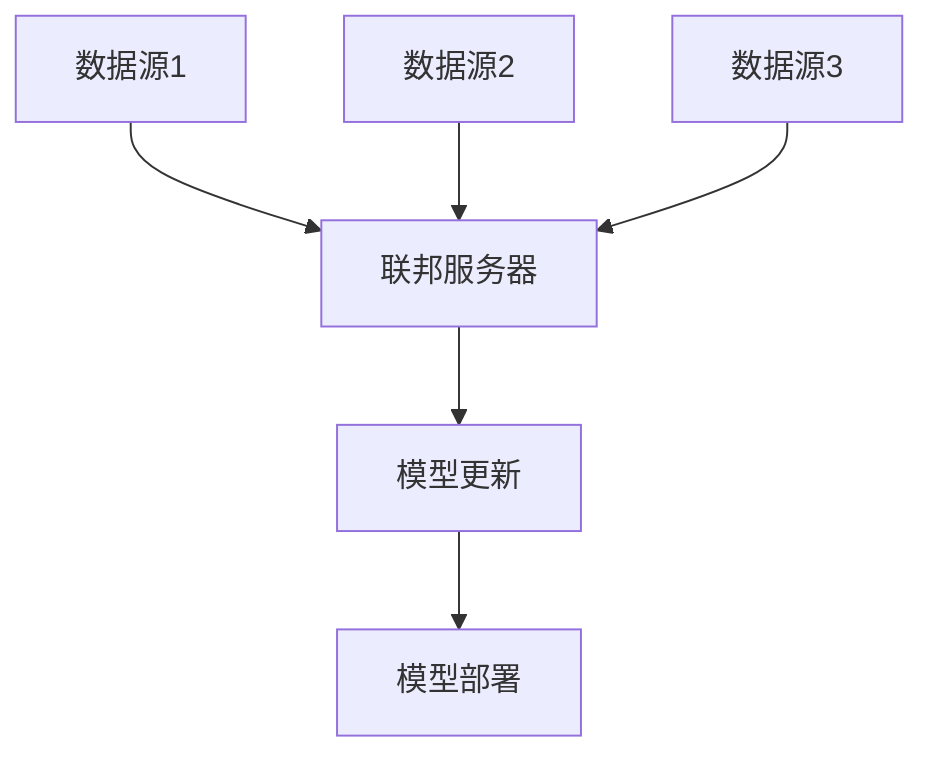

#### 5.2.2 差分隐私（Differential Privacy）

差分隐私是一种数据隐私保护技术，通过在数据中添加噪声，保护个体隐私。例如，在医疗数据中应用差分隐私技术，可以在不泄露患者隐私的前提下，进行数据共享和分析。

##### 差分隐私流程图

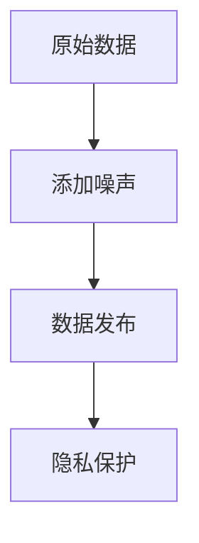

### 5.3 结合两者的潜在应用

通过结合全球股市估值和精准医疗的人工智能技术，可以在金融和医疗领域实现协同创新。例如，利用AI技术优化股票估值模型，同时推动精准医疗的发展。

#### 5.3.1 金融与医疗数据的交叉分析

通过分析金融和医疗数据的关联性，可以发现潜在的市场机会和医疗创新点。例如，通过分析医疗公司的股票走势，预测其未来的财务表现。

#### 5.3.2 AI在金融与医疗领域的协同创新

通过协同创新，可以在金融和医疗领域实现技术共享和资源优化。例如，利用AI技术优化股票估值模型的同时，推动精准医疗的发展。

---

## 第6章: 项目实战与案例分析

### 6.1 全球股市估值AI项目实战

#### 6.1.1 环境安装与数据准备

首先，安装必要的开发环境，包括Python、TensorFlow、Keras等。然后，收集和整理股票数据，进行数据清洗和特征提取。

##### 项目环境安装代码

```bash
pip install numpy pandas tensorflow keras scikit-learn
```

#### 6.1.2 核心算法实现与优化

使用机器学习和深度学习算法，训练股票估值模型，并进行模型优化。例如，使用LSTM模型预测股票价格，通过网格搜索优化模型参数。

##### LSTM模型实现代码

```python
import numpy as np
from tensorflow.keras.models import Sequential
from tensorflow.keras.layers import LSTM, Dense

# 数据准备
# (假设已经完成数据清洗和特征提取)

model = Sequential()
model.add(LSTM(units=50, input_shape=(timesteps, features)))
model.add(Dense(1))
model.compile(optimizer='adam', loss='mean_squared_error')

# 模型训练
model.fit(x_train, y_train, epochs=100, batch_size=32)
```

#### 6.1.3 实验结果与分析

通过实验验证模型的准确性，分析模型的优缺点，并提出改进建议。

### 6.2 精准医疗AI项目实战

#### 6.2.1 环境安装与数据准备

安装必要的开发环境，包括Python、TensorFlow、Keras等。收集和整理医疗数据，进行数据清洗和特征提取。

##### 项目环境安装代码

```bash
pip install numpy pandas tensorflow keras scikit-learn
```

#### 6.2.2 核心算法实现与优化

使用机器学习和深度学习算法，训练疾病预测模型，并进行模型优化。例如，使用CNN模型分析医学影像，通过交叉验证优化模型参数。

##### CNN模型实现代码

```python
import numpy as np
from tensorflow.keras.models import Sequential
from tensorflow.keras.layers import Conv2D, MaxPooling2D, Flatten, Dense

# 数据准备
# (假设已经完成数据清洗和特征提取)

model = Sequential()
model.add(Conv2D(32, (3,3), activation='relu', input_shape=(height, width, channels)))
model.add(MaxPooling2D(pool_size=(2,2)))
model.add(Flatten())
model.add(Dense(128, activation='relu'))
model.add(Dense(num_classes, activation='softmax'))

# 模型训练
model.compile(optimizer='adam', loss='categorical_crossentropy', metrics=['accuracy'])
model.fit(x_train, y_train, epochs=100, batch_size=32)
```

#### 6.2.3 实验结果与分析

通过实验验证模型的准确性，分析模型的优缺点，并提出改进建议。

---

## 第7章: 结论与展望

### 7.1 结论

本文探讨了人工智能在全球股市估值和精准医疗中的应用，分析了AI技术如何提升估值和治疗的准确性。通过实际案例展示了AI技术的优势与挑战，并提出了未来的改进方向。

### 7.2 未来展望

未来，随着人工智能技术的不断发展，其在全球股市估值和精准医疗中的应用将更加广泛。特别是在数据共享和隐私保护方面，需要进一步研究和创新。同时，如何在复杂应用场景中实现AI技术的高效应用，也是未来研究的重要方向。

---

**作者：AI天才研究院/AI Genius Institute & 禅与计算机程序设计艺术 /Zen And The Art of Computer Programming**

---

**附录**

- 附录A: 机器学习常用算法总结
- 附录B: 深度学习框架TensorFlow安装与使用指南
- 附录C: 联邦学习与差分隐私技术的详细说明
- 附录D: 项目代码与数据集下载链接

