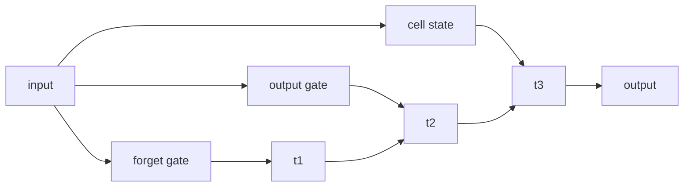
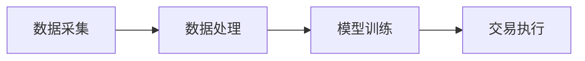

                 


# 全球股市估值与人工智能监管的关系

> 关键词：全球股市估值、人工智能监管、算法交易、时间序列分析、强化学习、金融风险管理

> 摘要：随着人工智能技术的快速发展，其在金融领域的应用日益广泛，尤其是在股市估值方面。然而，人工智能的应用也带来了新的监管挑战。本文将深入探讨全球股市估值与人工智能监管之间的关系，分析人工智能如何改变股市估值，以及监管如何影响人工智能的应用。文章从背景介绍、核心概念、算法原理、系统架构到项目实战，全面解析这一复杂而重要的议题。

---

## 第一部分：背景介绍

### 第1章：全球股市估值的背景与挑战

#### 1.1 股市估值的基本概念
股市估值是通过对公司财务数据、市场环境、行业趋势等因素进行分析，以确定股票的合理价格范围。传统的估值方法包括市盈率（P/E）、市净率（P/B）和股息率等指标。然而，这些方法在面对复杂市场环境时，往往难以捕捉到市场的动态变化。

#### 1.2 人工智能的崛起与金融市场的融合
人工智能技术的快速发展，尤其是在大数据处理和模式识别方面的优势，使其在金融市场的应用日益广泛。人工智能可以通过分析海量数据，发现传统方法难以察觉的市场规律，从而优化股票估值。

#### 1.3 问题背景
随着人工智能技术的普及，股市估值的精度和效率得到了显著提升。然而，人工智能的应用也带来了新的问题，例如算法交易的不透明性、市场操纵风险以及技术滥用的可能性。这些问题对金融监管提出了更高的要求。

---

### 第2章：人工智能监管的核心概念

#### 2.1 人工智能在金融领域的应用
人工智能在金融领域的应用包括算法交易、风险评估、客户画像构建等。特别是在股市估值方面，人工智能可以通过自然语言处理（NLP）分析新闻、社交媒体数据，预测市场情绪。

#### 2.2 监管的必要性与挑战
人工智能的应用可能带来市场操纵、信息不对称等问题，因此需要监管机构制定相应的规则和标准。然而，监管的滞后性和技术的快速变化，使得监管机构在应对人工智能挑战时面临诸多困难。

#### 2.3 监管框架的构建
为了平衡创新与风险，监管机构需要制定灵活且有效的监管框架，既要鼓励技术发展，又要防范潜在风险。

---

## 第二部分：核心概念与联系

### 第3章：人工智能对股市估值的影响

#### 3.1 传统估值方法与人工智能方法的对比
| 方法 | 优点 | 缺点 |
|------|------|------|
| 传统估值方法 | 简单易懂，易于解释 | 依赖假设，难以捕捉市场动态 |
| 人工智能方法 | 高精度，适应性强 | 黑箱问题，难以解释 |

#### 3.2 人工智能在股市估值中的具体应用
人工智能可以通过以下步骤优化股市估值：
1. 数据收集：整合财务数据、市场数据、新闻数据等。
2. 数据预处理：清洗、特征提取。
3. 模型训练：使用机器学习算法训练估值模型。
4. 预测与优化：基于模型输出估值结果并进行动态调整。

---

### 第4章：监管对人工智能的影响

#### 4.1 监管对市场公平性的保障
通过监管，可以防止人工智能技术被滥用，确保市场参与者之间的公平竞争。

#### 4.2 监管对投资者保护的作用
监管机构需要确保人工智能的应用不会损害投资者的利益，例如防止算法交易引发的市场闪崩。

#### 4.3 监管对技术创新的促进
合理的监管框架可以为人工智能技术的发展提供明确的方向，激励技术创新。

---

## 第三部分：算法原理与数学模型

### 第5章：时间序列分析

#### 5.1 ARIMA模型
ARIMA（自回归积分滑动平均模型）是一种广泛应用于时间序列预测的方法。其数学公式为：
$$ ARIMA(p, d, q) $$
其中，p为自回归阶数，d为差分阶数，q为滑动平均阶数。

#### 5.2 LSTM网络
长短期记忆网络（LSTM）是一种特殊的循环神经网络（RNN），适用于处理时间序列数据。其结构如下：


---

### 第6章：强化学习在交易策略中的应用

#### 6.1 强化学习的基本原理
强化学习通过智能体与环境的交互，学习最优策略。其核心公式为：
$$ Q(s, a) = r + \gamma \max_{a'} Q(s', a') $$
其中，s为状态，a为动作，r为奖励，γ为折扣因子。

#### 6.2 基于强化学习的交易策略
1. 状态定义：市场数据、技术指标。
2. 动作定义：买入、卖出、持有。
3. 奖励定义：收益变化。

---

## 第四部分：系统架构与项目实战

### 第7章：系统架构设计

#### 7.1 系统功能设计
- 数据采集模块：收集市场数据。
- 数据处理模块：清洗、特征提取。
- 模型训练模块：训练估值模型。
- 交易执行模块：根据模型输出执行交易。

#### 7.2 系统架构图


---

### 第8章：项目实战

#### 8.1 环境安装
- 安装Python、Pandas、NumPy、TensorFlow等库。

#### 8.2 核心代码实现
```python
import numpy as np
import pandas as pd
from tensorflow.keras import layers

# 数据预处理
data = pd.read_csv('stock_data.csv')
train_data = data.iloc[:1000]
test_data = data.iloc[1000:]

# LSTM模型构建
model = tf.keras.Sequential()
model.add(layers.LSTM(64, input_shape=(None, 1)))
model.add(layers.Dense(1))
model.compile(loss='mean_squared_error', optimizer='adam')

# 模型训练
model.fit(train_data.values, epochs=10, batch_size=32)
```

---

### 第9章：案例分析与小结

#### 9.1 案例分析
通过实际案例分析，验证人工智能在股市估值中的效果，并评估监管对交易策略的影响。

#### 9.2 小结
本文从背景、核心概念、算法原理到系统架构，全面分析了全球股市估值与人工智能监管的关系。人工智能技术的应用提高了股市估值的精度，但也带来了新的监管挑战。

---

## 结语

人工智能技术的快速发展正在改变金融市场的运作方式，但同时也需要监管机构的及时介入。只有在技术创新与合规监管之间找到平衡，才能确保市场的健康发展。

作者：AI天才研究院/AI Genius Institute & 禅与计算机程序设计艺术 /Zen And The Art of Computer Programming

