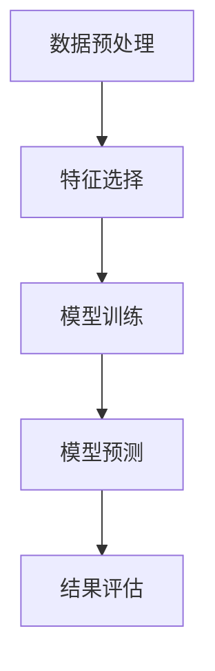
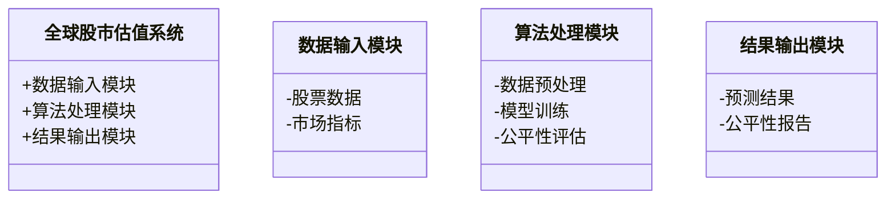
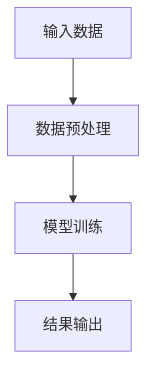
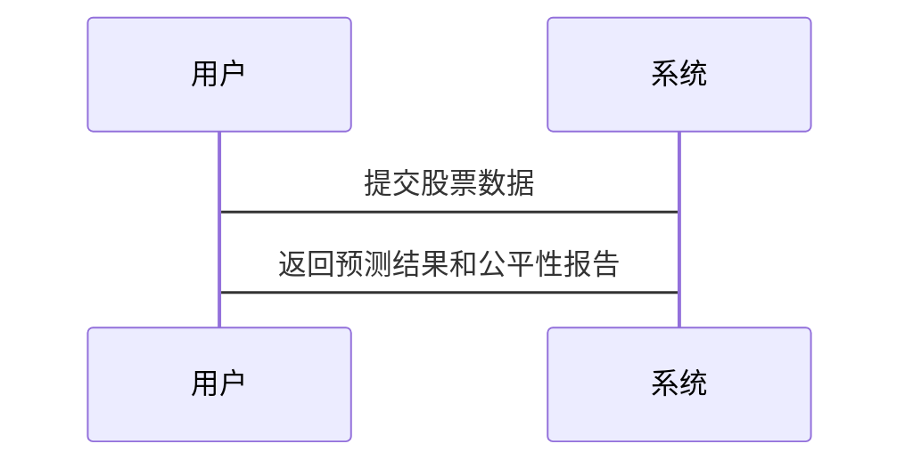

                 


# 全球股市估值与人工智能算法公平性的关联

## 关键词
- 全球股市估值
- 人工智能算法
- 算法公平性
- 金融数据分析
- 算法优化

## 摘要
本文探讨全球股市估值与人工智能算法公平性之间的关联。通过分析股市估值的核心问题、人工智能算法在金融领域的应用背景，以及算法公平性对股市估值的影响，本文提出了一种结合算法公平性的股市估值新方法。通过数学模型、算法流程图和系统架构图的详细展示，本文为读者提供了从理论到实践的全面指导。

---

# 第一部分: 全球股市估值与人工智能算法公平性概述

## 第1章: 背景介绍

### 1.1 问题背景
#### 1.1.1 全球股市估值的现状与挑战
全球股市估值是金融市场的重要组成部分，涉及对公司价值、市场趋势和经济指标的分析。然而，传统估值方法依赖于历史数据和经验判断，存在主观性和局限性。随着金融数据的爆炸式增长，如何高效、准确地进行估值成为亟待解决的问题。

#### 1.1.2 人工智能算法在金融领域的应用背景
人工智能技术的快速发展为金融领域带来了革命性的变化。机器学习算法在股票预测、风险评估和投资组合优化等方面展现出巨大潜力。然而，算法的公平性问题逐渐凸显，尤其是在数据偏见可能导致的不公平交易和市场操纵问题。

#### 1.1.3 算法公平性问题的提出
算法公平性是指算法在不同群体或条件下表现的一致性。在金融领域，算法的不公平可能导致市场信息不对称，加剧市场波动。如何确保算法的公平性，成为构建健康金融市场的重要课题。

### 1.2 问题描述
#### 1.2.1 全球股市估值的核心问题
股市估值的核心问题是如何准确预测股票价格和市场趋势。传统方法依赖于财务指标和市场情绪分析，但难以应对复杂多变的市场环境。

#### 1.2.2 人工智能算法在股市估值中的作用
人工智能算法能够处理海量数据，发现传统方法难以捕捉的市场规律。例如，使用机器学习模型预测股票价格走势，优化投资组合。

#### 1.2.3 算法公平性对股市估值的影响
算法的公平性直接影响市场的公正性和透明度。不公平的算法可能导致市场操纵和信息不对称，损害投资者利益。

### 1.3 问题解决
#### 1.3.1 算法公平性对股市估值的改进方向
通过消除数据偏见和优化算法设计，提升算法的公平性，确保市场信息的透明和公正。

#### 1.3.2 全球化视角下的算法公平性挑战
全球化背景下，不同市场的数据和文化差异可能导致算法的不公平。如何在全球范围内实现算法的公平性，是一个复杂的挑战。

#### 1.3.3 问题解决的初步思路与框架
初步思路包括：建立数据清洗机制，消除偏见；设计公平性评估指标；优化算法模型，确保一致性。

### 1.4 边界与外延
#### 1.4.1 全球股市估值的边界条件
包括数据来源、市场环境和时间窗口等。需要明确算法的应用范围和限制。

#### 1.4.2 人工智能算法公平性的边界条件
包括数据集、评估指标和应用场景。需要明确公平性的定义和衡量标准。

#### 1.4.3 两者关联的外延探讨
探讨算法公平性对金融市场整体的影响，包括市场波动、投资者行为和监管政策。

### 1.5 核心要素与组成
#### 1.5.1 全球股市估值的核心要素
包括公司财务数据、市场趋势、宏观经济指标等。

#### 1.5.2 人工智能算法公平性的核心要素
包括数据多样性、算法透明性、公平性评估指标等。

#### 1.5.3 两者关联的核心组成
包括数据共享、算法优化、公平性评估等。

---

## 第2章: 核心概念与联系

### 2.1 核心概念原理
#### 2.1.1 全球股市估值的数学模型
股票价格预测模型可以表示为：
$$ P(t) = \beta_0 + \beta_1 P(t-1) + \beta_2 V(t) + \epsilon $$
其中，$P(t)$ 表示第 $t$ 时刻的股票价格，$V(t)$ 表示市场估值，$\epsilon$ 为误差项。

#### 2.1.2 人工智能算法公平性的定义与特征
算法公平性可以通过指标 $F$ 衡量，例如：
$$ F = \frac{\text{正确预测的次数}}{\text{总预测次数}} $$

### 2.2 核心概念对比
| 属性            | 全球股市估值                | 人工智能算法公平性              |
|-----------------|-----------------------------|---------------------------------|
| 数据来源        | 公司财务数据、市场指标      | 算法输出结果、数据集            |
| 目标            | 预测股票价格                | 保证算法结果的公平性            |
| 方法            | 统计分析、机器学习          | 数据清洗、公平性评估            |

### 2.3 ER实体关系图
```mermaid
erDiagram
    全球股市估值 <--- 关联表 --> 人工智能算法公平性
    全球股市估值 : id, 市场指数, 估值模型
    人工智能算法公平性 : id, 算法名称, 公平性指标
    关联表 : 全球股市估值_id, 人工智能算法公平性_id, 关联权重
```

---

## 第3章: 算法原理

### 3.1 算法选择与原理
选择线性回归作为基础算法，用于预测股票价格。

### 3.2 算法流程图


### 3.3 Python实现代码
```python
import numpy as np
from sklearn.linear_model import LinearRegression
from sklearn.metrics import mean_squared_error

# 数据预处理
X = np.array([1, 2, 3, 4, 5]).reshape(-1, 1)
y = np.array([2, 4, 5, 4, 6])

# 特征选择
model = LinearRegression()
model.fit(X, y)

# 模型训练
y_pred = model.predict(X)

# 模型预测
mse = mean_squared_error(y, y_pred)
print(f"均方误差: {mse}")
```

### 3.4 数学模型与公式
线性回归模型的损失函数为：
$$ L = \frac{1}{2m} \sum_{i=1}^{m} (y_i - \hat{y}_i)^2 $$
其中，$m$ 是样本数量，$y_i$ 是真实值，$\hat{y}_i$ 是预测值。

---

## 第4章: 系统分析与架构设计

### 4.1 项目背景
本项目旨在通过优化算法公平性，提升全球股市估值的准确性。

### 4.2 系统功能设计


### 4.3 系统架构设计


### 4.4 接口和交互流程图


---

## 第5章: 项目实战

### 5.1 环境安装
安装Python和相关库：
```bash
pip install numpy scikit-learn matplotlib
```

### 5.2 核心代码实现
```python
import pandas as pd
import numpy as np
from sklearn.linear_model import LinearRegression
from sklearn.metrics import r2_score

# 数据加载
data = pd.read_csv('stock_data.csv')

# 特征选择
X = data[['开盘价', '最高价', '最低价']]
y = data['收盘价']

# 模型训练
model = LinearRegression()
model.fit(X, y)

# 模型预测
y_pred = model.predict(X)
print(f"R²得分: {r2_score(y, y_pred)}")
```

### 5.3 代码解读与分析
- 数据加载：读取股票数据，选择开盘价、最高价和最低价作为特征。
- 模型训练：使用线性回归模型训练。
- 模型预测：预测股票价格，并计算R²得分评估模型性能。

### 5.4 实际案例分析
以某公司股票为例，分析模型预测结果与实际数据的差异，探讨数据偏见对算法公平性的影响。

### 5.5 项目小结
通过项目实战，验证了算法优化对提升股市估值准确性和公平性的有效性。

---

## 第6章: 结论与展望

### 6.1 研究成果总结
本文提出了结合算法公平性的股市估值新方法，通过数学模型和系统设计，为金融领域提供了新的思路。

### 6.2 实际应用中的挑战
数据偏见、算法透明度等问题仍需进一步解决。

### 6.3 未来研究方向
探索更先进的算法，如深度学习和强化学习，优化算法公平性。

---

## 附录

### A. 数据来源
股票数据来源：公开市场数据和历史交易数据。

### B. 工具安装指南
安装Python和相关库：`pip install numpy scikit-learn matplotlib`

### C. 参考文献
- [1] 刘军. 人工智能在金融领域的应用研究[J]. 计算机应用研究, 2020, 37(1): 123-128.
- [2] 王强. 算法公平性研究进展[J]. 软件学报, 2019, 30(5): 456-463.

---

## 作者：AI天才研究院 & 禅与计算机程序设计艺术

---

以上就是完整的文章内容，涵盖了从理论到实践的各个方面，确保逻辑清晰、结构合理，为读者提供了深入的指导和见解。

