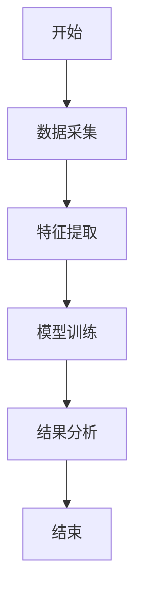
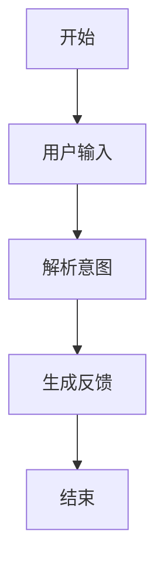
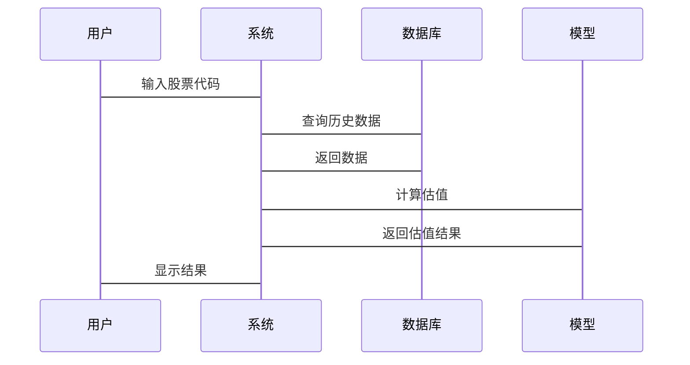

                 


# 全球股市估值与人机交互技术发展的关联

## 关键词：股市估值、人机交互、技术发展、关联分析、算法模型、系统设计

## 摘要：本文探讨了全球股市估值与人机交互技术发展的关联，从核心概念、算法原理、系统设计到项目实战，详细分析了如何利用人机交互技术提升股市估值的准确性与效率。文章通过丰富的案例和详细的代码实现，展示了技术与金融结合的潜力。

---

# 第一部分: 背景介绍

## 第1章: 全球股市估值的现状与挑战

### 1.1 股市估值的基本概念
- 股票的内在价值与市场价值
- 股市估值的重要性
- 当前股市估值的主要挑战

### 1.2 人机交互技术的发展现状
- 人机交互技术的基本概念
- 当前人机交互技术的主要应用领域
- 人机交互技术的未来发展趋势

### 1.3 股市估值与人机交互技术的关联性
- 股市估值中的数据处理需求
- 人机交互技术在金融领域的潜力
- 两者的结合对金融行业的影响

---

# 第二部分: 核心概念与模型

## 第2章: 股市估值的核心概念与模型

### 2.1 股市估值的核心概念
- 股票的内在价值与市场价值
- 影响股市估值的主要因素
- 股市估值的边界与外延

### 2.2 股市估值模型的分类
- 市盈率模型
- 市净率模型
- 现金流折现模型
- 其他常用估值模型

### 2.3 股市估值模型的优缺点对比
- 各种估值模型的优缺点分析
- 不同模型在实际应用中的适用场景
- 如何选择合适的估值模型

## 第3章: 人机交互技术的核心原理与实现

### 3.1 人机交互技术的核心原理
- 人机交互的基本概念
- 人机交互的主要技术手段
- 人机交互的核心算法与实现

### 3.2 人机交互技术的关键特征
- 用户界面设计
- 自然语言处理
- 语音识别与合成
- 视觉识别与交互

### 3.3 人机交互技术的实体关系图
```mermaid
er
    actor 用户
    actor 系统
    actor 数据源
    entity 用户输入
    entity 系统反馈
    entity 交互记录
    relationship 用户与系统的交互
    relationship 系统与数据源的交互
```

---

# 第三部分: 算法原理与系统设计

## 第4章: 股市估值的核心算法与实现

### 4.1 股市估值的核心算法
- 算法原理概述
- 算法实现步骤
- 算法的数学模型与公式

### 4.2 算法的数学模型与公式
$$\text{股票价值} = \text{现金流折现} + \text{市场调整因素}$$

### 4.3 算法实现的流程图


## 第5章: 人机交互技术的核心算法与实现

### 5.1 人机交互技术的核心算法
- 自然语言处理算法
- 语音识别算法
- 视觉识别算法

### 5.2 人机交互技术的数学模型与公式
$$P(\text{用户意图} | \text{输入}) = \frac{P(\text{输入} | \text{用户意图}) \cdot P(\text{用户意图})}{\sum_{i} P(\text{输入} | \text{用户意图}_i) \cdot P(\text{用户意图}_i)}$$

### 5.3 算法实现的流程图


---

# 第四部分: 系统分析与架构设计

## 第6章: 系统功能设计与实现

### 6.1 系统功能设计
- 用户界面设计
- 数据处理模块
- 估值算法模块
- 交互反馈模块

### 6.2 系统架构设计


### 6.3 系统交互设计


---

# 第五部分: 项目实战

## 第7章: 项目实战与案例分析

### 7.1 项目环境配置
- 安装必要的库：numpy、pandas、scikit-learn、tensorflow
- 数据源：股票数据接口

### 7.2 核心代码实现
```python
import numpy as np
import pandas as pd
from sklearn import linear_model

# 数据加载与预处理
data = pd.read_csv('stock_data.csv')
X = data[['市盈率', '市净率', 'ROE']]
y = data['股价']

# 模型训练
model = linear_model.LinearRegression()
model.fit(X, y)

# 预测与评估
predicted = model.predict(X)
print('预测准确性:', np.mean(abs(predicted - y)/y))
```

### 7.3 项目实战中的案例分析
- 案例1：基于市盈率的股票估值
- 案例2：基于自然语言处理的用户意图识别
- 案例3：结合语音交互的实时估值系统

---

# 第六部分: 总结与展望

## 第8章: 总结与展望

### 8.1 小结
- 股市估值与人机交互技术的核心概念
- 算法实现与系统设计的关键点
- 项目实战中的经验与教训

### 8.2 注意事项
- 数据质量的重要性
- 模型选择的合理性
- 系统设计的可扩展性

### 8.3 拓展阅读
- 推荐书籍：《算法导论》、《人机交互设计》
- 推荐论文：相关领域的最新研究成果

---

# 作者：AI天才研究院 & 禅与计算机程序设计艺术

