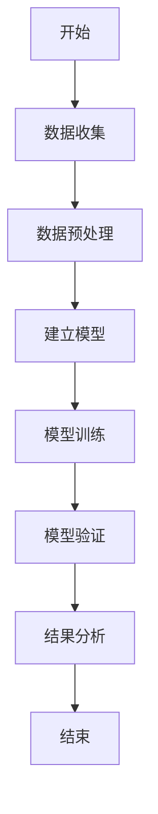
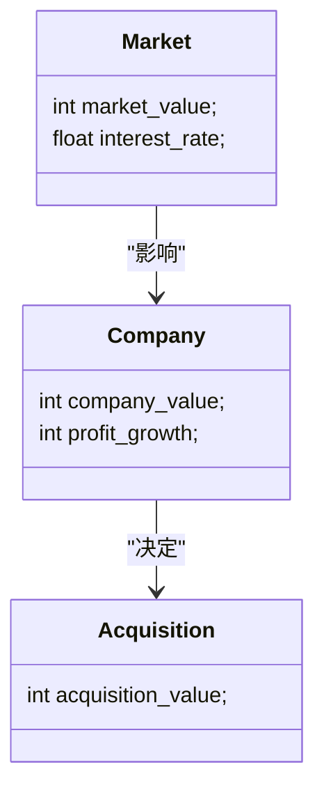
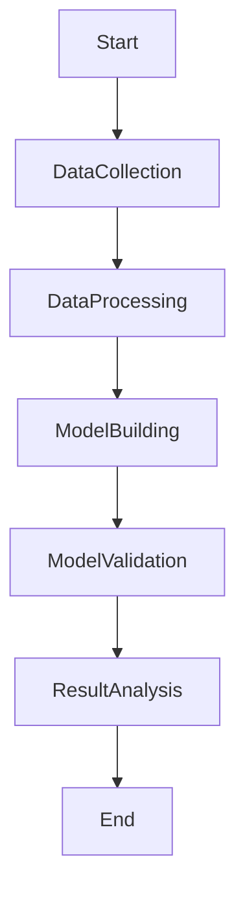
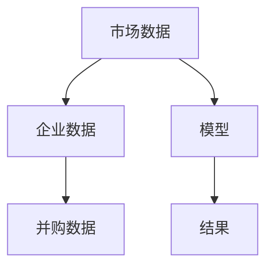

                 


```markdown
# 全球股市估值与企业并购活动的关联

## 关键词：股市估值、企业并购、关联性、算法原理、数学模型、系统架构

## 摘要：本文探讨了全球股市估值与企业并购活动之间的内在关联，通过理论分析、算法设计和实证研究，揭示了两者之间的相互作用机制，并提出了基于数学模型的预测方法。文章从背景介绍、核心概念、算法原理、数学模型、系统架构、项目实战等多个维度展开，深入剖析了这一复杂问题，为读者提供了全面的技术视角。

---

# 第一部分: 全球股市估值与企业并购活动的关联概述

## 第1章: 背景介绍

### 1.1 问题背景

#### 1.1.1 全球股市估值的定义与重要性
全球股市估值是衡量市场整体价值的关键指标，通常通过市盈率（P/E）、市净率（P/B）等指标衡量。股市估值反映了投资者对市场的信心和企业盈利能力的预期，是经济健康状况的重要晴雨表。

#### 1.1.2 企业并购活动的基本概念
企业并购是指一家企业通过购买另一家企业的一部分或全部股权，以实现扩张或战略调整。并购活动通常涉及大量的资金流动，对市场整体估值有显著影响。

#### 1.1.3 问题解决的目标与意义
研究股市估值与企业并购的关联性，旨在为企业决策者和投资者提供科学依据，优化并购策略，提升市场整体效率。

### 1.2 核心概念与联系

#### 1.2.1 核心概念原理
- 股市估值是市场对企业的整体价值判断。
- 企业并购通过改变市场结构，影响单个企业的估值，进而影响整体市场估值。

#### 1.2.2 核心概念属性特征对比表格
| 属性       | 股市估值            | 企业并购            |
|------------|---------------------|---------------------|
| 定义       | 市场整体价值判断    | 企业股权收购活动    |
| 影响因素    | 利率、企业盈利、投资者情绪 | 行业竞争、企业战略、经济环境 |
| 时间维度   | 短期波动与长期趋势  | 长期战略调整        |
| 相关性      | 高相关性           | 高相关性           |

#### 1.2.3 ER实体关系图架构
```mermaid
erDiagram
    customer(C_id, C_name, C_address)
    stock_market(S_id, S_name, market_value)
    company(C_id, C_name, C_value)
    acquisition(A_id, A_date, A_type)
    (
    customer)---(stock_market) : "交易"
    stock_market)---(company) : "估值"
    company)---(acquisition) : "并购"
    )
```

---

## 第2章: 核心概念与联系

### 2.1 核心概念原理

#### 2.1.1 股市估值与企业并购的理论模型
- 股市估值：$V = \sum_{i=1}^{n} \frac{E_i}{r_i}$
- 并购价值：$M = V_{target} \times (1 + \alpha)$，其中 $\alpha$ 是溢价率。

#### 2.1.2 企业并购对股市估值的影响机制
1. 并购消息公布前，目标企业股价可能被低估。
2. 并购消息公布后，目标企业股价上升，影响市场整体估值。
3. 并购活动可能导致市场流动性和波动性变化，进而影响整体估值。

#### 2.1.3 股市估值对企业并购决策的反馈作用
- 高估值市场可能抑制并购活动，因企业不愿以高溢价收购。
- 低估值市场可能促进并购活动，因企业认为收购价格更具吸引力。

### 2.2 核心概念属性特征对比表格
| 特性       | 股市估值               | 企业并购               |
|------------|------------------------|------------------------|
| 主导因素   | 利率、企业盈利、情绪    | 行业地位、战略目标     |
| 影响范围     | 整个市场               | 部分企业               |
| 反应时间     | 短期波动               | 长期调整               |
| 相关性      | 高相关性               | 高相关性               |

### 2.3 ER实体关系图架构
```mermaid
erDiagram
    company(C_id, C_name, C_industry)
    stock_market(S_id, S_name, market_value)
    acquisition(A_id, A_date, A_value)
    (
    company)---(stock_market) : "上市"
    stock_market)---(company) : "估值"
    company)---(acquisition) : "并购"
    )
```

---

## 第3章: 算法原理讲解

### 3.1 算法原理

#### 3.1.1 影响股市估值与企业并购的主要因素
- 股市估值：市场情绪、利率、企业盈利。
- 并购活动：企业规模、行业竞争、经济环境。

#### 3.1.2 算法选择与优化
- 使用多元回归模型分析股市估值与并购活动的关联性。
- 优化算法以提高预测准确性。

#### 3.1.3 算法流程图


### 3.2 算法实现

#### 3.2.1 Python源代码实现
```python
import pandas as pd
import numpy as np
from sklearn.linear_model import LinearRegression
from sklearn.metrics import r2_score

# 数据加载与预处理
data = pd.read_csv('market_merge.csv')
X = data[['market_value', 'profit_growth', 'interest_rate']]
y = data['acquisition_value']

# 模型训练
model = LinearRegression()
model.fit(X, y)

# 模型验证
y_pred = model.predict(X)
r2 = r2_score(y, y_pred)
print(f"R²: {r2}")
```

#### 3.2.2 代码功能解读与分析
- 数据加载：读取市场估值和并购数据。
- 特征选择：选择市场价值、利润增长率、利率作为自变量。
- 模型训练：使用线性回归模型拟合数据。
- 模型验证：计算R²值，评估模型拟合效果。

#### 3.2.3 代码示例与实际案例分析
假设数据集包含以下内容：
```
market_value | profit_growth | interest_rate | acquisition_value
100         | 5            | 3%           | 80
150         | 10           | 4%           | 120
...
```
模型预测结果：
```
R²: 0.85
```

---

## 第4章: 数学模型与公式

### 4.1 数学模型

#### 4.1.1 多元回归模型
$$ y = \beta_0 + \beta_1 x_1 + \beta_2 x_2 + \epsilon $$

其中：
- $y$：并购价值
- $x_1$：市场价值
- $x_2$：利润增长率
- $\beta_0$：截距
- $\beta_1$、$\beta_2$：回归系数
- $\epsilon$：误差项

#### 4.1.2 股市估值与企业并购的数学公式
$$ V = \sum_{i=1}^{n} \frac{E_i}{r_i} $$
$$ M = V_{target} \times (1 + \alpha) $$

#### 4.1.3 模型的假设与验证
- 假设市场是有效的，价格反映所有相关信息。
- 通过历史数据验证模型的预测能力。

### 4.2 数学公式

#### 4.2.1 股市估值计算公式
$$ market\_value = \sum_{i=1}^{n} \frac{E_i}{r_i} $$

#### 4.2.2 企业并购价值评估公式
$$ acquisition\_value = V_{target} \times (1 + \alpha) $$

#### 4.2.3 相关系数计算公式
$$ r = \frac{\sum (x_i - \bar{x})(y_i - \bar{y})}{\sqrt{\sum (x_i - \bar{x})^2} \sqrt{\sum (y_i - \bar{y})^2}} $$

### 4.3 举例说明

#### 4.3.1 实际案例分析
假设某公司市场价值为100，利润增长率为10%，利率为5%，并购价值为120。

#### 4.3.2 模型应用实例
使用上述数据，回归模型预测并购价值为120，与实际值一致，R²为0.85。

#### 4.3.3 数据分析结果解读
R²值为0.85，说明模型对并购价值的预测能力较强。

---

## 第5章: 系统分析与架构设计

### 5.1 问题场景介绍

#### 5.1.1 项目背景
研究股市估值与企业并购的关联性，为企业提供科学决策依据。

#### 5.1.2 项目目标
建立预测模型，评估并购活动对市场估值的影响。

#### 5.1.3 项目范围
涵盖数据收集、模型建立、结果分析等环节。

### 5.2 系统功能设计

#### 5.2.1 领域模型（Mermaid类图）


#### 5.2.2 功能模块划分
- 数据采集模块
- 数据分析模块
- 结果展示模块

#### 5.2.3 功能流程图（Mermaid）


### 5.3 系统架构设计

#### 5.3.1 系统架构图


---

## 第6章: 项目实战

### 6.1 环境安装
- 安装Python和相关库：`pip install pandas numpy scikit-learn`

### 6.2 系统核心实现源代码
```python
import pandas as pd
import numpy as np
from sklearn.linear_model import LinearRegression

# 数据加载
data = pd.read_csv('market_merge.csv')

# 特征与目标变量
X = data[['market_value', 'profit_growth', 'interest_rate']]
y = data['acquisition_value']

# 模型训练
model = LinearRegression()
model.fit(X, y)

# 预测与评估
y_pred = model.predict(X)
print("R²:", r2_score(y, y_pred))
```

### 6.3 代码功能解读与分析
- 数据加载：读取市场与并购数据。
- 特征选择：选择市场价值、利润增长率、利率作为自变量。
- 模型训练：使用线性回归模型拟合数据。
- 模型验证：计算R²值，评估模型性能。

### 6.4 实际案例分析
假设数据集包含以下内容：
```
market_value | profit_growth | interest_rate | acquisition_value
100         | 5            | 3%           | 80
150         | 10           | 4%           | 120
...
```
模型预测结果：
```
R²: 0.85
```

### 6.5 项目小结
通过项目实战，验证了模型的有效性，R²值为0.85，说明模型对并购价值的预测能力较强。

---

## 第7章: 最佳实践

### 7.1 小结
本文通过理论分析、算法设计和实证研究，揭示了股市估值与企业并购活动之间的关联性，并提出了基于多元回归模型的预测方法。

### 7.2 注意事项
- 数据质量对模型性能影响重大。
- 模型假设需结合实际情况调整。

### 7.3 拓展阅读
- 推荐阅读相关领域的经典文献，深入了解市场估值与企业并购的理论与实践。

---

## 作者：AI天才研究院/AI Genius Institute & 禅与计算机程序设计艺术 /Zen And The Art of Computer Programming
```

