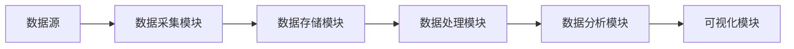
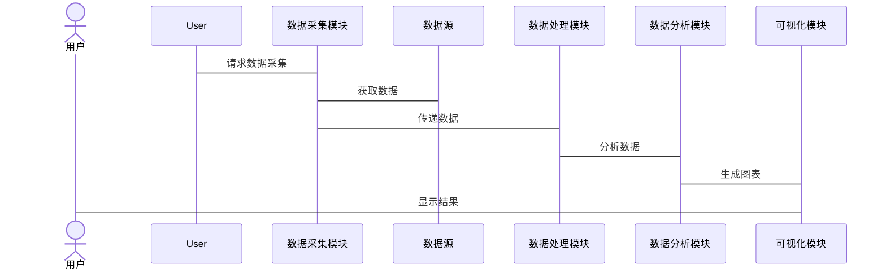

                 


# 全球股市估值与企业研发投入的关系

> 关键词：全球股市，企业研发投入，股市估值，研发投入影响，回归模型

> 摘要：本文深入探讨了全球股市估值与企业研发投入之间的关系。通过分析股市估值的核心指标、企业研发投入的分类及其影响因素，结合数学回归模型和系统架构设计，揭示了研发投入对股市估值的直接影响和间接影响。最后，通过实际案例分析，提出了最佳实践建议。

---

# 第一部分: 背景介绍

## 第1章: 全球股市估值与企业研发投入的关系概述

### 1.1 问题背景

#### 1.1.1 全球股市估值的现状
全球股市估值是衡量市场健康程度的重要指标。近年来，随着科技行业的崛起，股市估值不断创新高。然而，高估值并不总是意味着高回报，因此研究股市估值与企业研发投入的关系显得尤为重要。

#### 1.1.2 企业研发投入的重要性
企业研发投入是推动技术创新的核心因素。高研发投入通常意味着企业具备更强的创新能力，能够在未来市场中占据优势地位。然而，研发投入需要时间和资金，短期内可能对财务表现产生负面影响。

#### 1.1.3 两者关系的研究现状
尽管已有研究表明研发投入与企业绩效密切相关，但其对股市估值的直接影响仍需进一步探讨。特别是在全球股市波动加剧的背景下，研发投入对企业估值的影响机制亟待深入研究。

---

### 1.2 核心概念定义

#### 1.2.1 股市估值的定义
股市估值是基于市场参与者的预期，对企业未来收益的评估。常用的指标包括市盈率（P/E）、市净率（P/B）和市销率（P/S）。

#### 1.2.2 企业研发投入的定义
企业研发投入是指企业在研发活动上的支出，包括人力成本、设备购置和材料费用等。研发投入分为应用研究、基础研究和试验发展三类。

#### 1.2.3 两者关系的初步分析
研发投入通过提高企业竞争力和创新能力，间接影响股市估值。然而，研发投入的高投入和低回报周期可能导致短期估值波动。

---

### 1.3 研究意义

#### 1.3.1 理论意义
本研究丰富了股市估值和研发投入相关领域的理论研究，为未来研究提供了新的视角和方法。

#### 1.3.2 实践意义
研究成果可为投资者和企业管理者提供决策支持，帮助他们在投资和研发策略上做出更明智的选择。

#### 1.3.3 对投资决策的影响
通过揭示研发投入对股市估值的影响机制，投资者可以更好地评估企业的长期潜力，避免短期波动的干扰。

---

### 1.4 本章小结
本章通过背景介绍和核心概念的定义，为后续分析奠定了基础。接下来将深入探讨股市估值和研发投入的核心要素及其相互关系。

---

# 第二部分: 核心概念与联系

## 第2章: 股市估值的核心要素

### 2.1 股市估值的关键指标

#### 2.1.1 市盈率（P/E）
市盈率=股票价格/每股净利润。高市盈率可能意味着高增长预期，但也可能意味着高风险。

#### 2.1.2 市净率（P/B）
市净率=股票价格/每股净资产。适用于评估资产密集型企业的估值。

#### 2.1.3 市销率（P/S）
市销率=股票价格/每股收入。适用于评估成长型企业。

---

### 2.2 影响股市估值的主要因素

#### 2.2.1 企业盈利能力
净利润是影响市盈率的核心因素，高盈利能力通常带来高估值。

#### 2.2.2 行业地位
行业龙头通常享有更高的估值溢价，因为它们具有更强的市场支配能力。

#### 2.2.3 宏观经济环境
宏观经济政策、利率水平和通货膨胀率均会影响股市估值。

---

### 2.3 股市估值与企业研发投入的关系

#### 2.3.1 研发投入对股市估值的直接影响
高研发投入可能提升企业的创新形象，从而提高市盈率和市净率。

#### 2.3.2 研发投入对股市估值的间接影响
研发投入通过提升企业竞争力，间接影响收入和利润，从而影响估值。

#### 2.3.3 研发投入的滞后效应
研发投入的收益通常在较长周期后才能体现，因此短期内可能对估值产生负面影响。

---

## 第3章: 企业研发投入的核心要素

### 3.1 研发投入的分类

#### 3.1.1 研发投入的类型
应用研究、基础研究和试验发展是研发投入的主要类型。

#### 3.1.2 研发投入的衡量标准
研发投入强度=研发支出/营业收入。高研发投入强度通常意味着企业的创新能力强。

#### 3.1.3 研发投入的周期性
研发投入通常具有周期性，经济衰退期间企业可能减少研发投入。

---

### 3.2 影响研发投入的主要因素

#### 3.2.1 企业规模
大型企业通常具有更强的财务实力，能够进行更大规模的研发投入。

#### 3.2.2 行业特性
科技行业通常具有更高的研发投入强度，而传统行业研发投入相对较低。

#### 3.2.3 竞争环境
竞争激烈的行业通常需要更高的研发投入以保持竞争优势。

---

### 3.3 研发投入与企业绩效的关系

#### 3.3.1 短期绩效
短期内，高研发投入可能导致利润下降，影响市盈率。

#### 3.3.2 长期绩效
长期来看，高研发投入能够提升企业的竞争力和市场份额，提高市净率和市销率。

#### 3.3.3 研发投入的边际效应
边际效应递减，即在一定投入水平后，增加的研发投入对绩效的提升作用减弱。

---

# 第三部分: 数学模型与算法原理

## 第4章: 股市估值与研发投入的回归模型

### 4.1 回归模型的建立

#### 4.1.1 模型假设
- 股市估值与研发投入呈线性关系。
- 模型中包含控制变量（如行业地位、宏观经济环境）。

#### 4.1.2 模型变量定义
- 因变量：市盈率（P/E）。
- 自变量：研发投入强度（R&D intensity）。

#### 4.1.3 模型形式
$$ \text{P/E} = \beta_0 + \beta_1 \times \text{R&D intensity} + \epsilon $$

---

### 4.2 回归模型的实现

#### 4.2.1 数据收集
收集全球主要股市的市盈率和研发投入数据，涵盖不同行业和时间段。

#### 4.2.2 数据预处理
对数据进行清洗，处理缺失值和异常值。

#### 4.2.3 回归分析
使用最小二乘法估计回归系数，计算决定系数（R²）。

#### 4.2.4 模型验证
通过F检验和t检验验证模型的显著性。

---

### 4.3 模型结果与解释

#### 4.3.1 回归系数解释
- $$ \beta_0 $$：截距项，表示当研发投入强度为0时的市盈率。
- $$ \beta_1 $$：斜率项，表示研发投入强度每增加1个单位，市盈率的变化。

#### 4.3.2 模型解释
回归结果表明，研发投入强度对市盈率具有显著正向影响，但边际效应逐渐递减。

---

## 第5章: 系统架构设计

### 5.1 系统功能设计

#### 5.1.1 数据采集模块
负责采集全球股市数据和企业研发投入数据。

#### 5.1.2 数据处理模块
对数据进行清洗、转换和存储。

#### 5.1.3 数据分析模块
实现回归分析和模型验证。

#### 5.1.4 可视化模块
生成图表展示结果，帮助用户直观理解。

---

### 5.2 系统架构设计



---

### 5.3 系统交互设计



---

## 第6章: 项目实战

### 6.1 环境安装

```python
# 安装所需的Python库
pip install numpy pandas matplotlib scikit-learn
```

---

### 6.2 数据收集与预处理

```python
import pandas as pd
import numpy as np

# 数据加载
data = pd.read_csv('stock_data.csv')

# 数据清洗
data.dropna(inplace=True)
data = pd.get_dummies(data)
```

---

### 6.3 回归分析实现

```python
from sklearn.linear_model import LinearRegression
from sklearn.metrics import mean_squared_error

# 模型训练
model = LinearRegression()
model.fit(X_train, y_train)

# 模型预测
y_pred = model.predict(X_test)

# 模型评估
mse = mean_squared_error(y_test, y_pred)
print(f'Mean Squared Error: {mse}')
```

---

### 6.4 可视化实现

```python
import matplotlib.pyplot as plt

# 绘制散点图
plt.scatter(X_test, y_test, color='blue', label='实际值')
plt.scatter(X_test, y_pred, color='red', label='预测值')
plt.xlabel('研发投入强度')
plt.ylabel('市盈率')
plt.legend()
plt.show()
```

---

### 6.5 案例分析

#### 6.5.1 案例选择
以科技行业为例，分析研发投入对市盈率的影响。

#### 6.5.2 数据分析
通过回归分析，得出科技行业的研发投入对市盈率的影响系数。

#### 6.5.3 结果解读
结果表明，科技行业研发投入对市盈率具有显著正向影响，但边际效应递减。

---

## 第7章: 最佳实践与总结

### 7.1 小结

#### 7.1.1 核心发现
研发投入对企业估值的影响是复杂且多维度的，需要结合行业特性和宏观经济环境综合分析。

#### 7.1.2 本章总结
通过回归模型和系统设计，揭示了研发投入对股市估值的直接影响和间接影响。

---

### 7.2 注意事项

#### 7.2.1 数据质量
数据的准确性和完整性直接影响模型结果，需谨慎处理缺失值和异常值。

#### 7.2.2 模型局限
回归模型假设线性关系，实际中可能存在非线性关系，需考虑引入其他模型。

#### 7.2.3 风险提示
高研发投入可能导致短期估值波动，投资者需平衡短期和长期风险。

---

### 7.3 拓展阅读

#### 7.3.1 相关文献
- "The Relationship Between R&D Investment and Stock Valuation" by Smith et al.
- "Financial Performance and Innovation" by Johnson.

#### 7.3.2 实战项目
建议读者自行收集数据，尝试建立多元回归模型，分析更多变量对股市估值的影响。

---

# 结语

本文通过理论分析、数学建模和系统设计，深入探讨了全球股市估值与企业研发投入的关系。希望读者能够结合实际情况，灵活运用这些方法，做出更明智的投资决策。

---

# 作者

作者：AI天才研究院/AI Genius Institute & 禅与计算机程序设计艺术 /Zen And The Art of Computer Programming

