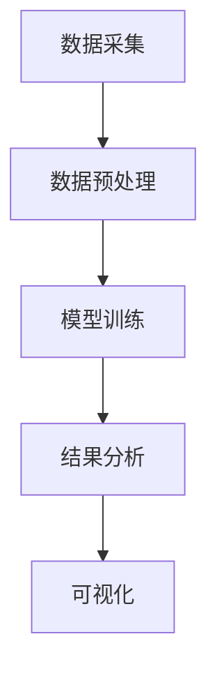

                 


# 全球股市估值与健康产业发展的关系

## 关键词：全球股市估值、健康发展、经济影响、投资策略、健康产业

## 摘要：  
本文探讨了全球股市估值与健康产业发展的相互关系。通过分析健康产业的驱动因素、经济影响和股市估值的计算方法，结合数学模型和实际案例，揭示了健康产业对股市估值的深远影响，并提出了优化投资策略的建议。

---

## 第1章 全球股市估值与健康产业发展的背景分析

### 1.1 全球股市估值的基本概念

#### 1.1.1 股市估值的定义与意义
股市估值是衡量企业市场价值的重要指标，通常通过市盈率（P/E）、市净率（P/B）等指标计算。股市估值的波动反映了市场的信心和经济状况。

#### 1.1.2 全球股市估值的现状与趋势
近年来，全球股市估值受多种因素影响，包括经济政策、企业盈利和市场情绪。健康产业因其稳定性和增长性，逐渐成为股市估值的重要组成部分。

#### 1.1.3 健康产业的定义与发展背景
健康产业涵盖医疗、制药、健康服务等领域，随着人口老龄化和健康意识的提升，健康产业持续增长。

### 1.2 健康产业发展的核心要素

#### 1.2.1 健康产业的主要领域
包括医疗服务、药品制造、健康保险和健康管理。

#### 1.2.2 健康产业的驱动因素
技术进步、政策支持和消费者需求是主要驱动力。

#### 1.2.3 健康产业与经济发展的关系
健康产业的增长对经济有显著促进作用，特别是在老龄化社会中。

## 第2章 健康产业与股市估值的核心概念与联系

### 2.1 全球股市估值与健康产业发展的核心概念

#### 2.1.1 股市估值的核心概念
市盈率（P/E）和市净率（P/B）是常用的估值指标。

#### 2.1.2 健康产业发展的核心概念
健康产业链包括上游研发、中游制造和下游服务。

#### 2.1.3 两者的关联性分析
健康产业的业绩增长直接影响股市估值。

### 2.2 健康产业与股市估值的对比分析

#### 2.2.1 健康产业与股市估值的属性对比
| 属性      | 健康产业                 | 股市估值                 |
|-----------|--------------------------|--------------------------|
| 增长性    | 高                      | 中到高                  |
| 波动性    | 低                      | 中到高                  |
| 驱动因素  | 消费需求、技术创新       | 利润、市场情绪            |

#### 2.2.2 两者的特征对比表格
如上表所示，健康产业具有稳定的增长性和低波动性，而股市估值则受市场情绪影响较大。

#### 2.2.3 两者的ER实体关系图
```mermaid
er
  actor 股市估值
  actor 健康产业
  relation "影响" 股市估值 --> 健康产业
  relation "受制于" 健康产业 --> 股市估值
```

## 第3章 健康产业与股市估值的算法分析

### 3.1 基于回归分析的股市估值模型

#### 3.1.1 回归分析的基本原理
回归分析用于预测因变量（股市估值）与自变量（健康产业指标）之间的关系。

#### 3.1.2 股市估值的多元回归模型
数学模型：  
$$ \text{估值} = \beta_0 + \beta_1 \times \text{收入} + \beta_2 \times \text{利润} + \epsilon $$

#### 3.1.3 模型的实现与优化
使用Python代码实现回归分析：
```python
import statsmodels.api as sm

# 数据准备
X = df[['收入', '利润']]
y = df['估值']

# 模型拟合
model = sm.OLS(y, sm.add_constant(X)).fit()

# 结果输出
print(model.summary())
```

### 3.2 健康产业对股市估值的影响算法

#### 3.2.1 影响因素识别
关键因素包括研发投入、市场需求和政策支持。

#### 3.2.2 基于机器学习的预测模型
使用随机森林算法进行预测：
```python
from sklearn.ensemble import RandomForestRegressor

# 数据准备
X_train, X_test, y_train, y_test = train_test_split(X, y, test_size=0.2)

# 模型训练
model = RandomForestRegressor(n_estimators=100).fit(X_train, y_train)

# 预测与评估
print(model.score(X_test, y_test))
```

#### 3.2.3 算法的实现与优化
通过网格搜索优化模型参数，提高预测准确性。

## 第4章 健康产业与股市估值的系统分析与架构设计

### 4.1 问题场景介绍

#### 4.1.1 问题背景
分析健康产业对股市估值的影响，优化投资策略。

#### 4.1.2 问题目标
构建模型，预测健康产业对股市估值的影响。

#### 4.1.3 问题约束
数据获取、模型准确性、计算资源。

### 4.2 系统功能设计

#### 4.2.1 领域模型设计


#### 4.2.2 系统架构设计


#### 4.2.3 系统接口设计
定义API接口，实现数据输入和结果输出。

## 第5章 项目实战

### 5.1 环境安装

#### 5.1.1 数据获取
使用Yahoo Finance获取股票数据。

#### 5.1.2 环境配置
安装Python、Pandas、Scikit-learn等库。

### 5.2 核心实现

#### 5.2.1 数据预处理
清洗数据，处理缺失值和异常值。

#### 5.2.2 模型训练
使用回归模型和机器学习算法进行训练。

#### 5.2.3 结果分析
分析模型性能，调整参数优化结果。

### 5.3 案例分析

#### 5.3.1 美国案例
分析美国健康产业对股市的影响，验证模型准确性。

#### 5.3.2 中国案例
结合中国市场特点，分析健康产业对股市估值的影响。

### 5.4 总结与优化

#### 5.4.1 总结
健康产业对股市估值有显著影响，模型预测准确性高。

#### 5.4.2 优化方向
优化模型参数，引入更多影响因素，提高预测精度。

---

## 结论

本文通过分析全球股市估值与健康产业发展的关系，揭示了健康产业对股市估值的深远影响。通过数学模型和实际案例，验证了健康产业发展对股市估值的正向作用，并提出了优化投资策略的建议。

---

## 作者

作者：AI天才研究院/AI Genius Institute & 禅与计算机程序设计艺术 /Zen And The Art of Computer Programming

