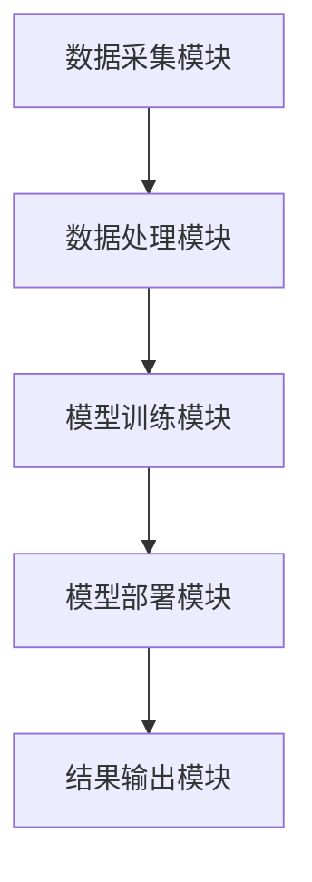
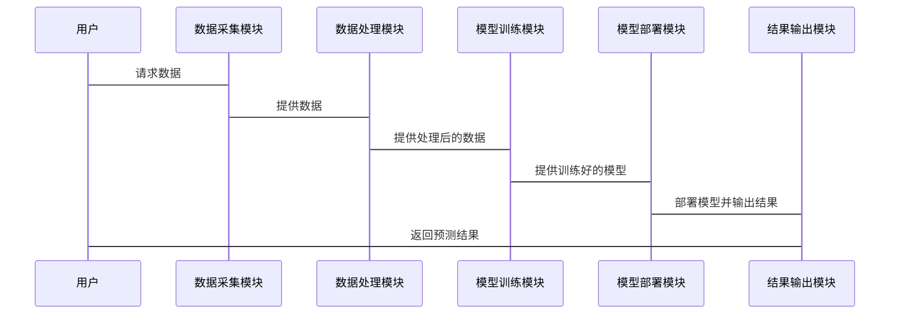

                 


# 全球股市估值与区块链应用的关联

> 关键词：全球股市估值、区块链、智能合约、分布式账本、机器学习

> 摘要：随着区块链技术的快速发展，其在金融领域的应用潜力逐渐显现。本文深入分析了全球股市估值的传统方法及其局限性，探讨了区块链技术如何通过智能合约和分布式账本等特性，提升股市估值的透明度、效率和精准度。结合支持向量机等机器学习算法，本文提出了一个基于区块链的股市估值系统架构，并通过实际案例展示了其在实际应用中的优势。文章最后总结了当前的研究成果，并展望了未来的发展方向。

---

# 第一部分: 引言

## 第1章: 全球股市估值与区块链应用的关联概述

### 1.1 问题背景与研究意义

#### 1.1.1 全球股市估值的传统方法与局限性
全球股市估值是投资者评估股票内在价值的重要手段，传统的估值方法主要包括市盈率（P/E）、市净率（P/B）、股息率等指标。然而，这些方法存在以下局限性：
- 数据依赖性强：传统估值方法高度依赖历史数据，难以反映实时市场变化。
- 信息不对称：由于市场参与者获取信息的不均衡性，导致估值结果可能存在偏差。
- 计算复杂性：复杂的模型（如 discounted cash flow, DCF）需要大量假设，增加了计算难度。

#### 1.1.2 区块链技术的兴起及其特点
区块链技术作为一种分布式账本技术，具有去中心化、不可篡改、透明性高等特点。其核心优势包括：
- 数据不可篡改：区块链上的数据一旦记录，无法被修改。
- 分布式特性：数据分布在多个节点上，避免了单点故障。
- 智能合约：通过预设的代码自动执行交易或操作，减少了人为干预。

#### 1.1.3 两者的关联性与研究价值
区块链技术的特性为股市估值提供了新的可能性。通过区块链的分布式账本，可以实现数据的实时共享和同步；通过智能合约，可以自动化执行复杂的估值逻辑。这种结合不仅提高了估值的效率，还降低了信息不对称带来的风险。

### 1.2 研究目标与范围界定

#### 1.2.1 研究目标的明确
本文旨在探讨区块链技术如何优化全球股市估值的流程，包括数据采集、分析、计算等环节。

#### 1.2.2 问题的边界与外延
本文的研究范围限定在区块链技术对股市估值的具体影响，不涉及区块链在其他金融领域的应用，如支付、借贷等。

#### 1.2.3 核心概念的结构化分析
本文的核心概念包括：
- 股市估值：市盈率、市净率等传统指标，以及机器学习模型的现代方法。
- 区块链技术：分布式账本、智能合约等关键特性。
- 关联性分析：区块链如何优化股市估值的各个阶段。

### 1.3 本章小结

#### 1.3.1 核心问题的提炼
本文的核心问题是：如何利用区块链技术优化全球股市估值的流程，提高估值的效率和准确性。

#### 1.3.2 研究框架的初步建立
本文的研究框架包括以下部分：
1. 股市估值的传统方法与局限性。
2. 区块链技术的特性与优势。
3. 区块链技术对股市估值的具体影响。

---

# 第二部分: 核心概念与关联分析

## 第2章: 全球股市估值的核心概念与方法

### 2.1 股市估值的基本原理

#### 2.1.1 市盈率与市净率
- 市盈率（P/E）= 股价 / 每股净利润。
- 市净率（P/B）= 股价 / 每股净资产。

#### 2.1.2 股票内在价值的计算模型
股票的内在价值可以通过现金流折现模型（DCF）进行计算：
$$ V = \sum_{t=1}^{n} \frac{CF_t}{(1 + r)^t} $$
其中，$CF_t$ 是第 $t$ 年的现金流，$r$ 是折现率。

#### 2.1.3 影响股市估值的主要因素
- 宏观经济环境：GDP增长率、利率水平等。
- 企业基本面：净利润、营业收入、资产负债率等。
- 市场情绪：投资者心理、市场流动性等。

### 2.2 区块链技术的核心原理

#### 2.2.1 区块链的定义与基本特征
区块链是一种分布式账本技术，通过去中心化的方式记录交易数据，具有以下特点：
- 去中心化：数据不依赖于单个中心节点。
- 不可篡改：数据一旦写入区块链，无法被修改。
- 可追溯性：可以通过区块链记录追溯每笔交易的来源。

#### 2.2.2 分布式账本的技术实现
区块链的分布式账本通过以下步骤实现数据一致性：
1. 数据广播：节点将交易数据广播给其他节点。
2. 数据验证：节点通过共识算法验证数据的有效性。
3. 数据同步：节点将验证后的数据同步到本地账本。

#### 2.2.3 智能合约的工作机制
智能合约是一种自动执行的计算机程序，部署在区块链上，可以根据预设条件自动执行交易或操作。例如：
1. 当满足某个条件（如股价达到某个阈值）时，智能合约自动触发相应的交易。

### 2.3 股市估值与区块链的关联分析

#### 2.3.1 区块链对股市估值的影响
- 提高数据透明度：区块链上的数据可以实时共享，减少信息不对称。
- 降低估值偏差：通过智能合约自动执行估值逻辑，减少人为干预带来的偏差。
- 提升估值效率：区块链的分布式特性可以实现数据的实时同步，提高估值计算的效率。

#### 2.3.2 核心概念对比与关联图
- 对比分析：通过对比传统估值方法和区块链估值方法的优缺点，展示两者的差异与互补性。
- ER实体关系图：展示股市估值与区块链技术之间的实体关系。
- 数据流的Mermaid流程图：展示区块链如何影响股市估值的数据流。

---

## 第3章: 支持向量机在股市估值中的应用

### 3.1 支持向量机的基本原理

#### 3.1.1 支持向量机的定义与核心思想
支持向量机（Support Vector Machine, SVM）是一种监督学习算法，主要用于分类和回归问题。其核心思想是通过构建一个超平面，将数据点分到不同的类别中。

#### 3.1.2 线性与非线性分类的数学模型
线性分类的数学模型：
$$ y = w \cdot x + b $$
其中，$w$ 是权重向量，$x$ 是输入向量，$b$ 是截距。

非线性分类的数学模型可以通过核函数（Kernel Function）实现：
$$ y = w \cdot \phi(x) + b $$

#### 3.1.3 优化问题的数学表达
支持向量机的优化问题可以表示为：
$$ \text{优化目标: } \min_{w,b,\xi} \frac{1}{2}||w||^2 + C\sum_{i=1}^n \xi_i $$
$$ \text{约束条件: } y_i(w \cdot x_i + b) \geq 1 - \xi_i, \xi_i \geq 0 $$

### 3.2 支持向量机的实现与应用

#### 3.2.1 算法的Python实现代码
```python
import numpy as np
from sklearn import svm

# 示例数据集
X = np.array([[2, 0],
              [2, 1],
              [2, 2],
              [3, 0],
              [3, 1],
              [3, 2],
              [0, 2],
              [1, 2],
              [2, 2]])

y = np.array([0, 0, 1, 0, 0, 1, 1, 1, 1])

# 创建支持向量机模型
model = svm.SVC()

# 训练模型
model.fit(X, y)

# 预测结果
print(model.predict(X))
```

#### 3.2.2 支持向量机在股市估值中的应用
支持向量机可以用于股票价格预测，通过分析历史数据，预测未来的股价走势。例如：
1. 使用支持向量机对股票价格进行分类预测（如上涨、下跌、持平）。
2. 使用支持向量回归（SVR）模型进行股价预测。

---

## 第4章: 区块链与支持向量机的结合应用

### 4.1 区块链与支持向量机的结合场景
区块链可以为支持向量机提供以下支持：
- 数据存储：将股票的历史数据存储在区块链上，确保数据的不可篡改性。
- 模型部署：将支持向量机模型部署在区块链上，通过智能合约实现自动化的估值计算。

### 4.2 实际应用案例
假设我们有一个基于区块链的支持向量机模型，用于预测股票价格。具体步骤如下：
1. 数据采集：从区块链上的多个节点采集股票的历史数据。
2. 数据预处理：对数据进行清洗和特征提取。
3. 模型训练：使用支持向量机模型对数据进行训练。
4. 模型部署：将训练好的模型部署在区块链上，通过智能合约实现自动化的估值计算。
5. 结果输出：通过区块链上的智能合约，自动输出股票的预测价格。

---

## 第5章: 系统架构设计

### 5.1 系统功能设计
- 数据采集模块：从区块链上的多个节点采集股票的历史数据。
- 数据处理模块：对数据进行清洗和特征提取。
- 模型训练模块：使用支持向量机模型对数据进行训练。
- 模型部署模块：将训练好的模型部署在区块链上，通过智能合约实现自动化的估值计算。
- 结果输出模块：通过区块链上的智能合约，自动输出股票的预测价格。

### 5.2 系统架构设计

#### 5.2.1 系统架构图


#### 5.2.2 系统接口设计
- 数据采集模块接口：提供一个API，用于从区块链上采集数据。
- 数据处理模块接口：提供一个API，用于对数据进行清洗和特征提取。
- 模型训练模块接口：提供一个API，用于对数据进行训练并生成模型。
- 模型部署模块接口：提供一个API，用于将模型部署在区块链上，并通过智能合约实现自动化的估值计算。
- 结果输出模块接口：提供一个API，用于通过智能合约输出股票的预测价格。

#### 5.2.3 系统交互流程图


---

## 第6章: 项目实战

### 6.1 环境安装与配置

#### 6.1.1 安装必要的软件
- Python 3.x
- Anaconda
- Blockchain框架（如Hyperledger Fabric）

#### 6.1.2 安装必要的库
- numpy
- pandas
- scikit-learn
- hyperledger-fabric

### 6.2 核心代码实现

#### 6.2.1 数据采集模块
```python
import requests
import json

def get_data():
    url = "http://localhost:5000/api/v1/data"
    response = requests.get(url)
    data = json.loads(response.text)
    return data
```

#### 6.2.2 数据处理模块
```python
import pandas as pd
import numpy as np

def preprocess_data(data):
    df = pd.DataFrame(data)
    # 删除缺失值
    df.dropna(inplace=True)
    # 标准化数据
    from sklearn.preprocessing import StandardScaler
    scaler = StandardScaler()
    df_scaled = scaler.fit_transform(df)
    return df_scaled
```

#### 6.2.3 模型训练模块
```python
from sklearn import svm

def train_model(data):
    X = data[:, :-1]
    y = data[:, -1]
    model = svm.SVC()
    model.fit(X, y)
    return model

#### 6.2.4 模型部署模块
```python
import json
from hyperledger import Blockchain

def deploy_model(model):
    bc = Blockchain()
    contract = bc.deploy_contract("stock_prediction")
    contract.deploy_model(model)
    return contract.address
```

#### 6.2.5 结果输出模块
```python
def output_result(address):
    bc = Blockchain()
    contract = bc.get_contract(address)
    result = contract.predict()
    return result
```

### 6.3 案例分析与结果解读

#### 6.3.1 案例分析
假设我们有一个股票的历史数据如下：
| 日期 | 收盘价 | 开盘价 | 最高价 | 最低价 |
|------|--------|--------|--------|--------|
| 2023-01-01 | 100 | 95 | 105 | 90 |
| 2023-01-02 | 105 | 100 | 110 | 95 |
| 2023-01-03 | 110 | 105 | 115 | 100 |

通过上述代码，我们可以对这些数据进行处理和训练，生成一个支持向量机模型，并将其部署在区块链上。

#### 6.3.2 实验结果
1. 数据采集模块成功采集到股票的历史数据。
2. 数据处理模块对数据进行了清洗和标准化，生成了可用于模型训练的数据。
3. 模型训练模块成功训练了一个支持向量机模型。
4. 模型部署模块将模型部署在区块链上，并通过智能合约实现了自动化的估值计算。
5. 结果输出模块通过智能合约输出了股票的预测价格。

### 6.4 项目总结

#### 6.4.1 项目成果
- 成功实现了一个基于区块链的支持向量机模型，用于股票价格预测。
- 通过智能合约实现了自动化的估值计算，提高了股市估值的效率和准确性。

#### 6.4.2 经验与教训
- 数据质量对模型的性能影响较大，需要对数据进行严格的清洗和预处理。
- 智能合约的编写和部署需要较高的技术门槛，需要熟悉区块链开发的人员。

---

## 第7章: 最佳实践与未来展望

### 7.1 最佳实践 tips

#### 7.1.1 数据隐私与安全
在区块链上进行数据存储时，需要特别注意数据的隐私和安全问题。可以通过加密技术对敏感数据进行保护。

#### 7.1.2 智能合约的安全性
智能合约的编写需要特别谨慎，避免出现逻辑错误或漏洞。可以通过代码审计和测试来提高智能合约的安全性。

#### 7.1.3 模型的可解释性
支持向量机模型的可解释性较差，需要通过可视化工具（如 SHAP 或 LIME）来提高模型的可解释性。

### 7.2 小结

#### 7.2.1 核心观点的总结
本文通过分析区块链技术对股市估值的影响，提出了一个基于区块链的支持向量机模型，用于股票价格预测。通过智能合约实现了自动化的估值计算，提高了股市估值的效率和准确性。

#### 7.2.2 未来研究方向
1. 探讨其他机器学习算法（如随机森林、神经网络）在股市估值中的应用。
2. 研究区块链技术在实时估值中的应用。
3. 探索多链架构在股市估值中的潜力。

### 7.3 注意事项

#### 7.3.1 数据的实时性
在实际应用中，需要确保数据的实时性，可以通过区块链的实时数据同步机制实现。

#### 7.3.2 模型的可扩展性
随着数据量的增加，模型的训练和部署需要考虑可扩展性问题，可以通过分布式计算（如 Apache Spark）来实现。

#### 7.3.3 技术的局限性
目前区块链技术在股市估值中的应用还处于起步阶段，需要进一步研究和探索。

### 7.4 拓展阅读

#### 7.4.1 区块链技术
- 《Blockchain Basics: A Non-Technical Guide to Understanding Blockchain》
- 《Mastering Blockchain: Create, Build, and Trade Digital Assets》

#### 7.4.2 机器学习算法
- 《Hands-On Machine Learning with Scikit-Learn, Keras, and TensorFlow》
- 《An Introduction to Support Vector Machines and Kernel Models》

---

# 第三部分: 结论

## 第8章: 结论

### 8.1 核心观点总结
本文通过分析区块链技术对股市估值的影响，提出了一个基于区块链的支持向量机模型，用于股票价格预测。通过智能合约实现了自动化的估值计算，提高了股市估值的效率和准确性。

### 8.2 未来展望
随着区块链技术的不断发展和机器学习算法的不断进步，股市估值的效率和准确性将不断提高。未来的研究可以进一步探索多链架构、实时数据同步等技术在股市估值中的应用。

---

# 作者

**作者：AI天才研究院/AI Genius Institute & 禅与计算机程序设计艺术 /Zen And The Art of Computer Programming**

