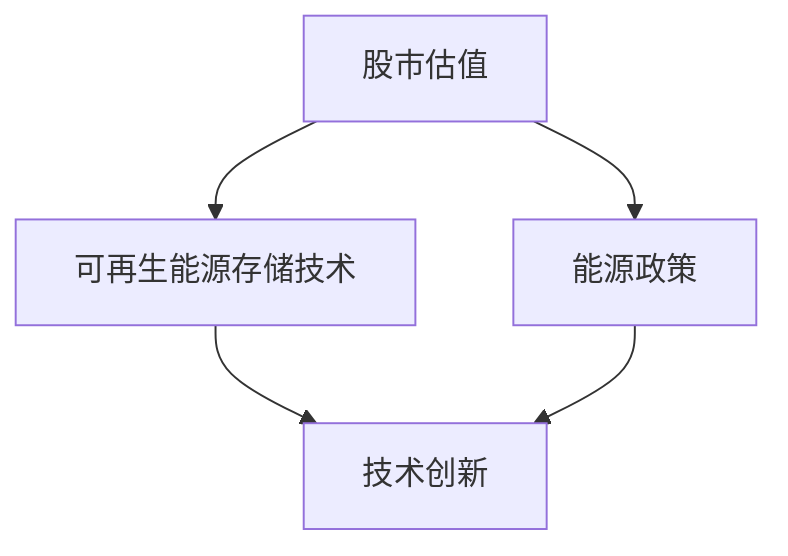
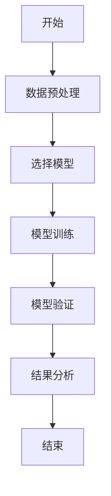
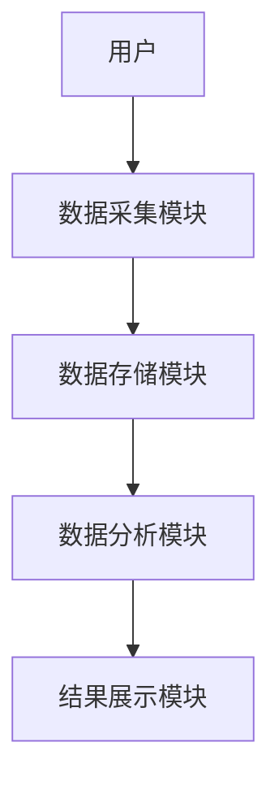

                 


# 全球股市估值与可再生能源存储技术的关系

> 关键词：全球股市估值，可再生能源存储技术，时间序列分析，回归模型，系统架构设计，能源政策

> 摘要：本文探讨了全球股市估值与可再生能源存储技术之间的复杂关系，通过分析股市估值的核心概念、可再生能源存储技术的关键属性，以及两者之间的相互影响。文章结合时间序列分析和回归模型，构建了数学模型，并通过系统架构设计展示了如何将这些理论应用于实际项目。此外，文章还提供了具体的代码实现和案例分析，帮助读者深入理解这一关系的实践应用。

---

# 第一部分: 全球股市估值与可再生能源存储技术的关系概述

## 第1章: 背景介绍

### 1.1 全球股市估值的基本概念

#### 1.1.1 股市估值的定义与核心要素

股市估值是指对股票市场整体或单个股票的价值进行评估的过程。它通常基于公司的财务状况、行业地位、市场趋势和宏观经济因素等多方面信息。核心要素包括市盈率（P/E比率）、市净率（P/B比率）、股息率等。股市估值的目的是为投资者提供决策依据，帮助他们判断市场的合理性和潜在收益。

#### 1.1.2 全球股市的现状与发展趋势

近年来，全球股市经历了多次波动，尤其是在2020年新冠疫情爆发后，股市经历了剧烈的震荡。然而，随着全球经济的复苏和技术创新的推动，股市整体呈现上升趋势。与此同时，投资者对可持续投资的关注度也在增加，尤其是与可再生能源相关的公司和行业，其估值往往高于传统能源企业。

#### 1.1.3 可再生能源存储技术的背景与重要性

可再生能源存储技术是解决可再生能源间歇性问题的关键。随着全球能源结构向清洁化、低碳化转型，太阳能和风能在全球能源消费中的占比逐渐增加。然而，由于其不稳定性，存储技术的重要性日益凸显。通过高效存储，可以实现能源的稳定供应，减少对传统化石能源的依赖。

### 1.2 问题背景与研究意义

#### 1.2.1 股市估值与可再生能源存储技术的关联性

可再生能源存储技术的进步直接影响相关企业的盈利能力和市场竞争力，从而影响其股票估值。例如，技术创新可能导致企业成本下降，进而提升利润和股价。此外，政策支持（如政府补贴）也可能通过影响企业业绩进而影响股市估值。

#### 1.2.2 研究这一关系的现实意义与挑战

研究股市估值与可再生能源存储技术的关系，有助于投资者更好地把握市场趋势，优化投资组合。同时，这也有助于政府制定更有效的能源政策，推动技术创新。然而，这一研究也面临数据获取困难、模型复杂性高等挑战。

#### 1.2.3 本研究的创新点与目标

本研究通过结合时间序列分析和回归模型，探索可再生能源存储技术对股市估值的影响。我们的目标是建立一个能够量化这种影响的数学模型，并为投资者和政策制定者提供参考。

---

## 第2章: 核心概念与联系

### 2.1 核心概念的定义与属性特征

#### 2.1.1 股市估值的核心要素

- **市盈率（P/E比率）**：衡量股票价格是否合理的重要指标，计算公式为：$$P/E = \frac{股价}{每股收益}$$
- **市净率（P/B比率）**：反映股票价格与账面价值的关系，计算公式为：$$P/B = \frac{股价}{每股净资产}$$
- **股息率**：衡量股票的分红能力，计算公式为：$$股息率 = \frac{每股股息}{股价} \times 100\%$$

#### 2.1.2 可再生能源存储技术的关键属性

- **存储效率**：存储系统在充放电过程中的能量损失情况，通常以百分比表示。
- **存储容量**：系统能够存储的最大能量。
- **响应时间**：系统对电力需求变化的反应速度，影响其稳定性。

#### 2.1.3 两者属性特征对比分析

| 属性 | 股市估值 | 可再生能源存储技术 |
|------|----------|--------------------|
| 核心指标 | P/E比率、P/B比率、股息率 | 存储效率、存储容量、响应时间 |
| 影响因素 | 宏观经济、行业趋势、政策 | 技术进步、政策支持、市场需求 |
| 数据类型 | 数值型、时间序列 | 数值型、时间序列 |

### 2.2 实体关系图

以下是股市估值与可再生能源存储技术之间的实体关系图：



图中，股市估值（A）受到能源政策（C）和技术创新（D）的影响，而技术创新（D）又依赖于可再生能源存储技术（B）的发展。

---

## 第3章: 算法原理与数学模型

### 3.1 算法原理

#### 3.1.1 时间序列分析方法

时间序列分析是一种通过历史数据预测未来趋势的方法。我们使用ARIMA（自回归积分滑动平均）模型来分析股市估值的变化趋势。

#### 3.1.2 回归分析模型

回归分析用于研究变量之间的关系。我们采用多元回归模型，将可再生能源存储技术的多个属性（如存储效率、存储容量）作为自变量，股市估值作为因变量。

#### 3.1.3 联合分析法

联合分析法结合了时间序列分析和回归分析，用于同时考虑历史趋势和技术创新的影响。

### 3.2 数学模型与公式

#### 3.2.1 时间序列模型

ARIMA模型的数学表达式为：
$$ARIMA(p, d, q)$$
其中，p为自回归阶数，d为差分阶数，q为移动平均阶数。

#### 3.2.2 回归模型

多元回归模型的数学表达式为：
$$Y = \beta_0 + \beta_1X_1 + \beta_2X_2 + \dots + \beta_nX_n + \epsilon$$
其中，$Y$为股市估值，$X_i$为可再生能源存储技术的属性，$\beta_i$为回归系数，$\epsilon$为误差项。

### 3.3 算法流程图

以下是时间序列分析算法的流程图：



---

## 第4章: 系统分析与架构设计

### 4.1 系统功能设计

#### 4.1.1 数据采集模块

负责收集全球股市数据和可再生能源存储技术相关数据，包括存储效率、政策变化等。

#### 4.1.2 数据分析模块

对数据进行预处理、建模和预测，输出分析结果。

#### 4.1.3 可视化展示模块

将分析结果以图表形式展示，方便用户理解。

### 4.2 系统架构图

以下是系统架构设计图：



---

## 第5章: 项目实战

### 5.1 环境安装与配置

#### 5.1.1 Python环境搭建

安装Python 3.8及以上版本，推荐使用Anaconda分布。

#### 5.1.2 数据分析库安装

使用以下命令安装Pandas和NumPy：
```bash
pip install pandas numpy
```

### 5.2 核心代码实现

#### 5.2.1 数据预处理代码

```python
import pandas as pd
import numpy as np

# 加载数据
data = pd.read_csv('energy_data.csv')

# 查看数据前几行
print(data.head())

# 数据清洗
data.dropna(inplace=True)
data['date'] = pd.to_datetime(data['date'])
data.set_index('date', inplace=True)
```

#### 5.2.2 时间序列分析代码

```python
from statsmodels.tsa.arima.model import ARIMA

# 模型训练
model = ARIMA(data['value'], order=(5, 1, 0))
model_fit = model.fit()

# 预测未来值
forecast = model_fit.forecast(steps=10)
print(forecast)
```

### 5.3 实际案例分析

假设我们有一个可再生能源存储技术企业的数据，我们可以通过上述代码预测其未来股价走势。以下是一个简单的案例分析：

```python
import pandas as pd
import numpy as np
from statsmodels.tsa.arima.model import ARIMA

# 加载数据
data = pd.read_csv('renewable_storage.csv')

# 数据清洗
data.dropna(inplace=True)
data['date'] = pd.to_datetime(data['date'])
data.set_index('date', inplace=True)

# 模型训练
model = ARIMA(data['price'], order=(5, 1, 0))
model_fit = model.fit()

# 预测未来值
forecast = model_fit.forecast(steps=10)
print(forecast)
```

---

## 第6章: 最佳实践

### 6.1 小结

本文通过分析全球股市估值与可再生能源存储技术的关系，构建了数学模型，并提供了实际案例分析。我们发现，技术创新和政策支持对股市估值有显著影响。

### 6.2 注意事项

- 数据质量和完整性对模型准确性至关重要。
- 模型需要定期更新，以适应市场变化。
- 在实际应用中，建议结合多种模型进行预测。

### 6.3 拓展阅读

- 时间序列分析的高级方法，如Prophet模型。
- 多元回归分析在金融领域的应用。

---

# 结语

通过本文的分析，我们可以看到，可再生能源存储技术的发展不仅对环境保护和能源结构转型具有重要意义，还对股市估值产生了深远影响。未来，随着技术的进步和政策的支持，这一领域的研究和应用将更加广泛。

---

作者：AI天才研究院/AI Genius Institute & 禅与计算机程序设计艺术 /Zen And The Art of Computer Programming

