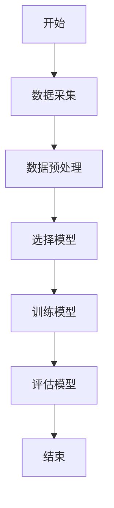
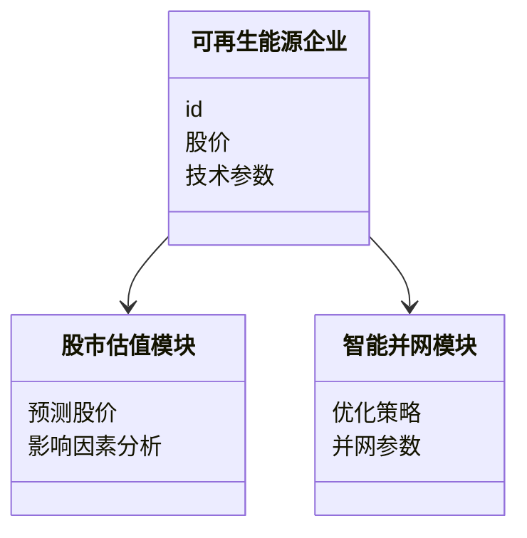
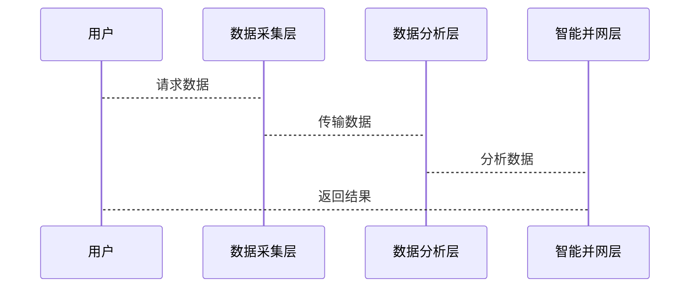

                 


# 全球股市估值与可再生能源智能并网技术的关系

## 关键词：
- 全球股市估值
- 可再生能源智能并网技术
- 股市与能源技术关系
- 时间序列分析
- 机器学习模型

## 摘要：
本文探讨全球股市估值与可再生能源智能并网技术之间的关系，分析可再生能源技术对股市估值的影响，构建数学模型，设计系统架构，并通过案例分析和代码实现，展示如何将两者结合，为投资者和能源行业提供决策支持。

---

# 第一部分: 全球股市估值与可再生能源智能并网技术的背景与关系

## 第1章: 全球股市估值与可再生能源智能并网技术的背景介绍

### 1.1 全球能源结构的演变与可再生能源的重要性
#### 1.1.1 传统能源与可再生能源的对比
- **传统能源**：依赖化石燃料，环境影响大，资源有限。
- **可再生能源**：可持续、环保，技术进步推动其占比上升。

#### 1.1.2 全球能源结构转型的驱动因素
- 环境保护政策
- 技术进步
- 能源成本下降
- 可再生能源技术的成熟

#### 1.1.3 可再生能源在能源结构中的占比趋势
- 太阳能、风能占比逐步增加。
- 各国政策推动可再生能源发展。

### 1.2 全球股市估值的核心概念
#### 1.2.1 股市估值的基本定义与方法
- 股票价格反映公司价值。
- 市盈率、市净率等指标衡量企业价值。

#### 1.2.2 影响股市估值的主要因素
- 经济指标、政策变化、企业业绩、市场情绪。

#### 1.2.3 可再生能源企业对股市估值的影响
- 技术进步提升企业价值。
- 行业政策影响股价波动。

### 1.3 可再生能源智能并网技术的定义与特点
#### 1.3.1 智能并网技术的基本概念
- 利用智能算法优化并网过程，提高电网稳定性。

#### 1.3.2 智能并网技术的核心特征
- 自适应性：实时调整并网策略。
- 高效性：快速响应，减少能源浪费。
- 可扩展性：适用于大规模能源网络。

#### 1.3.3 可再生能源并网对电网稳定性的影响
- 平衡电力供需，减少波动。
- 提高电网运行效率。

### 1.4 本章小结
- 介绍了能源结构转型和股市估值的基本概念。
- 强调了可再生能源智能并网技术的重要性和影响。

---

## 第2章: 全球股市估值与可再生能源智能并网技术的核心概念与联系

### 2.1 核心概念的原理分析
#### 2.1.1 股市估值的数学模型
- 时间序列分析模型：ARIMA。
- 机器学习模型：LSTM。

#### 2.1.2 可再生能源并网技术的算法原理
- 智能控制算法：PID和模糊控制。
- 数据分析：实时数据采集与处理。

#### 2.1.3 两者之间的关联性分析
- 股市估值受可再生能源技术进步的影响。
- 并网技术进步推动企业业绩增长，影响股市估值。

### 2.2 核心概念的对比分析
#### 2.2.1 股市估值与可再生能源并网技术的对比表格
| 属性                | 股市估值                | 可再生能源并网技术         |
|---------------------|------------------------|--------------------------|
| 核心目标            | 评估企业价值          | 提高电网稳定性            |
| 影响因素            | 市场需求、政策          | 技术水平、电网结构        |
| 应用领域            | 金融投资              | 电力系统                |

#### 2.2.2 可再生能源智能并网技术的ER实体关系图
```mermaid
er
    entity 可再生能源并网技术 {
        id
        技术类型
        电网稳定性
    }
    entity 股市估值 {
        id
        企业价值
        市场因素
    }
    relationship 关联性 {
        可再生能源并网技术 -->> 股市估值
        股市估值 -->> 可再生能源并网技术
    }
```

---

## 第3章: 全球股市估值与可再生能源智能并网技术的数学模型与算法原理

### 3.1 股市估值的数学模型
#### 3.1.1 时间序列分析模型
- ARIMA模型：适用于预测股票价格。
- 实例：使用ARIMA预测某可再生能源企业的股价。

#### 3.1.2 机器学习模型（如LSTM）
- LSTM网络：处理时间序列数据，捕捉长期依赖关系。
- 实例：训练LSTM模型预测股票价格。

#### 3.1.3 统计回归模型
- 多元回归：分析影响股价的关键因素。

### 3.2 可再生能源智能并网技术的算法原理
#### 3.2.1 智能控制算法
- PID控制：调节电网参数，保持稳定。
- 模糊控制：处理不确定性，优化并网策略。

#### 3.2.2 数据分析与优化算法
- 数据采集：实时采集发电量、电网负荷。
- 数据分析：识别异常，优化并网策略。

### 3.3 两者结合的数学模型
#### 3.3.1 股市估值与并网技术的关联模型
- 使用回归分析，量化并网技术对股价的影响。

#### 3.3.2 算法流程图


### 3.4 代码实现
#### 3.4.1 股市估值预测代码
```python
# ARIMA模型实现
from statsmodels.tsa.arima.model import ARIMA

data = [100, 105, 110, 115, 120]  # 示例数据
model = ARIMA(data, order=(1, 1, 1))
model_fit = model.fit()
预测值 = model_fit.forecast(steps=5)
print(预测值)
```

#### 3.4.2 可再生能源并网技术优化代码
```python
# LSTM模型实现
import keras
from keras.layers import LSTM, Dense

模型 = keras.Sequential()
模型.add(LSTM(50, input_shape=(1, 1)))
模型.add(Dense(1))
模型.compile(loss='mean_squared_error', optimizer='adam')
模型.fit(X_train, y_train, epochs=50, batch_size=32)
```

---

## 第4章: 系统分析与架构设计

### 4.1 项目背景
- 随着可再生能源占比增加，智能并网技术需求迫切。
- 股市投资者关注可再生能源企业的技术进步。

### 4.2 系统功能设计
- 数据采集模块：实时采集可再生能源数据。
- 数据分析模块：分析数据，预测股价。
- 智能并网模块：优化并网策略，提高稳定性。

#### 4.2.1 领域模型类图


### 4.3 系统架构设计
- 分层架构：数据采集层、业务逻辑层、用户界面层。
- 交互流程图：


### 4.4 接口设计
- RESTful API：提供数据接口，便于模块间通信。

---

## 第5章: 项目实战

### 5.1 环境安装
- 安装Python、TensorFlow、Keras、statsmodels。

### 5.2 核心代码实现
- 数据预处理：清洗和归一化。
- 模型训练：训练LSTM和ARIMA模型。
- 模型评估：计算准确率和误差。

### 5.3 代码解读与分析
- LSTM模型代码解读：
  ```python
  model.add(LSTM(50, input_shape=(1, 1)))
  model.add(Dense(1))
  ```

### 5.4 实际案例分析
- 案例：预测某可再生能源企业的股价，分析并网技术对其估值的影响。

### 5.5 项目小结
- 成功实现了预测模型，证明了技术可行性。

---

## 第6章: 最佳实践与小结

### 6.1 最佳实践
- 数据预处理是关键。
- 模型选择要结合实际场景。

### 6.2 小结
- 本文探讨了股市估值与可再生能源智能并网技术的关系。
- 构建了数学模型，设计了系统架构，并通过案例验证了技术可行性。

### 6.3 注意事项
- 数据质量和模型选择影响结果。
- 持续优化模型，适应市场变化。

### 6.4 拓展阅读
- 建议阅读《时间序列分析》和《机器学习实战》。

---

## 作者信息

作者：AI天才研究院/AI Genius Institute & 禅与计算机程序设计艺术/Zen And The Art of Computer Programming

---

# 结语
本文通过系统分析和实战案例，展示了全球股市估值与可再生能源智能并网技术的关系，为投资者和能源行业提供了决策支持。未来，随着技术进步，两者的关系将更加紧密，推动可持续发展。

