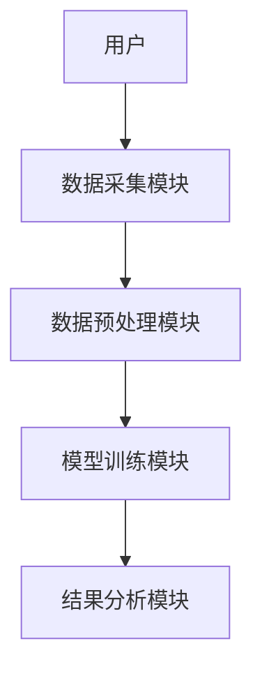
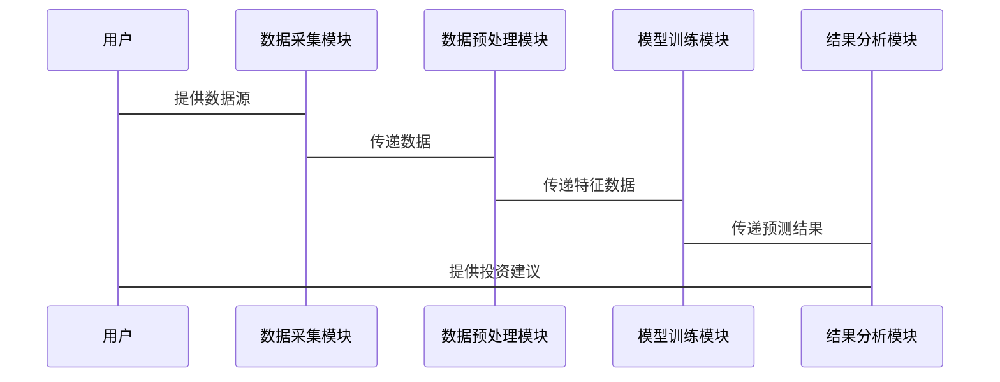

                 


# 全球股市估值与可再生能源预测技术的关系

**关键词**：全球股市估值、可再生能源预测、时间序列分析、机器学习、能源市场、投资策略

**摘要**：  
随着全球能源结构向可再生能源转型，可再生能源的波动性和不确定性对全球股市估值产生了深远影响。本文通过分析可再生能源预测技术，探讨其对股市估值的预测和优化作用。结合时间序列分析和机器学习算法，构建预测模型，揭示两者之间的相互关系，并为投资者提供科学的决策支持。

---

# 第一部分：背景与核心概念

## 第1章：全球股市估值与可再生能源预测技术的背景介绍

### 1.1 问题背景与问题描述

#### 1.1.1 全球股市估值的现状与挑战
全球股市估值是衡量市场健康状况的重要指标，但受经济波动、政策变化和企业盈利等多种因素影响。近年来，能源转型带来的可再生能源波动性增加，进一步复杂化了股市估值的预测。

#### 1.1.2 可再生能源发展的趋势与影响
可再生能源（如太阳能、风能）的崛起正在改变全球能源结构，其波动性对能源企业的盈利能力和股市估值产生直接影响。

#### 1.1.3 两者关系的提出与研究意义
研究可再生能源预测技术对股市估值的影响，有助于投资者更好地理解市场波动，优化投资策略。

---

## 第2章：核心概念与问题解决

### 2.1 核心概念与理论基础

#### 2.1.1 股市估值的核心要素
- 市盈率（P/E）
- 市净率（P/B）
- 股价收益率（ROE）

#### 2.1.2 可再生能源预测技术的关键点
- 时间序列分析
- 机器学习算法（如LSTM）
- 数据来源（如天气数据、政策变化）

---

# 第二部分：算法与系统设计

## 第3章：可再生能源预测模型的构建与优化

### 3.1 时间序列分析模型

#### 3.1.1 ARIMA模型
ARIMA（自回归积分滑动平均模型）是一种经典的统计模型，适用于线性时间序列预测。

$$ ARIMA(p, d, q) $$
其中，p为自回归阶数，d为差分阶数，q为滑动平均阶数。

#### 3.1.2 LSTM网络
LSTM（长短期记忆网络）是一种深度学习模型，适用于捕捉时间序列中的长期依赖关系。

$$ f(t) = \sigma(W_f \cdot [h_{t-1}, x_t] + b_f) $$
其中，$\sigma$为sigmoid函数，$W_f$和$b_f$为权重和偏置。

### 3.2 模型优化与比较

#### 3.2.1 模型性能对比
- ARIMA适用于线性趋势，LSTM适用于非线性波动。
- LSTM在捕捉短期波动方面表现更优。

#### 3.2.2 超参数调优
- 确定最佳的模型参数（如p、q、隐藏层大小）。
- 使用交叉验证评估模型性能。

---

## 第4章：系统架构与功能设计

### 4.1 问题场景与需求分析

#### 4.1.1 项目背景
设计一个结合股市数据和可再生能源数据的预测系统，为投资者提供决策支持。

#### 4.1.2 系统功能
- 数据采集：整合股市数据和可再生能源数据。
- 数据预处理：清洗和特征提取。
- 模型训练：构建预测模型并优化参数。
- 结果分析：生成预测报告和投资建议。

### 4.2 系统架构设计

#### 4.2.1 系统架构图


#### 4.2.2 系统交互流程


---

## 第5章：项目实战与案例分析

### 5.1 环境安装与数据准备

#### 5.1.1 环境安装
安装必要的Python库：
```bash
pip install numpy pandas scikit-learn keras tensorflow
```

#### 5.1.2 数据准备
获取可再生能源数据和相关股市数据，进行清洗和特征提取。

### 5.2 核心代码实现

#### 5.2.1 数据预处理
```python
import pandas as pd
import numpy as np

# 数据加载与清洗
df = pd.read_csv('re_data.csv')
df = df.dropna()  # 删除缺失值
```

#### 5.2.2 LSTM模型实现
```python
from keras.models import Sequential
from keras.layers import LSTM, Dense

model = Sequential()
model.add(LSTM(64, input_shape=(timesteps, features)))
model.add(Dense(1))
model.compile(loss='mean_squared_error', optimizer='adam')
```

### 5.3 案例分析与结果解读

#### 5.3.1 案例分析
以某可再生能源公司为例，使用LSTM模型预测其股价波动。

#### 5.3.2 结果解读
- 模型预测与实际数据的对比。
- 模型性能评估（如MAE、RMSE）。

### 5.4 项目小结

---

# 第三部分：总结与展望

## 第6章：总结与最佳实践

### 6.1 研究总结
- 可再生能源预测技术对股市估值具有重要影响。
- LSTM模型在非线性预测中表现优异。

### 6.2 最佳实践
- 数据质量是模型性能的关键。
- 模型部署需考虑实时数据更新。

### 6.3 未来展望
- 结合机器学习和区块链技术，提升数据安全性和预测精度。
- 开发更多元化的预测模型，适应复杂市场环境。

---

# 作者：AI天才研究院 & 禅与计算机程序设计艺术

---

以上是文章的完整目录和内容概要，希望对您有所帮助！

