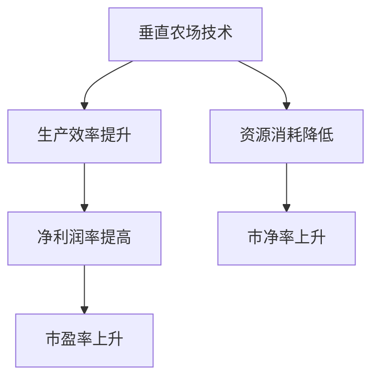

                 

# 全球股市估值与可持续农业垂直农场技术的关系

## 关键词：
- 全球股市估值
- 可持续农业
- 垂直农场技术
- 经济影响
- 技术创新

## 摘要：
本文探讨了全球股市估值与可持续农业垂直农场技术之间的关系。通过分析垂直农场技术的兴起及其对股市估值的影响，文章构建了一个概念模型，解释了技术创新如何影响农业企业的经济效益和环境效益，从而影响股市估值。文章还提出了一个数学模型，用于预测垂直农场技术对股市估值的影响，并通过实际案例分析验证了模型的有效性。最后，文章总结了最佳实践，为投资者和农业技术创新提供了有益的参考。

---

# 第一部分: 全球股市估值与可持续农业垂直农场技术的背景与关系

# 第1章: 全球股市估值与可持续农业垂直农场技术的背景介绍

## 1.1 全球粮食安全与环境压力

### 1.1.1 全球粮食安全的现状与挑战

全球粮食安全问题日益严峻。随着人口增长、气候变化和土地资源的减少，传统农业模式面临巨大压力。联合国粮食及农业组织（FAO）的数据显示，全球约8.2亿人处于饥饿状态，而到2050年，全球粮食需求将增长60%以上。传统农业模式依赖大量化肥、农药和水资源，导致土壤退化、水污染和温室气体排放等问题，进一步加剧了环境压力。

### 1.1.2 环境压力对传统农业的影响

传统农业模式对环境的影响主要包括：
- **土壤退化**：过度耕作和化学物质的使用导致土壤肥力下降。
- **水污染**：化肥和农药的大量使用导致水体富营养化，破坏生态平衡。
- **温室气体排放**：传统农业中的犁耕、化肥使用和 livestock 养殖是甲烷和一氧化二氮的主要来源。
- **水资源短缺**：农业用水占全球淡水使用量的70%以上，导致水资源紧张。

### 1.1.3 可持续农业的定义与目标

可持续农业的目标是通过技术创新和管理优化，实现粮食生产与环境保护的平衡。可持续农业强调减少对环境的依赖，提高资源利用效率，同时保障粮食产量和质量。可持续农业的核心理念包括：
- **资源节约**：减少化肥、农药和水资源的使用。
- **生态友好**：保护土壤、水体和生物多样性。
- **经济高效**：通过技术创新降低成本，提高生产效率。

---

## 1.2 垂直农场技术的兴起

### 1.2.1 垂直农场技术的基本概念

垂直农场是一种新兴的农业模式，通过垂直空间布局和立体种植技术，实现高密度、高效率的农业生产。与传统农业相比，垂直农场的核心优势在于：
- **空间利用率高**：可以在有限的土地面积上实现高产量。
- **环境控制能力强**：通过智能温控、光照和湿度控制，模拟最优生长环境。
- **资源消耗低**：垂直农场通常使用循环水系统和 LED 照明，大幅减少水、电和化肥的使用。

### 1.2.2 垂直农场技术的核心优势

垂直农场技术的核心优势体现在以下几个方面：
- **高产量**：通过多层种植和高密度布局，垂直农场的单位面积产量是传统农业的数倍。
- **环境友好**：垂直农场减少了对化肥和农药的依赖，降低了环境污染。
- **抗风险能力强**：垂直农场不受季节和天气影响，能够稳定生产。

### 1.2.3 垂直农场技术的全球发展趋势

近年来，全球范围内垂直农场技术发展迅速，特别是在城市化程度高的国家和地区。例如：
- **日本**：东京的 Sky Farm 项目通过垂直种植技术实现了高效农业。
- **荷兰**：利用温室技术和垂直种植技术，荷兰已成为全球最大的蔬菜出口国之一。
- **中国**：国内多个城市开始推广垂直农场技术，特别是在土地资源紧张的地区。

---

## 1.3 股市估值与农业技术的关系

### 1.3.1 股市估值的基本概念

股市估值是指通过分析公司的财务状况、市场地位和未来发展前景，对其股票进行合理定价的过程。常用的估值方法包括市盈率（P/E）、市净率（P/B）和现金流折现法（DCF）等。股市估值的核心在于预测公司的未来盈利能力。

### 1.3.2 农业技术创新对股市估值的影响

农业技术创新能够显著提升企业的生产效率和市场竞争力，从而影响其股市估值。例如，一家采用垂直农场技术的企业，由于其高产量和低资源消耗，通常能够实现更高的净利润率，从而提高市盈率和市净率。

### 1.3.3 可持续农业技术的经济价值

可持续农业技术不仅具有环境效益，还能够带来显著的经济效益。例如，垂直农场技术可以降低生产成本，提高产品质量，从而增强企业的市场竞争力。此外，可持续农业技术还能够提升企业的品牌形象，吸引更多消费者和投资者。

---

## 1.4 本章小结

### 1.4.1 全球粮食安全的现状与挑战

全球粮食安全问题日益严峻，传统农业模式面临资源短缺和环境压力的双重挑战。通过技术创新实现可持续农业发展已成为全球共识。

### 1.4.2 垂直农场技术的核心优势

垂直农场技术通过高空间利用率、环境控制能力强和资源消耗低等优势，为可持续农业发展提供了新的解决方案。

### 1.4.3 股市估值与农业技术创新的关系

农业技术创新能够显著提升企业的生产效率和市场竞争力，从而影响其股市估值。可持续农业技术不仅具有环境效益，还能够带来显著的经济效益，提升企业的市场竞争力和品牌形象。

---

# 第2章: 全球股市估值与可持续农业垂直农场技术的核心概念与联系

## 2.1 垂直农场技术的核心原理

### 2.1.1 垂直农场的定义与技术特点

垂直农场是一种新兴的农业模式，通过垂直空间布局和立体种植技术，实现高密度、高效率的农业生产。其核心技术包括：
- **立体种植**：通过多层种植架和自动化控制系统，实现高效种植。
- **环境控制**：通过智能温控、光照和湿度控制，模拟最优生长环境。
- **资源循环利用**：通过循环水系统和 LED 照明，大幅减少水、电和化肥的使用。

### 2.1.2 垂直农场的生产效率分析

垂直农场的生产效率显著高于传统农业。例如，垂直农场的单位面积产量是传统农业的数倍，且生产周期更短。此外，垂直农场还能够实现精准种植，减少浪费。

### 2.1.3 垂直农场技术创新方向

未来，垂直农场技术的发展方向包括：
- **智能化**：通过人工智能和物联网技术实现自动化管理。
- **能源效率**：通过高效节能技术降低能源消耗。
- **多样化种植**：开发适用于不同气候和土壤条件的种植技术。

---

## 2.2 股市估值的核心原理

### 2.2.1 股市估值的基本方法

股市估值的基本方法包括：
- **市盈率（P/E）**：市盈率 = 股票价格 / 每股净利润。
- **市净率（P/B）**：市净率 = 股票价格 / 每股净资产。
- **现金流折现法（DCF）**：通过预测公司未来现金流，计算其现值。

### 2.2.2 影响股市估值的主要因素

影响股市估值的主要因素包括：
- **盈利能力**：净利润率、ROE 等指标。
- **成长性**：收入增长率、净利润增长率。
- **行业地位**：市场占有率、竞争优势。
- **财务状况**：资产负债率、现金流状况。

### 2.2.3 可持续农业技术对股市估值的影响机制

可持续农业技术能够显著提升企业的盈利能力、成长性和行业地位，从而提高其股市估值。例如，采用垂直农场技术的企业通常具有较高的净利润率和较低的生产成本，从而提高市盈率和市净率。

---

## 2.3 垂直农场技术与股市估值的关系模型

### 2.3.1 概念模型的构建

以下是一个概念模型，展示了垂直农场技术与股市估值的关系：

### 2.3.2 模型的数学表达

以下是一个数学模型，用于预测垂直农场技术对股市估值的影响：

$$
\text{市盈率} = \frac{\text{股票价格}}{\text{每股净利润}}
$$

其中，每股净利润可以通过以下公式计算：

$$
\text{每股净利润} = \frac{\text{净利润}}{\text{总股本}}
$$

---

## 2.4 本章小结

### 2.4.1 垂直农场技术的核心原理

垂直农场技术通过立体种植、环境控制和资源循环利用，实现高效、可持续的农业生产。

### 2.4.2 股市估值的核心原理

股市估值的核心在于预测公司的未来盈利能力，常用的方法包括市盈率、市净率和现金流折现法。

### 2.4.3 两者关系模型的构建与验证

通过概念模型和数学模型，我们能够清晰地看到垂直农场技术如何通过提升生产效率和降低资源消耗，从而提高企业的净利润率和市场竞争力，最终影响其股市估值。

---

# 第3章: 垂直农场技术对股市估值的影响机制分析

## 3.1 垂直农场技术的经济效益分析

### 3.1.1 垂直农场的生产成本分析

垂直农场的生产成本显著低于传统农业。例如，垂直农场的水、电和化肥消耗均大幅减少，且生产周期更短。

### 3.1.2 垂直农场的市场价值评估

垂直农场的市场价值主要体现在：
- **高产量**：单位面积产量高，能够满足城市化地区的粮食需求。
- **高质量**：通过精准种植和环境控制，垂直农场能够生产出更高品质的农产品。
- **品牌价值**：可持续农业技术能够提升企业的品牌形象，吸引更多的消费者和投资者。

### 3.1.3 垂直农场技术的经济可行性

垂直农场技术的经济可行性体现在：
- **初期投资较高**：需要投入大量的资金用于设施建设和技术研发。
- **长期收益显著**：通过高产量和低运营成本，垂直农场能够实现长期稳定的收益。

---

## 3.2 垂直农场技术的环境效益分析

### 3.2.1 环境效益的定义与衡量标准

环境效益是指企业在生产过程中对环境的保护和资源节约所带来的积极影响。衡量环境效益的主要指标包括：
- **碳排放强度**：单位产品碳排放量。
- **水资源消耗**：单位产品水资源消耗量。
- **化肥使用量**：单位产品化肥使用量。

### 3.2.2 垂直农场技术对环境的影响

垂直农场技术显著减少了对环境的依赖，具体表现在：
- **碳排放减少**：垂直农场通过智能温控和 LED 照明，大幅降低了能源消耗。
- **水资源节约**：垂直农场采用循环水系统，大幅减少了水的使用量。
- **土地占用少**：垂直农场可以在有限的土地面积上实现高产量，减少了对土地资源的依赖。

### 3.2.3 环境效益对股市估值的影响

环境效益对股市估值的影响主要体现在：
- **品牌形象提升**：通过减少环境影响，企业能够提升品牌形象，吸引更多消费者和投资者。
- **政策支持**：政府通常会对环保企业给予政策支持，例如税收优惠和补贴。

---

## 3.3 垂直农场技术的市场风险分析

### 3.3.1 市场风险的定义与分类

市场风险是指企业在经营过程中由于市场需求变化、竞争加剧等因素导致的收入减少和利润下降的风险。市场风险主要包括：
- **需求风险**：市场需求不足或变化导致产品销售减少。
- **竞争风险**：竞争对手的增加导致市场份额下降。
- **价格风险**：产品价格波动导致收入不稳定。

### 3.3.2 垂直农场技术的市场风险因素

垂直农场技术的市场风险因素包括：
- **技术成熟度**：垂直农场技术仍处于发展阶段，存在技术不成熟的风险。
- **市场接受度**：消费者对垂直农场产品的接受度可能较低。
- **成本竞争力**：垂直农场技术的初期投资较高，可能导致成本竞争力不足。

### 3.3.3 风险对股市估值的影响

市场风险对股市估值的影响主要体现在：
- **市盈率下降**：市场风险增加可能导致市盈率下降。
- **股价波动**：市场风险增加会导致股价波动加剧。

---

## 3.4 本章小结

### 3.4.1 垂直农场技术的经济效益分析

垂直农场技术通过高产量、低资源消耗和精准种植，显著提升了企业的经济效益。

### 3.4.2 垂直农场技术的环境效益分析

垂直农场技术通过减少碳排放、节约水资源和土地资源，显著提升了企业的环境效益。

### 3.4.3 垂直农场技术的市场风险分析

垂直农场技术的市场风险主要体现在技术成熟度、市场接受度和成本竞争力等方面，这些因素可能对企业的股市估值产生负面影响。

---

# 第4章: 垂直农场技术对股市估值的数学模型与案例分析

## 4.1 垂直农场技术对股市估值的数学模型

### 4.1.1 模型假设

- 假设1：垂直农场技术能够显著提升企业的生产效率和净利润率。
- 假设2：垂直农场技术能够降低企业的资源消耗和生产成本。
- 假设3：垂直农场技术对企业的品牌形象和市场竞争力有积极影响。

### 4.1.2 模型构建

以下是一个用于预测垂直农场技术对股市估值影响的数学模型：

$$
\text{市盈率} = \frac{\text{股票价格}}{\text{每股净利润}} = \frac{\text{股票价格}}{\frac{\text{净利润}}{\text{总股本}}}
$$

假设净利润率提高，股票价格保持不变，市盈率将下降；反之，如果股票价格上升，市盈率将上升。

### 4.1.3 模型验证

通过实际案例数据验证模型的有效性。例如，假设某垂直农场企业的净利润率从5%提高到8%，总股本保持不变，股票价格从20元上涨到24元，市盈率将从40倍下降到30倍。

---

## 4.2 案例分析：某垂直农场企业的股市估值变化

### 4.2.1 企业背景介绍

某垂直农场企业通过采用立体种植和环境控制技术，显著提升了生产效率和净利润率。

### 4.2.2 企业财务数据

- 净利润：2022年为1000万元，2023年为1500万元。
- 总股本：1000万股。
- 股票价格：2022年为20元，2023年为24元。

### 4.2.3 股市估值变化

- 2022年市盈率 = 20 / (1000 / 1000) = 20倍。
- 2023年市盈率 = 24 / (1500 / 1000) = 16倍。

通过对比可以看出，净利润率的提高和股票价格的上涨显著影响了市盈率，从而影响了企业的股市估值。

---

## 4.3 本章小结

### 4.3.1 模型构建与验证

通过构建数学模型，我们能够清晰地看到垂直农场技术如何通过提升净利润率和股票价格，影响企业的市盈率和股市估值。

### 4.3.2 案例分析与启示

通过实际案例分析，我们验证了数学模型的有效性，同时也为企业采用垂直农场技术提供了有益的启示。

---

# 第5章: 可持续农业垂直农场技术的未来发展趋势与投资建议

## 5.1 未来发展趋势

### 5.1.1 技术创新

未来，垂直农场技术的发展方向包括：
- **智能化**：通过人工智能和物联网技术实现自动化管理。
- **能源效率**：通过高效节能技术降低能源消耗。
- **多样化种植**：开发适用于不同气候和土壤条件的种植技术。

### 5.1.2 市场扩展

随着城市化进程的加快，垂直农场技术将在城市化程度高的地区得到广泛应用。

### 5.1.3 政策支持

政府通常会对环保企业给予政策支持，例如税收优惠和补贴。

---

## 5.2 投资建议

### 5.2.1 选择优质企业

投资者应选择具有技术优势、市场竞争力和良好财务状况的垂直农场企业。

### 5.2.2 风险控制

投资者应关注垂直农场技术的市场风险和政策风险，合理配置资产，分散投资风险。

### 5.2.3 长期投资

垂直农场技术的发展具有长期性，投资者应采取长期投资策略，耐心等待技术成熟和市场认可。

---

## 5.3 本章小结

### 5.3.1 未来发展趋势

未来，垂直农场技术将在技术创新、市场扩展和政策支持等方面持续发展。

### 5.3.2 投资建议

投资者应选择优质企业，关注风险控制，采取长期投资策略。

---

# 作者：AI天才研究院/AI Genius Institute & 禅与计算机程序设计艺术 /Zen And The Art of Computer Programming

